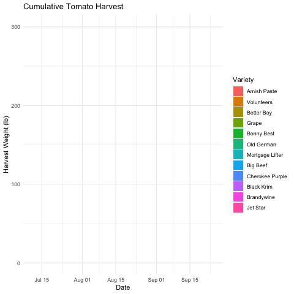

## Put your homework on GitHub!

Go [here](https://github.com/llendway/github_for_collaboration/blob/master/github_for_collaboration.md) or to previous homework to remind yourself how to get set up. 

Once your repository is created, you should always open your **project** rather than just opening an .Rmd file. You can do that by either clicking on the .Rproj file in your repository folder on your computer. Or, by going to the upper right hand corner in R Studio and clicking the arrow next to where it says Project: (None). You should see your project come up in that list if you've used it recently. You could also go to File --> Open Project and navigate to your .Rproj file. 

## Instructions

* Put your name at the top of the document. 

* **For ALL graphs, you should include appropriate labels.** 

* Feel free to change the default theme, which I currently have set to `theme_minimal()`. 

* Use good coding practice. Read the short sections on good code with [pipes](https://style.tidyverse.org/pipes.html) and [ggplot2](https://style.tidyverse.org/ggplot2.html). **This is part of your grade!**

* **NEW!!** With animated graphs, add `eval=FALSE` to the code chunk that creates the animation and saves it using `anim_save()`. Add another code chunk to reread the gif back into the file. See the [tutorial](https://animation-and-interactivity-in-r.netlify.app/) for help. 

* When you are finished with ALL the exercises, uncomment the options at the top so your document looks nicer. Don't do it before then, or else you might miss some important warnings and messages.

## Warm-up exercises from tutorial

  1. Choose 2 graphs you have created for ANY assignment in this class and add interactivity using the `ggplotly()` function.

<!--html_preserve-->

<script type="application/json" data-for="htmlwidget-5935eac6ac6efac464d7">{"x":{"data":[{"orientation":"v","width":[0.900000000000091,0.900000000000091,0.900000000000091,0.900000000000091,0.900000000000091,0.900000000000091,0.900000000000091,0.900000000000091,0.900000000000091,0.900000000000091,0.900000000000091,0.900000000000091,0.900000000000091,0.900000000000091,0.900000000000091,0.900000000000091,0.900000000000091,0.900000000000091,0.900000000000091,0.900000000000091,0.900000000000091,0.900000000000091,0.900000000000091,0.900000000000091,0.900000000000091,0.900000000000091,0.900000000000091,0.900000000000091,0.900000000000091,0.900000000000091,0.900000000000091,0.900000000000091,0.900000000000091,0.900000000000091,0.900000000000091,0.900000000000091,0.900000000000091,0.900000000000091,0.900000000000091,0.900000000000091,0.900000000000091,0.900000000000091,0.900000000000091,0.900000000000091,0.900000000000091,0.900000000000091,0.900000000000091,0.900000000000091,0.900000000000091,0.900000000000091,0.900000000000091,0.900000000000091,0.900000000000091,0.900000000000091,0.900000000000091,0.900000000000091,0.900000000000091,0.900000000000091,0.900000000000091,0.900000000000091,0.900000000000091,0.900000000000091,0.900000000000091,0.900000000000091,0.900000000000091,0.900000000000091,0.900000000000091,0.900000000000091,0.900000000000091,0.900000000000091,0.900000000000091,0.900000000000091,0.900000000000091,0.900000000000091,0.900000000000091,0.900000000000091,0.900000000000091,0.900000000000091,0.900000000000091,0.900000000000091,0.900000000000091,0.900000000000091,0.900000000000091,0.900000000000091,0.900000000000091,0.900000000000091,0.900000000000091,0.900000000000091,0.900000000000091,0.900000000000091,0.900000000000091,0.900000000000091,0.900000000000091,0.900000000000091,0.900000000000091,0.900000000000091,0.900000000000091,0.900000000000091,0.900000000000091,0.900000000000091,0.900000000000091,0.900000000000091,0.900000000000091,0.900000000000091,0.900000000000091,0.900000000000091,0.900000000000091,0.900000000000091,0.900000000000091,0.900000000000091,0.900000000000091,0.900000000000091,0.900000000000091,0.900000000000091,0.900000000000091,0.900000000000091,0.900000000000091,0.900000000000091,0.900000000000091,0.900000000000091,0.900000000000091,0.900000000000091,0.900000000000091,0.900000000000091,0.900000000000091,0.900000000000091,0.900000000000091,0.900000000000091,0.900000000000091,0.900000000000091,0.900000000000091,0.900000000000091,0.900000000000091,0.900000000000091,0.900000000000091,0.900000000000091,0.900000000000091,0.900000000000091,0.900000000000091,0.900000000000091,0.900000000000091,0.900000000000091,0.900000000000091,0.900000000000091,0.900000000000091,0.900000000000091,0.900000000000091,0.900000000000091,0.900000000000091,0.900000000000091,0.900000000000091,0.900000000000091,0.900000000000091,0.900000000000091,0.900000000000091,0.900000000000091,0.900000000000091,0.900000000000091,0.900000000000091,0.900000000000091,0.900000000000091,0.900000000000091,0.900000000000091,0.900000000000091,0.900000000000091,0.900000000000091,0.900000000000091,0.900000000000091,0.900000000000091,0.900000000000091,0.900000000000091,0.900000000000091,0.900000000000091,0.900000000000091,0.900000000000091,0.900000000000091,0.900000000000091,0.900000000000091,0.900000000000091,0.900000000000091,0.900000000000091,0.900000000000091,0.900000000000091,0.900000000000091,0.900000000000091,0.900000000000091,0.900000000000091,0.900000000000091,0.900000000000091,0.900000000000091,0.900000000000091,0.900000000000091,0.900000000000091,0.900000000000091,0.900000000000091,0.900000000000091,0.900000000000091,0.900000000000091,0.900000000000091,0.900000000000091,0.900000000000091,0.900000000000091,0.900000000000091,0.900000000000091,0.900000000000091,0.900000000000091,0.900000000000091,0.900000000000091,0.900000000000091,0.900000000000091,0.900000000000091,0.900000000000091,0.900000000000091,0.900000000000091,0.900000000000091,0.900000000000091,0.900000000000091,0.900000000000091,0.900000000000091,0.900000000000091,0.900000000000091,0.900000000000091,0.900000000000091,0.900000000000091,0.900000000000091,0.900000000000091,0.900000000000091,0.900000000000091,0.900000000000091,0.900000000000091,0.900000000000091,0.900000000000091,0.900000000000091,0.900000000000091,0.900000000000091,0.900000000000091,0.900000000000091,0.900000000000091,0.900000000000091,0.900000000000091,0.900000000000091,0.900000000000091,0.900000000000091,0.900000000000091,0.900000000000091,0.900000000000091,0.900000000000091,0.900000000000091,0.900000000000091,0.900000000000091,0.900000000000091,0.900000000000091,0.900000000000091,0.900000000000091,0.900000000000091,0.900000000000091,0.900000000000091,0.900000000000091,0.900000000000091,0.900000000000091,0.900000000000091,0.900000000000091,0.900000000000091,0.900000000000091,0.900000000000091,0.900000000000091,0.900000000000091,0.900000000000091,0.900000000000091,0.900000000000091,0.900000000000091,0.900000000000091,0.900000000000091,0.900000000000091,0.900000000000091,0.900000000000091,0.900000000000091,0.900000000000091,0.900000000000091,0.900000000000091,0.900000000000091,0.900000000000091,0.900000000000091,0.900000000000091,0.900000000000091,0.900000000000091,0.900000000000091,0.900000000000091,0.900000000000091,0.900000000000091,0.900000000000091,0.900000000000091,0.900000000000091,0.900000000000091,0.900000000000091,0.900000000000091,0.900000000000091,0.900000000000091,0.900000000000091,0.900000000000091,0.900000000000091,0.900000000000091,0.900000000000091,0.900000000000091,0.900000000000091,0.900000000000091,0.900000000000091,0.900000000000091,0.900000000000091,0.900000000000091,0.900000000000091,0.900000000000091,0.900000000000091,0.900000000000091,0.900000000000091,0.900000000000091,0.900000000000091,0.900000000000091,0.900000000000091,0.900000000000091,0.900000000000091,0.900000000000091,0.900000000000091,0.900000000000091,0.900000000000091,0.900000000000091,0.900000000000091,0.900000000000091,0.900000000000091,0.900000000000091,0.900000000000091,0.900000000000091,0.900000000000091,0.900000000000091,0.900000000000091,0.900000000000091,0.900000000000091,0.900000000000091,0.900000000000091,0.900000000000091,0.900000000000091,0.900000000000091,0.900000000000091,0.900000000000091,0.900000000000091,0.900000000000091,0.900000000000091,0.900000000000091,0.900000000000091,0.900000000000091,0.900000000000091,0.900000000000091,0.900000000000091,0.900000000000091,0.900000000000091,0.900000000000091,0.900000000000091,0.900000000000091,0.900000000000091,0.900000000000091,0.900000000000091,0.900000000000091,0.900000000000091,0.900000000000091,0.900000000000091,0.900000000000091,0.900000000000091,0.900000000000091,0.900000000000091,0.900000000000091,0.900000000000091,0.900000000000091,0.900000000000091,0.900000000000091,0.900000000000091,0.900000000000091,0.900000000000091,0.900000000000091,0.900000000000091,0.900000000000091,0.900000000000091,0.900000000000091,0.900000000000091,0.900000000000091,0.900000000000091,0.900000000000091,0.900000000000091,0.900000000000091,0.900000000000091,0.900000000000091,0.900000000000091,0.900000000000091,0.900000000000091,0.900000000000091,0.900000000000091,0.900000000000091,0.900000000000091,0.900000000000091,0.900000000000091,0.900000000000091,0.900000000000091,0.900000000000091,0.900000000000091,0.900000000000091,0.900000000000091,0.900000000000091,0.900000000000091,0.900000000000091,0.900000000000091,0.900000000000091,0.900000000000091,0.900000000000091,0.900000000000091,0.900000000000091,0.900000000000091,0.900000000000091,0.900000000000091,0.900000000000091,0.900000000000091,0.900000000000091,0.900000000000091,0.900000000000091,0.900000000000091,0.900000000000091,0.900000000000091,0.900000000000091,0.900000000000091,0.900000000000091,0.900000000000091,0.900000000000091,0.900000000000091,0.900000000000091,0.900000000000091,0.900000000000091,0.900000000000091,0.900000000000091,0.900000000000091,0.900000000000091,0.900000000000091,0.900000000000091,0.900000000000091,0.900000000000091,0.900000000000091,0.900000000000091,0.900000000000091,0.900000000000091,0.900000000000091,0.900000000000091,0.900000000000091,0.900000000000091,0.900000000000091,0.900000000000091,0.900000000000091,0.900000000000091,0.900000000000091,0.900000000000091,0.900000000000091,0.900000000000091,0.900000000000091,0.900000000000091,0.900000000000091,0.900000000000091,0.900000000000091,0.900000000000091,0.900000000000091,0.900000000000091,0.900000000000091,0.900000000000091,0.900000000000091,0.900000000000091,0.900000000000091,0.900000000000091,0.900000000000091,0.900000000000091,0.900000000000091,0.900000000000091,0.900000000000091,0.900000000000091,0.900000000000091,0.900000000000091,0.900000000000091,0.900000000000091,0.900000000000091,0.900000000000091,0.900000000000091,0.900000000000091,0.900000000000091,0.900000000000091,0.900000000000091,0.900000000000091,0.900000000000091,0.900000000000091,0.900000000000091,0.900000000000091,0.900000000000091,0.900000000000091,0.900000000000091,0.900000000000091,0.900000000000091,0.900000000000091,0.900000000000091,0.900000000000091,0.900000000000091,0.900000000000091,0.900000000000091,0.900000000000091,0.900000000000091,0.900000000000091,0.900000000000091,0.900000000000091,0.900000000000091,0.900000000000091,0.900000000000091,0.900000000000091,0.900000000000091,0.900000000000091,0.900000000000091,0.900000000000091,0.900000000000091,0.900000000000091,0.900000000000091,0.900000000000091,0.900000000000091,0.900000000000091,0.900000000000091,0.900000000000091,0.900000000000091,0.900000000000091,0.900000000000091,0.900000000000091,0.900000000000091,0.900000000000091,0.900000000000091,0.900000000000091,0.900000000000091,0.900000000000091,0.900000000000091,0.900000000000091,0.900000000000091,0.900000000000091,0.900000000000091,0.900000000000091,0.900000000000091,0.900000000000091,0.900000000000091,0.900000000000091,0.900000000000091,0.900000000000091,0.900000000000091,0.900000000000091,0.900000000000091,0.900000000000091,0.900000000000091,0.900000000000091,0.900000000000091,0.900000000000091,0.900000000000091,0.900000000000091,0.900000000000091,0.900000000000091,0.900000000000091,0.900000000000091,0.900000000000091,0.900000000000091,0.900000000000091,0.900000000000091,0.900000000000091,0.900000000000091,0.900000000000091,0.900000000000091,0.900000000000091,0.900000000000091,0.900000000000091,0.900000000000091,0.900000000000091,0.900000000000091,0.900000000000091,0.900000000000091,0.900000000000091,0.900000000000091,0.900000000000091,0.900000000000091,0.900000000000091,0.900000000000091,0.900000000000091,0.900000000000091,0.900000000000091,0.900000000000091,0.900000000000091,0.900000000000091,0.900000000000091,0.900000000000091,0.900000000000091,0.900000000000091,0.900000000000091,0.900000000000091,0.900000000000091,0.900000000000091,0.900000000000091,0.900000000000091,0.900000000000091,0.900000000000091,0.900000000000091,0.900000000000091,0.900000000000091,0.900000000000091,0.900000000000091,0.900000000000091,0.900000000000091,0.900000000000091,0.900000000000091,0.900000000000091,0.900000000000091,0.900000000000091,0.900000000000091,0.900000000000091,0.900000000000091,0.900000000000091,0.900000000000091,0.900000000000091,0.900000000000091,0.900000000000091,0.900000000000091,0.900000000000091,0.900000000000091,0.900000000000091,0.900000000000091,0.900000000000091,0.900000000000091,0.900000000000091,0.900000000000091,0.900000000000091,0.900000000000091,0.900000000000091,0.900000000000091,0.900000000000091,0.900000000000091,0.900000000000091,0.900000000000091,0.900000000000091,0.900000000000091,0.900000000000091,0.900000000000091,0.900000000000091,0.900000000000091,0.900000000000091,0.900000000000091,0.900000000000091,0.900000000000091,0.900000000000091,0.900000000000091,0.900000000000091,0.900000000000091,0.900000000000091,0.900000000000091,0.900000000000091,0.900000000000091,0.900000000000091,0.900000000000091,0.900000000000091,0.900000000000091,0.900000000000091,0.900000000000091,0.900000000000091,0.900000000000091,0.900000000000091,0.900000000000091,0.900000000000091,0.900000000000091,0.900000000000091,0.900000000000091,0.900000000000091,0.900000000000091,0.900000000000091,0.900000000000091,0.900000000000091,0.900000000000091,0.900000000000091,0.900000000000091,0.900000000000091,0.900000000000091,0.900000000000091,0.900000000000091,0.900000000000091,0.900000000000091,0.900000000000091,0.900000000000091,0.900000000000091,0.900000000000091,0.900000000000091,0.900000000000091,0.900000000000091,0.900000000000091,0.900000000000091,0.900000000000091,0.900000000000091,0.900000000000091,0.900000000000091,0.900000000000091,0.900000000000091,0.900000000000091,0.900000000000091,0.900000000000091,0.900000000000091,0.900000000000091,0.900000000000091,0.900000000000091,0.900000000000091,0.900000000000091,0.900000000000091,0.900000000000091,0.900000000000091,0.900000000000091,0.900000000000091,0.900000000000091,0.900000000000091,0.900000000000091,0.900000000000091,0.900000000000091,0.900000000000091,0.900000000000091,0.900000000000091,0.900000000000091,0.900000000000091,0.900000000000091,0.900000000000091,0.900000000000091,0.900000000000091,0.900000000000091,0.900000000000091,0.900000000000091,0.900000000000091,0.900000000000091,0.900000000000091,0.900000000000091,0.900000000000091,0.900000000000091,0.900000000000091,0.900000000000091,0.900000000000091,0.900000000000091,0.900000000000091,0.900000000000091,0.900000000000091,0.900000000000091,0.900000000000091,0.900000000000091,0.900000000000091,0.900000000000091,0.900000000000091,0.900000000000091,0.900000000000091,0.900000000000091,0.900000000000091,0.900000000000091,0.900000000000091,0.900000000000091,0.900000000000091,0.900000000000091,0.900000000000091,0.900000000000091,0.900000000000091,0.900000000000091,0.900000000000091,0.900000000000091,0.900000000000091,0.900000000000091,0.900000000000091,0.900000000000091,0.900000000000091,0.900000000000091,0.900000000000091,0.900000000000091,0.900000000000091,0.900000000000091,0.900000000000091,0.900000000000091,0.900000000000091,0.900000000000091,0.900000000000091,0.900000000000091,0.900000000000091,0.900000000000091,0.900000000000091,0.900000000000091,0.900000000000091,0.900000000000091,0.900000000000091,0.900000000000091,0.900000000000091,0.900000000000091,0.900000000000091,0.900000000000091,0.900000000000091,0.900000000000091,0.900000000000091,0.900000000000091,0.900000000000091,0.900000000000091,0.900000000000091,0.900000000000091,0.900000000000091,0.900000000000091,0.900000000000091,0.900000000000091,0.900000000000091,0.900000000000091,0.900000000000091,0.900000000000091,0.900000000000091,0.900000000000091,0.900000000000091,0.900000000000091,0.900000000000091,0.900000000000091,0.900000000000091,0.900000000000091,0.900000000000091,0.900000000000091,0.900000000000091,0.900000000000091,0.900000000000091,0.900000000000091,0.900000000000091,0.900000000000091,0.900000000000091,0.900000000000091,0.900000000000091,0.900000000000091,0.900000000000091,0.900000000000091,0.900000000000091,0.900000000000091,0.900000000000091,0.900000000000091,0.900000000000091,0.900000000000091,0.900000000000091,0.900000000000091,0.900000000000091,0.900000000000091,0.900000000000091,0.900000000000091,0.900000000000091,0.900000000000091,0.900000000000091,0.900000000000091,0.900000000000091,0.900000000000091,0.900000000000091,0.900000000000091,0.900000000000091,0.900000000000091,0.900000000000091,0.900000000000091,0.900000000000091,0.900000000000091,0.900000000000091,0.900000000000091,0.900000000000091,0.900000000000091,0.900000000000091,0.900000000000091,0.900000000000091,0.900000000000091,0.900000000000091,0.900000000000091,0.900000000000091,0.900000000000091,0.900000000000091,0.900000000000091,0.900000000000091,0.900000000000091,0.900000000000091,0.900000000000091,0.900000000000091,0.900000000000091,0.900000000000091,0.900000000000091,0.900000000000091,0.900000000000091,0.900000000000091,0.900000000000091,0.900000000000091,0.900000000000091,0.900000000000091,0.900000000000091,0.900000000000091,0.900000000000091,0.900000000000091,0.900000000000091,0.900000000000091,0.900000000000091,0.900000000000091,0.900000000000091,0.900000000000091,0.900000000000091,0.900000000000091,0.900000000000091,0.900000000000091,0.900000000000091,0.900000000000091,0.900000000000091,0.900000000000091,0.900000000000091,0.900000000000091,0.900000000000091,0.900000000000091,0.900000000000091,0.900000000000091,0.900000000000091,0.900000000000091,0.900000000000091,0.900000000000091,0.900000000000091,0.900000000000091,0.900000000000091,0.900000000000091,0.900000000000091,0.900000000000091,0.900000000000091,0.900000000000091,0.900000000000091,0.900000000000091,0.900000000000091,0.900000000000091,0.900000000000091,0.900000000000091,0.900000000000091,0.900000000000091,0.900000000000091,0.900000000000091,0.900000000000091,0.900000000000091,0.900000000000091,0.900000000000091,0.900000000000091,0.900000000000091,0.900000000000091,0.900000000000091,0.900000000000091,0.900000000000091,0.900000000000091,0.900000000000091,0.900000000000091,0.900000000000091,0.900000000000091,0.900000000000091,0.900000000000091,0.900000000000091,0.900000000000091,0.900000000000091,0.900000000000091,0.900000000000091,0.900000000000091,0.900000000000091,0.900000000000091,0.900000000000091,0.900000000000091,0.900000000000091,0.900000000000091,0.900000000000091,0.900000000000091,0.900000000000091,0.900000000000091,0.900000000000091,0.900000000000091,0.900000000000091,0.900000000000091,0.900000000000091,0.900000000000091,0.900000000000091,0.900000000000091,0.900000000000091,0.900000000000091,0.900000000000091,0.900000000000091,0.900000000000091,0.900000000000091,0.900000000000091,0.900000000000091,0.900000000000091,0.900000000000091,0.900000000000091,0.900000000000091,0.900000000000091,0.900000000000091,0.900000000000091,0.900000000000091,0.900000000000091,0.900000000000091,0.900000000000091,0.900000000000091,0.900000000000091,0.900000000000091,0.900000000000091,0.900000000000091,0.900000000000091,0.900000000000091,0.900000000000091,0.900000000000091,0.900000000000091,0.900000000000091,0.900000000000091,0.900000000000091,0.900000000000091,0.900000000000091,0.900000000000091,0.900000000000091,0.900000000000091,0.900000000000091,0.900000000000091,0.900000000000091,0.900000000000091,0.900000000000091,0.900000000000091,0.900000000000091,0.900000000000091,0.900000000000091,0.900000000000091,0.900000000000091,0.900000000000091,0.900000000000091,0.900000000000091,0.900000000000091,0.900000000000091,0.900000000000091,0.900000000000091,0.900000000000091,0.900000000000091,0.900000000000091,0.900000000000091,0.900000000000091,0.900000000000091,0.900000000000091,0.900000000000091,0.900000000000091,0.900000000000091,0.900000000000091,0.900000000000091,0.900000000000091,0.900000000000091,0.900000000000091,0.900000000000091,0.900000000000091,0.900000000000091,0.900000000000091,0.900000000000091,0.900000000000091,0.900000000000091,0.900000000000091,0.900000000000091,0.900000000000091,0.900000000000091,0.900000000000091,0.900000000000091,0.900000000000091,0.900000000000091,0.900000000000091,0.900000000000091,0.900000000000091,0.900000000000091,0.900000000000091,0.900000000000091,0.900000000000091,0.900000000000091,0.900000000000091,0.900000000000091,0.900000000000091,0.900000000000091,0.900000000000091,0.900000000000091,0.900000000000091,0.900000000000091,0.900000000000091,0.900000000000091,0.900000000000091,0.900000000000091,0.900000000000091,0.900000000000091,0.900000000000091,0.900000000000091,0.900000000000091,0.900000000000091,0.900000000000091,0.900000000000091,0.900000000000091,0.900000000000091,0.900000000000091,0.900000000000091,0.900000000000091,0.900000000000091,0.900000000000091,0.900000000000091,0.900000000000091,0.900000000000091,0.900000000000091,0.900000000000091,0.900000000000091,0.900000000000091,0.900000000000091,0.900000000000091,0.900000000000091,0.900000000000091,0.900000000000091,0.900000000000091,0.900000000000091,0.900000000000091,0.900000000000091,0.900000000000091,0.900000000000091,0.900000000000091,0.900000000000091,0.900000000000091,0.900000000000091,0.900000000000091,0.900000000000091,0.900000000000091,0.900000000000091,0.900000000000091,0.900000000000091,0.900000000000091,0.900000000000091,0.900000000000091,0.900000000000091,0.900000000000091,0.900000000000091,0.900000000000091,0.900000000000091,0.900000000000091,0.900000000000091,0.900000000000091,0.900000000000091,0.900000000000091,0.900000000000091,0.900000000000091,0.900000000000091,0.900000000000091,0.900000000000091,0.900000000000091,0.900000000000091,0.900000000000091,0.900000000000091,0.900000000000091,0.900000000000091,0.900000000000091,0.900000000000091,0.900000000000091,0.900000000000091,0.900000000000091,0.900000000000091,0.900000000000091,0.900000000000091,0.900000000000091,0.900000000000091,0.900000000000091,0.900000000000091,0.900000000000091,0.900000000000091,0.900000000000091,0.900000000000091,0.900000000000091,0.900000000000091,0.900000000000091,0.900000000000091,0.900000000000091,0.900000000000091,0.900000000000091,0.900000000000091,0.900000000000091,0.900000000000091,0.900000000000091,0.900000000000091,0.900000000000091,0.900000000000091,0.900000000000091,0.900000000000091,0.900000000000091,0.900000000000091,0.900000000000091,0.900000000000091,0.900000000000091,0.900000000000091,0.900000000000091,0.900000000000091,0.900000000000091,0.900000000000091,0.900000000000091,0.900000000000091,0.900000000000091,0.900000000000091,0.900000000000091,0.900000000000091,0.900000000000091,0.900000000000091,0.900000000000091,0.900000000000091,0.900000000000091,0.900000000000091,0.900000000000091,0.900000000000091,0.900000000000091,0.900000000000091,0.900000000000091,0.900000000000091,0.900000000000091,0.900000000000091,0.900000000000091,0.900000000000091,0.900000000000091,0.900000000000091,0.900000000000091,0.900000000000091,0.900000000000091,0.900000000000091,0.900000000000091,0.900000000000091,0.900000000000091,0.900000000000091,0.900000000000091,0.900000000000091,0.900000000000091,0.900000000000091,0.900000000000091,0.900000000000091,0.900000000000091,0.900000000000091,0.900000000000091,0.900000000000091,0.900000000000091,0.900000000000091,0.900000000000091,0.900000000000091,0.900000000000091,0.900000000000091,0.900000000000091,0.900000000000091,0.900000000000091,0.900000000000091,0.900000000000091,0.900000000000091,0.900000000000091,0.900000000000091,0.900000000000091,0.900000000000091,0.900000000000091,0.900000000000091,0.900000000000091,0.900000000000091,0.900000000000091,0.900000000000091,0.900000000000091,0.900000000000091,0.900000000000091,0.900000000000091,0.900000000000091,0.900000000000091,0.900000000000091,0.900000000000091,0.900000000000091,0.900000000000091,0.900000000000091,0.900000000000091,0.900000000000091,0.900000000000091,0.900000000000091,0.900000000000091,0.900000000000091,0.900000000000091,0.900000000000091,0.900000000000091,0.900000000000091,0.900000000000091,0.900000000000091,0.900000000000091,0.900000000000091,0.900000000000091,0.900000000000091,0.900000000000091,0.900000000000091,0.900000000000091,0.900000000000091,0.900000000000091,0.900000000000091,0.900000000000091,0.900000000000091,0.900000000000091,0.900000000000091,0.900000000000091,0.900000000000091,0.900000000000091,0.900000000000091,0.900000000000091,0.900000000000091,0.900000000000091,0.900000000000091,0.900000000000091,0.900000000000091,0.900000000000091,0.900000000000091,0.900000000000091,0.900000000000091,0.900000000000091,0.900000000000091,0.900000000000091,0.900000000000091,0.900000000000091,0.900000000000091,0.900000000000091,0.900000000000091,0.900000000000091,0.900000000000091,0.900000000000091,0.900000000000091,0.900000000000091,0.900000000000091,0.900000000000091,0.900000000000091,0.900000000000091,0.900000000000091,0.900000000000091,0.900000000000091,0.900000000000091,0.900000000000091,0.900000000000091,0.900000000000091,0.900000000000091,0.900000000000091,0.900000000000091,0.900000000000091,0.900000000000091,0.900000000000091,0.900000000000091,0.900000000000091,0.900000000000091,0.900000000000091,0.900000000000091,0.900000000000091,0.900000000000091,0.900000000000091,0.900000000000091,0.900000000000091,0.900000000000091,0.900000000000091,0.900000000000091,0.900000000000091,0.900000000000091,0.900000000000091,0.900000000000091,0.900000000000091,0.900000000000091,0.900000000000091,0.900000000000091,0.900000000000091,0.900000000000091,0.900000000000091,0.900000000000091,0.900000000000091,0.900000000000091,0.900000000000091,0.900000000000091,0.900000000000091,0.900000000000091,0.900000000000091,0.900000000000091,0.900000000000091,0.900000000000091,0.900000000000091,0.900000000000091,0.900000000000091,0.900000000000091,0.900000000000091,0.900000000000091,0.900000000000091,0.900000000000091,0.900000000000091,0.900000000000091,0.900000000000091,0.900000000000091,0.900000000000091,0.900000000000091,0.900000000000091,0.900000000000091,0.900000000000091,0.900000000000091,0.900000000000091,0.900000000000091,0.900000000000091,0.900000000000091,0.900000000000091,0.900000000000091,0.900000000000091,0.900000000000091,0.900000000000091,0.900000000000091,0.900000000000091,0.900000000000091,0.900000000000091,0.900000000000091,0.900000000000091,0.900000000000091,0.900000000000091,0.900000000000091,0.900000000000091,0.900000000000091,0.900000000000091,0.900000000000091,0.900000000000091,0.900000000000091,0.900000000000091,0.900000000000091,0.900000000000091,0.900000000000091,0.900000000000091,0.900000000000091,0.900000000000091,0.900000000000091,0.900000000000091,0.900000000000091,0.900000000000091,0.900000000000091,0.900000000000091,0.900000000000091,0.900000000000091,0.900000000000091,0.900000000000091,0.900000000000091,0.900000000000091,0.900000000000091,0.900000000000091,0.900000000000091,0.900000000000091,0.900000000000091,0.900000000000091,0.900000000000091,0.900000000000091,0.900000000000091,0.900000000000091,0.900000000000091,0.900000000000091,0.900000000000091,0.900000000000091,0.900000000000091,0.900000000000091,0.900000000000091,0.900000000000091,0.900000000000091,0.900000000000091,0.900000000000091,0.900000000000091,0.900000000000091,0.900000000000091,0.900000000000091,0.900000000000091,0.900000000000091,0.900000000000091,0.900000000000091,0.900000000000091,0.900000000000091,0.900000000000091,0.900000000000091,0.900000000000091,0.900000000000091,0.900000000000091,0.900000000000091,0.900000000000091,0.900000000000091,0.900000000000091,0.900000000000091,0.900000000000091,0.900000000000091,0.900000000000091,0.900000000000091,0.900000000000091,0.900000000000091,0.900000000000091,0.900000000000091,0.900000000000091,0.900000000000091,0.900000000000091,0.900000000000091,0.900000000000091,0.900000000000091,0.900000000000091,0.900000000000091,0.900000000000091,0.900000000000091,0.900000000000091,0.900000000000091,0.900000000000091,0.900000000000091,0.900000000000091,0.900000000000091,0.900000000000091,0.900000000000091,0.900000000000091,0.900000000000091,0.900000000000091,0.900000000000091,0.900000000000091,0.900000000000091,0.900000000000091,0.900000000000091,0.900000000000091,0.900000000000091,0.900000000000091,0.900000000000091,0.900000000000091,0.900000000000091,0.900000000000091,0.900000000000091,0.900000000000091,0.900000000000091,0.900000000000091,0.900000000000091,0.900000000000091,0.900000000000091,0.900000000000091,0.900000000000091,0.900000000000091,0.900000000000091,0.900000000000091,0.900000000000091,0.900000000000091,0.900000000000091,0.900000000000091,0.900000000000091,0.900000000000091,0.900000000000091,0.900000000000091,0.900000000000091,0.900000000000091,0.900000000000091,0.900000000000091,0.900000000000091,0.900000000000091,0.900000000000091,0.900000000000091,0.900000000000091,0.900000000000091,0.900000000000091,0.900000000000091,0.900000000000091,0.900000000000091,0.900000000000091,0.900000000000091,0.900000000000091,0.900000000000091,0.900000000000091,0.900000000000091,0.900000000000091,0.900000000000091,0.900000000000091,0.900000000000091,0.900000000000091,0.900000000000091,0.900000000000091,0.900000000000091,0.900000000000091,0.900000000000091,0.900000000000091,0.900000000000091,0.900000000000091,0.900000000000091,0.900000000000091,0.900000000000091,0.900000000000091,0.900000000000091,0.900000000000091,0.900000000000091,0.900000000000091,0.900000000000091,0.900000000000091,0.900000000000091,0.900000000000091,0.900000000000091,0.900000000000091,0.900000000000091,0.900000000000091,0.900000000000091,0.900000000000091,0.900000000000091,0.900000000000091,0.900000000000091,0.900000000000091,0.900000000000091,0.900000000000091,0.900000000000091,0.900000000000091,0.900000000000091,0.900000000000091,0.900000000000091,0.900000000000091,0.900000000000091,0.900000000000091,0.900000000000091,0.900000000000091,0.900000000000091,0.900000000000091,0.900000000000091,0.900000000000091,0.900000000000091,0.900000000000091,0.900000000000091,0.900000000000091,0.900000000000091,0.900000000000091,0.900000000000091,0.900000000000091,0.900000000000091,0.900000000000091,0.900000000000091,0.900000000000091,0.900000000000091,0.900000000000091,0.900000000000091,0.900000000000091,0.900000000000091,0.900000000000091,0.900000000000091,0.900000000000091,0.900000000000091,0.900000000000091,0.900000000000091,0.900000000000091,0.900000000000091,0.900000000000091,0.900000000000091,0.900000000000091,0.900000000000091,0.900000000000091,0.900000000000091,0.900000000000091,0.900000000000091,0.900000000000091,0.900000000000091,0.900000000000091,0.900000000000091,0.900000000000091,0.900000000000091,0.900000000000091,0.900000000000091,0.900000000000091,0.900000000000091,0.900000000000091,0.900000000000091,0.900000000000091,0.900000000000091,0.900000000000091,0.900000000000091,0.900000000000091,0.900000000000091,0.900000000000091,0.900000000000091,0.900000000000091,0.900000000000091,0.900000000000091,0.900000000000091,0.900000000000091,0.900000000000091,0.900000000000091,0.900000000000091,0.900000000000091,0.900000000000091,0.900000000000091,0.900000000000091,0.900000000000091,0.900000000000091,0.900000000000091,0.900000000000091,0.900000000000091,0.900000000000091,0.900000000000091,0.900000000000091,0.900000000000091,0.900000000000091,0.900000000000091,0.900000000000091,0.900000000000091,0.900000000000091,0.900000000000091,0.900000000000091,0.900000000000091,0.900000000000091,0.900000000000091,0.900000000000091,0.900000000000091,0.900000000000091,0.900000000000091,0.900000000000091,0.900000000000091,0.900000000000091,0.900000000000091,0.900000000000091,0.900000000000091,0.900000000000091,0.900000000000091,0.900000000000091,0.900000000000091,0.900000000000091,0.900000000000091,0.900000000000091,0.900000000000091,0.900000000000091,0.900000000000091,0.900000000000091,0.900000000000091,0.900000000000091,0.900000000000091,0.900000000000091,0.900000000000091,0.900000000000091,0.900000000000091,0.900000000000091,0.900000000000091,0.900000000000091,0.900000000000091,0.900000000000091,0.900000000000091,0.900000000000091,0.900000000000091,0.900000000000091,0.900000000000091,0.900000000000091,0.900000000000091,0.900000000000091,0.900000000000091,0.900000000000091,0.900000000000091,0.900000000000091,0.900000000000091,0.900000000000091,0.900000000000091,0.900000000000091,0.900000000000091,0.900000000000091,0.900000000000091,0.900000000000091,0.900000000000091,0.900000000000091,0.900000000000091,0.900000000000091,0.900000000000091,0.900000000000091,0.900000000000091,0.900000000000091,0.900000000000091,0.900000000000091,0.900000000000091,0.900000000000091,0.900000000000091,0.900000000000091,0.900000000000091,0.900000000000091,0.900000000000091,0.900000000000091,0.900000000000091,0.900000000000091,0.900000000000091,0.900000000000091,0.900000000000091,0.900000000000091,0.900000000000091,0.900000000000091,0.900000000000091,0.900000000000091,0.900000000000091,0.900000000000091,0.900000000000091,0.900000000000091,0.900000000000091,0.900000000000091,0.900000000000091,0.900000000000091,0.900000000000091,0.900000000000091,0.900000000000091,0.900000000000091,0.900000000000091,0.900000000000091,0.900000000000091,0.900000000000091,0.900000000000091,0.900000000000091,0.900000000000091,0.900000000000091,0.900000000000091,0.900000000000091,0.900000000000091,0.900000000000091,0.900000000000091,0.900000000000091,0.900000000000091,0.900000000000091,0.900000000000091,0.900000000000091,0.900000000000091,0.900000000000091,0.900000000000091,0.900000000000091,0.900000000000091,0.900000000000091,0.900000000000091,0.900000000000091,0.900000000000091,0.900000000000091,0.900000000000091,0.900000000000091,0.900000000000091,0.900000000000091,0.900000000000091,0.900000000000091,0.900000000000091,0.900000000000091,0.900000000000091,0.900000000000091,0.900000000000091,0.900000000000091,0.900000000000091,0.900000000000091,0.900000000000091,0.900000000000091,0.900000000000091,0.900000000000091,0.900000000000091,0.900000000000091,0.900000000000091,0.900000000000091,0.900000000000091,0.900000000000091,0.900000000000091,0.900000000000091,0.900000000000091,0.900000000000091,0.900000000000091,0.900000000000091,0.900000000000091,0.900000000000091,0.900000000000091,0.900000000000091,0.900000000000091,0.900000000000091,0.900000000000091,0.900000000000091,0.900000000000091,0.900000000000091,0.900000000000091,0.900000000000091,0.900000000000091,0.900000000000091,0.900000000000091,0.900000000000091,0.900000000000091,0.900000000000091,0.900000000000091,0.900000000000091,0.900000000000091,0.900000000000091,0.900000000000091,0.900000000000091,0.900000000000091,0.900000000000091,0.900000000000091,0.900000000000091,0.900000000000091,0.900000000000091,0.900000000000091,0.900000000000091,0.900000000000091,0.900000000000091,0.900000000000091,0.900000000000091,0.900000000000091,0.900000000000091,0.900000000000091,0.900000000000091,0.900000000000091,0.900000000000091,0.900000000000091,0.900000000000091,0.900000000000091,0.900000000000091,0.900000000000091,0.900000000000091,0.900000000000091,0.900000000000091,0.900000000000091,0.900000000000091,0.900000000000091,0.900000000000091,0.900000000000091,0.900000000000091,0.900000000000091,0.900000000000091,0.900000000000091,0.900000000000091,0.900000000000091,0.900000000000091,0.900000000000091,0.900000000000091,0.900000000000091,0.900000000000091,0.900000000000091,0.900000000000091,0.900000000000091,0.900000000000091,0.900000000000091,0.900000000000091,0.900000000000091,0.900000000000091,0.900000000000091,0.900000000000091,0.900000000000091,0.900000000000091,0.900000000000091,0.900000000000091,0.900000000000091,0.900000000000091,0.900000000000091,0.900000000000091,0.900000000000091,0.900000000000091,0.900000000000091,0.900000000000091,0.900000000000091,0.900000000000091,0.900000000000091,0.900000000000091,0.900000000000091,0.900000000000091,0.900000000000091,0.900000000000091,0.900000000000091,0.900000000000091,0.900000000000091,0.900000000000091,0.900000000000091,0.900000000000091,0.900000000000091,0.900000000000091,0.900000000000091,0.900000000000091,0.900000000000091,0.900000000000091,0.900000000000091,0.900000000000091,0.900000000000091,0.900000000000091,0.900000000000091,0.900000000000091,0.900000000000091,0.900000000000091,0.900000000000091,0.900000000000091,0.900000000000091,0.900000000000091,0.900000000000091,0.900000000000091,0.900000000000091,0.900000000000091,0.900000000000091,0.900000000000091,0.900000000000091,0.900000000000091,0.900000000000091,0.900000000000091,0.900000000000091,0.900000000000091,0.900000000000091,0.900000000000091,0.900000000000091,0.900000000000091,0.900000000000091,0.900000000000091,0.900000000000091,0.900000000000091,0.900000000000091,0.900000000000091,0.900000000000091,0.900000000000091,0.900000000000091,0.900000000000091,0.900000000000091,0.900000000000091,0.900000000000091,0.900000000000091,0.900000000000091,0.900000000000091,0.900000000000091,0.900000000000091,0.900000000000091,0.900000000000091,0.900000000000091,0.900000000000091,0.900000000000091,0.900000000000091,0.900000000000091,0.900000000000091,0.900000000000091,0.900000000000091,0.900000000000091,0.900000000000091,0.900000000000091,0.900000000000091,0.900000000000091,0.900000000000091,0.900000000000091,0.900000000000091,0.900000000000091,0.900000000000091,0.900000000000091,0.900000000000091,0.900000000000091,0.900000000000091,0.900000000000091,0.900000000000091,0.900000000000091,0.900000000000091,0.900000000000091,0.900000000000091,0.900000000000091,0.900000000000091,0.900000000000091,0.900000000000091,0.900000000000091,0.900000000000091,0.900000000000091,0.900000000000091,0.900000000000091,0.900000000000091,0.900000000000091,0.900000000000091,0.900000000000091,0.900000000000091,0.900000000000091,0.900000000000091,0.900000000000091,0.900000000000091,0.900000000000091,0.900000000000091,0.900000000000091,0.900000000000091,0.900000000000091,0.900000000000091,0.900000000000091,0.900000000000091,0.900000000000091,0.900000000000091,0.900000000000091,0.900000000000091,0.900000000000091,0.900000000000091,0.900000000000091,0.900000000000091,0.900000000000091,0.900000000000091,0.900000000000091,0.900000000000091,0.900000000000091,0.900000000000091,0.900000000000091,0.900000000000091,0.900000000000091,0.900000000000091,0.900000000000091,0.900000000000091,0.900000000000091,0.900000000000091,0.900000000000091,0.900000000000091,0.900000000000091,0.900000000000091,0.900000000000091,0.900000000000091,0.900000000000091,0.900000000000091,0.900000000000091,0.900000000000091,0.900000000000091,0.900000000000091,0.900000000000091,0.900000000000091,0.900000000000091,0.900000000000091,0.900000000000091,0.900000000000091,0.900000000000091,0.900000000000091,0.900000000000091,0.900000000000091,0.900000000000091,0.900000000000091,0.900000000000091,0.900000000000091,0.900000000000091,0.900000000000091,0.900000000000091,0.900000000000091,0.900000000000091,0.900000000000091,0.900000000000091,0.900000000000091,0.900000000000091,0.900000000000091,0.900000000000091,0.900000000000091,0.900000000000091,0.900000000000091,0.900000000000091,0.900000000000091,0.900000000000091,0.900000000000091,0.900000000000091,0.900000000000091,0.900000000000091,0.900000000000091,0.900000000000091,0.900000000000091,0.900000000000091,0.900000000000091,0.900000000000091,0.900000000000091,0.900000000000091,0.900000000000091,0.900000000000091,0.900000000000091,0.900000000000091,0.900000000000091,0.900000000000091,0.900000000000091,0.900000000000091,0.900000000000091,0.900000000000091,0.900000000000091,0.900000000000091,0.900000000000091,0.900000000000091,0.900000000000091,0.900000000000091,0.900000000000091,0.900000000000091,0.900000000000091,0.900000000000091,0.900000000000091,0.900000000000091,0.900000000000091,0.900000000000091,0.900000000000091,0.900000000000091,0.900000000000091,0.900000000000091,0.900000000000091,0.900000000000091,0.900000000000091,0.900000000000091,0.900000000000091,0.900000000000091,0.900000000000091,0.900000000000091,0.900000000000091,0.900000000000091,0.900000000000091,0.900000000000091,0.900000000000091,0.900000000000091,0.900000000000091,0.900000000000091,0.900000000000091,0.900000000000091,0.900000000000091,0.900000000000091,0.900000000000091,0.900000000000091,0.900000000000091,0.900000000000091,0.900000000000091,0.900000000000091,0.900000000000091,0.900000000000091,0.900000000000091,0.900000000000091,0.900000000000091,0.900000000000091,0.900000000000091,0.900000000000091,0.900000000000091,0.900000000000091,0.900000000000091,0.900000000000091,0.900000000000091,0.900000000000091,0.900000000000091,0.900000000000091,0.900000000000091,0.900000000000091,0.900000000000091,0.900000000000091,0.900000000000091,0.900000000000091,0.900000000000091,0.900000000000091,0.900000000000091,0.900000000000091,0.900000000000091,0.900000000000091,0.900000000000091,0.900000000000091,0.900000000000091,0.900000000000091,0.900000000000091,0.900000000000091,0.900000000000091,0.900000000000091,0.900000000000091,0.900000000000091,0.900000000000091,0.900000000000091,0.900000000000091,0.900000000000091,0.900000000000091,0.900000000000091,0.900000000000091,0.900000000000091,0.900000000000091,0.900000000000091,0.900000000000091,0.900000000000091,0.900000000000091,0.900000000000091,0.900000000000091,0.900000000000091,0.900000000000091,0.900000000000091,0.900000000000091,0.900000000000091,0.900000000000091,0.900000000000091,0.900000000000091,0.900000000000091,0.900000000000091,0.900000000000091,0.900000000000091,0.900000000000091,0.900000000000091,0.900000000000091,0.900000000000091,0.900000000000091,0.900000000000091,0.900000000000091,0.900000000000091,0.900000000000091,0.900000000000091,0.900000000000091,0.900000000000091,0.900000000000091,0.900000000000091,0.900000000000091,0.900000000000091,0.900000000000091,0.900000000000091,0.900000000000091,0.900000000000091,0.900000000000091,0.900000000000091,0.900000000000091,0.900000000000091,0.900000000000091,0.900000000000091,0.900000000000091,0.900000000000091,0.900000000000091,0.900000000000091,0.900000000000091,0.900000000000091,0.900000000000091,0.900000000000091,0.900000000000091,0.900000000000091,0.900000000000091,0.900000000000091,0.900000000000091,0.900000000000091,0.900000000000091,0.900000000000091,0.900000000000091,0.900000000000091,0.900000000000091,0.900000000000091,0.900000000000091,0.900000000000091,0.900000000000091,0.900000000000091,0.900000000000091,0.900000000000091,0.900000000000091,0.900000000000091,0.900000000000091,0.900000000000091,0.900000000000091,0.900000000000091,0.900000000000091,0.900000000000091,0.900000000000091,0.900000000000091,0.900000000000091,0.900000000000091,0.900000000000091,0.900000000000091,0.900000000000091,0.900000000000091,0.900000000000091,0.900000000000091,0.900000000000091,0.900000000000091,0.900000000000091,0.900000000000091,0.900000000000091,0.900000000000091,0.900000000000091,0.900000000000091,0.900000000000091,0.900000000000091,0.900000000000091,0.900000000000091,0.900000000000091,0.900000000000091,0.900000000000091,0.900000000000091,0.900000000000091,0.900000000000091,0.900000000000091,0.900000000000091,0.900000000000091,0.900000000000091,0.900000000000091,0.900000000000091,0.900000000000091,0.900000000000091,0.900000000000091,0.900000000000091,0.900000000000091,0.900000000000091,0.900000000000091,0.900000000000091,0.900000000000091,0.900000000000091,0.900000000000091,0.900000000000091,0.900000000000091,0.900000000000091,0.900000000000091,0.900000000000091,0.900000000000091,0.900000000000091,0.900000000000091,0.900000000000091,0.900000000000091,0.900000000000091,0.900000000000091,0.900000000000091,0.900000000000091,0.900000000000091,0.900000000000091,0.900000000000091,0.900000000000091,0.900000000000091,0.900000000000091,0.900000000000091,0.900000000000091,0.900000000000091,0.900000000000091,0.900000000000091,0.900000000000091,0.900000000000091,0.900000000000091,0.900000000000091,0.900000000000091,0.900000000000091,0.900000000000091,0.900000000000091,0.900000000000091,0.900000000000091,0.900000000000091,0.900000000000091,0.900000000000091,0.900000000000091,0.900000000000091,0.900000000000091,0.900000000000091,0.900000000000091,0.900000000000091,0.900000000000091,0.900000000000091,0.900000000000091,0.900000000000091,0.900000000000091,0.900000000000091,0.900000000000091,0.900000000000091,0.900000000000091,0.900000000000091,0.900000000000091,0.900000000000091,0.900000000000091,0.900000000000091,0.900000000000091,0.900000000000091,0.900000000000091,0.900000000000091,0.900000000000091,0.900000000000091,0.900000000000091,0.900000000000091,0.900000000000091,0.900000000000091,0.900000000000091,0.900000000000091,0.900000000000091,0.900000000000091,0.900000000000091,0.900000000000091,0.900000000000091,0.900000000000091,0.900000000000091,0.900000000000091,0.900000000000091,0.900000000000091,0.900000000000091,0.900000000000091,0.900000000000091,0.900000000000091,0.900000000000091,0.900000000000091,0.900000000000091,0.900000000000091,0.900000000000091,0.900000000000091,0.900000000000091,0.900000000000091,0.900000000000091,0.900000000000091,0.900000000000091,0.900000000000091,0.900000000000091,0.900000000000091,0.900000000000091,0.900000000000091,0.900000000000091,0.900000000000091,0.900000000000091,0.900000000000091,0.900000000000091,0.900000000000091,0.900000000000091,0.900000000000091,0.900000000000091,0.900000000000091,0.900000000000091,0.900000000000091,0.900000000000091,0.900000000000091,0.900000000000091,0.900000000000091,0.900000000000091,0.900000000000091,0.900000000000091,0.900000000000091,0.900000000000091,0.900000000000091,0.900000000000091,0.900000000000091,0.900000000000091,0.900000000000091,0.900000000000091,0.900000000000091,0.900000000000091,0.900000000000091,0.900000000000091,0.900000000000091,0.900000000000091,0.900000000000091,0.900000000000091,0.900000000000091,0.900000000000091,0.900000000000091,0.900000000000091,0.900000000000091,0.900000000000091,0.900000000000091,0.900000000000091,0.900000000000091,0.900000000000091,0.900000000000091,0.900000000000091,0.900000000000091,0.900000000000091,0.900000000000091,0.900000000000091,0.900000000000091,0.900000000000091,0.900000000000091,0.900000000000091,0.900000000000091,0.900000000000091,0.900000000000091,0.900000000000091,0.900000000000091,0.900000000000091,0.900000000000091,0.900000000000091,0.900000000000091,0.900000000000091,0.900000000000091,0.900000000000091,0.900000000000091,0.900000000000091,0.900000000000091,0.900000000000091,0.900000000000091,0.900000000000091,0.900000000000091,0.900000000000091,0.900000000000091,0.900000000000091,0.900000000000091,0.900000000000091,0.900000000000091,0.900000000000091,0.900000000000091,0.900000000000091,0.900000000000091,0.900000000000091,0.900000000000091,0.900000000000091,0.900000000000091,0.900000000000091,0.900000000000091,0.900000000000091,0.900000000000091,0.900000000000091,0.900000000000091,0.900000000000091,0.900000000000091,0.900000000000091,0.900000000000091,0.900000000000091,0.900000000000091,0.900000000000091,0.900000000000091,0.900000000000091,0.900000000000091,0.900000000000091,0.900000000000091,0.900000000000091,0.900000000000091,0.900000000000091,0.900000000000091,0.900000000000091,0.900000000000091,0.900000000000091,0.900000000000091,0.900000000000091,0.900000000000091,0.900000000000091,0.900000000000091,0.900000000000091,0.900000000000091,0.900000000000091,0.900000000000091,0.900000000000091,0.900000000000091,0.900000000000091,0.900000000000091,0.900000000000091,0.900000000000091,0.900000000000091,0.900000000000091,0.900000000000091,0.900000000000091,0.900000000000091,0.900000000000091,0.900000000000091,0.900000000000091,0.900000000000091,0.900000000000091,0.900000000000091,0.900000000000091,0.900000000000091,0.900000000000091,0.900000000000091,0.900000000000091,0.900000000000091,0.900000000000091,0.900000000000091,0.900000000000091,0.900000000000091,0.900000000000091,0.900000000000091,0.900000000000091,0.900000000000091,0.900000000000091,0.900000000000091,0.900000000000091,0.900000000000091,0.900000000000091,0.900000000000091,0.900000000000091,0.900000000000091,0.900000000000091,0.900000000000091,0.900000000000091,0.900000000000091,0.900000000000091,0.900000000000091,0.900000000000091,0.900000000000091,0.900000000000091,0.900000000000091,0.900000000000091,0.900000000000091,0.900000000000091,0.900000000000091,0.900000000000091,0.900000000000091,0.900000000000091,0.900000000000091,0.900000000000091,0.900000000000091,0.900000000000091,0.900000000000091,0.900000000000091,0.900000000000091,0.900000000000091,0.900000000000091,0.900000000000091,0.900000000000091,0.900000000000091,0.900000000000091,0.900000000000091,0.900000000000091,0.900000000000091,0.900000000000091,0.900000000000091,0.900000000000091,0.900000000000091,0.900000000000091,0.900000000000091,0.900000000000091,0.900000000000091,0.900000000000091,0.900000000000091,0.900000000000091,0.900000000000091,0.900000000000091,0.900000000000091,0.900000000000091,0.900000000000091,0.900000000000091,0.900000000000091,0.900000000000091,0.900000000000091,0.900000000000091,0.900000000000091,0.900000000000091,0.900000000000091,0.900000000000091,0.900000000000091,0.900000000000091,0.900000000000091,0.900000000000091,0.900000000000091,0.900000000000091,0.900000000000091,0.900000000000091,0.900000000000091,0.900000000000091,0.900000000000091,0.900000000000091,0.900000000000091,0.900000000000091,0.900000000000091,0.900000000000091,0.900000000000091,0.900000000000091,0.900000000000091,0.900000000000091,0.900000000000091,0.900000000000091,0.900000000000091,0.900000000000091,0.900000000000091,0.900000000000091,0.900000000000091,0.900000000000091,0.900000000000091,0.900000000000091,0.900000000000091,0.900000000000091,0.900000000000091,0.900000000000091,0.900000000000091,0.900000000000091,0.900000000000091,0.900000000000091,0.900000000000091,0.900000000000091,0.900000000000091,0.900000000000091,0.900000000000091,0.900000000000091,0.900000000000091,0.900000000000091,0.900000000000091,0.900000000000091,0.900000000000091,0.900000000000091,0.900000000000091,0.900000000000091,0.900000000000091,0.900000000000091,0.900000000000091,0.900000000000091,0.900000000000091,0.900000000000091,0.900000000000091,0.900000000000091,0.900000000000091,0.900000000000091,0.900000000000091,0.900000000000091,0.900000000000091,0.900000000000091,0.900000000000091,0.900000000000091,0.900000000000091,0.900000000000091,0.900000000000091,0.900000000000091,0.900000000000091,0.900000000000091,0.900000000000091,0.900000000000091,0.900000000000091,0.900000000000091,0.900000000000091,0.900000000000091,0.900000000000091,0.900000000000091,0.900000000000091,0.900000000000091,0.900000000000091,0.900000000000091,0.900000000000091,0.900000000000091,0.900000000000091,0.900000000000091,0.900000000000091,0.900000000000091,0.900000000000091,0.900000000000091,0.900000000000091,0.900000000000091,0.900000000000091,0.900000000000091,0.900000000000091,0.900000000000091,0.900000000000091,0.900000000000091,0.900000000000091,0.900000000000091,0.900000000000091,0.900000000000091,0.900000000000091,0.900000000000091,0.900000000000091,0.900000000000091,0.900000000000091,0.900000000000091,0.900000000000091,0.900000000000091,0.900000000000091,0.900000000000091,0.900000000000091,0.900000000000091,0.900000000000091,0.900000000000091,0.900000000000091,0.900000000000091,0.900000000000091,0.900000000000091,0.900000000000091,0.900000000000091,0.900000000000091,0.900000000000091,0.900000000000091,0.900000000000091,0.900000000000091,0.900000000000091,0.900000000000091,0.900000000000091,0.900000000000091,0.900000000000091,0.900000000000091,0.900000000000091,0.900000000000091,0.900000000000091,0.900000000000091,0.900000000000091,0.900000000000091,0.900000000000091,0.900000000000091,0.900000000000091,0.900000000000091,0.900000000000091,0.900000000000091,0.900000000000091,0.900000000000091,0.900000000000091,0.900000000000091,0.900000000000091,0.900000000000091,0.900000000000091,0.900000000000091,0.900000000000091,0.900000000000091,0.900000000000091,0.900000000000091,0.900000000000091,0.900000000000091,0.900000000000091,0.900000000000091,0.900000000000091,0.900000000000091,0.900000000000091,0.900000000000091,0.900000000000091,0.900000000000091,0.900000000000091,0.900000000000091,0.900000000000091,0.900000000000091,0.900000000000091,0.900000000000091,0.900000000000091,0.900000000000091,0.900000000000091,0.900000000000091,0.900000000000091,0.900000000000091,0.900000000000091,0.900000000000091,0.900000000000091,0.900000000000091,0.900000000000091,0.900000000000091,0.900000000000091,0.900000000000091,0.900000000000091,0.900000000000091,0.900000000000091,0.900000000000091,0.900000000000091,0.900000000000091,0.900000000000091,0.900000000000091,0.900000000000091,0.900000000000091,0.900000000000091,0.900000000000091,0.900000000000091,0.900000000000091,0.900000000000091,0.900000000000091,0.900000000000091,0.900000000000091,0.900000000000091,0.900000000000091,0.900000000000091,0.900000000000091,0.900000000000091,0.900000000000091,0.900000000000091,0.900000000000091,0.900000000000091,0.900000000000091,0.900000000000091,0.900000000000091,0.900000000000091,0.900000000000091,0.900000000000091,0.900000000000091,0.900000000000091,0.900000000000091,0.900000000000091,0.900000000000091,0.900000000000091,0.900000000000091,0.900000000000091,0.900000000000091,0.900000000000091,0.900000000000091,0.900000000000091,0.900000000000091,0.900000000000091,0.900000000000091,0.900000000000091,0.900000000000091,0.900000000000091,0.900000000000091,0.900000000000091,0.900000000000091,0.900000000000091,0.900000000000091,0.900000000000091,0.900000000000091,0.900000000000091,0.900000000000091,0.900000000000091,0.900000000000091,0.900000000000091,0.900000000000091,0.900000000000091,0.900000000000091,0.900000000000091,0.900000000000091,0.900000000000091,0.900000000000091,0.900000000000091,0.900000000000091,0.900000000000091,0.900000000000091,0.900000000000091,0.900000000000091,0.900000000000091,0.900000000000091,0.900000000000091,0.900000000000091,0.900000000000091,0.900000000000091,0.900000000000091,0.900000000000091,0.900000000000091,0.900000000000091,0.900000000000091,0.900000000000091,0.900000000000091,0.900000000000091,0.900000000000091,0.900000000000091,0.900000000000091,0.900000000000091,0.900000000000091,0.900000000000091,0.900000000000091,0.900000000000091,0.900000000000091,0.900000000000091,0.900000000000091,0.900000000000091,0.900000000000091,0.900000000000091,0.900000000000091,0.900000000000091,0.900000000000091,0.900000000000091,0.900000000000091,0.900000000000091,0.900000000000091,0.900000000000091,0.900000000000091,0.900000000000091,0.900000000000091,0.900000000000091,0.900000000000091,0.900000000000091,0.900000000000091,0.900000000000091,0.900000000000091,0.900000000000091,0.900000000000091,0.900000000000091,0.900000000000091,0.900000000000091,0.900000000000091,0.900000000000091,0.900000000000091,0.900000000000091,0.900000000000091,0.900000000000091,0.900000000000091,0.900000000000091,0.900000000000091,0.900000000000091,0.900000000000091,0.900000000000091,0.900000000000091,0.900000000000091,0.900000000000091,0.900000000000091,0.900000000000091,0.900000000000091,0.900000000000091,0.900000000000091,0.900000000000091,0.900000000000091,0.900000000000091,0.900000000000091,0.900000000000091,0.900000000000091,0.900000000000091,0.900000000000091,0.900000000000091,0.900000000000091,0.900000000000091,0.900000000000091,0.900000000000091,0.900000000000091,0.900000000000091,0.900000000000091,0.900000000000091,0.900000000000091,0.900000000000091,0.900000000000091,0.900000000000091,0.900000000000091,0.900000000000091,0.900000000000091,0.900000000000091,0.900000000000091,0.900000000000091,0.900000000000091,0.900000000000091,0.900000000000091,0.900000000000091,0.900000000000091,0.900000000000091,0.900000000000091,0.900000000000091,0.900000000000091,0.900000000000091,0.900000000000091,0.900000000000091,0.900000000000091,0.900000000000091,0.900000000000091,0.900000000000091,0.900000000000091,0.900000000000091,0.900000000000091,0.900000000000091,0.900000000000091,0.900000000000091,0.900000000000091,0.900000000000091,0.900000000000091,0.900000000000091,0.900000000000091,0.900000000000091,0.900000000000091,0.900000000000091,0.900000000000091,0.900000000000091,0.900000000000091,0.900000000000091,0.900000000000091,0.900000000000091,0.900000000000091,0.900000000000091,0.900000000000091,0.900000000000091,0.900000000000091,0.900000000000091,0.900000000000091,0.900000000000091,0.900000000000091,0.900000000000091,0.900000000000091,0.900000000000091,0.900000000000091,0.900000000000091,0.900000000000091,0.900000000000091,0.900000000000091,0.900000000000091,0.900000000000091,0.900000000000091,0.900000000000091,0.900000000000091,0.900000000000091,0.900000000000091,0.900000000000091,0.900000000000091,0.900000000000091,0.900000000000091,0.900000000000091,0.900000000000091,0.900000000000091,0.900000000000091,0.900000000000091,0.900000000000091,0.900000000000091,0.900000000000091,0.900000000000091,0.900000000000091,0.900000000000091,0.900000000000091,0.900000000000091,0.900000000000091,0.900000000000091,0.900000000000091,0.900000000000091,0.900000000000091,0.900000000000091,0.900000000000091,0.900000000000091,0.900000000000091,0.900000000000091,0.900000000000091,0.900000000000091,0.900000000000091,0.900000000000091,0.900000000000091,0.900000000000091,0.900000000000091,0.900000000000091,0.900000000000091,0.900000000000091,0.900000000000091,0.900000000000091,0.900000000000091,0.900000000000091,0.900000000000091,0.900000000000091,0.900000000000091,0.900000000000091,0.900000000000091,0.900000000000091,0.900000000000091,0.900000000000091,0.900000000000091,0.900000000000091,0.900000000000091,0.900000000000091,0.900000000000091,0.900000000000091,0.900000000000091,0.900000000000091,0.900000000000091,0.900000000000091,0.900000000000091,0.900000000000091,0.900000000000091,0.900000000000091,0.900000000000091,0.900000000000091,0.900000000000091,0.900000000000091,0.900000000000091,0.900000000000091,0.900000000000091,0.900000000000091,0.900000000000091,0.900000000000091,0.900000000000091,0.900000000000091,0.900000000000091,0.900000000000091,0.900000000000091,0.900000000000091,0.900000000000091,0.900000000000091,0.900000000000091,0.900000000000091,0.900000000000091,0.900000000000091,0.900000000000091,0.900000000000091,0.900000000000091,0.900000000000091,0.900000000000091,0.900000000000091,0.900000000000091,0.900000000000091,0.900000000000091,0.900000000000091,0.900000000000091,0.900000000000091,0.900000000000091,0.900000000000091,0.900000000000091,0.900000000000091,0.900000000000091,0.900000000000091,0.900000000000091,0.900000000000091,0.900000000000091,0.900000000000091,0.900000000000091,0.900000000000091,0.900000000000091,0.900000000000091,0.900000000000091,0.900000000000091,0.900000000000091,0.900000000000091,0.900000000000091,0.900000000000091,0.900000000000091,0.900000000000091,0.900000000000091,0.900000000000091,0.900000000000091,0.900000000000091,0.900000000000091,0.900000000000091,0.900000000000091,0.900000000000091,0.900000000000091,0.900000000000091,0.900000000000091,0.900000000000091,0.900000000000091,0.900000000000091,0.900000000000091,0.900000000000091,0.900000000000091,0.900000000000091,0.900000000000091,0.900000000000091,0.900000000000091,0.900000000000091,0.900000000000091,0.900000000000091,0.900000000000091,0.900000000000091,0.900000000000091,0.900000000000091,0.900000000000091,0.900000000000091,0.900000000000091,0.900000000000091,0.900000000000091,0.900000000000091,0.900000000000091,0.900000000000091,0.900000000000091,0.900000000000091,0.900000000000091,0.900000000000091,0.900000000000091,0.900000000000091,0.900000000000091,0.900000000000091,0.900000000000091,0.900000000000091,0.900000000000091,0.900000000000091,0.900000000000091,0.900000000000091,0.900000000000091,0.900000000000091,0.900000000000091,0.900000000000091,0.900000000000091,0.900000000000091,0.900000000000091,0.900000000000091,0.900000000000091,0.900000000000091,0.900000000000091,0.900000000000091,0.900000000000091,0.900000000000091,0.900000000000091,0.900000000000091,0.900000000000091,0.900000000000091,0.900000000000091,0.900000000000091,0.900000000000091,0.900000000000091,0.900000000000091,0.900000000000091,0.900000000000091,0.900000000000091,0.900000000000091,0.900000000000091,0.900000000000091,0.900000000000091,0.900000000000091,0.900000000000091,0.900000000000091,0.900000000000091,0.900000000000091,0.900000000000091,0.900000000000091,0.900000000000091,0.900000000000091,0.900000000000091,0.900000000000091,0.900000000000091,0.900000000000091,0.900000000000091,0.900000000000091,0.900000000000091,0.900000000000091,0.900000000000091,0.900000000000091,0.900000000000091,0.900000000000091,0.900000000000091,0.900000000000091,0.900000000000091,0.900000000000091,0.900000000000091,0.900000000000091,0.900000000000091,0.900000000000091,0.900000000000091,0.900000000000091,0.900000000000091,0.900000000000091,0.900000000000091,0.900000000000091,0.900000000000091,0.900000000000091,0.900000000000091,0.900000000000091,0.900000000000091,0.900000000000091,0.900000000000091,0.900000000000091,0.900000000000091,0.900000000000091,0.900000000000091,0.900000000000091,0.900000000000091,0.900000000000091,0.900000000000091,0.900000000000091,0.900000000000091,0.900000000000091,0.900000000000091,0.900000000000091,0.900000000000091,0.900000000000091,0.900000000000091,0.900000000000091,0.900000000000091,0.900000000000091,0.900000000000091,0.900000000000091,0.900000000000091,0.900000000000091,0.900000000000091,0.900000000000091,0.900000000000091,0.900000000000091,0.900000000000091,0.900000000000091,0.900000000000091,0.900000000000091,0.900000000000091,0.900000000000091,0.900000000000091,0.900000000000091,0.900000000000091,0.900000000000091,0.900000000000091,0.900000000000091,0.900000000000091,0.900000000000091,0.900000000000091,0.900000000000091,0.900000000000091,0.900000000000091,0.900000000000091,0.900000000000091,0.900000000000091,0.900000000000091,0.900000000000091,0.900000000000091,0.900000000000091,0.900000000000091,0.900000000000091,0.900000000000091,0.900000000000091,0.900000000000091,0.900000000000091,0.900000000000091,0.900000000000091,0.900000000000091,0.900000000000091,0.900000000000091,0.900000000000091,0.900000000000091,0.900000000000091,0.900000000000091,0.900000000000091,0.900000000000091,0.900000000000091,0.900000000000091,0.900000000000091,0.900000000000091,0.900000000000091,0.900000000000091,0.900000000000091,0.900000000000091,0.900000000000091,0.900000000000091,0.900000000000091,0.900000000000091,0.900000000000091,0.900000000000091,0.900000000000091,0.900000000000091,0.900000000000091,0.900000000000091,0.900000000000091,0.900000000000091,0.900000000000091,0.900000000000091,0.900000000000091,0.900000000000091,0.900000000000091,0.900000000000091,0.900000000000091,0.900000000000091,0.900000000000091,0.900000000000091,0.900000000000091,0.900000000000091,0.900000000000091,0.900000000000091,0.900000000000091,0.900000000000091,0.900000000000091,0.900000000000091,0.900000000000091,0.900000000000091,0.900000000000091,0.900000000000091,0.900000000000091,0.900000000000091,0.900000000000091,0.900000000000091,0.900000000000091,0.900000000000091,0.900000000000091,0.900000000000091,0.900000000000091,0.900000000000091,0.900000000000091,0.900000000000091,0.900000000000091,0.900000000000091,0.900000000000091,0.900000000000091],"base":[0,0,0,28,45,18,27,0,9,39,0,20,30,50,0,17,41,69,71,95,136,149,186,213,222,238,271,284,311,314,339,355,370,400,423,447,460,463,470,482,499,0,9,24,38,45,58,68,93,95,133,144,148,188,217,238,263,271,288,300,316,322,328,333,348,357,387,396,422,447,465,508,536,590,614,653,658,720,0,533,568,605,777,820,0,65,0,638,53,78,97,107,140,175,192,197,211,226,245,257,260,278,299,337,350,390,403,410,431,447,477,499,532,549,552,566,581,593,623,654,666,670,677,706,730,749,757,764,770,779,787,797,798,820,850,881,908,947,971,993,1041,1081,1128,1153,1182,1222,1242,1266,1268,39,76,84,106,109,130,152,182,213,253,262,270,289,300,309,324,334,347,363,401,411,423,431,458,469,498,518,553,568,593,616,654,675,708,728,772,821,858,103,842,133,156,187,207,222,256,300,316,323,330,340,348,358,387,420,691,694,725,730,748,780,823,844,3,33,61,75,104,122,129,135,166,188,206,212,227,246,309,351,399,409,421,449,470,492,511,525,571,4,66,81,115,136,154,173,179,185,197,204,221,243,244,253,264,290,294,310,334,343,365,373,388,411,427,439,463,472,494,498,505,517,520,538,541,547,556,567,577,592,605,618,618,626,681,715,745,777,798,813,845,864,874,894,905,913,936,939,953,966,991,994,1031,1064,1085,1128,1161,0,38,72,105,143,156,185,208,211,232,246,282,305,330,366,373,388,412,436,452,456,468,497,505,520,544,553,562,580,586,590,619,633,643,651,662,671,683,693,703,703,720,742,766,787,816,846,857,870,910,955,965,984,0,12,20,38,61,63,86,100,124,142,153,178,190,212,242,260,272,281,309,317,328,333,349,364,375,384,387,394,418,428,441,454,467,477,495,517,525,533,539,541,552,573,594,637,676,1029,1071,0,0,18,30,48,62,70,113,118,121,126,138,141,146,152,163,173,192,200,214,232,249,267,280,288,306,327,344,379,403,582,427,439,445,457,467,484,489,501,501,510,529,555,579,599,626,644,671,689,705,706,715,724,730,732,787,844,870,901,947,989,1021,1055,428,439,1081,0,0,440,911,0,34,46,48,67,91,104,131,157,186,220,227,271,318,340,357,361,373,385,393,417,420,443,472,489,504,537,560,577,583,599,617,634,658,676,702,722,747,770,790,814,832,861,874,886,913,917,967,1004,1024,1048,1085,1104,1114,1127,1149,1159,1178,1192,1210,1219,1224,1227,1240,1250,1265,1273,1283,1292,1300,1316,1328,1336,1356,1384,1398,1411,1417,1425,1437,1443,1456,1469,1483,1491,1501,1508,1527,1540,1574,1596,1631,1645,4,1682,0,0,0,10,23,31,40,75,82,91,97,111,142,166,169,175,215,220,225,238,245,256,290,313,331,344,384,403,432,457,477,490,506,524,532,552,568,596,614,634,656,677,698,710,725,733,743,754,763,786,791,798,809,825,834,841,850,856,871,907,926,969,1003,1030,1035,1067,1085,1111,1140,1155,1188,1239,1272,1285,1292,1357,1367,1374,1388,1398,1417,1451,1469,1491,1504,31,25,1275,1313,1191,612,631,1104,883,0,26,52,76,94,112,126,136,159,177,196,215,234,254,273,300,323,349,370,391,415,439,460,471,475,485,499,518,548,572,581,597,619,634,658,673,686,702,717,734,775,786,797,805,808,831,849,882,892,898,910,923,934,938,951,964,971,979,991,1004,1009,1016,1026,1029,1039,1043,1046,1053,1066,1074,1085,1093,1099,1104,1112,1121,1131,1137,1162,1186,1202,1208,1215,1219,1258,1305,1337,1375,1410,1432,1464,1496,1542,1548,1593,1602,1608,1614,1618,1627,1634,1641,1678,1710,1725,1739,1748,1789,1811,1826,1833,1837,1847,1853,1858,1863,1888,1916,1706,1531,1945,1554,1726,1118,1561,693,1582,0,19,20,26,41,50,60,64,89,122,124,160,176,186,194,207,215,225,249,254,260,264,273,281,291,301,316,328,343,349,355,357,364,373,373,394,405,410,415,422,445,471,493,512,521,547,567,588,605,633,650,657,663,686,709,732,751,767,775,783,802,827,864,891,910,925,943,989,995,1016,1026,1051,1060,1092,1123,1129,1175,1183,1190,1233,1235,1272,1283,1294,1303,1315,1315,1324,1325,1327,1335,1346,0,21,33,45,69,75,82,106,133,148,168,185,196,201,207,210,216,220,231,241,259,268,277,284,288,299,308,310,319,326,331,336,345,358,366,369,376,396,424,429,433,440,453,464,475,487,539,551,575,593,616,641,658,682,704,726,767,790,814,832,853,874,894,899,919,943,966,981,1003,1023,1044,1062,1080,1106,1111,1121,1130,1133,1151,1182,1219,1251,1268,1281,1301,1312,1328,1335,1352,1391,1423,1432,1441,1450,1454,1469,1484,1493,1503,1513,1554,1586,1598,891,1952,1361,0,16,32,46,54,67,79,90,102,111,118,124,133,138,142,153,163,169,189,221,232,241,259,264,274,280,290,299,305,311,316,340,363,390,415,446,465,488,516,538,558,579,598,621,646,663,679,701,719,740,756,780,799,806,833,848,870,890,914,937,960,986,1002,1028,1060,1093,1103,1139,1173,1215,1239,1246,1254,1277,1296,1314,1324,1326,1334,1345,1359,1366,1379,1395,1410,1414,1424,1431,1443,1450,1472,0,4,7,16,25,29,42,46,49,55,65,74,79,90,105,113,115,120,130,134,149,166,196,216,230,249,254,269,273,282,293,302,307,316,330,333,334,357,371,394,417,437,451,471,492,514,539,569,591,608,629,657,672,680,706,728,758,779,803,824,848,878,915,927,943,965,984,1003,1022,1045,1056,1084,1123,1134,1175,1206,1228,1236,1246,1271,1281,1302,1309,1341,1383,1397,1414,1451,1468,1474,1486,1494,1500,1503,1504,1509,1518,1526,1548,1141,1567,1599,1614,1618,1754,1635,0,13,19,28,37,50,57,69,76,88,90,101,111,124,127,139,144,153,169,173,186,199,202,215,231,243,277,307,323,341,360,377,387,390,394,403,411,413,421,431,437,437,442,465,486,508,531,551,576,589,612,619,637,657,676,699,720,732,752,779,797,823,843,868,882,903,922,934,962,988,1012,1023,1046,1068,1084,1103,1109,1122,1174,1181,1188,1193,1207,1214,1223,1232,1241,1248,1257,1267,1301,1323,1338,1370,1397,1439,1466,1481,1491,1511,1515,1523,1529,1532,1555,1565,1576,1590,1595,1597,1606,1619,1626,0,1631,2,23,39,63,88,105,122,139,155,175,191,213,236,255,257,275,287,304,308,336,357,372,390,412,433,454,467,487,506,512,530,547,569,587,611,627,646,662,680,695,721,741,760,772,783,803,822,839,862,896,908,919,923,984,996,1011,1018,1025,1035,1038,1059,1076,1078,1095,1109,1138,1154,1184,1208,1218,1245,1255,1262,1271,1281,1291,1303,1313,1317,1320,1323,1327,1342,1352,1363,1372,1384,1400,1410,1414,1417,1429,1438,1451,1454,1458,1468,1477,1491,1494,1502,1512,1522,1534,1539,1547,1559,1563,1575,1580,1588,1596,1606,1615,1623,1641,1651,1655,1676,1691,1698,1699,1700,1708,1729,1741,1754,1764,1772,1121,1783,1787,1790,0,6,12,25,38,45,54,61,66,75,80,90,102,112,122,137,147,172,178,182,199,221,244,259,280,296,316,330,347,363,375,386,406,423,442,466,486,502,521,542,564,580,595,614,631,649,670,688,708,732,742,762,783,802,821,844,863,883,903,920,924,949,966,984,1003,1026,1037,1060,1078,1086,1110,1115,1132,1149,1810,1149,1155,1171,1175,1179,1183,1189,1193,1204,1207,1228,1230,1243,1262,1277,1290,1295,1300,1310,1319,1329,1334,1338,1342,1349,1357,1368,1376,1398,1402,1415,1424,1436,1445,1448,1455,1466,1472,1482,1486,1503,1515,1522,1530,1538,1546,1558,1566,1569,1579,1595,1595,1604,1621,1149,1630,1634,1639,0,11,18,42,42,70,97,127,153,182,209,239,260,283,283,294,312,330,353,371,383,409,437,469,489,515,541,561,586,609,635,662,689,713,734,753,763,790,808,839,851,858,887,909,925,948,956,971,981,993,1017,1032,1051,1072,1095,1099,1114,1136,1143,1159,1171,1173,1199,1219,1238,1261,1263,1280,1296,1316,1355,1393,1411,1432,1455,1481,1504,1512,1532,1533,1560,1581,1600,1621,1657,1693,1696,1702,1707,1722,1734,1745,1754,1770,1784,1794,1814,1827,1837,1850,1860,1868,1876,1886,1891,1900,1912,1921,1936,1944,1945,1959,1972,1989,2001,2012,2030,2038,2041,2050,2055,2060,2069,2080,2082,2085,2095,2111,2124,2126,2135,2146,2157,2169,2176,2182,2189,2198,2202,2217,2221,2222,2228,2257,2279,2304,2335,2363,2393,2421,2450,2470,2491,2513,2542,2564,2591,2609,2636,2656,2670,2697,2721,2747,2770,2798,2810,2812,2827,2836,2841,2849,2855,2858,2863,2866,2868,2874,2874,2880,2886,2896,2914,2933,2947,2957,1638,0,11,29,48,56,71,82,90,103,130,140,160,185,216,232,253,279,294,317,342,356,381,399,411,434,434,447,469,492,507,521,527,547,571,597,622,645,665,683,700,721,747,770,782,791,815,830,852,870,896,915,922,942,958,980,991,1016,1036,1053,1077,1088,1094,1104,1117,1130,1138,1144,1155,1164,1170,1181,1202,1207,1217,1233,1242,1250,1263,1274,1282,1286,1292,1298,1313,1326,1335,1341,1349,1353,1359,1372,1384,1388,1401,1418,1421,1426,1433,1442,1473,1474,1481,1491,1497,1504,1513,1525,1532,1541,1543,1555,1564,1588,1614,1627,1650,1672,1704,1704,1721,1742,1774,1789,1798,1820,1827,1872,1646,1918,1926,1946,1958,1966,1967,1990,2005,2011,2034,2055,2076,2094,2102,2107,2118,2130,2141,2145,2147,2158,2158,2160,2162,2166,2181,2196,2209,2222,2229,2236,0,6,20,23,35,50,61,74,78,93,100,109,125,153,173,192,213,223,254,277,296,316,323,335,349,362,385,404,425,436,461,486,512,544,565,591,608,611,637,641,661,683,691,719,742,752,770,791,795,807,812,814,818,821,822,831,852,874,877,881,890,911,932,935,938,950,988,993,999,1009,1014,1023,1032,1036,1046,1052,1062,1076,1079,1085,1090,1097,1099,1109,1114,1127,1132,1138,1150,1164,1173,1175,1178,1187,1199,1203,1208,1211,1214,1610,1225,1227,1239,1254,1262,1270,1273,1280,1290,1300,1303,1310,1318,1325,1345,1365,1384,1408,1431,1432,1442,1466,1479,1510,1523,1527,1546,1555,1568,1581,1591,1602,1615,1626,1652,1653,1663,1676,1693,1705,1708,1723,1733,1745,1753,1781,1794,1817,1833,1863,1886,1899,1917,1928,1930,1942,1961,1961,1995,2004,2020,2028,2028,2044,2047,2052,2055,2060,2060,2072,2083,2092,2104,2111,2129,2139,2150,2167,2183,2211,2219,2229,2238,2243,2252,2256,0,11,23,32,51,75,89,115,131,154,161,170,189,210,223,232,237,249,255,260,266,283,294,313,319,332,342,347,352,355,365,369,378,384,391,398,403,410,422,425,437,442,451,463,466,473,484,496,500,513,522,525,535,543,557,561,563,566,571,576,591,606,633,645,661,661,671,683,689,694,696,705,710,716,721,726,729,733,736,753,774,791,812,819,831,849,863,877,896,915,930,944,947,966,987,1005,1025,1045,1060,1082,1094,1111,1120,1140,1161,1176,1200,1219,1235,1259,1279,1300,1319,1337,1350,1367,1386,1399,1423,1441,1463,1481,1502,1517,1528,1541,1570,1598,1617,1625,1641,1644,1650,1663,1671,1697,1706,1714,1745,1804,1825,1848,1852,1861,1875,1892,1908,1936,1938,1953,1972,1991,1994,1998,2040,2046,2053,2056,2077,2083,2091,2096,2111,2121,2126,2133,2141,2152,2160,2168,2183,2192,2199,2203,2221,2225,2234,2246,2248,2256,2261,2273,2276,2286,2261,2289,0,13,25,46,67,87,110,126,138,165,177,199,211,226,237,254,265,293,319,342,364,376,388,400,411,436,449,451,472,492,512,534,551,577,599,611,632,644,644,648,651,673,675,683,690,703,707,720,734,742,745,2302,2320,2325,758,773,778,782,794,810,816,818,822,828,834,841,856,864,867,878,884,895,899,903,918,929,948,958,970,977,992,1006,1026,1031,1042,1045,1051,1057,1069,1080,1083,1092,1117,1144,1163,1177,1202,1217,1232,1245,1264,1273,1285,1294,1314,1332,1350,1366,1374,1407,1413,1417,1429,1437,1450,1454,1467,1470,1483,1490,1517,1533,1543,1557,1562,1571,1596,1605,1618,1624,1645,1655,1660,1662,1678,1688,1698,1712,1719,1731,1739,1744,1755,1758,1760,1822,2275,1767,1771,1786,1816,1822,1640,1833,1839,1844,1857,1884,1884,1907,1909,1928,1940,1957,1970,1986,1999,2043,2050,2057,2061,2079,2084,2090,2101,0,11,24,46,66,81,115,129,141,148,174,198,226,233,264,2106,282,286,2119,2129,296,305,314,328,336,347,360,365,369,375,387,393,396,402,406,415,425,431,436,440,444,448,474,495,513,530,531,539,544,557,586,602,2332,609,2135,634,640,647,660,668,680,695,710,713,713,741,766,787,803,824,850,877,905,916,939,959,984,1014,1029,1049,1069,1094,1123,2141,1145,1166,1187,0,2,23,44,54,61,79,91,104,113,131,1211,140,1222,1235,1239,1246,1249,1257,1269,1297,1308,1331,1338,150,170,1339,1365,1393,1419,1436,1443,186,199,1127,1448,1455,1466,1480,1487,1490,1497,1501,1512,1520,1524,1536,1549,1560,1572,1574,2144,1584,1592,1597,1601,1620,1624,1637,1645,1649,1659,222,227,229,1671,1692,1697,236,249,266,1721,279,298,307,320,332,351,359,378,388,411,1730,1741,1750,1776,1776,421,423,433,438,438,445,456,461,468,475,489,494,505,508,519,528,538,542,551,559,562,572,580,582,587,601,623,659,670,680,689,699,704,717,724,737,751,758,778,791,804,843,866,884,898,915,924,943,947,954,966,983,1007,1011,1030,1047,1056,1077,1100,1121,1149,1170,1187,1200,1213,1223,1228,1232,1244,1281,1294,1303,1333,1346,1347,1353,1358,1373,1393,1409,1426,1446,1459,1467,1477,1490,1500,2148,1513,1778,1783,1532,1542,1554,1559,1566,1574,1582,1594,1606,1613,1632,1644,1649,1666,1789,1671,1680,1695,1798,1704,0,21,38,46,65,79,98,116,135,154,172,186,193,213,227,239,253,273,291,316,335,346,356,376,397,1823,417,432,451,476,497,518,534,558,576,588,599,618,636,659,677,695,713,729,752,759,767,772,794,806,809,812,826,835,842,856,859,883,889,898,906,921,941,959,986,1003,1017,1025,1044,1069,1095,1110,1135,1158,1189,1205,1216,1221,1227,1260,1264,1268,1275,1287,1291,1294,1301,1319,1335,1353,1358,1363,1376,1378,1390,1422,1457,1457,1457,1457,1462,1466,1470,1476,1489,1497,1505,1515,1525,1536,1544,1552,1569,1586,1622,1641,1646,1660,1685,1687,1691,1703,1706,1716,1718,1720,1726,1735,1738,1758,1769,1769,1794,1797,1823,1829,1838,1844,1848,1857,1859,1877,1887,1902,1908,0,22,32,49,66,81,101,123,139,152,174,198,220,239,263,286,301,318,336,350,357,375,400,406,427,445,462,469,472,477,480,486,492,499,512,523,532,534,543,560,572,592,604,619,626,639,643,666,688,710,724,745,764,776,796,822,885,891,906,923,948,962,973,973,978,979,979,1000,1004,1010,1017,1023,1026,1034,1048,1059,1061,2974,1910,2346,1068,1129,1161,1166,1169,1173,1185,1188,1199,1205,1208,1217,1226,1232,1241,1257,1281,1300,1319,1344,1366,1383,1399,1408,1414,1425,1434,1454,1457,1464,1470,1474,1475,1477,1478,1483,1485,1491,1508,1521,1545,1580,1601,1610,1617,1717,0,13,26,58,88,98,106,126,152,176,194,211,242,1619,1625,260,276,1632,2270,292,1645,298,311,313,323,327,330,343,358,366,387,388,398,417,439,442,456,468,473,496,503,527,533,545,557,559,562,568,590,591,594,596,602,604,625,637,645,660,664,674,691,707,713,717,740,754,763,769,780,787,793,804,825,844,855,0,9,13,855,25,37,48,57,68,73,95,103,121,146,170,194,219,238,257,282,306,324,349,365,388,409,432,442,451,463,472,481,488,494,501,514,525,534,539,541,551,576,580,595,628,661,672,682,690,696,702,705,715,726,741,743,747,754,769,772,779,795,804,833,849,867,886,903,920,939,952,976,996,1011,1031,1046,1072,1092,1112,1125,1135,1154,1176,1196,1220,1240,1281,1306,1316,1318,1336,1339,1353,1359,1650,1368,1371,1380,1385,1388,1391,1396,1411,1670,50,0,15,25,35,41,46,50,58,62,70,76,87,90,98,107,112,124,131,134,138,143,152,156,161,166,177,189,193,201,206,209,219,229,236,249,255,256,268,272,281,285,299,300,301,309,1925,311,322,330,337,339,354,383,404,2275,435,1175,440,451,463,474,485,496,503,509,516,521,523,527,538,545,598,611,628,645,662,670,690,701,715,728,748,767,790,797,813,830,838,851,871,892,913,935,957,973,993,1015,1035,1060,1079,1094,1113,1127,1141,1158,1173,1185,1200,1206,1213,1226,1242,1431,1262,1441,1290,1595,1304,1311,1324,1334,1347,1359,1370,1380,1390,1398,884,1954,1724,1400,1411,1413,1418,1423,859,1823,1135,1426,1436,0,7,17,27,33,35,41,48,58,74,79,87,96,104,111,120,124,127,134,139,141,147,157,164,171,174,184,186,188,199,201,209,218,230,244,248,259,272,281,281,299,321,347,366,388,408,427,449,472,487,503,520,538,554,577,593,608,618,634,644,652,663,675,688,698,710,716,723,733,746,754,767,774,774,783,783,788,794,812,815,820,841,845,860,881,892,905,919,937,957,969,989,1003,1021,1037,1061,1077,1088,1107,1125,1138,1155,1176,1197,1213,1236,1258,1277,1297,1298,1303,1308,1318,1328,1334,1350,1360,1365,1378,1381,1390,1397],"x":[1983,1987,1990,1987,1987,1990,1990,1991,1991,1991,1992,1992,1992,1992,1985,1985,1985,1987,1987,1987,1987,1987,1987,1987,1987,1987,1987,1987,1987,1987,1987,1987,1987,1987,1987,1987,1987,1987,1987,1987,1987,1989,1989,1989,1989,1989,1989,1989,1989,1989,1989,1989,1989,1989,1989,1989,1989,1989,1989,1989,1989,1989,1989,1989,1989,1989,1989,1989,1989,1989,1989,1989,1989,1989,1989,1989,1989,1989,1986,1987,1987,1987,1989,1989,1988,1988,1984,1987,1991,1991,1991,1991,1991,1991,1991,1991,1991,1991,1991,1991,1991,1991,1991,1991,1991,1991,1991,1991,1991,1991,1991,1991,1991,1991,1991,1991,1991,1991,1991,1991,1991,1991,1991,1991,1991,1991,1991,1991,1991,1991,1991,1991,1991,1991,1991,1991,1991,1991,1991,1991,1991,1991,1991,1991,1991,1991,1991,1991,1991,1990,1990,1990,1990,1990,1990,1990,1990,1990,1990,1990,1990,1990,1990,1990,1990,1990,1990,1990,1990,1990,1990,1990,1990,1990,1990,1990,1990,1990,1990,1990,1990,1990,1990,1990,1990,1990,1990,1988,1989,1988,1988,1988,1988,1988,1988,1988,1988,1988,1988,1988,1988,1988,1988,1988,1987,1987,1987,1987,1987,1987,1987,1987,1986,1986,1986,1986,1986,1986,1986,1986,1986,1986,1986,1986,1986,1986,1986,1986,1986,1986,1986,1986,1986,1986,1986,1986,1986,1984,1992,1992,1992,1992,1992,1992,1992,1992,1992,1992,1992,1992,1992,1992,1992,1992,1992,1992,1992,1992,1992,1992,1992,1992,1992,1992,1992,1992,1992,1992,1992,1992,1992,1992,1992,1992,1992,1992,1992,1992,1992,1992,1992,1992,1992,1992,1992,1992,1992,1992,1992,1992,1992,1992,1992,1992,1992,1992,1992,1992,1992,1992,1992,1992,1992,1992,1992,1993,1993,1993,1993,1993,1993,1993,1993,1993,1993,1993,1993,1993,1993,1993,1993,1993,1993,1993,1993,1993,1993,1993,1993,1993,1993,1993,1993,1993,1993,1993,1993,1993,1993,1993,1993,1993,1993,1993,1993,1993,1993,1993,1993,1993,1993,1993,1993,1993,1993,1993,1993,1993,1994,1994,1994,1994,1994,1994,1994,1994,1994,1994,1994,1994,1994,1994,1994,1994,1994,1994,1994,1994,1994,1994,1994,1994,1994,1994,1994,1994,1994,1994,1994,1994,1994,1994,1994,1994,1994,1994,1994,1994,1994,1994,1994,1994,1994,1993,1993,1982,1995,1995,1995,1995,1995,1995,1995,1995,1995,1995,1995,1995,1995,1995,1995,1995,1995,1995,1995,1995,1995,1995,1995,1995,1995,1995,1995,1995,1995,1986,1995,1995,1995,1995,1995,1995,1995,1995,1995,1995,1995,1995,1995,1995,1995,1995,1995,1995,1995,1995,1995,1995,1995,1995,1995,1995,1995,1995,1995,1995,1995,1995,1988,1988,1995,1981,1996,1988,1989,1980,1996,1996,1996,1996,1996,1996,1996,1996,1996,1996,1996,1996,1996,1996,1996,1996,1996,1996,1996,1996,1996,1996,1996,1996,1996,1996,1996,1996,1996,1996,1996,1996,1996,1996,1996,1996,1996,1996,1996,1996,1996,1996,1996,1996,1996,1996,1996,1996,1996,1996,1996,1996,1996,1996,1996,1996,1996,1996,1996,1996,1996,1996,1996,1996,1996,1996,1996,1996,1996,1996,1996,1996,1996,1996,1996,1996,1996,1996,1996,1996,1996,1996,1996,1996,1996,1996,1996,1996,1996,1996,1996,1996,1982,1996,1978,1975,1997,1997,1997,1997,1997,1997,1997,1997,1997,1997,1997,1997,1997,1997,1997,1997,1997,1997,1997,1997,1997,1997,1997,1997,1997,1997,1997,1997,1997,1997,1997,1997,1997,1997,1997,1997,1997,1997,1997,1997,1997,1997,1997,1997,1997,1997,1997,1997,1997,1997,1997,1997,1997,1997,1997,1997,1997,1997,1997,1997,1997,1997,1997,1997,1997,1997,1997,1997,1997,1997,1997,1997,1997,1997,1997,1997,1997,1997,1997,1997,1997,1997,1997,1980,1982,1991,1991,1992,1986,1986,1995,1987,1998,1998,1998,1998,1998,1998,1998,1998,1998,1998,1998,1998,1998,1998,1998,1998,1998,1998,1998,1998,1998,1998,1998,1998,1998,1998,1998,1998,1998,1998,1998,1998,1998,1998,1998,1998,1998,1998,1998,1998,1998,1998,1998,1998,1998,1998,1998,1998,1998,1998,1998,1998,1998,1998,1998,1998,1998,1998,1998,1998,1998,1998,1998,1998,1998,1998,1998,1998,1998,1998,1998,1998,1998,1998,1998,1998,1998,1998,1998,1998,1998,1998,1998,1998,1998,1998,1998,1998,1998,1998,1998,1998,1998,1998,1998,1998,1998,1998,1998,1998,1998,1998,1998,1998,1998,1998,1998,1998,1998,1998,1998,1998,1998,1998,1998,1998,1998,1998,1996,1997,1998,1997,1996,1995,1997,1994,1997,1999,1999,1999,1999,1999,1999,1999,1999,1999,1999,1999,1999,1999,1999,1999,1999,1999,1999,1999,1999,1999,1999,1999,1999,1999,1999,1999,1999,1999,1999,1999,1999,1999,1999,1999,1999,1999,1999,1999,1999,1999,1999,1999,1999,1999,1999,1999,1999,1999,1999,1999,1999,1999,1999,1999,1999,1999,1999,1999,1999,1999,1999,1999,1999,1999,1999,1999,1999,1999,1999,1999,1999,1999,1999,1999,1999,1999,1999,1999,1999,1999,1999,1999,1999,1999,1999,1999,1999,1999,1999,1999,1999,2000,2000,2000,2000,2000,2000,2000,2000,2000,2000,2000,2000,2000,2000,2000,2000,2000,2000,2000,2000,2000,2000,2000,2000,2000,2000,2000,2000,2000,2000,2000,2000,2000,2000,2000,2000,2000,2000,2000,2000,2000,2000,2000,2000,2000,2000,2000,2000,2000,2000,2000,2000,2000,2000,2000,2000,2000,2000,2000,2000,2000,2000,2000,2000,2000,2000,2000,2000,2000,2000,2000,2000,2000,2000,2000,2000,2000,2000,2000,2000,2000,2000,2000,2000,2000,2000,2000,2000,2000,2000,2000,2000,2000,2000,2000,2000,2000,2000,2000,2000,2000,2000,2000,1987,1998,1999,2001,2001,2001,2001,2001,2001,2001,2001,2001,2001,2001,2001,2001,2001,2001,2001,2001,2001,2001,2001,2001,2001,2001,2001,2001,2001,2001,2001,2001,2001,2001,2001,2001,2001,2001,2001,2001,2001,2001,2001,2001,2001,2001,2001,2001,2001,2001,2001,2001,2001,2001,2001,2001,2001,2001,2001,2001,2001,2001,2001,2001,2001,2001,2001,2001,2001,2001,2001,2001,2001,2001,2001,2001,2001,2001,2001,2001,2001,2001,2001,2001,2001,2001,2001,2001,2001,2001,2001,2001,2001,2001,2002,2002,2002,2002,2002,2002,2002,2002,2002,2002,2002,2002,2002,2002,2002,2002,2002,2002,2002,2002,2002,2002,2002,2002,2002,2002,2002,2002,2002,2002,2002,2002,2002,2002,2002,2002,2002,2002,2002,2002,2002,2002,2002,2002,2002,2002,2002,2002,2002,2002,2002,2002,2002,2002,2002,2002,2002,2002,2002,2002,2002,2002,2002,2002,2002,2002,2002,2002,2002,2002,2002,2002,2002,2002,2002,2002,2002,2002,2002,2002,2002,2002,2002,2002,2002,2002,2002,2002,2002,2002,2002,2002,2002,2002,2002,2002,2002,2002,2002,1995,2002,2002,2002,2002,1996,2002,2003,2003,2003,2003,2003,2003,2003,2003,2003,2003,2003,2003,2003,2003,2003,2003,2003,2003,2003,2003,2003,2003,2003,2003,2003,2003,2003,2003,2003,2003,2003,2003,2003,2003,2003,2003,2003,2003,2003,2003,2003,2003,2003,2003,2003,2003,2003,2003,2003,2003,2003,2003,2003,2003,2003,2003,2003,2003,2003,2003,2003,2003,2003,2003,2003,2003,2003,2003,2003,2003,2003,2003,2003,2003,2003,2003,2003,2003,2003,2003,2003,2003,2003,2003,2003,2003,2003,2003,2003,2003,2003,2003,2003,2003,2003,2003,2003,2003,2003,2003,2003,2003,2003,2003,2003,2003,2003,2003,2003,2003,2003,2003,2003,2004,2003,2004,2004,2004,2004,2004,2004,2004,2004,2004,2004,2004,2004,2004,2004,2004,2004,2004,2004,2004,2004,2004,2004,2004,2004,2004,2004,2004,2004,2004,2004,2004,2004,2004,2004,2004,2004,2004,2004,2004,2004,2004,2004,2004,2004,2004,2004,2004,2004,2004,2004,2004,2004,2004,2004,2004,2004,2004,2004,2004,2004,2004,2004,2004,2004,2004,2004,2004,2004,2004,2004,2004,2004,2004,2004,2004,2004,2004,2004,2004,2004,2004,2004,2004,2004,2004,2004,2004,2004,2004,2004,2004,2004,2004,2004,2004,2004,2004,2004,2004,2004,2004,2004,2004,2004,2004,2004,2004,2004,2004,2004,2004,2004,2004,2004,2004,2004,2004,2004,2004,2004,2004,2004,2004,2004,2004,2004,2004,2004,2004,1993,2004,2004,2004,2005,2005,2005,2005,2005,2005,2005,2005,2005,2005,2005,2005,2005,2005,2005,2005,2005,2005,2005,2005,2005,2005,2005,2005,2005,2005,2005,2005,2005,2005,2005,2005,2005,2005,2005,2005,2005,2005,2005,2005,2005,2005,2005,2005,2005,2005,2005,2005,2005,2005,2005,2005,2005,2005,2005,2005,2005,2005,2005,2005,2005,2005,2005,2005,2005,2005,2005,2005,2005,2005,2005,2005,2005,2005,2004,2005,2005,2005,2005,2005,2005,2005,2005,2005,2005,2005,2005,2005,2005,2005,2005,2005,2005,2005,2005,2005,2005,2005,2005,2005,2005,2005,2005,2005,2005,2005,2005,2005,2005,2005,2005,2005,2005,2005,2005,2005,2005,2005,2005,2005,2005,2005,2005,2005,2005,2005,2005,2005,2005,1995,2005,2005,2005,2006,2006,2006,2006,2006,2006,2006,2006,2006,2006,2006,2006,2006,2006,2006,2006,2006,2006,2006,2006,2006,2006,2006,2006,2006,2006,2006,2006,2006,2006,2006,2006,2006,2006,2006,2006,2006,2006,2006,2006,2006,2006,2006,2006,2006,2006,2006,2006,2006,2006,2006,2006,2006,2006,2006,2006,2006,2006,2006,2006,2006,2006,2006,2006,2006,2006,2006,2006,2006,2006,2006,2006,2006,2006,2006,2006,2006,2006,2006,2006,2006,2006,2006,2006,2006,2006,2006,2006,2006,2006,2006,2006,2006,2006,2006,2006,2006,2006,2006,2006,2006,2006,2006,2006,2006,2006,2006,2006,2006,2006,2006,2006,2006,2006,2006,2006,2006,2006,2006,2006,2006,2006,2006,2006,2006,2006,2006,2006,2006,2006,2006,2006,2006,2006,2006,2006,2006,2006,2006,2006,2006,2006,2006,2006,2006,2006,2006,2006,2006,2006,2006,2006,2006,2006,2006,2006,2006,2006,2006,2006,2006,2006,2006,2006,2006,2006,2006,2006,2006,2006,2006,2006,2006,2006,2006,2006,2006,2006,2006,2006,2006,2006,2006,2006,2006,2006,2002,2007,2007,2007,2007,2007,2007,2007,2007,2007,2007,2007,2007,2007,2007,2007,2007,2007,2007,2007,2007,2007,2007,2007,2007,2007,2007,2007,2007,2007,2007,2007,2007,2007,2007,2007,2007,2007,2007,2007,2007,2007,2007,2007,2007,2007,2007,2007,2007,2007,2007,2007,2007,2007,2007,2007,2007,2007,2007,2007,2007,2007,2007,2007,2007,2007,2007,2007,2007,2007,2007,2007,2007,2007,2007,2007,2007,2007,2007,2007,2007,2007,2007,2007,2007,2007,2007,2007,2007,2007,2007,2007,2007,2007,2007,2007,2007,2007,2007,2007,2007,2007,2007,2007,2007,2007,2007,2007,2007,2007,2007,2007,2007,2007,2007,2007,2007,2007,2007,2007,2007,2007,2007,2007,2007,2007,2007,2007,2005,2007,2007,2007,2007,2007,2007,2007,2007,2007,2007,2007,2007,2007,2007,2007,2007,2007,2007,2007,2007,2007,2007,2007,2007,2007,2007,2007,2007,2007,2007,2007,2008,2008,2008,2008,2008,2008,2008,2008,2008,2008,2008,2008,2008,2008,2008,2008,2008,2008,2008,2008,2008,2008,2008,2008,2008,2008,2008,2008,2008,2008,2008,2008,2008,2008,2008,2008,2008,2008,2008,2008,2008,2008,2008,2008,2008,2008,2008,2008,2008,2008,2008,2008,2008,2008,2008,2008,2008,2008,2008,2008,2008,2008,2008,2008,2008,2008,2008,2008,2008,2008,2008,2008,2008,2008,2008,2008,2008,2008,2008,2008,2008,2008,2008,2008,2008,2008,2008,2008,2008,2008,2008,2008,2008,2008,2008,2008,2008,2008,2008,2000,2008,2008,2008,2008,2008,2008,2008,2008,2008,2008,2008,2008,2008,2008,2008,2008,2008,2008,2008,2008,2008,2008,2008,2008,2008,2008,2008,2008,2008,2008,2008,2008,2008,2008,2008,2008,2008,2008,2008,2008,2008,2008,2008,2008,2008,2008,2008,2008,2008,2008,2008,2008,2008,2008,2008,2008,2008,2008,2008,2008,2008,2008,2008,2008,2008,2008,2008,2008,2008,2008,2008,2008,2008,2008,2008,2008,2008,2008,2008,2008,2008,2008,2008,2008,2008,2008,2009,2009,2009,2009,2009,2009,2009,2009,2009,2009,2009,2009,2009,2009,2009,2009,2009,2009,2009,2009,2009,2009,2009,2009,2009,2009,2009,2009,2009,2009,2009,2009,2009,2009,2009,2009,2009,2009,2009,2009,2009,2009,2009,2009,2009,2009,2009,2009,2009,2009,2009,2009,2009,2009,2009,2009,2009,2009,2009,2009,2009,2009,2009,2009,2009,2009,2009,2009,2009,2009,2009,2009,2009,2009,2009,2009,2009,2009,2009,2009,2009,2009,2009,2009,2009,2009,2009,2009,2009,2009,2009,2009,2009,2009,2009,2009,2009,2009,2009,2009,2009,2009,2009,2009,2009,2009,2009,2009,2009,2009,2009,2009,2009,2009,2009,2009,2009,2009,2009,2009,2009,2009,2009,2009,2009,2009,2009,2009,2009,2009,2009,2009,2009,2009,2009,2009,2009,2009,2009,2009,2009,2009,2009,2009,2009,2009,2009,2009,2009,2009,2009,2009,2009,2009,2009,2009,2009,2009,2009,2009,2009,2009,2009,2009,2009,2009,2009,2009,2009,2009,2009,2009,2009,2009,2009,2009,2009,2009,2009,2009,2009,2009,2009,2009,2008,2009,2010,2010,2010,2010,2010,2010,2010,2010,2010,2010,2010,2010,2010,2010,2010,2010,2010,2010,2010,2010,2010,2010,2010,2010,2010,2010,2010,2010,2010,2010,2010,2010,2010,2010,2010,2010,2010,2010,2010,2010,2010,2010,2010,2010,2010,2010,2010,2010,2010,2010,2010,2009,2009,2009,2010,2010,2010,2010,2010,2010,2010,2010,2010,2010,2010,2010,2010,2010,2010,2010,2010,2010,2010,2010,2010,2010,2010,2010,2010,2010,2010,2010,2010,2010,2010,2010,2010,2010,2010,2010,2010,2010,2010,2010,2010,2010,2010,2010,2010,2010,2010,2010,2010,2010,2010,2010,2010,2010,2010,2010,2010,2010,2010,2010,2010,2010,2010,2010,2010,2010,2010,2010,2010,2010,2010,2010,2010,2010,2010,2010,2010,2010,2010,2010,2010,2010,2010,2010,2010,2010,2010,2010,2010,2010,2010,2004,2007,2010,2010,2010,2010,2010,2002,2010,2010,2010,2010,2010,2010,2010,2010,2010,2010,2010,2010,2010,2010,2010,2010,2010,2010,2010,2010,2010,2010,2011,2011,2011,2011,2011,2011,2011,2011,2011,2011,2011,2011,2011,2011,2011,2010,2011,2011,2010,2010,2011,2011,2011,2011,2011,2011,2011,2011,2011,2011,2011,2011,2011,2011,2011,2011,2011,2011,2011,2011,2011,2011,2011,2011,2011,2011,2011,2011,2011,2011,2011,2011,2009,2011,2010,2011,2011,2011,2011,2011,2011,2011,2011,2011,2011,2011,2011,2011,2011,2011,2011,2011,2011,2011,2011,2011,2011,2011,2011,2011,2011,2011,2011,2010,2011,2011,2011,2012,2012,2012,2012,2012,2012,2012,2012,2012,2012,2012,2011,2012,2011,2011,2011,2011,2011,2011,2011,2011,2011,2011,2011,2012,2012,2011,2011,2011,2011,2011,2011,2012,2012,1993,2011,2011,2011,2011,2011,2011,2011,2011,2011,2011,2011,2011,2011,2011,2011,2011,2010,2011,2011,2011,2011,2011,2011,2011,2011,2011,2011,2012,2012,2012,2011,2011,2011,2012,2012,2012,2011,2012,2012,2012,2012,2012,2012,2012,2012,2012,2012,2011,2011,2011,2011,2011,2012,2012,2012,2012,2012,2012,2012,2012,2012,2012,2012,2012,2012,2012,2012,2012,2012,2012,2012,2012,2012,2012,2012,2012,2012,2012,2012,2012,2012,2012,2012,2012,2012,2012,2012,2012,2012,2012,2012,2012,2012,2012,2012,2012,2012,2012,2012,2012,2012,2012,2012,2012,2012,2012,2012,2012,2012,2012,2012,2012,2012,2012,2012,2012,2012,2012,2012,2012,2012,2012,2012,2012,2012,2012,2012,2012,2012,2012,2012,2012,2012,2012,2012,2012,2012,2012,2012,2010,2012,2011,2011,2012,2012,2012,2012,2012,2012,2012,2012,2012,2012,2012,2012,2012,2012,2011,2012,2012,2012,2011,2012,2013,2013,2013,2013,2013,2013,2013,2013,2013,2013,2013,2013,2013,2013,2013,2013,2013,2013,2013,2013,2013,2013,2013,2013,2013,2011,2013,2013,2013,2013,2013,2013,2013,2013,2013,2013,2013,2013,2013,2013,2013,2013,2013,2013,2013,2013,2013,2013,2013,2013,2013,2013,2013,2013,2013,2013,2013,2013,2013,2013,2013,2013,2013,2013,2013,2013,2013,2013,2013,2013,2013,2013,2013,2013,2013,2013,2013,2013,2013,2013,2013,2013,2013,2013,2013,2013,2013,2013,2013,2013,2013,2013,2013,2013,2013,2013,2013,2013,2013,2013,2013,2013,2013,2013,2013,2013,2013,2013,2013,2013,2013,2013,2013,2013,2013,2013,2013,2013,2013,2013,2013,2013,2013,2013,2013,2013,2013,2013,2013,2013,2013,2013,2013,2013,2013,2013,2013,2013,2013,2013,2013,2013,2013,2013,2013,2014,2014,2014,2014,2014,2014,2014,2014,2014,2014,2014,2014,2014,2014,2014,2014,2014,2014,2014,2014,2014,2014,2014,2014,2014,2014,2014,2014,2014,2014,2014,2014,2014,2014,2014,2014,2014,2014,2014,2014,2014,2014,2014,2014,2014,2014,2014,2014,2014,2014,2014,2014,2014,2014,2014,2014,2014,2014,2014,2014,2014,2014,2014,2014,2014,2014,2014,2014,2014,2014,2014,2014,2014,2014,2014,2014,2014,2006,2013,2009,2014,2014,2014,2014,2014,2014,2014,2014,2014,2014,2014,2014,2014,2014,2014,2014,2014,2014,2014,2014,2014,2014,2014,2014,2014,2014,2014,2014,2014,2014,2014,2014,2014,2014,2014,2014,2014,2014,2014,2014,2014,2014,2014,2014,2014,2012,2015,2015,2015,2015,2015,2015,2015,2015,2015,2015,2015,2015,2015,2014,2014,2015,2015,2014,2008,2015,2014,2015,2015,2015,2015,2015,2015,2015,2015,2015,2015,2015,2015,2015,2015,2015,2015,2015,2015,2015,2015,2015,2015,2015,2015,2015,2015,2015,2015,2015,2015,2015,2015,2015,2015,2015,2015,2015,2015,2015,2015,2015,2015,2015,2015,2015,2015,2015,2015,2015,2015,2015,2015,2015,2015,2016,2016,2016,2015,2016,2016,2016,2016,2016,2016,2016,2016,2016,2016,2016,2016,2016,2016,2016,2016,2016,2016,2016,2016,2016,2016,2016,2016,2016,2016,2016,2016,2016,2016,2016,2016,2016,2016,2016,2016,2016,2016,2016,2016,2016,2016,2016,2016,2016,2016,2016,2016,2016,2016,2016,2016,2016,2016,2016,2016,2016,2016,2016,2016,2016,2016,2016,2016,2016,2016,2016,2016,2016,2016,2016,2016,2016,2016,2016,2016,2016,2016,2016,2016,2016,2016,2016,2016,2016,2016,2016,2016,2016,2016,2014,2016,2016,2016,2016,2016,2016,2016,2016,2014,1978,2017,2017,2017,2017,2017,2017,2017,2017,2017,2017,2017,2017,2017,2017,2017,2017,2017,2017,2017,2017,2017,2017,2017,2017,2017,2017,2017,2017,2017,2017,2017,2017,2017,2017,2017,2017,2017,2017,2017,2017,2017,2017,2017,2017,2017,2013,2017,2017,2017,2017,2017,2017,2017,2017,2008,2017,1995,2017,2017,2017,2017,2017,2017,2017,2017,2017,2017,2017,2017,2017,2017,2017,2017,2017,2017,2017,2017,2017,2017,2017,2017,2017,2017,2017,2017,2017,2017,2017,2017,2017,2017,2017,2017,2017,2017,2017,2017,2017,2017,2017,2017,2017,2017,2017,2017,2017,2017,2017,2017,2017,2017,2017,2016,2017,2016,2017,1997,2017,2017,2017,2017,2017,2017,2017,2017,2017,2017,1990,1998,2012,2017,2017,2017,2017,2017,2015,2004,1993,2017,2017,2018,2018,2018,2018,2018,2018,2018,2018,2018,2018,2018,2018,2018,2018,2018,2018,2018,2018,2018,2018,2018,2018,2018,2018,2018,2018,2018,2018,2018,2018,2018,2018,2018,2018,2018,2018,2018,2018,2018,2018,2018,2018,2018,2018,2018,2018,2018,2018,2018,2018,2018,2018,2018,2018,2018,2018,2018,2018,2018,2018,2018,2018,2018,2018,2018,2018,2018,2018,2018,2018,2018,2018,2018,2018,2018,2018,2018,2018,2018,2018,2018,2018,2018,2018,2018,2018,2018,2018,2018,2018,2018,2018,2018,2018,2018,2018,2018,2018,2018,2018,2018,2018,2018,2018,2018,2018,2018,2018,2018,2018,2018,2018,2018,2018,2018,2018,2018,2018,2018,2018,2018,2018],"y":[50,28,18,17,24,9,12,9,30,14,20,10,20,16,17,24,4,2,24,41,13,37,27,9,16,33,13,27,3,25,16,15,30,23,24,13,3,7,12,17,34,9,15,14,7,13,10,25,2,38,11,4,40,29,21,25,8,17,12,16,6,6,5,15,9,30,9,26,25,18,43,28,54,24,39,5,62,57,3,35,37,33,43,22,65,38,4,53,25,19,10,33,35,17,5,14,15,19,12,3,18,21,38,13,40,13,7,21,16,30,22,33,17,3,14,15,12,30,31,12,4,7,29,24,19,8,7,6,9,8,10,1,22,30,31,27,39,24,22,48,40,47,25,29,40,20,24,2,7,37,8,22,3,21,22,30,31,40,9,8,19,11,9,15,10,13,16,38,10,12,8,27,11,29,20,35,15,25,23,38,21,33,20,44,49,37,26,30,69,23,31,20,15,34,44,16,7,7,10,8,10,29,33,8,3,31,5,18,32,43,21,39,30,28,14,29,18,7,6,31,22,18,6,15,19,63,42,48,10,12,28,21,22,19,14,46,11,9,15,34,21,18,19,6,6,12,7,17,22,1,9,11,26,4,16,24,9,22,8,15,23,16,12,24,9,22,4,7,12,3,18,3,6,9,11,10,15,13,13,0,8,55,34,30,32,21,15,32,19,10,20,11,8,23,3,14,13,25,3,37,33,21,43,33,30,38,34,33,38,13,29,23,3,21,14,36,23,25,36,7,15,24,24,16,4,12,29,8,15,24,9,9,18,6,4,29,14,10,8,11,9,12,10,10,0,17,22,24,21,29,30,11,13,40,45,10,19,45,12,8,18,23,2,23,14,24,18,11,25,12,22,30,18,12,9,28,8,11,5,16,15,11,9,3,7,24,10,13,13,13,10,18,22,8,8,6,2,11,21,21,43,39,17,42,50,4,18,12,18,14,8,43,5,3,5,12,3,5,6,11,10,19,8,14,18,17,18,13,8,18,21,17,35,24,24,30,12,6,12,10,17,5,12,0,9,19,26,24,20,27,18,27,18,16,1,9,9,6,2,55,57,26,31,46,42,32,34,26,11,1,23,52,34,25,57,31,12,2,19,24,13,27,26,29,34,7,44,47,22,17,4,12,12,8,24,3,23,29,17,15,33,23,17,6,16,18,17,24,18,26,20,25,23,20,24,18,29,13,12,27,4,50,37,20,24,37,19,10,13,22,10,19,14,18,9,5,3,13,10,15,8,10,9,8,16,12,8,20,28,14,13,6,8,12,6,13,13,14,8,10,7,19,13,34,22,35,14,37,21,24,50,32,10,13,8,9,35,7,9,6,14,31,24,3,6,40,5,5,13,7,11,34,23,18,13,40,19,29,25,20,13,16,18,8,20,16,28,18,20,22,21,21,12,15,8,10,11,9,23,5,7,11,16,9,7,9,6,15,36,19,43,34,27,5,32,18,26,29,15,33,51,33,13,7,65,10,7,14,10,19,34,18,22,13,27,7,10,38,20,22,19,13,14,8,26,26,24,18,18,14,10,23,18,19,19,19,20,19,27,23,26,21,21,24,24,21,11,4,10,14,19,30,24,9,16,22,15,24,15,13,16,15,17,41,11,11,8,3,23,18,33,10,6,12,13,11,4,13,13,7,8,12,13,5,7,10,3,10,4,3,7,13,8,11,8,6,5,8,9,10,6,25,24,16,6,7,4,39,47,32,38,35,22,32,32,46,6,45,9,6,6,4,9,7,7,37,32,15,14,9,41,22,15,7,4,10,6,5,5,25,28,29,20,23,7,7,28,23,21,18,13,19,1,6,15,9,10,4,25,33,2,36,16,10,8,13,8,10,24,5,6,4,9,8,10,10,15,12,15,6,6,2,7,9,0,21,11,5,5,7,23,26,22,19,9,26,20,21,17,28,17,7,6,23,23,23,19,16,8,8,19,25,37,27,19,15,18,46,6,21,10,25,9,32,31,6,46,8,7,43,2,37,11,11,9,12,0,9,1,2,8,11,15,21,12,12,24,6,7,24,27,15,20,17,11,5,6,3,6,4,11,10,18,9,9,7,4,11,9,2,9,7,5,5,9,13,8,3,7,20,28,5,4,7,13,11,11,12,52,12,24,18,23,25,17,24,22,22,41,23,24,18,21,21,20,5,20,24,23,15,22,20,21,18,18,26,5,10,9,3,18,31,37,32,17,13,20,11,16,7,17,39,32,9,9,9,4,15,15,9,10,10,41,32,12,12,8,2,1,16,16,14,8,13,12,11,12,9,7,6,9,5,4,11,10,6,20,32,11,9,18,5,10,6,10,9,6,6,5,24,23,27,25,31,19,23,28,22,20,21,19,23,25,17,16,22,18,21,16,24,19,7,27,15,22,20,24,23,23,26,16,26,32,33,10,36,34,42,24,7,8,23,19,18,10,2,8,11,14,7,13,16,15,4,10,7,12,7,22,18,4,3,9,9,4,13,4,3,6,10,9,5,11,15,8,2,5,10,4,15,17,30,20,14,19,5,15,4,9,11,9,5,9,14,3,1,23,14,23,23,20,14,20,21,22,25,30,22,17,21,28,15,8,26,22,30,21,24,21,24,30,37,12,16,22,19,19,19,23,11,28,39,11,41,31,22,8,10,25,10,21,7,32,42,14,17,37,17,6,12,8,6,3,1,5,9,8,22,19,8,32,15,4,17,16,3,13,6,9,9,13,7,12,7,12,2,11,10,13,3,12,5,9,16,4,13,13,3,13,16,12,34,30,16,18,19,17,10,3,4,9,8,2,8,10,6,0,5,23,21,22,23,20,25,13,23,7,18,20,19,23,21,12,20,27,18,26,20,25,14,21,19,12,28,26,24,11,23,22,16,19,6,13,52,7,7,5,14,7,9,9,9,7,9,10,34,22,15,32,27,42,27,15,10,20,4,8,6,3,23,10,11,14,5,2,9,13,7,5,2,21,21,16,24,25,17,17,17,16,20,16,22,23,19,2,18,12,17,4,28,21,15,18,22,21,21,13,20,19,6,18,17,22,18,24,16,19,16,18,15,26,20,19,12,11,20,19,17,23,34,12,11,4,61,12,15,7,7,10,3,21,17,2,17,14,29,16,30,24,10,27,10,7,9,10,10,12,10,4,3,3,4,15,10,11,9,12,16,10,4,3,12,9,13,3,4,10,9,14,3,8,10,10,12,5,8,12,4,12,5,8,8,10,9,8,18,10,4,21,15,7,1,1,8,21,12,13,10,8,11,6,4,3,20,6,6,13,13,7,9,7,5,9,5,10,12,10,10,15,10,25,6,4,17,22,23,15,21,16,20,14,17,16,12,11,20,17,19,24,20,16,19,21,22,16,15,19,17,18,21,18,20,24,10,20,21,19,19,23,19,20,20,17,4,25,17,18,19,23,11,23,18,8,24,5,17,17,0,12,6,16,4,4,4,6,4,11,3,21,2,13,19,15,13,5,5,10,9,10,5,4,4,7,8,11,8,22,4,13,9,12,9,3,7,11,6,10,4,17,12,7,8,8,8,12,8,3,10,16,0,9,17,9,26,4,5,7,11,7,24,0,28,27,30,26,29,27,30,21,23,0,11,18,18,23,18,12,26,28,32,20,26,26,20,25,23,26,27,27,24,21,19,10,27,18,31,12,7,29,22,16,23,8,15,10,12,24,15,19,21,23,4,15,22,7,16,12,2,26,20,19,23,2,17,16,20,39,38,18,21,23,26,23,8,20,1,27,21,19,21,36,36,3,6,5,15,12,11,9,16,14,10,20,13,10,13,10,8,8,10,5,9,12,9,15,8,1,14,13,17,12,11,18,8,3,9,5,5,9,11,2,3,10,16,13,2,9,11,11,12,7,6,7,9,4,15,4,1,6,29,22,25,31,28,30,28,29,20,21,22,29,22,27,18,27,20,14,27,24,26,23,28,12,2,15,9,5,8,6,3,5,3,2,6,0,6,6,10,18,19,14,10,17,2,11,18,19,8,15,11,8,13,27,10,20,25,31,16,21,26,15,23,25,14,25,18,12,23,0,13,22,23,15,14,6,20,24,26,25,23,20,18,17,21,26,23,12,9,24,15,22,18,26,19,7,20,16,22,11,25,20,17,24,11,6,10,13,13,8,6,11,9,6,11,21,5,10,16,9,8,13,11,8,4,6,6,15,13,9,6,8,4,6,13,12,4,13,17,3,5,7,9,31,1,7,10,6,7,9,12,7,9,2,12,9,24,26,13,23,22,32,0,17,21,32,15,9,22,7,45,46,5,8,20,12,8,1,23,15,6,23,21,21,18,8,5,11,12,11,4,2,11,0,2,2,4,15,15,13,13,7,7,39,6,14,3,12,15,11,13,4,15,7,9,16,28,20,19,21,10,31,23,19,20,7,12,14,13,23,19,21,11,25,25,26,32,21,26,17,3,26,4,20,22,8,28,23,10,18,21,4,12,5,2,4,3,1,9,21,22,3,4,9,21,21,3,3,12,38,5,6,10,5,9,9,4,10,6,10,14,3,6,5,7,2,10,5,13,5,6,12,14,9,2,3,9,12,4,5,3,3,11,10,2,12,15,8,8,3,7,10,10,3,7,8,7,20,20,19,24,23,1,10,24,13,31,13,4,19,9,13,13,10,11,13,11,26,1,10,13,17,12,3,15,10,12,8,28,13,23,16,30,23,13,18,11,2,12,19,0,34,9,16,8,0,16,3,5,3,5,0,12,11,9,12,7,18,10,11,17,16,28,8,10,9,5,9,4,5,11,12,9,19,24,14,26,16,23,7,9,19,21,13,9,5,12,6,5,6,17,11,19,6,13,10,5,5,3,10,4,9,6,7,7,5,7,12,3,12,5,9,12,3,7,11,12,4,13,9,3,10,8,14,4,2,3,5,5,15,15,27,12,16,0,10,12,6,5,2,9,5,6,5,5,3,4,3,17,21,17,21,7,12,18,14,14,19,19,15,14,3,19,21,18,20,20,15,22,12,17,9,20,21,15,24,19,16,24,20,21,19,18,13,17,19,13,24,18,22,18,21,15,11,13,29,28,19,8,16,3,6,13,8,26,9,8,31,59,21,23,4,9,14,17,16,28,2,15,19,19,3,4,42,6,7,3,21,6,8,5,15,10,5,7,8,11,8,8,15,9,7,4,18,4,9,12,2,8,5,12,3,10,3,9,13,13,12,21,21,20,23,16,12,27,12,22,12,15,11,17,11,28,26,23,22,12,12,12,11,25,13,2,21,20,20,22,17,26,22,12,21,12,0,4,3,22,2,8,7,13,4,13,14,8,3,13,18,5,7,15,5,4,12,16,6,2,4,6,6,7,15,8,3,11,6,11,4,4,15,11,19,10,12,7,15,14,20,5,11,3,6,6,12,11,3,9,25,27,19,14,25,15,15,13,19,9,12,9,20,18,18,16,8,33,6,4,12,8,13,4,13,3,13,7,27,16,10,14,5,9,25,9,13,6,21,10,5,2,16,10,10,14,7,12,8,5,11,3,2,7,1,2,4,15,30,6,11,19,6,5,13,27,0,23,2,19,12,17,13,16,13,44,7,7,4,18,5,6,11,5,11,13,22,20,15,34,14,12,7,26,24,28,7,31,18,13,4,10,10,6,9,9,14,8,11,13,5,4,6,12,6,3,6,4,9,10,6,5,4,4,4,26,21,18,17,1,8,5,13,29,16,7,14,25,6,6,7,13,8,12,15,15,3,0,28,25,21,16,21,26,27,28,11,23,20,25,30,15,20,20,25,29,22,3,21,21,24,2,21,21,10,7,18,12,13,9,18,9,11,10,13,4,7,3,8,12,28,11,23,7,1,20,16,26,28,26,17,7,5,13,23,8,7,11,14,7,3,7,4,11,8,4,12,13,11,12,2,10,4,8,5,4,19,4,13,8,4,10,12,5,2,7,21,5,24,13,17,13,9,19,9,13,12,19,8,19,10,23,10,11,9,26,0,2,2,10,5,0,7,11,5,7,7,14,5,11,3,11,9,10,4,9,8,3,10,8,2,5,14,22,36,11,10,9,10,5,13,7,13,14,7,20,13,13,39,23,18,14,17,9,19,4,7,12,17,24,4,19,17,9,21,23,21,28,21,17,13,13,10,5,4,12,37,13,9,30,13,1,6,5,15,20,16,17,20,13,8,10,13,10,13,6,19,5,6,10,12,5,7,8,8,12,12,7,19,12,5,17,5,9,9,15,9,25,13,21,17,8,19,14,19,18,19,19,18,14,7,20,14,12,14,20,18,25,19,11,10,20,21,20,8,15,19,25,21,21,16,24,18,12,11,19,18,23,18,18,18,16,23,7,8,5,22,12,3,3,14,9,7,14,3,24,6,9,8,15,20,18,27,17,14,8,19,25,26,15,25,23,31,16,11,5,6,33,4,4,7,12,4,3,7,18,16,18,5,5,13,2,12,32,35,0,0,0,5,4,4,6,13,8,8,10,10,11,8,8,17,17,36,19,5,14,25,2,4,12,3,10,2,2,6,9,3,20,11,0,25,3,26,6,9,6,4,9,2,18,10,15,6,2,22,10,17,17,15,20,22,16,13,22,24,22,19,24,23,15,17,18,14,7,18,25,6,21,18,17,7,3,5,3,6,6,7,13,11,9,2,9,17,12,20,12,15,7,13,4,23,22,22,14,21,19,12,20,26,63,6,15,17,25,14,11,0,5,1,0,21,4,6,7,6,3,8,14,11,2,7,8,15,26,61,32,5,3,4,12,3,11,6,3,9,9,6,9,16,24,19,19,25,22,17,16,9,6,11,9,20,3,7,6,4,1,2,1,5,2,6,17,13,24,35,21,9,7,2,7,13,13,32,30,10,8,20,26,24,18,17,31,18,6,7,16,16,13,5,6,5,13,2,10,4,3,13,15,8,21,1,10,19,22,3,14,12,5,23,7,24,6,12,12,2,3,6,22,1,3,2,6,2,21,12,8,15,4,10,17,16,6,4,23,14,9,6,11,7,6,11,21,19,11,0,9,4,12,4,12,11,9,11,5,22,8,18,25,24,24,25,19,19,25,24,18,25,16,23,21,23,10,9,12,9,9,7,6,7,13,11,9,5,2,10,25,4,15,33,33,11,10,8,6,6,3,10,11,15,2,4,7,15,3,7,16,9,29,16,18,19,17,17,19,13,24,20,15,20,15,26,20,20,13,10,19,22,20,24,20,41,25,10,2,18,3,14,6,9,20,3,9,5,3,3,5,15,20,26,1,15,10,10,6,5,4,8,4,8,6,11,3,8,9,5,12,7,3,4,5,9,4,5,5,11,12,4,8,5,3,10,10,7,13,6,1,12,4,9,4,14,1,1,8,2,4,11,8,7,2,15,29,21,31,12,5,35,11,12,11,11,11,7,6,7,5,2,4,11,7,53,13,17,17,17,8,20,11,14,13,20,19,23,7,16,17,8,13,20,21,21,22,22,16,20,22,20,25,19,15,19,14,14,17,15,12,15,6,7,13,16,20,10,28,25,14,5,7,13,10,13,12,11,10,10,8,2,9,15,3,11,2,5,5,3,10,21,21,10,17,7,10,10,6,2,6,7,10,16,5,8,9,8,7,9,4,3,7,5,2,6,10,7,7,3,10,2,2,11,2,8,9,12,14,4,11,13,9,0,18,22,26,19,22,20,19,22,23,15,16,17,18,16,23,16,15,10,16,10,8,11,12,13,10,12,6,7,10,13,8,13,7,0,9,0,5,6,18,3,5,21,4,15,21,11,13,14,18,20,12,20,14,18,16,24,16,11,19,18,13,17,21,21,16,23,22,19,20,1,5,5,10,10,6,16,10,5,13,3,9,7,3],"text":["year: 1983 time_to_peak:  50 season: Autumn","year: 1987 time_to_peak:  28 season: Autumn","year: 1990 time_to_peak:  18 season: Autumn","year: 1987 time_to_peak:  17 season: Autumn","year: 1987 time_to_peak:  24 season: Autumn","year: 1990 time_to_peak:   9 season: Autumn","year: 1990 time_to_peak:  12 season: Autumn","year: 1991 time_to_peak:   9 season: Autumn","year: 1991 time_to_peak:  30 season: Autumn","year: 1991 time_to_peak:  14 season: Autumn","year: 1992 time_to_peak:  20 season: Autumn","year: 1992 time_to_peak:  10 season: Autumn","year: 1992 time_to_peak:  20 season: Autumn","year: 1992 time_to_peak:  16 season: Autumn","year: 1985 time_to_peak:  17 season: Autumn","year: 1985 time_to_peak:  24 season: Autumn","year: 1985 time_to_peak:   4 season: Autumn","year: 1987 time_to_peak:   2 season: Autumn","year: 1987 time_to_peak:  24 season: Autumn","year: 1987 time_to_peak:  41 season: Autumn","year: 1987 time_to_peak:  13 season: Autumn","year: 1987 time_to_peak:  37 season: Autumn","year: 1987 time_to_peak:  27 season: Autumn","year: 1987 time_to_peak:   9 season: Autumn","year: 1987 time_to_peak:  16 season: Autumn","year: 1987 time_to_peak:  33 season: Autumn","year: 1987 time_to_peak:  13 season: Autumn","year: 1987 time_to_peak:  27 season: Autumn","year: 1987 time_to_peak:   3 season: Autumn","year: 1987 time_to_peak:  25 season: Autumn","year: 1987 time_to_peak:  16 season: Autumn","year: 1987 time_to_peak:  15 season: Autumn","year: 1987 time_to_peak:  30 season: Autumn","year: 1987 time_to_peak:  23 season: Autumn","year: 1987 time_to_peak:  24 season: Autumn","year: 1987 time_to_peak:  13 season: Autumn","year: 1987 time_to_peak:   3 season: Autumn","year: 1987 time_to_peak:   7 season: Autumn","year: 1987 time_to_peak:  12 season: Autumn","year: 1987 time_to_peak:  17 season: Autumn","year: 1987 time_to_peak:  34 season: Autumn","year: 1989 time_to_peak:   9 season: Autumn","year: 1989 time_to_peak:  15 season: Autumn","year: 1989 time_to_peak:  14 season: Autumn","year: 1989 time_to_peak:   7 season: Autumn","year: 1989 time_to_peak:  13 season: Autumn","year: 1989 time_to_peak:  10 season: Autumn","year: 1989 time_to_peak:  25 season: Autumn","year: 1989 time_to_peak:   2 season: Autumn","year: 1989 time_to_peak:  38 season: Autumn","year: 1989 time_to_peak:  11 season: Autumn","year: 1989 time_to_peak:   4 season: Autumn","year: 1989 time_to_peak:  40 season: Autumn","year: 1989 time_to_peak:  29 season: Autumn","year: 1989 time_to_peak:  21 season: Autumn","year: 1989 time_to_peak:  25 season: Autumn","year: 1989 time_to_peak:   8 season: Autumn","year: 1989 time_to_peak:  17 season: Autumn","year: 1989 time_to_peak:  12 season: Autumn","year: 1989 time_to_peak:  16 season: Autumn","year: 1989 time_to_peak:   6 season: Autumn","year: 1989 time_to_peak:   6 season: Autumn","year: 1989 time_to_peak:   5 season: Autumn","year: 1989 time_to_peak:  15 season: Autumn","year: 1989 time_to_peak:   9 season: Autumn","year: 1989 time_to_peak:  30 season: Autumn","year: 1989 time_to_peak:   9 season: Autumn","year: 1989 time_to_peak:  26 season: Autumn","year: 1989 time_to_peak:  25 season: Autumn","year: 1989 time_to_peak:  18 season: Autumn","year: 1989 time_to_peak:  43 season: Autumn","year: 1989 time_to_peak:  28 season: Autumn","year: 1989 time_to_peak:  54 season: Autumn","year: 1989 time_to_peak:  24 season: Autumn","year: 1989 time_to_peak:  39 season: Autumn","year: 1989 time_to_peak:   5 season: Autumn","year: 1989 time_to_peak:  62 season: Autumn","year: 1989 time_to_peak:  57 season: Autumn","year: 1986 time_to_peak:   3 season: Autumn","year: 1987 time_to_peak:  35 season: Autumn","year: 1987 time_to_peak:  37 season: Autumn","year: 1987 time_to_peak:  33 season: Autumn","year: 1989 time_to_peak:  43 season: Autumn","year: 1989 time_to_peak:  22 season: Autumn","year: 1988 time_to_peak:  65 season: Autumn","year: 1988 time_to_peak:  38 season: Autumn","year: 1984 time_to_peak:   4 season: Autumn","year: 1987 time_to_peak:  53 season: Autumn","year: 1991 time_to_peak:  25 season: Autumn","year: 1991 time_to_peak:  19 season: Autumn","year: 1991 time_to_peak:  10 season: Autumn","year: 1991 time_to_peak:  33 season: Autumn","year: 1991 time_to_peak:  35 season: Autumn","year: 1991 time_to_peak:  17 season: Autumn","year: 1991 time_to_peak:   5 season: Autumn","year: 1991 time_to_peak:  14 season: Autumn","year: 1991 time_to_peak:  15 season: Autumn","year: 1991 time_to_peak:  19 season: Autumn","year: 1991 time_to_peak:  12 season: Autumn","year: 1991 time_to_peak:   3 season: Autumn","year: 1991 time_to_peak:  18 season: Autumn","year: 1991 time_to_peak:  21 season: Autumn","year: 1991 time_to_peak:  38 season: Autumn","year: 1991 time_to_peak:  13 season: Autumn","year: 1991 time_to_peak:  40 season: Autumn","year: 1991 time_to_peak:  13 season: Autumn","year: 1991 time_to_peak:   7 season: Autumn","year: 1991 time_to_peak:  21 season: Autumn","year: 1991 time_to_peak:  16 season: Autumn","year: 1991 time_to_peak:  30 season: Autumn","year: 1991 time_to_peak:  22 season: Autumn","year: 1991 time_to_peak:  33 season: Autumn","year: 1991 time_to_peak:  17 season: Autumn","year: 1991 time_to_peak:   3 season: Autumn","year: 1991 time_to_peak:  14 season: Autumn","year: 1991 time_to_peak:  15 season: Autumn","year: 1991 time_to_peak:  12 season: Autumn","year: 1991 time_to_peak:  30 season: Autumn","year: 1991 time_to_peak:  31 season: Autumn","year: 1991 time_to_peak:  12 season: Autumn","year: 1991 time_to_peak:   4 season: Autumn","year: 1991 time_to_peak:   7 season: Autumn","year: 1991 time_to_peak:  29 season: Autumn","year: 1991 time_to_peak:  24 season: Autumn","year: 1991 time_to_peak:  19 season: Autumn","year: 1991 time_to_peak:   8 season: Autumn","year: 1991 time_to_peak:   7 season: Autumn","year: 1991 time_to_peak:   6 season: Autumn","year: 1991 time_to_peak:   9 season: Autumn","year: 1991 time_to_peak:   8 season: Autumn","year: 1991 time_to_peak:  10 season: Autumn","year: 1991 time_to_peak:   1 season: Autumn","year: 1991 time_to_peak:  22 season: Autumn","year: 1991 time_to_peak:  30 season: Autumn","year: 1991 time_to_peak:  31 season: Autumn","year: 1991 time_to_peak:  27 season: Autumn","year: 1991 time_to_peak:  39 season: Autumn","year: 1991 time_to_peak:  24 season: Autumn","year: 1991 time_to_peak:  22 season: Autumn","year: 1991 time_to_peak:  48 season: Autumn","year: 1991 time_to_peak:  40 season: Autumn","year: 1991 time_to_peak:  47 season: Autumn","year: 1991 time_to_peak:  25 season: Autumn","year: 1991 time_to_peak:  29 season: Autumn","year: 1991 time_to_peak:  40 season: Autumn","year: 1991 time_to_peak:  20 season: Autumn","year: 1991 time_to_peak:  24 season: Autumn","year: 1991 time_to_peak:   2 season: Autumn","year: 1991 time_to_peak:   7 season: Autumn","year: 1990 time_to_peak:  37 season: Autumn","year: 1990 time_to_peak:   8 season: Autumn","year: 1990 time_to_peak:  22 season: Autumn","year: 1990 time_to_peak:   3 season: Autumn","year: 1990 time_to_peak:  21 season: Autumn","year: 1990 time_to_peak:  22 season: Autumn","year: 1990 time_to_peak:  30 season: Autumn","year: 1990 time_to_peak:  31 season: Autumn","year: 1990 time_to_peak:  40 season: Autumn","year: 1990 time_to_peak:   9 season: Autumn","year: 1990 time_to_peak:   8 season: Autumn","year: 1990 time_to_peak:  19 season: Autumn","year: 1990 time_to_peak:  11 season: Autumn","year: 1990 time_to_peak:   9 season: Autumn","year: 1990 time_to_peak:  15 season: Autumn","year: 1990 time_to_peak:  10 season: Autumn","year: 1990 time_to_peak:  13 season: Autumn","year: 1990 time_to_peak:  16 season: Autumn","year: 1990 time_to_peak:  38 season: Autumn","year: 1990 time_to_peak:  10 season: Autumn","year: 1990 time_to_peak:  12 season: Autumn","year: 1990 time_to_peak:   8 season: Autumn","year: 1990 time_to_peak:  27 season: Autumn","year: 1990 time_to_peak:  11 season: Autumn","year: 1990 time_to_peak:  29 season: Autumn","year: 1990 time_to_peak:  20 season: Autumn","year: 1990 time_to_peak:  35 season: Autumn","year: 1990 time_to_peak:  15 season: Autumn","year: 1990 time_to_peak:  25 season: Autumn","year: 1990 time_to_peak:  23 season: Autumn","year: 1990 time_to_peak:  38 season: Autumn","year: 1990 time_to_peak:  21 season: Autumn","year: 1990 time_to_peak:  33 season: Autumn","year: 1990 time_to_peak:  20 season: Autumn","year: 1990 time_to_peak:  44 season: Autumn","year: 1990 time_to_peak:  49 season: Autumn","year: 1990 time_to_peak:  37 season: Autumn","year: 1990 time_to_peak:  26 season: Autumn","year: 1988 time_to_peak:  30 season: Autumn","year: 1989 time_to_peak:  69 season: Autumn","year: 1988 time_to_peak:  23 season: Autumn","year: 1988 time_to_peak:  31 season: Autumn","year: 1988 time_to_peak:  20 season: Autumn","year: 1988 time_to_peak:  15 season: Autumn","year: 1988 time_to_peak:  34 season: Autumn","year: 1988 time_to_peak:  44 season: Autumn","year: 1988 time_to_peak:  16 season: Autumn","year: 1988 time_to_peak:   7 season: Autumn","year: 1988 time_to_peak:   7 season: Autumn","year: 1988 time_to_peak:  10 season: Autumn","year: 1988 time_to_peak:   8 season: Autumn","year: 1988 time_to_peak:  10 season: Autumn","year: 1988 time_to_peak:  29 season: Autumn","year: 1988 time_to_peak:  33 season: Autumn","year: 1988 time_to_peak:   8 season: Autumn","year: 1987 time_to_peak:   3 season: Autumn","year: 1987 time_to_peak:  31 season: Autumn","year: 1987 time_to_peak:   5 season: Autumn","year: 1987 time_to_peak:  18 season: Autumn","year: 1987 time_to_peak:  32 season: Autumn","year: 1987 time_to_peak:  43 season: Autumn","year: 1987 time_to_peak:  21 season: Autumn","year: 1987 time_to_peak:  39 season: Autumn","year: 1986 time_to_peak:  30 season: Autumn","year: 1986 time_to_peak:  28 season: Autumn","year: 1986 time_to_peak:  14 season: Autumn","year: 1986 time_to_peak:  29 season: Autumn","year: 1986 time_to_peak:  18 season: Autumn","year: 1986 time_to_peak:   7 season: Autumn","year: 1986 time_to_peak:   6 season: Autumn","year: 1986 time_to_peak:  31 season: Autumn","year: 1986 time_to_peak:  22 season: Autumn","year: 1986 time_to_peak:  18 season: Autumn","year: 1986 time_to_peak:   6 season: Autumn","year: 1986 time_to_peak:  15 season: Autumn","year: 1986 time_to_peak:  19 season: Autumn","year: 1986 time_to_peak:  63 season: Autumn","year: 1986 time_to_peak:  42 season: Autumn","year: 1986 time_to_peak:  48 season: Autumn","year: 1986 time_to_peak:  10 season: Autumn","year: 1986 time_to_peak:  12 season: Autumn","year: 1986 time_to_peak:  28 season: Autumn","year: 1986 time_to_peak:  21 season: Autumn","year: 1986 time_to_peak:  22 season: Autumn","year: 1986 time_to_peak:  19 season: Autumn","year: 1986 time_to_peak:  14 season: Autumn","year: 1986 time_to_peak:  46 season: Autumn","year: 1986 time_to_peak:  11 season: Autumn","year: 1984 time_to_peak:   9 season: Autumn","year: 1992 time_to_peak:  15 season: Autumn","year: 1992 time_to_peak:  34 season: Autumn","year: 1992 time_to_peak:  21 season: Autumn","year: 1992 time_to_peak:  18 season: Autumn","year: 1992 time_to_peak:  19 season: Autumn","year: 1992 time_to_peak:   6 season: Autumn","year: 1992 time_to_peak:   6 season: Autumn","year: 1992 time_to_peak:  12 season: Autumn","year: 1992 time_to_peak:   7 season: Autumn","year: 1992 time_to_peak:  17 season: Autumn","year: 1992 time_to_peak:  22 season: Autumn","year: 1992 time_to_peak:   1 season: Autumn","year: 1992 time_to_peak:   9 season: Autumn","year: 1992 time_to_peak:  11 season: Autumn","year: 1992 time_to_peak:  26 season: Autumn","year: 1992 time_to_peak:   4 season: Autumn","year: 1992 time_to_peak:  16 season: Autumn","year: 1992 time_to_peak:  24 season: Autumn","year: 1992 time_to_peak:   9 season: Autumn","year: 1992 time_to_peak:  22 season: Autumn","year: 1992 time_to_peak:   8 season: Autumn","year: 1992 time_to_peak:  15 season: Autumn","year: 1992 time_to_peak:  23 season: Autumn","year: 1992 time_to_peak:  16 season: Autumn","year: 1992 time_to_peak:  12 season: Autumn","year: 1992 time_to_peak:  24 season: Autumn","year: 1992 time_to_peak:   9 season: Autumn","year: 1992 time_to_peak:  22 season: Autumn","year: 1992 time_to_peak:   4 season: Autumn","year: 1992 time_to_peak:   7 season: Autumn","year: 1992 time_to_peak:  12 season: Autumn","year: 1992 time_to_peak:   3 season: Autumn","year: 1992 time_to_peak:  18 season: Autumn","year: 1992 time_to_peak:   3 season: Autumn","year: 1992 time_to_peak:   6 season: Autumn","year: 1992 time_to_peak:   9 season: Autumn","year: 1992 time_to_peak:  11 season: Autumn","year: 1992 time_to_peak:  10 season: Autumn","year: 1992 time_to_peak:  15 season: Autumn","year: 1992 time_to_peak:  13 season: Autumn","year: 1992 time_to_peak:  13 season: Autumn","year: 1992 time_to_peak:   0 season: Autumn","year: 1992 time_to_peak:   8 season: Autumn","year: 1992 time_to_peak:  55 season: Autumn","year: 1992 time_to_peak:  34 season: Autumn","year: 1992 time_to_peak:  30 season: Autumn","year: 1992 time_to_peak:  32 season: Autumn","year: 1992 time_to_peak:  21 season: Autumn","year: 1992 time_to_peak:  15 season: Autumn","year: 1992 time_to_peak:  32 season: Autumn","year: 1992 time_to_peak:  19 season: Autumn","year: 1992 time_to_peak:  10 season: Autumn","year: 1992 time_to_peak:  20 season: Autumn","year: 1992 time_to_peak:  11 season: Autumn","year: 1992 time_to_peak:   8 season: Autumn","year: 1992 time_to_peak:  23 season: Autumn","year: 1992 time_to_peak:   3 season: Autumn","year: 1992 time_to_peak:  14 season: Autumn","year: 1992 time_to_peak:  13 season: Autumn","year: 1992 time_to_peak:  25 season: Autumn","year: 1992 time_to_peak:   3 season: Autumn","year: 1992 time_to_peak:  37 season: Autumn","year: 1992 time_to_peak:  33 season: Autumn","year: 1992 time_to_peak:  21 season: Autumn","year: 1992 time_to_peak:  43 season: Autumn","year: 1992 time_to_peak:  33 season: Autumn","year: 1992 time_to_peak:  30 season: Autumn","year: 1993 time_to_peak:  38 season: Autumn","year: 1993 time_to_peak:  34 season: Autumn","year: 1993 time_to_peak:  33 season: Autumn","year: 1993 time_to_peak:  38 season: Autumn","year: 1993 time_to_peak:  13 season: Autumn","year: 1993 time_to_peak:  29 season: Autumn","year: 1993 time_to_peak:  23 season: Autumn","year: 1993 time_to_peak:   3 season: Autumn","year: 1993 time_to_peak:  21 season: Autumn","year: 1993 time_to_peak:  14 season: Autumn","year: 1993 time_to_peak:  36 season: Autumn","year: 1993 time_to_peak:  23 season: Autumn","year: 1993 time_to_peak:  25 season: Autumn","year: 1993 time_to_peak:  36 season: Autumn","year: 1993 time_to_peak:   7 season: Autumn","year: 1993 time_to_peak:  15 season: Autumn","year: 1993 time_to_peak:  24 season: Autumn","year: 1993 time_to_peak:  24 season: Autumn","year: 1993 time_to_peak:  16 season: Autumn","year: 1993 time_to_peak:   4 season: Autumn","year: 1993 time_to_peak:  12 season: Autumn","year: 1993 time_to_peak:  29 season: Autumn","year: 1993 time_to_peak:   8 season: Autumn","year: 1993 time_to_peak:  15 season: Autumn","year: 1993 time_to_peak:  24 season: Autumn","year: 1993 time_to_peak:   9 season: Autumn","year: 1993 time_to_peak:   9 season: Autumn","year: 1993 time_to_peak:  18 season: Autumn","year: 1993 time_to_peak:   6 season: Autumn","year: 1993 time_to_peak:   4 season: Autumn","year: 1993 time_to_peak:  29 season: Autumn","year: 1993 time_to_peak:  14 season: Autumn","year: 1993 time_to_peak:  10 season: Autumn","year: 1993 time_to_peak:   8 season: Autumn","year: 1993 time_to_peak:  11 season: Autumn","year: 1993 time_to_peak:   9 season: Autumn","year: 1993 time_to_peak:  12 season: Autumn","year: 1993 time_to_peak:  10 season: Autumn","year: 1993 time_to_peak:  10 season: Autumn","year: 1993 time_to_peak:   0 season: Autumn","year: 1993 time_to_peak:  17 season: Autumn","year: 1993 time_to_peak:  22 season: Autumn","year: 1993 time_to_peak:  24 season: Autumn","year: 1993 time_to_peak:  21 season: Autumn","year: 1993 time_to_peak:  29 season: Autumn","year: 1993 time_to_peak:  30 season: Autumn","year: 1993 time_to_peak:  11 season: Autumn","year: 1993 time_to_peak:  13 season: Autumn","year: 1993 time_to_peak:  40 season: Autumn","year: 1993 time_to_peak:  45 season: Autumn","year: 1993 time_to_peak:  10 season: Autumn","year: 1993 time_to_peak:  19 season: Autumn","year: 1993 time_to_peak:  45 season: Autumn","year: 1994 time_to_peak:  12 season: Autumn","year: 1994 time_to_peak:   8 season: Autumn","year: 1994 time_to_peak:  18 season: Autumn","year: 1994 time_to_peak:  23 season: Autumn","year: 1994 time_to_peak:   2 season: Autumn","year: 1994 time_to_peak:  23 season: Autumn","year: 1994 time_to_peak:  14 season: Autumn","year: 1994 time_to_peak:  24 season: Autumn","year: 1994 time_to_peak:  18 season: Autumn","year: 1994 time_to_peak:  11 season: Autumn","year: 1994 time_to_peak:  25 season: Autumn","year: 1994 time_to_peak:  12 season: Autumn","year: 1994 time_to_peak:  22 season: Autumn","year: 1994 time_to_peak:  30 season: Autumn","year: 1994 time_to_peak:  18 season: Autumn","year: 1994 time_to_peak:  12 season: Autumn","year: 1994 time_to_peak:   9 season: Autumn","year: 1994 time_to_peak:  28 season: Autumn","year: 1994 time_to_peak:   8 season: Autumn","year: 1994 time_to_peak:  11 season: Autumn","year: 1994 time_to_peak:   5 season: Autumn","year: 1994 time_to_peak:  16 season: Autumn","year: 1994 time_to_peak:  15 season: Autumn","year: 1994 time_to_peak:  11 season: Autumn","year: 1994 time_to_peak:   9 season: Autumn","year: 1994 time_to_peak:   3 season: Autumn","year: 1994 time_to_peak:   7 season: Autumn","year: 1994 time_to_peak:  24 season: Autumn","year: 1994 time_to_peak:  10 season: Autumn","year: 1994 time_to_peak:  13 season: Autumn","year: 1994 time_to_peak:  13 season: Autumn","year: 1994 time_to_peak:  13 season: Autumn","year: 1994 time_to_peak:  10 season: Autumn","year: 1994 time_to_peak:  18 season: Autumn","year: 1994 time_to_peak:  22 season: Autumn","year: 1994 time_to_peak:   8 season: Autumn","year: 1994 time_to_peak:   8 season: Autumn","year: 1994 time_to_peak:   6 season: Autumn","year: 1994 time_to_peak:   2 season: Autumn","year: 1994 time_to_peak:  11 season: Autumn","year: 1994 time_to_peak:  21 season: Autumn","year: 1994 time_to_peak:  21 season: Autumn","year: 1994 time_to_peak:  43 season: Autumn","year: 1994 time_to_peak:  39 season: Autumn","year: 1994 time_to_peak:  17 season: Autumn","year: 1993 time_to_peak:  42 season: Autumn","year: 1993 time_to_peak:  50 season: Autumn","year: 1982 time_to_peak:   4 season: Autumn","year: 1995 time_to_peak:  18 season: Autumn","year: 1995 time_to_peak:  12 season: Autumn","year: 1995 time_to_peak:  18 season: Autumn","year: 1995 time_to_peak:  14 season: Autumn","year: 1995 time_to_peak:   8 season: Autumn","year: 1995 time_to_peak:  43 season: Autumn","year: 1995 time_to_peak:   5 season: Autumn","year: 1995 time_to_peak:   3 season: Autumn","year: 1995 time_to_peak:   5 season: Autumn","year: 1995 time_to_peak:  12 season: Autumn","year: 1995 time_to_peak:   3 season: Autumn","year: 1995 time_to_peak:   5 season: Autumn","year: 1995 time_to_peak:   6 season: Autumn","year: 1995 time_to_peak:  11 season: Autumn","year: 1995 time_to_peak:  10 season: Autumn","year: 1995 time_to_peak:  19 season: Autumn","year: 1995 time_to_peak:   8 season: Autumn","year: 1995 time_to_peak:  14 season: Autumn","year: 1995 time_to_peak:  18 season: Autumn","year: 1995 time_to_peak:  17 season: Autumn","year: 1995 time_to_peak:  18 season: Autumn","year: 1995 time_to_peak:  13 season: Autumn","year: 1995 time_to_peak:   8 season: Autumn","year: 1995 time_to_peak:  18 season: Autumn","year: 1995 time_to_peak:  21 season: Autumn","year: 1995 time_to_peak:  17 season: Autumn","year: 1995 time_to_peak:  35 season: Autumn","year: 1995 time_to_peak:  24 season: Autumn","year: 1995 time_to_peak:  24 season: Autumn","year: 1986 time_to_peak:  30 season: Autumn","year: 1995 time_to_peak:  12 season: Autumn","year: 1995 time_to_peak:   6 season: Autumn","year: 1995 time_to_peak:  12 season: Autumn","year: 1995 time_to_peak:  10 season: Autumn","year: 1995 time_to_peak:  17 season: Autumn","year: 1995 time_to_peak:   5 season: Autumn","year: 1995 time_to_peak:  12 season: Autumn","year: 1995 time_to_peak:   0 season: Autumn","year: 1995 time_to_peak:   9 season: Autumn","year: 1995 time_to_peak:  19 season: Autumn","year: 1995 time_to_peak:  26 season: Autumn","year: 1995 time_to_peak:  24 season: Autumn","year: 1995 time_to_peak:  20 season: Autumn","year: 1995 time_to_peak:  27 season: Autumn","year: 1995 time_to_peak:  18 season: Autumn","year: 1995 time_to_peak:  27 season: Autumn","year: 1995 time_to_peak:  18 season: Autumn","year: 1995 time_to_peak:  16 season: Autumn","year: 1995 time_to_peak:   1 season: Autumn","year: 1995 time_to_peak:   9 season: Autumn","year: 1995 time_to_peak:   9 season: Autumn","year: 1995 time_to_peak:   6 season: Autumn","year: 1995 time_to_peak:   2 season: Autumn","year: 1995 time_to_peak:  55 season: Autumn","year: 1995 time_to_peak:  57 season: Autumn","year: 1995 time_to_peak:  26 season: Autumn","year: 1995 time_to_peak:  31 season: Autumn","year: 1995 time_to_peak:  46 season: Autumn","year: 1995 time_to_peak:  42 season: Autumn","year: 1995 time_to_peak:  32 season: Autumn","year: 1995 time_to_peak:  34 season: Autumn","year: 1995 time_to_peak:  26 season: Autumn","year: 1988 time_to_peak:  11 season: Autumn","year: 1988 time_to_peak:   1 season: Autumn","year: 1995 time_to_peak:  23 season: Autumn","year: 1981 time_to_peak:  52 season: Autumn","year: 1996 time_to_peak:  34 season: Autumn","year: 1988 time_to_peak:  25 season: Autumn","year: 1989 time_to_peak:  57 season: Autumn","year: 1980 time_to_peak:  31 season: Autumn","year: 1996 time_to_peak:  12 season: Autumn","year: 1996 time_to_peak:   2 season: Autumn","year: 1996 time_to_peak:  19 season: Autumn","year: 1996 time_to_peak:  24 season: Autumn","year: 1996 time_to_peak:  13 season: Autumn","year: 1996 time_to_peak:  27 season: Autumn","year: 1996 time_to_peak:  26 season: Autumn","year: 1996 time_to_peak:  29 season: Autumn","year: 1996 time_to_peak:  34 season: Autumn","year: 1996 time_to_peak:   7 season: Autumn","year: 1996 time_to_peak:  44 season: Autumn","year: 1996 time_to_peak:  47 season: Autumn","year: 1996 time_to_peak:  22 season: Autumn","year: 1996 time_to_peak:  17 season: Autumn","year: 1996 time_to_peak:   4 season: Autumn","year: 1996 time_to_peak:  12 season: Autumn","year: 1996 time_to_peak:  12 season: Autumn","year: 1996 time_to_peak:   8 season: Autumn","year: 1996 time_to_peak:  24 season: Autumn","year: 1996 time_to_peak:   3 season: Autumn","year: 1996 time_to_peak:  23 season: Autumn","year: 1996 time_to_peak:  29 season: Autumn","year: 1996 time_to_peak:  17 season: Autumn","year: 1996 time_to_peak:  15 season: Autumn","year: 1996 time_to_peak:  33 season: Autumn","year: 1996 time_to_peak:  23 season: Autumn","year: 1996 time_to_peak:  17 season: Autumn","year: 1996 time_to_peak:   6 season: Autumn","year: 1996 time_to_peak:  16 season: Autumn","year: 1996 time_to_peak:  18 season: Autumn","year: 1996 time_to_peak:  17 season: Autumn","year: 1996 time_to_peak:  24 season: Autumn","year: 1996 time_to_peak:  18 season: Autumn","year: 1996 time_to_peak:  26 season: Autumn","year: 1996 time_to_peak:  20 season: Autumn","year: 1996 time_to_peak:  25 season: Autumn","year: 1996 time_to_peak:  23 season: Autumn","year: 1996 time_to_peak:  20 season: Autumn","year: 1996 time_to_peak:  24 season: Autumn","year: 1996 time_to_peak:  18 season: Autumn","year: 1996 time_to_peak:  29 season: Autumn","year: 1996 time_to_peak:  13 season: Autumn","year: 1996 time_to_peak:  12 season: Autumn","year: 1996 time_to_peak:  27 season: Autumn","year: 1996 time_to_peak:   4 season: Autumn","year: 1996 time_to_peak:  50 season: Autumn","year: 1996 time_to_peak:  37 season: Autumn","year: 1996 time_to_peak:  20 season: Autumn","year: 1996 time_to_peak:  24 season: Autumn","year: 1996 time_to_peak:  37 season: Autumn","year: 1996 time_to_peak:  19 season: Autumn","year: 1996 time_to_peak:  10 season: Autumn","year: 1996 time_to_peak:  13 season: Autumn","year: 1996 time_to_peak:  22 season: Autumn","year: 1996 time_to_peak:  10 season: Autumn","year: 1996 time_to_peak:  19 season: Autumn","year: 1996 time_to_peak:  14 season: Autumn","year: 1996 time_to_peak:  18 season: Autumn","year: 1996 time_to_peak:   9 season: Autumn","year: 1996 time_to_peak:   5 season: Autumn","year: 1996 time_to_peak:   3 season: Autumn","year: 1996 time_to_peak:  13 season: Autumn","year: 1996 time_to_peak:  10 season: Autumn","year: 1996 time_to_peak:  15 season: Autumn","year: 1996 time_to_peak:   8 season: Autumn","year: 1996 time_to_peak:  10 season: Autumn","year: 1996 time_to_peak:   9 season: Autumn","year: 1996 time_to_peak:   8 season: Autumn","year: 1996 time_to_peak:  16 season: Autumn","year: 1996 time_to_peak:  12 season: Autumn","year: 1996 time_to_peak:   8 season: Autumn","year: 1996 time_to_peak:  20 season: Autumn","year: 1996 time_to_peak:  28 season: Autumn","year: 1996 time_to_peak:  14 season: Autumn","year: 1996 time_to_peak:  13 season: Autumn","year: 1996 time_to_peak:   6 season: Autumn","year: 1996 time_to_peak:   8 season: Autumn","year: 1996 time_to_peak:  12 season: Autumn","year: 1996 time_to_peak:   6 season: Autumn","year: 1996 time_to_peak:  13 season: Autumn","year: 1996 time_to_peak:  13 season: Autumn","year: 1996 time_to_peak:  14 season: Autumn","year: 1996 time_to_peak:   8 season: Autumn","year: 1996 time_to_peak:  10 season: Autumn","year: 1996 time_to_peak:   7 season: Autumn","year: 1996 time_to_peak:  19 season: Autumn","year: 1996 time_to_peak:  13 season: Autumn","year: 1996 time_to_peak:  34 season: Autumn","year: 1996 time_to_peak:  22 season: Autumn","year: 1996 time_to_peak:  35 season: Autumn","year: 1996 time_to_peak:  14 season: Autumn","year: 1996 time_to_peak:  37 season: Autumn","year: 1982 time_to_peak:  21 season: Autumn","year: 1996 time_to_peak:  24 season: Autumn","year: 1978 time_to_peak:  50 season: Autumn","year: 1975 time_to_peak:  32 season: Autumn","year: 1997 time_to_peak:  10 season: Autumn","year: 1997 time_to_peak:  13 season: Autumn","year: 1997 time_to_peak:   8 season: Autumn","year: 1997 time_to_peak:   9 season: Autumn","year: 1997 time_to_peak:  35 season: Autumn","year: 1997 time_to_peak:   7 season: Autumn","year: 1997 time_to_peak:   9 season: Autumn","year: 1997 time_to_peak:   6 season: Autumn","year: 1997 time_to_peak:  14 season: Autumn","year: 1997 time_to_peak:  31 season: Autumn","year: 1997 time_to_peak:  24 season: Autumn","year: 1997 time_to_peak:   3 season: Autumn","year: 1997 time_to_peak:   6 season: Autumn","year: 1997 time_to_peak:  40 season: Autumn","year: 1997 time_to_peak:   5 season: Autumn","year: 1997 time_to_peak:   5 season: Autumn","year: 1997 time_to_peak:  13 season: Autumn","year: 1997 time_to_peak:   7 season: Autumn","year: 1997 time_to_peak:  11 season: Autumn","year: 1997 time_to_peak:  34 season: Autumn","year: 1997 time_to_peak:  23 season: Autumn","year: 1997 time_to_peak:  18 season: Autumn","year: 1997 time_to_peak:  13 season: Autumn","year: 1997 time_to_peak:  40 season: Autumn","year: 1997 time_to_peak:  19 season: Autumn","year: 1997 time_to_peak:  29 season: Autumn","year: 1997 time_to_peak:  25 season: Autumn","year: 1997 time_to_peak:  20 season: Autumn","year: 1997 time_to_peak:  13 season: Autumn","year: 1997 time_to_peak:  16 season: Autumn","year: 1997 time_to_peak:  18 season: Autumn","year: 1997 time_to_peak:   8 season: Autumn","year: 1997 time_to_peak:  20 season: Autumn","year: 1997 time_to_peak:  16 season: Autumn","year: 1997 time_to_peak:  28 season: Autumn","year: 1997 time_to_peak:  18 season: Autumn","year: 1997 time_to_peak:  20 season: Autumn","year: 1997 time_to_peak:  22 season: Autumn","year: 1997 time_to_peak:  21 season: Autumn","year: 1997 time_to_peak:  21 season: Autumn","year: 1997 time_to_peak:  12 season: Autumn","year: 1997 time_to_peak:  15 season: Autumn","year: 1997 time_to_peak:   8 season: Autumn","year: 1997 time_to_peak:  10 season: Autumn","year: 1997 time_to_peak:  11 season: Autumn","year: 1997 time_to_peak:   9 season: Autumn","year: 1997 time_to_peak:  23 season: Autumn","year: 1997 time_to_peak:   5 season: Autumn","year: 1997 time_to_peak:   7 season: Autumn","year: 1997 time_to_peak:  11 season: Autumn","year: 1997 time_to_peak:  16 season: Autumn","year: 1997 time_to_peak:   9 season: Autumn","year: 1997 time_to_peak:   7 season: Autumn","year: 1997 time_to_peak:   9 season: Autumn","year: 1997 time_to_peak:   6 season: Autumn","year: 1997 time_to_peak:  15 season: Autumn","year: 1997 time_to_peak:  36 season: Autumn","year: 1997 time_to_peak:  19 season: Autumn","year: 1997 time_to_peak:  43 season: Autumn","year: 1997 time_to_peak:  34 season: Autumn","year: 1997 time_to_peak:  27 season: Autumn","year: 1997 time_to_peak:   5 season: Autumn","year: 1997 time_to_peak:  32 season: Autumn","year: 1997 time_to_peak:  18 season: Autumn","year: 1997 time_to_peak:  26 season: Autumn","year: 1997 time_to_peak:  29 season: Autumn","year: 1997 time_to_peak:  15 season: Autumn","year: 1997 time_to_peak:  33 season: Autumn","year: 1997 time_to_peak:  51 season: Autumn","year: 1997 time_to_peak:  33 season: Autumn","year: 1997 time_to_peak:  13 season: Autumn","year: 1997 time_to_peak:   7 season: Autumn","year: 1997 time_to_peak:  65 season: Autumn","year: 1997 time_to_peak:  10 season: Autumn","year: 1997 time_to_peak:   7 season: Autumn","year: 1997 time_to_peak:  14 season: Autumn","year: 1997 time_to_peak:  10 season: Autumn","year: 1997 time_to_peak:  19 season: Autumn","year: 1997 time_to_peak:  34 season: Autumn","year: 1997 time_to_peak:  18 season: Autumn","year: 1997 time_to_peak:  22 season: Autumn","year: 1997 time_to_peak:  13 season: Autumn","year: 1997 time_to_peak:  27 season: Autumn","year: 1980 time_to_peak:   7 season: Autumn","year: 1982 time_to_peak:  10 season: Autumn","year: 1991 time_to_peak:  38 season: Autumn","year: 1991 time_to_peak:  20 season: Autumn","year: 1992 time_to_peak:  22 season: Autumn","year: 1986 time_to_peak:  19 season: Autumn","year: 1986 time_to_peak:  13 season: Autumn","year: 1995 time_to_peak:  14 season: Autumn","year: 1987 time_to_peak:   8 season: Autumn","year: 1998 time_to_peak:  26 season: Autumn","year: 1998 time_to_peak:  26 season: Autumn","year: 1998 time_to_peak:  24 season: Autumn","year: 1998 time_to_peak:  18 season: Autumn","year: 1998 time_to_peak:  18 season: Autumn","year: 1998 time_to_peak:  14 season: Autumn","year: 1998 time_to_peak:  10 season: Autumn","year: 1998 time_to_peak:  23 season: Autumn","year: 1998 time_to_peak:  18 season: Autumn","year: 1998 time_to_peak:  19 season: Autumn","year: 1998 time_to_peak:  19 season: Autumn","year: 1998 time_to_peak:  19 season: Autumn","year: 1998 time_to_peak:  20 season: Autumn","year: 1998 time_to_peak:  19 season: Autumn","year: 1998 time_to_peak:  27 season: Autumn","year: 1998 time_to_peak:  23 season: Autumn","year: 1998 time_to_peak:  26 season: Autumn","year: 1998 time_to_peak:  21 season: Autumn","year: 1998 time_to_peak:  21 season: Autumn","year: 1998 time_to_peak:  24 season: Autumn","year: 1998 time_to_peak:  24 season: Autumn","year: 1998 time_to_peak:  21 season: Autumn","year: 1998 time_to_peak:  11 season: Autumn","year: 1998 time_to_peak:   4 season: Autumn","year: 1998 time_to_peak:  10 season: Autumn","year: 1998 time_to_peak:  14 season: Autumn","year: 1998 time_to_peak:  19 season: Autumn","year: 1998 time_to_peak:  30 season: Autumn","year: 1998 time_to_peak:  24 season: Autumn","year: 1998 time_to_peak:   9 season: Autumn","year: 1998 time_to_peak:  16 season: Autumn","year: 1998 time_to_peak:  22 season: Autumn","year: 1998 time_to_peak:  15 season: Autumn","year: 1998 time_to_peak:  24 season: Autumn","year: 1998 time_to_peak:  15 season: Autumn","year: 1998 time_to_peak:  13 season: Autumn","year: 1998 time_to_peak:  16 season: Autumn","year: 1998 time_to_peak:  15 season: Autumn","year: 1998 time_to_peak:  17 season: Autumn","year: 1998 time_to_peak:  41 season: Autumn","year: 1998 time_to_peak:  11 season: Autumn","year: 1998 time_to_peak:  11 season: Autumn","year: 1998 time_to_peak:   8 season: Autumn","year: 1998 time_to_peak:   3 season: Autumn","year: 1998 time_to_peak:  23 season: Autumn","year: 1998 time_to_peak:  18 season: Autumn","year: 1998 time_to_peak:  33 season: Autumn","year: 1998 time_to_peak:  10 season: Autumn","year: 1998 time_to_peak:   6 season: Autumn","year: 1998 time_to_peak:  12 season: Autumn","year: 1998 time_to_peak:  13 season: Autumn","year: 1998 time_to_peak:  11 season: Autumn","year: 1998 time_to_peak:   4 season: Autumn","year: 1998 time_to_peak:  13 season: Autumn","year: 1998 time_to_peak:  13 season: Autumn","year: 1998 time_to_peak:   7 season: Autumn","year: 1998 time_to_peak:   8 season: Autumn","year: 1998 time_to_peak:  12 season: Autumn","year: 1998 time_to_peak:  13 season: Autumn","year: 1998 time_to_peak:   5 season: Autumn","year: 1998 time_to_peak:   7 season: Autumn","year: 1998 time_to_peak:  10 season: Autumn","year: 1998 time_to_peak:   3 season: Autumn","year: 1998 time_to_peak:  10 season: Autumn","year: 1998 time_to_peak:   4 season: Autumn","year: 1998 time_to_peak:   3 season: Autumn","year: 1998 time_to_peak:   7 season: Autumn","year: 1998 time_to_peak:  13 season: Autumn","year: 1998 time_to_peak:   8 season: Autumn","year: 1998 time_to_peak:  11 season: Autumn","year: 1998 time_to_peak:   8 season: Autumn","year: 1998 time_to_peak:   6 season: Autumn","year: 1998 time_to_peak:   5 season: Autumn","year: 1998 time_to_peak:   8 season: Autumn","year: 1998 time_to_peak:   9 season: Autumn","year: 1998 time_to_peak:  10 season: Autumn","year: 1998 time_to_peak:   6 season: Autumn","year: 1998 time_to_peak:  25 season: Autumn","year: 1998 time_to_peak:  24 season: Autumn","year: 1998 time_to_peak:  16 season: Autumn","year: 1998 time_to_peak:   6 season: Autumn","year: 1998 time_to_peak:   7 season: Autumn","year: 1998 time_to_peak:   4 season: Autumn","year: 1998 time_to_peak:  39 season: Autumn","year: 1998 time_to_peak:  47 season: Autumn","year: 1998 time_to_peak:  32 season: Autumn","year: 1998 time_to_peak:  38 season: Autumn","year: 1998 time_to_peak:  35 season: Autumn","year: 1998 time_to_peak:  22 season: Autumn","year: 1998 time_to_peak:  32 season: Autumn","year: 1998 time_to_peak:  32 season: Autumn","year: 1998 time_to_peak:  46 season: Autumn","year: 1998 time_to_peak:   6 season: Autumn","year: 1998 time_to_peak:  45 season: Autumn","year: 1998 time_to_peak:   9 season: Autumn","year: 1998 time_to_peak:   6 season: Autumn","year: 1998 time_to_peak:   6 season: Autumn","year: 1998 time_to_peak:   4 season: Autumn","year: 1998 time_to_peak:   9 season: Autumn","year: 1998 time_to_peak:   7 season: Autumn","year: 1998 time_to_peak:   7 season: Autumn","year: 1998 time_to_peak:  37 season: Autumn","year: 1998 time_to_peak:  32 season: Autumn","year: 1998 time_to_peak:  15 season: Autumn","year: 1998 time_to_peak:  14 season: Autumn","year: 1998 time_to_peak:   9 season: Autumn","year: 1998 time_to_peak:  41 season: Autumn","year: 1998 time_to_peak:  22 season: Autumn","year: 1998 time_to_peak:  15 season: Autumn","year: 1998 time_to_peak:   7 season: Autumn","year: 1998 time_to_peak:   4 season: Autumn","year: 1998 time_to_peak:  10 season: Autumn","year: 1998 time_to_peak:   6 season: Autumn","year: 1998 time_to_peak:   5 season: Autumn","year: 1998 time_to_peak:   5 season: Autumn","year: 1998 time_to_peak:  25 season: Autumn","year: 1998 time_to_peak:  28 season: Autumn","year: 1998 time_to_peak:  29 season: Autumn","year: 1996 time_to_peak:  20 season: Autumn","year: 1997 time_to_peak:  23 season: Autumn","year: 1998 time_to_peak:   7 season: Autumn","year: 1997 time_to_peak:   7 season: Autumn","year: 1996 time_to_peak:  28 season: Autumn","year: 1995 time_to_peak:  23 season: Autumn","year: 1997 time_to_peak:  21 season: Autumn","year: 1994 time_to_peak:  18 season: Autumn","year: 1997 time_to_peak:  13 season: Autumn","year: 1999 time_to_peak:  19 season: Autumn","year: 1999 time_to_peak:   1 season: Autumn","year: 1999 time_to_peak:   6 season: Autumn","year: 1999 time_to_peak:  15 season: Autumn","year: 1999 time_to_peak:   9 season: Autumn","year: 1999 time_to_peak:  10 season: Autumn","year: 1999 time_to_peak:   4 season: Autumn","year: 1999 time_to_peak:  25 season: Autumn","year: 1999 time_to_peak:  33 season: Autumn","year: 1999 time_to_peak:   2 season: Autumn","year: 1999 time_to_peak:  36 season: Autumn","year: 1999 time_to_peak:  16 season: Autumn","year: 1999 time_to_peak:  10 season: Autumn","year: 1999 time_to_peak:   8 season: Autumn","year: 1999 time_to_peak:  13 season: Autumn","year: 1999 time_to_peak:   8 season: Autumn","year: 1999 time_to_peak:  10 season: Autumn","year: 1999 time_to_peak:  24 season: Autumn","year: 1999 time_to_peak:   5 season: Autumn","year: 1999 time_to_peak:   6 season: Autumn","year: 1999 time_to_peak:   4 season: Autumn","year: 1999 time_to_peak:   9 season: Autumn","year: 1999 time_to_peak:   8 season: Autumn","year: 1999 time_to_peak:  10 season: Autumn","year: 1999 time_to_peak:  10 season: Autumn","year: 1999 time_to_peak:  15 season: Autumn","year: 1999 time_to_peak:  12 season: Autumn","year: 1999 time_to_peak:  15 season: Autumn","year: 1999 time_to_peak:   6 season: Autumn","year: 1999 time_to_peak:   6 season: Autumn","year: 1999 time_to_peak:   2 season: Autumn","year: 1999 time_to_peak:   7 season: Autumn","year: 1999 time_to_peak:   9 season: Autumn","year: 1999 time_to_peak:   0 season: Autumn","year: 1999 time_to_peak:  21 season: Autumn","year: 1999 time_to_peak:  11 season: Autumn","year: 1999 time_to_peak:   5 season: Autumn","year: 1999 time_to_peak:   5 season: Autumn","year: 1999 time_to_peak:   7 season: Autumn","year: 1999 time_to_peak:  23 season: Autumn","year: 1999 time_to_peak:  26 season: Autumn","year: 1999 time_to_peak:  22 season: Autumn","year: 1999 time_to_peak:  19 season: Autumn","year: 1999 time_to_peak:   9 season: Autumn","year: 1999 time_to_peak:  26 season: Autumn","year: 1999 time_to_peak:  20 season: Autumn","year: 1999 time_to_peak:  21 season: Autumn","year: 1999 time_to_peak:  17 season: Autumn","year: 1999 time_to_peak:  28 season: Autumn","year: 1999 time_to_peak:  17 season: Autumn","year: 1999 time_to_peak:   7 season: Autumn","year: 1999 time_to_peak:   6 season: Autumn","year: 1999 time_to_peak:  23 season: Autumn","year: 1999 time_to_peak:  23 season: Autumn","year: 1999 time_to_peak:  23 season: Autumn","year: 1999 time_to_peak:  19 season: Autumn","year: 1999 time_to_peak:  16 season: Autumn","year: 1999 time_to_peak:   8 season: Autumn","year: 1999 time_to_peak:   8 season: Autumn","year: 1999 time_to_peak:  19 season: Autumn","year: 1999 time_to_peak:  25 season: Autumn","year: 1999 time_to_peak:  37 season: Autumn","year: 1999 time_to_peak:  27 season: Autumn","year: 1999 time_to_peak:  19 season: Autumn","year: 1999 time_to_peak:  15 season: Autumn","year: 1999 time_to_peak:  18 season: Autumn","year: 1999 time_to_peak:  46 season: Autumn","year: 1999 time_to_peak:   6 season: Autumn","year: 1999 time_to_peak:  21 season: Autumn","year: 1999 time_to_peak:  10 season: Autumn","year: 1999 time_to_peak:  25 season: Autumn","year: 1999 time_to_peak:   9 season: Autumn","year: 1999 time_to_peak:  32 season: Autumn","year: 1999 time_to_peak:  31 season: Autumn","year: 1999 time_to_peak:   6 season: Autumn","year: 1999 time_to_peak:  46 season: Autumn","year: 1999 time_to_peak:   8 season: Autumn","year: 1999 time_to_peak:   7 season: Autumn","year: 1999 time_to_peak:  43 season: Autumn","year: 1999 time_to_peak:   2 season: Autumn","year: 1999 time_to_peak:  37 season: Autumn","year: 1999 time_to_peak:  11 season: Autumn","year: 1999 time_to_peak:  11 season: Autumn","year: 1999 time_to_peak:   9 season: Autumn","year: 1999 time_to_peak:  12 season: Autumn","year: 1999 time_to_peak:   0 season: Autumn","year: 1999 time_to_peak:   9 season: Autumn","year: 1999 time_to_peak:   1 season: Autumn","year: 1999 time_to_peak:   2 season: Autumn","year: 1999 time_to_peak:   8 season: Autumn","year: 1999 time_to_peak:  11 season: Autumn","year: 1999 time_to_peak:  15 season: Autumn","year: 2000 time_to_peak:  21 season: Autumn","year: 2000 time_to_peak:  12 season: Autumn","year: 2000 time_to_peak:  12 season: Autumn","year: 2000 time_to_peak:  24 season: Autumn","year: 2000 time_to_peak:   6 season: Autumn","year: 2000 time_to_peak:   7 season: Autumn","year: 2000 time_to_peak:  24 season: Autumn","year: 2000 time_to_peak:  27 season: Autumn","year: 2000 time_to_peak:  15 season: Autumn","year: 2000 time_to_peak:  20 season: Autumn","year: 2000 time_to_peak:  17 season: Autumn","year: 2000 time_to_peak:  11 season: Autumn","year: 2000 time_to_peak:   5 season: Autumn","year: 2000 time_to_peak:   6 season: Autumn","year: 2000 time_to_peak:   3 season: Autumn","year: 2000 time_to_peak:   6 season: Autumn","year: 2000 time_to_peak:   4 season: Autumn","year: 2000 time_to_peak:  11 season: Autumn","year: 2000 time_to_peak:  10 season: Autumn","year: 2000 time_to_peak:  18 season: Autumn","year: 2000 time_to_peak:   9 season: Autumn","year: 2000 time_to_peak:   9 season: Autumn","year: 2000 time_to_peak:   7 season: Autumn","year: 2000 time_to_peak:   4 season: Autumn","year: 2000 time_to_peak:  11 season: Autumn","year: 2000 time_to_peak:   9 season: Autumn","year: 2000 time_to_peak:   2 season: Autumn","year: 2000 time_to_peak:   9 season: Autumn","year: 2000 time_to_peak:   7 season: Autumn","year: 2000 time_to_peak:   5 season: Autumn","year: 2000 time_to_peak:   5 season: Autumn","year: 2000 time_to_peak:   9 season: Autumn","year: 2000 time_to_peak:  13 season: Autumn","year: 2000 time_to_peak:   8 season: Autumn","year: 2000 time_to_peak:   3 season: Autumn","year: 2000 time_to_peak:   7 season: Autumn","year: 2000 time_to_peak:  20 season: Autumn","year: 2000 time_to_peak:  28 season: Autumn","year: 2000 time_to_peak:   5 season: Autumn","year: 2000 time_to_peak:   4 season: Autumn","year: 2000 time_to_peak:   7 season: Autumn","year: 2000 time_to_peak:  13 season: Autumn","year: 2000 time_to_peak:  11 season: Autumn","year: 2000 time_to_peak:  11 season: Autumn","year: 2000 time_to_peak:  12 season: Autumn","year: 2000 time_to_peak:  52 season: Autumn","year: 2000 time_to_peak:  12 season: Autumn","year: 2000 time_to_peak:  24 season: Autumn","year: 2000 time_to_peak:  18 season: Autumn","year: 2000 time_to_peak:  23 season: Autumn","year: 2000 time_to_peak:  25 season: Autumn","year: 2000 time_to_peak:  17 season: Autumn","year: 2000 time_to_peak:  24 season: Autumn","year: 2000 time_to_peak:  22 season: Autumn","year: 2000 time_to_peak:  22 season: Autumn","year: 2000 time_to_peak:  41 season: Autumn","year: 2000 time_to_peak:  23 season: Autumn","year: 2000 time_to_peak:  24 season: Autumn","year: 2000 time_to_peak:  18 season: Autumn","year: 2000 time_to_peak:  21 season: Autumn","year: 2000 time_to_peak:  21 season: Autumn","year: 2000 time_to_peak:  20 season: Autumn","year: 2000 time_to_peak:   5 season: Autumn","year: 2000 time_to_peak:  20 season: Autumn","year: 2000 time_to_peak:  24 season: Autumn","year: 2000 time_to_peak:  23 season: Autumn","year: 2000 time_to_peak:  15 season: Autumn","year: 2000 time_to_peak:  22 season: Autumn","year: 2000 time_to_peak:  20 season: Autumn","year: 2000 time_to_peak:  21 season: Autumn","year: 2000 time_to_peak:  18 season: Autumn","year: 2000 time_to_peak:  18 season: Autumn","year: 2000 time_to_peak:  26 season: Autumn","year: 2000 time_to_peak:   5 season: Autumn","year: 2000 time_to_peak:  10 season: Autumn","year: 2000 time_to_peak:   9 season: Autumn","year: 2000 time_to_peak:   3 season: Autumn","year: 2000 time_to_peak:  18 season: Autumn","year: 2000 time_to_peak:  31 season: Autumn","year: 2000 time_to_peak:  37 season: Autumn","year: 2000 time_to_peak:  32 season: Autumn","year: 2000 time_to_peak:  17 season: Autumn","year: 2000 time_to_peak:  13 season: Autumn","year: 2000 time_to_peak:  20 season: Autumn","year: 2000 time_to_peak:  11 season: Autumn","year: 2000 time_to_peak:  16 season: Autumn","year: 2000 time_to_peak:   7 season: Autumn","year: 2000 time_to_peak:  17 season: Autumn","year: 2000 time_to_peak:  39 season: Autumn","year: 2000 time_to_peak:  32 season: Autumn","year: 2000 time_to_peak:   9 season: Autumn","year: 2000 time_to_peak:   9 season: Autumn","year: 2000 time_to_peak:   9 season: Autumn","year: 2000 time_to_peak:   4 season: Autumn","year: 2000 time_to_peak:  15 season: Autumn","year: 2000 time_to_peak:  15 season: Autumn","year: 2000 time_to_peak:   9 season: Autumn","year: 2000 time_to_peak:  10 season: Autumn","year: 2000 time_to_peak:  10 season: Autumn","year: 2000 time_to_peak:  41 season: Autumn","year: 2000 time_to_peak:  32 season: Autumn","year: 2000 time_to_peak:  12 season: Autumn","year: 2000 time_to_peak:  12 season: Autumn","year: 1987 time_to_peak:   8 season: Autumn","year: 1998 time_to_peak:   2 season: Autumn","year: 1999 time_to_peak:   1 season: Autumn","year: 2001 time_to_peak:  16 season: Autumn","year: 2001 time_to_peak:  16 season: Autumn","year: 2001 time_to_peak:  14 season: Autumn","year: 2001 time_to_peak:   8 season: Autumn","year: 2001 time_to_peak:  13 season: Autumn","year: 2001 time_to_peak:  12 season: Autumn","year: 2001 time_to_peak:  11 season: Autumn","year: 2001 time_to_peak:  12 season: Autumn","year: 2001 time_to_peak:   9 season: Autumn","year: 2001 time_to_peak:   7 season: Autumn","year: 2001 time_to_peak:   6 season: Autumn","year: 2001 time_to_peak:   9 season: Autumn","year: 2001 time_to_peak:   5 season: Autumn","year: 2001 time_to_peak:   4 season: Autumn","year: 2001 time_to_peak:  11 season: Autumn","year: 2001 time_to_peak:  10 season: Autumn","year: 2001 time_to_peak:   6 season: Autumn","year: 2001 time_to_peak:  20 season: Autumn","year: 2001 time_to_peak:  32 season: Autumn","year: 2001 time_to_peak:  11 season: Autumn","year: 2001 time_to_peak:   9 season: Autumn","year: 2001 time_to_peak:  18 season: Autumn","year: 2001 time_to_peak:   5 season: Autumn","year: 2001 time_to_peak:  10 season: Autumn","year: 2001 time_to_peak:   6 season: Autumn","year: 2001 time_to_peak:  10 season: Autumn","year: 2001 time_to_peak:   9 season: Autumn","year: 2001 time_to_peak:   6 season: Autumn","year: 2001 time_to_peak:   6 season: Autumn","year: 2001 time_to_peak:   5 season: Autumn","year: 2001 time_to_peak:  24 season: Autumn","year: 2001 time_to_peak:  23 season: Autumn","year: 2001 time_to_peak:  27 season: Autumn","year: 2001 time_to_peak:  25 season: Autumn","year: 2001 time_to_peak:  31 season: Autumn","year: 2001 time_to_peak:  19 season: Autumn","year: 2001 time_to_peak:  23 season: Autumn","year: 2001 time_to_peak:  28 season: Autumn","year: 2001 time_to_peak:  22 season: Autumn","year: 2001 time_to_peak:  20 season: Autumn","year: 2001 time_to_peak:  21 season: Autumn","year: 2001 time_to_peak:  19 season: Autumn","year: 2001 time_to_peak:  23 season: Autumn","year: 2001 time_to_peak:  25 season: Autumn","year: 2001 time_to_peak:  17 season: Autumn","year: 2001 time_to_peak:  16 season: Autumn","year: 2001 time_to_peak:  22 season: Autumn","year: 2001 time_to_peak:  18 season: Autumn","year: 2001 time_to_peak:  21 season: Autumn","year: 2001 time_to_peak:  16 season: Autumn","year: 2001 time_to_peak:  24 season: Autumn","year: 2001 time_to_peak:  19 season: Autumn","year: 2001 time_to_peak:   7 season: Autumn","year: 2001 time_to_peak:  27 season: Autumn","year: 2001 time_to_peak:  15 season: Autumn","year: 2001 time_to_peak:  22 season: Autumn","year: 2001 time_to_peak:  20 season: Autumn","year: 2001 time_to_peak:  24 season: Autumn","year: 2001 time_to_peak:  23 season: Autumn","year: 2001 time_to_peak:  23 season: Autumn","year: 2001 time_to_peak:  26 season: Autumn","year: 2001 time_to_peak:  16 season: Autumn","year: 2001 time_to_peak:  26 season: Autumn","year: 2001 time_to_peak:  32 season: Autumn","year: 2001 time_to_peak:  33 season: Autumn","year: 2001 time_to_peak:  10 season: Autumn","year: 2001 time_to_peak:  36 season: Autumn","year: 2001 time_to_peak:  34 season: Autumn","year: 2001 time_to_peak:  42 season: Autumn","year: 2001 time_to_peak:  24 season: Autumn","year: 2001 time_to_peak:   7 season: Autumn","year: 2001 time_to_peak:   8 season: Autumn","year: 2001 time_to_peak:  23 season: Autumn","year: 2001 time_to_peak:  19 season: Autumn","year: 2001 time_to_peak:  18 season: Autumn","year: 2001 time_to_peak:  10 season: Autumn","year: 2001 time_to_peak:   2 season: Autumn","year: 2001 time_to_peak:   8 season: Autumn","year: 2001 time_to_peak:  11 season: Autumn","year: 2001 time_to_peak:  14 season: Autumn","year: 2001 time_to_peak:   7 season: Autumn","year: 2001 time_to_peak:  13 season: Autumn","year: 2001 time_to_peak:  16 season: Autumn","year: 2001 time_to_peak:  15 season: Autumn","year: 2001 time_to_peak:   4 season: Autumn","year: 2001 time_to_peak:  10 season: Autumn","year: 2001 time_to_peak:   7 season: Autumn","year: 2001 time_to_peak:  12 season: Autumn","year: 2001 time_to_peak:   7 season: Autumn","year: 2001 time_to_peak:  22 season: Autumn","year: 2001 time_to_peak:  18 season: Autumn","year: 2002 time_to_peak:   4 season: Autumn","year: 2002 time_to_peak:   3 season: Autumn","year: 2002 time_to_peak:   9 season: Autumn","year: 2002 time_to_peak:   9 season: Autumn","year: 2002 time_to_peak:   4 season: Autumn","year: 2002 time_to_peak:  13 season: Autumn","year: 2002 time_to_peak:   4 season: Autumn","year: 2002 time_to_peak:   3 season: Autumn","year: 2002 time_to_peak:   6 season: Autumn","year: 2002 time_to_peak:  10 season: Autumn","year: 2002 time_to_peak:   9 season: Autumn","year: 2002 time_to_peak:   5 season: Autumn","year: 2002 time_to_peak:  11 season: Autumn","year: 2002 time_to_peak:  15 season: Autumn","year: 2002 time_to_peak:   8 season: Autumn","year: 2002 time_to_peak:   2 season: Autumn","year: 2002 time_to_peak:   5 season: Autumn","year: 2002 time_to_peak:  10 season: Autumn","year: 2002 time_to_peak:   4 season: Autumn","year: 2002 time_to_peak:  15 season: Autumn","year: 2002 time_to_peak:  17 season: Autumn","year: 2002 time_to_peak:  30 season: Autumn","year: 2002 time_to_peak:  20 season: Autumn","year: 2002 time_to_peak:  14 season: Autumn","year: 2002 time_to_peak:  19 season: Autumn","year: 2002 time_to_peak:   5 season: Autumn","year: 2002 time_to_peak:  15 season: Autumn","year: 2002 time_to_peak:   4 season: Autumn","year: 2002 time_to_peak:   9 season: Autumn","year: 2002 time_to_peak:  11 season: Autumn","year: 2002 time_to_peak:   9 season: Autumn","year: 2002 time_to_peak:   5 season: Autumn","year: 2002 time_to_peak:   9 season: Autumn","year: 2002 time_to_peak:  14 season: Autumn","year: 2002 time_to_peak:   3 season: Autumn","year: 2002 time_to_peak:   1 season: Autumn","year: 2002 time_to_peak:  23 season: Autumn","year: 2002 time_to_peak:  14 season: Autumn","year: 2002 time_to_peak:  23 season: Autumn","year: 2002 time_to_peak:  23 season: Autumn","year: 2002 time_to_peak:  20 season: Autumn","year: 2002 time_to_peak:  14 season: Autumn","year: 2002 time_to_peak:  20 season: Autumn","year: 2002 time_to_peak:  21 season: Autumn","year: 2002 time_to_peak:  22 season: Autumn","year: 2002 time_to_peak:  25 season: Autumn","year: 2002 time_to_peak:  30 season: Autumn","year: 2002 time_to_peak:  22 season: Autumn","year: 2002 time_to_peak:  17 season: Autumn","year: 2002 time_to_peak:  21 season: Autumn","year: 2002 time_to_peak:  28 season: Autumn","year: 2002 time_to_peak:  15 season: Autumn","year: 2002 time_to_peak:   8 season: Autumn","year: 2002 time_to_peak:  26 season: Autumn","year: 2002 time_to_peak:  22 season: Autumn","year: 2002 time_to_peak:  30 season: Autumn","year: 2002 time_to_peak:  21 season: Autumn","year: 2002 time_to_peak:  24 season: Autumn","year: 2002 time_to_peak:  21 season: Autumn","year: 2002 time_to_peak:  24 season: Autumn","year: 2002 time_to_peak:  30 season: Autumn","year: 2002 time_to_peak:  37 season: Autumn","year: 2002 time_to_peak:  12 season: Autumn","year: 2002 time_to_peak:  16 season: Autumn","year: 2002 time_to_peak:  22 season: Autumn","year: 2002 time_to_peak:  19 season: Autumn","year: 2002 time_to_peak:  19 season: Autumn","year: 2002 time_to_peak:  19 season: Autumn","year: 2002 time_to_peak:  23 season: Autumn","year: 2002 time_to_peak:  11 season: Autumn","year: 2002 time_to_peak:  28 season: Autumn","year: 2002 time_to_peak:  39 season: Autumn","year: 2002 time_to_peak:  11 season: Autumn","year: 2002 time_to_peak:  41 season: Autumn","year: 2002 time_to_peak:  31 season: Autumn","year: 2002 time_to_peak:  22 season: Autumn","year: 2002 time_to_peak:   8 season: Autumn","year: 2002 time_to_peak:  10 season: Autumn","year: 2002 time_to_peak:  25 season: Autumn","year: 2002 time_to_peak:  10 season: Autumn","year: 2002 time_to_peak:  21 season: Autumn","year: 2002 time_to_peak:   7 season: Autumn","year: 2002 time_to_peak:  32 season: Autumn","year: 2002 time_to_peak:  42 season: Autumn","year: 2002 time_to_peak:  14 season: Autumn","year: 2002 time_to_peak:  17 season: Autumn","year: 2002 time_to_peak:  37 season: Autumn","year: 2002 time_to_peak:  17 season: Autumn","year: 2002 time_to_peak:   6 season: Autumn","year: 2002 time_to_peak:  12 season: Autumn","year: 2002 time_to_peak:   8 season: Autumn","year: 2002 time_to_peak:   6 season: Autumn","year: 2002 time_to_peak:   3 season: Autumn","year: 2002 time_to_peak:   1 season: Autumn","year: 2002 time_to_peak:   5 season: Autumn","year: 2002 time_to_peak:   9 season: Autumn","year: 2002 time_to_peak:   8 season: Autumn","year: 2002 time_to_peak:  22 season: Autumn","year: 2002 time_to_peak:  19 season: Autumn","year: 1995 time_to_peak:   8 season: Autumn","year: 2002 time_to_peak:  32 season: Autumn","year: 2002 time_to_peak:  15 season: Autumn","year: 2002 time_to_peak:   4 season: Autumn","year: 2002 time_to_peak:  17 season: Autumn","year: 1996 time_to_peak:  16 season: Autumn","year: 2002 time_to_peak:   3 season: Autumn","year: 2003 time_to_peak:  13 season: Autumn","year: 2003 time_to_peak:   6 season: Autumn","year: 2003 time_to_peak:   9 season: Autumn","year: 2003 time_to_peak:   9 season: Autumn","year: 2003 time_to_peak:  13 season: Autumn","year: 2003 time_to_peak:   7 season: Autumn","year: 2003 time_to_peak:  12 season: Autumn","year: 2003 time_to_peak:   7 season: Autumn","year: 2003 time_to_peak:  12 season: Autumn","year: 2003 time_to_peak:   2 season: Autumn","year: 2003 time_to_peak:  11 season: Autumn","year: 2003 time_to_peak:  10 season: Autumn","year: 2003 time_to_peak:  13 season: Autumn","year: 2003 time_to_peak:   3 season: Autumn","year: 2003 time_to_peak:  12 season: Autumn","year: 2003 time_to_peak:   5 season: Autumn","year: 2003 time_to_peak:   9 season: Autumn","year: 2003 time_to_peak:  16 season: Autumn","year: 2003 time_to_peak:   4 season: Autumn","year: 2003 time_to_peak:  13 season: Autumn","year: 2003 time_to_peak:  13 season: Autumn","year: 2003 time_to_peak:   3 season: Autumn","year: 2003 time_to_peak:  13 season: Autumn","year: 2003 time_to_peak:  16 season: Autumn","year: 2003 time_to_peak:  12 season: Autumn","year: 2003 time_to_peak:  34 season: Autumn","year: 2003 time_to_peak:  30 season: Autumn","year: 2003 time_to_peak:  16 season: Autumn","year: 2003 time_to_peak:  18 season: Autumn","year: 2003 time_to_peak:  19 season: Autumn","year: 2003 time_to_peak:  17 season: Autumn","year: 2003 time_to_peak:  10 season: Autumn","year: 2003 time_to_peak:   3 season: Autumn","year: 2003 time_to_peak:   4 season: Autumn","year: 2003 time_to_peak:   9 season: Autumn","year: 2003 time_to_peak:   8 season: Autumn","year: 2003 time_to_peak:   2 season: Autumn","year: 2003 time_to_peak:   8 season: Autumn","year: 2003 time_to_peak:  10 season: Autumn","year: 2003 time_to_peak:   6 season: Autumn","year: 2003 time_to_peak:   0 season: Autumn","year: 2003 time_to_peak:   5 season: Autumn","year: 2003 time_to_peak:  23 season: Autumn","year: 2003 time_to_peak:  21 season: Autumn","year: 2003 time_to_peak:  22 season: Autumn","year: 2003 time_to_peak:  23 season: Autumn","year: 2003 time_to_peak:  20 season: Autumn","year: 2003 time_to_peak:  25 season: Autumn","year: 2003 time_to_peak:  13 season: Autumn","year: 2003 time_to_peak:  23 season: Autumn","year: 2003 time_to_peak:   7 season: Autumn","year: 2003 time_to_peak:  18 season: Autumn","year: 2003 time_to_peak:  20 season: Autumn","year: 2003 time_to_peak:  19 season: Autumn","year: 2003 time_to_peak:  23 season: Autumn","year: 2003 time_to_peak:  21 season: Autumn","year: 2003 time_to_peak:  12 season: Autumn","year: 2003 time_to_peak:  20 season: Autumn","year: 2003 time_to_peak:  27 season: Autumn","year: 2003 time_to_peak:  18 season: Autumn","year: 2003 time_to_peak:  26 season: Autumn","year: 2003 time_to_peak:  20 season: Autumn","year: 2003 time_to_peak:  25 season: Autumn","year: 2003 time_to_peak:  14 season: Autumn","year: 2003 time_to_peak:  21 season: Autumn","year: 2003 time_to_peak:  19 season: Autumn","year: 2003 time_to_peak:  12 season: Autumn","year: 2003 time_to_peak:  28 season: Autumn","year: 2003 time_to_peak:  26 season: Autumn","year: 2003 time_to_peak:  24 season: Autumn","year: 2003 time_to_peak:  11 season: Autumn","year: 2003 time_to_peak:  23 season: Autumn","year: 2003 time_to_peak:  22 season: Autumn","year: 2003 time_to_peak:  16 season: Autumn","year: 2003 time_to_peak:  19 season: Autumn","year: 2003 time_to_peak:   6 season: Autumn","year: 2003 time_to_peak:  13 season: Autumn","year: 2003 time_to_peak:  52 season: Autumn","year: 2003 time_to_peak:   7 season: Autumn","year: 2003 time_to_peak:   7 season: Autumn","year: 2003 time_to_peak:   5 season: Autumn","year: 2003 time_to_peak:  14 season: Autumn","year: 2003 time_to_peak:   7 season: Autumn","year: 2003 time_to_peak:   9 season: Autumn","year: 2003 time_to_peak:   9 season: Autumn","year: 2003 time_to_peak:   9 season: Autumn","year: 2003 time_to_peak:   7 season: Autumn","year: 2003 time_to_peak:   9 season: Autumn","year: 2003 time_to_peak:  10 season: Autumn","year: 2003 time_to_peak:  34 season: Autumn","year: 2003 time_to_peak:  22 season: Autumn","year: 2003 time_to_peak:  15 season: Autumn","year: 2003 time_to_peak:  32 season: Autumn","year: 2003 time_to_peak:  27 season: Autumn","year: 2003 time_to_peak:  42 season: Autumn","year: 2003 time_to_peak:  27 season: Autumn","year: 2003 time_to_peak:  15 season: Autumn","year: 2003 time_to_peak:  10 season: Autumn","year: 2003 time_to_peak:  20 season: Autumn","year: 2003 time_to_peak:   4 season: Autumn","year: 2003 time_to_peak:   8 season: Autumn","year: 2003 time_to_peak:   6 season: Autumn","year: 2003 time_to_peak:   3 season: Autumn","year: 2003 time_to_peak:  23 season: Autumn","year: 2003 time_to_peak:  10 season: Autumn","year: 2003 time_to_peak:  11 season: Autumn","year: 2003 time_to_peak:  14 season: Autumn","year: 2003 time_to_peak:   5 season: Autumn","year: 2003 time_to_peak:   2 season: Autumn","year: 2003 time_to_peak:   9 season: Autumn","year: 2003 time_to_peak:  13 season: Autumn","year: 2003 time_to_peak:   7 season: Autumn","year: 2003 time_to_peak:   5 season: Autumn","year: 2004 time_to_peak:   2 season: Autumn","year: 2003 time_to_peak:  21 season: Autumn","year: 2004 time_to_peak:  21 season: Autumn","year: 2004 time_to_peak:  16 season: Autumn","year: 2004 time_to_peak:  24 season: Autumn","year: 2004 time_to_peak:  25 season: Autumn","year: 2004 time_to_peak:  17 season: Autumn","year: 2004 time_to_peak:  17 season: Autumn","year: 2004 time_to_peak:  17 season: Autumn","year: 2004 time_to_peak:  16 season: Autumn","year: 2004 time_to_peak:  20 season: Autumn","year: 2004 time_to_peak:  16 season: Autumn","year: 2004 time_to_peak:  22 season: Autumn","year: 2004 time_to_peak:  23 season: Autumn","year: 2004 time_to_peak:  19 season: Autumn","year: 2004 time_to_peak:   2 season: Autumn","year: 2004 time_to_peak:  18 season: Autumn","year: 2004 time_to_peak:  12 season: Autumn","year: 2004 time_to_peak:  17 season: Autumn","year: 2004 time_to_peak:   4 season: Autumn","year: 2004 time_to_peak:  28 season: Autumn","year: 2004 time_to_peak:  21 season: Autumn","year: 2004 time_to_peak:  15 season: Autumn","year: 2004 time_to_peak:  18 season: Autumn","year: 2004 time_to_peak:  22 season: Autumn","year: 2004 time_to_peak:  21 season: Autumn","year: 2004 time_to_peak:  21 season: Autumn","year: 2004 time_to_peak:  13 season: Autumn","year: 2004 time_to_peak:  20 season: Autumn","year: 2004 time_to_peak:  19 season: Autumn","year: 2004 time_to_peak:   6 season: Autumn","year: 2004 time_to_peak:  18 season: Autumn","year: 2004 time_to_peak:  17 season: Autumn","year: 2004 time_to_peak:  22 season: Autumn","year: 2004 time_to_peak:  18 season: Autumn","year: 2004 time_to_peak:  24 season: Autumn","year: 2004 time_to_peak:  16 season: Autumn","year: 2004 time_to_peak:  19 season: Autumn","year: 2004 time_to_peak:  16 season: Autumn","year: 2004 time_to_peak:  18 season: Autumn","year: 2004 time_to_peak:  15 season: Autumn","year: 2004 time_to_peak:  26 season: Autumn","year: 2004 time_to_peak:  20 season: Autumn","year: 2004 time_to_peak:  19 season: Autumn","year: 2004 time_to_peak:  12 season: Autumn","year: 2004 time_to_peak:  11 season: Autumn","year: 2004 time_to_peak:  20 season: Autumn","year: 2004 time_to_peak:  19 season: Autumn","year: 2004 time_to_peak:  17 season: Autumn","year: 2004 time_to_peak:  23 season: Autumn","year: 2004 time_to_peak:  34 season: Autumn","year: 2004 time_to_peak:  12 season: Autumn","year: 2004 time_to_peak:  11 season: Autumn","year: 2004 time_to_peak:   4 season: Autumn","year: 2004 time_to_peak:  61 season: Autumn","year: 2004 time_to_peak:  12 season: Autumn","year: 2004 time_to_peak:  15 season: Autumn","year: 2004 time_to_peak:   7 season: Autumn","year: 2004 time_to_peak:   7 season: Autumn","year: 2004 time_to_peak:  10 season: Autumn","year: 2004 time_to_peak:   3 season: Autumn","year: 2004 time_to_peak:  21 season: Autumn","year: 2004 time_to_peak:  17 season: Autumn","year: 2004 time_to_peak:   2 season: Autumn","year: 2004 time_to_peak:  17 season: Autumn","year: 2004 time_to_peak:  14 season: Autumn","year: 2004 time_to_peak:  29 season: Autumn","year: 2004 time_to_peak:  16 season: Autumn","year: 2004 time_to_peak:  30 season: Autumn","year: 2004 time_to_peak:  24 season: Autumn","year: 2004 time_to_peak:  10 season: Autumn","year: 2004 time_to_peak:  27 season: Autumn","year: 2004 time_to_peak:  10 season: Autumn","year: 2004 time_to_peak:   7 season: Autumn","year: 2004 time_to_peak:   9 season: Autumn","year: 2004 time_to_peak:  10 season: Autumn","year: 2004 time_to_peak:  10 season: Autumn","year: 2004 time_to_peak:  12 season: Autumn","year: 2004 time_to_peak:  10 season: Autumn","year: 2004 time_to_peak:   4 season: Autumn","year: 2004 time_to_peak:   3 season: Autumn","year: 2004 time_to_peak:   3 season: Autumn","year: 2004 time_to_peak:   4 season: Autumn","year: 2004 time_to_peak:  15 season: Autumn","year: 2004 time_to_peak:  10 season: Autumn","year: 2004 time_to_peak:  11 season: Autumn","year: 2004 time_to_peak:   9 season: Autumn","year: 2004 time_to_peak:  12 season: Autumn","year: 2004 time_to_peak:  16 season: Autumn","year: 2004 time_to_peak:  10 season: Autumn","year: 2004 time_to_peak:   4 season: Autumn","year: 2004 time_to_peak:   3 season: Autumn","year: 2004 time_to_peak:  12 season: Autumn","year: 2004 time_to_peak:   9 season: Autumn","year: 2004 time_to_peak:  13 season: Autumn","year: 2004 time_to_peak:   3 season: Autumn","year: 2004 time_to_peak:   4 season: Autumn","year: 2004 time_to_peak:  10 season: Autumn","year: 2004 time_to_peak:   9 season: Autumn","year: 2004 time_to_peak:  14 season: Autumn","year: 2004 time_to_peak:   3 season: Autumn","year: 2004 time_to_peak:   8 season: Autumn","year: 2004 time_to_peak:  10 season: Autumn","year: 2004 time_to_peak:  10 season: Autumn","year: 2004 time_to_peak:  12 season: Autumn","year: 2004 time_to_peak:   5 season: Autumn","year: 2004 time_to_peak:   8 season: Autumn","year: 2004 time_to_peak:  12 season: Autumn","year: 2004 time_to_peak:   4 season: Autumn","year: 2004 time_to_peak:  12 season: Autumn","year: 2004 time_to_peak:   5 season: Autumn","year: 2004 time_to_peak:   8 season: Autumn","year: 2004 time_to_peak:   8 season: Autumn","year: 2004 time_to_peak:  10 season: Autumn","year: 2004 time_to_peak:   9 season: Autumn","year: 2004 time_to_peak:   8 season: Autumn","year: 2004 time_to_peak:  18 season: Autumn","year: 2004 time_to_peak:  10 season: Autumn","year: 2004 time_to_peak:   4 season: Autumn","year: 2004 time_to_peak:  21 season: Autumn","year: 2004 time_to_peak:  15 season: Autumn","year: 2004 time_to_peak:   7 season: Autumn","year: 2004 time_to_peak:   1 season: Autumn","year: 2004 time_to_peak:   1 season: Autumn","year: 2004 time_to_peak:   8 season: Autumn","year: 2004 time_to_peak:  21 season: Autumn","year: 2004 time_to_peak:  12 season: Autumn","year: 2004 time_to_peak:  13 season: Autumn","year: 2004 time_to_peak:  10 season: Autumn","year: 2004 time_to_peak:   8 season: Autumn","year: 2004 time_to_peak:  11 season: Autumn","year: 1993 time_to_peak:   6 season: Autumn","year: 2004 time_to_peak:   4 season: Autumn","year: 2004 time_to_peak:   3 season: Autumn","year: 2004 time_to_peak:  20 season: Autumn","year: 2005 time_to_peak:   6 season: Autumn","year: 2005 time_to_peak:   6 season: Autumn","year: 2005 time_to_peak:  13 season: Autumn","year: 2005 time_to_peak:  13 season: Autumn","year: 2005 time_to_peak:   7 season: Autumn","year: 2005 time_to_peak:   9 season: Autumn","year: 2005 time_to_peak:   7 season: Autumn","year: 2005 time_to_peak:   5 season: Autumn","year: 2005 time_to_peak:   9 season: Autumn","year: 2005 time_to_peak:   5 season: Autumn","year: 2005 time_to_peak:  10 season: Autumn","year: 2005 time_to_peak:  12 season: Autumn","year: 2005 time_to_peak:  10 season: Autumn","year: 2005 time_to_peak:  10 season: Autumn","year: 2005 time_to_peak:  15 season: Autumn","year: 2005 time_to_peak:  10 season: Autumn","year: 2005 time_to_peak:  25 season: Autumn","year: 2005 time_to_peak:   6 season: Autumn","year: 2005 time_to_peak:   4 season: Autumn","year: 2005 time_to_peak:  17 season: Autumn","year: 2005 time_to_peak:  22 season: Autumn","year: 2005 time_to_peak:  23 season: Autumn","year: 2005 time_to_peak:  15 season: Autumn","year: 2005 time_to_peak:  21 season: Autumn","year: 2005 time_to_peak:  16 season: Autumn","year: 2005 time_to_peak:  20 season: Autumn","year: 2005 time_to_peak:  14 season: Autumn","year: 2005 time_to_peak:  17 season: Autumn","year: 2005 time_to_peak:  16 season: Autumn","year: 2005 time_to_peak:  12 season: Autumn","year: 2005 time_to_peak:  11 season: Autumn","year: 2005 time_to_peak:  20 season: Autumn","year: 2005 time_to_peak:  17 season: Autumn","year: 2005 time_to_peak:  19 season: Autumn","year: 2005 time_to_peak:  24 season: Autumn","year: 2005 time_to_peak:  20 season: Autumn","year: 2005 time_to_peak:  16 season: Autumn","year: 2005 time_to_peak:  19 season: Autumn","year: 2005 time_to_peak:  21 season: Autumn","year: 2005 time_to_peak:  22 season: Autumn","year: 2005 time_to_peak:  16 season: Autumn","year: 2005 time_to_peak:  15 season: Autumn","year: 2005 time_to_peak:  19 season: Autumn","year: 2005 time_to_peak:  17 season: Autumn","year: 2005 time_to_peak:  18 season: Autumn","year: 2005 time_to_peak:  21 season: Autumn","year: 2005 time_to_peak:  18 season: Autumn","year: 2005 time_to_peak:  20 season: Autumn","year: 2005 time_to_peak:  24 season: Autumn","year: 2005 time_to_peak:  10 season: Autumn","year: 2005 time_to_peak:  20 season: Autumn","year: 2005 time_to_peak:  21 season: Autumn","year: 2005 time_to_peak:  19 season: Autumn","year: 2005 time_to_peak:  19 season: Autumn","year: 2005 time_to_peak:  23 season: Autumn","year: 2005 time_to_peak:  19 season: Autumn","year: 2005 time_to_peak:  20 season: Autumn","year: 2005 time_to_peak:  20 season: Autumn","year: 2005 time_to_peak:  17 season: Autumn","year: 2005 time_to_peak:   4 season: Autumn","year: 2005 time_to_peak:  25 season: Autumn","year: 2005 time_to_peak:  17 season: Autumn","year: 2005 time_to_peak:  18 season: Autumn","year: 2005 time_to_peak:  19 season: Autumn","year: 2005 time_to_peak:  23 season: Autumn","year: 2005 time_to_peak:  11 season: Autumn","year: 2005 time_to_peak:  23 season: Autumn","year: 2005 time_to_peak:  18 season: Autumn","year: 2005 time_to_peak:   8 season: Autumn","year: 2005 time_to_peak:  24 season: Autumn","year: 2005 time_to_peak:   5 season: Autumn","year: 2005 time_to_peak:  17 season: Autumn","year: 2005 time_to_peak:  17 season: Autumn","year: 2005 time_to_peak:   0 season: Autumn","year: 2004 time_to_peak:  12 season: Autumn","year: 2005 time_to_peak:   6 season: Autumn","year: 2005 time_to_peak:  16 season: Autumn","year: 2005 time_to_peak:   4 season: Autumn","year: 2005 time_to_peak:   4 season: Autumn","year: 2005 time_to_peak:   4 season: Autumn","year: 2005 time_to_peak:   6 season: Autumn","year: 2005 time_to_peak:   4 season: Autumn","year: 2005 time_to_peak:  11 season: Autumn","year: 2005 time_to_peak:   3 season: Autumn","year: 2005 time_to_peak:  21 season: Autumn","year: 2005 time_to_peak:   2 season: Autumn","year: 2005 time_to_peak:  13 season: Autumn","year: 2005 time_to_peak:  19 season: Autumn","year: 2005 time_to_peak:  15 season: Autumn","year: 2005 time_to_peak:  13 season: Autumn","year: 2005 time_to_peak:   5 season: Autumn","year: 2005 time_to_peak:   5 season: Autumn","year: 2005 time_to_peak:  10 season: Autumn","year: 2005 time_to_peak:   9 season: Autumn","year: 2005 time_to_peak:  10 season: Autumn","year: 2005 time_to_peak:   5 season: Autumn","year: 2005 time_to_peak:   4 season: Autumn","year: 2005 time_to_peak:   4 season: Autumn","year: 2005 time_to_peak:   7 season: Autumn","year: 2005 time_to_peak:   8 season: Autumn","year: 2005 time_to_peak:  11 season: Autumn","year: 2005 time_to_peak:   8 season: Autumn","year: 2005 time_to_peak:  22 season: Autumn","year: 2005 time_to_peak:   4 season: Autumn","year: 2005 time_to_peak:  13 season: Autumn","year: 2005 time_to_peak:   9 season: Autumn","year: 2005 time_to_peak:  12 season: Autumn","year: 2005 time_to_peak:   9 season: Autumn","year: 2005 time_to_peak:   3 season: Autumn","year: 2005 time_to_peak:   7 season: Autumn","year: 2005 time_to_peak:  11 season: Autumn","year: 2005 time_to_peak:   6 season: Autumn","year: 2005 time_to_peak:  10 season: Autumn","year: 2005 time_to_peak:   4 season: Autumn","year: 2005 time_to_peak:  17 season: Autumn","year: 2005 time_to_peak:  12 season: Autumn","year: 2005 time_to_peak:   7 season: Autumn","year: 2005 time_to_peak:   8 season: Autumn","year: 2005 time_to_peak:   8 season: Autumn","year: 2005 time_to_peak:   8 season: Autumn","year: 2005 time_to_peak:  12 season: Autumn","year: 2005 time_to_peak:   8 season: Autumn","year: 2005 time_to_peak:   3 season: Autumn","year: 2005 time_to_peak:  10 season: Autumn","year: 2005 time_to_peak:  16 season: Autumn","year: 2005 time_to_peak:   0 season: Autumn","year: 2005 time_to_peak:   9 season: Autumn","year: 2005 time_to_peak:  17 season: Autumn","year: 2005 time_to_peak:   9 season: Autumn","year: 1995 time_to_peak:  26 season: Autumn","year: 2005 time_to_peak:   4 season: Autumn","year: 2005 time_to_peak:   5 season: Autumn","year: 2005 time_to_peak:   7 season: Autumn","year: 2006 time_to_peak:  11 season: Autumn","year: 2006 time_to_peak:   7 season: Autumn","year: 2006 time_to_peak:  24 season: Autumn","year: 2006 time_to_peak:   0 season: Autumn","year: 2006 time_to_peak:  28 season: Autumn","year: 2006 time_to_peak:  27 season: Autumn","year: 2006 time_to_peak:  30 season: Autumn","year: 2006 time_to_peak:  26 season: Autumn","year: 2006 time_to_peak:  29 season: Autumn","year: 2006 time_to_peak:  27 season: Autumn","year: 2006 time_to_peak:  30 season: Autumn","year: 2006 time_to_peak:  21 season: Autumn","year: 2006 time_to_peak:  23 season: Autumn","year: 2006 time_to_peak:   0 season: Autumn","year: 2006 time_to_peak:  11 season: Autumn","year: 2006 time_to_peak:  18 season: Autumn","year: 2006 time_to_peak:  18 season: Autumn","year: 2006 time_to_peak:  23 season: Autumn","year: 2006 time_to_peak:  18 season: Autumn","year: 2006 time_to_peak:  12 season: Autumn","year: 2006 time_to_peak:  26 season: Autumn","year: 2006 time_to_peak:  28 season: Autumn","year: 2006 time_to_peak:  32 season: Autumn","year: 2006 time_to_peak:  20 season: Autumn","year: 2006 time_to_peak:  26 season: Autumn","year: 2006 time_to_peak:  26 season: Autumn","year: 2006 time_to_peak:  20 season: Autumn","year: 2006 time_to_peak:  25 season: Autumn","year: 2006 time_to_peak:  23 season: Autumn","year: 2006 time_to_peak:  26 season: Autumn","year: 2006 time_to_peak:  27 season: Autumn","year: 2006 time_to_peak:  27 season: Autumn","year: 2006 time_to_peak:  24 season: Autumn","year: 2006 time_to_peak:  21 season: Autumn","year: 2006 time_to_peak:  19 season: Autumn","year: 2006 time_to_peak:  10 season: Autumn","year: 2006 time_to_peak:  27 season: Autumn","year: 2006 time_to_peak:  18 season: Autumn","year: 2006 time_to_peak:  31 season: Autumn","year: 2006 time_to_peak:  12 season: Autumn","year: 2006 time_to_peak:   7 season: Autumn","year: 2006 time_to_peak:  29 season: Autumn","year: 2006 time_to_peak:  22 season: Autumn","year: 2006 time_to_peak:  16 season: Autumn","year: 2006 time_to_peak:  23 season: Autumn","year: 2006 time_to_peak:   8 season: Autumn","year: 2006 time_to_peak:  15 season: Autumn","year: 2006 time_to_peak:  10 season: Autumn","year: 2006 time_to_peak:  12 season: Autumn","year: 2006 time_to_peak:  24 season: Autumn","year: 2006 time_to_peak:  15 season: Autumn","year: 2006 time_to_peak:  19 season: Autumn","year: 2006 time_to_peak:  21 season: Autumn","year: 2006 time_to_peak:  23 season: Autumn","year: 2006 time_to_peak:   4 season: Autumn","year: 2006 time_to_peak:  15 season: Autumn","year: 2006 time_to_peak:  22 season: Autumn","year: 2006 time_to_peak:   7 season: Autumn","year: 2006 time_to_peak:  16 season: Autumn","year: 2006 time_to_peak:  12 season: Autumn","year: 2006 time_to_peak:   2 season: Autumn","year: 2006 time_to_peak:  26 season: Autumn","year: 2006 time_to_peak:  20 season: Autumn","year: 2006 time_to_peak:  19 season: Autumn","year: 2006 time_to_peak:  23 season: Autumn","year: 2006 time_to_peak:   2 season: Autumn","year: 2006 time_to_peak:  17 season: Autumn","year: 2006 time_to_peak:  16 season: Autumn","year: 2006 time_to_peak:  20 season: Autumn","year: 2006 time_to_peak:  39 season: Autumn","year: 2006 time_to_peak:  38 season: Autumn","year: 2006 time_to_peak:  18 season: Autumn","year: 2006 time_to_peak:  21 season: Autumn","year: 2006 time_to_peak:  23 season: Autumn","year: 2006 time_to_peak:  26 season: Autumn","year: 2006 time_to_peak:  23 season: Autumn","year: 2006 time_to_peak:   8 season: Autumn","year: 2006 time_to_peak:  20 season: Autumn","year: 2006 time_to_peak:   1 season: Autumn","year: 2006 time_to_peak:  27 season: Autumn","year: 2006 time_to_peak:  21 season: Autumn","year: 2006 time_to_peak:  19 season: Autumn","year: 2006 time_to_peak:  21 season: Autumn","year: 2006 time_to_peak:  36 season: Autumn","year: 2006 time_to_peak:  36 season: Autumn","year: 2006 time_to_peak:   3 season: Autumn","year: 2006 time_to_peak:   6 season: Autumn","year: 2006 time_to_peak:   5 season: Autumn","year: 2006 time_to_peak:  15 season: Autumn","year: 2006 time_to_peak:  12 season: Autumn","year: 2006 time_to_peak:  11 season: Autumn","year: 2006 time_to_peak:   9 season: Autumn","year: 2006 time_to_peak:  16 season: Autumn","year: 2006 time_to_peak:  14 season: Autumn","year: 2006 time_to_peak:  10 season: Autumn","year: 2006 time_to_peak:  20 season: Autumn","year: 2006 time_to_peak:  13 season: Autumn","year: 2006 time_to_peak:  10 season: Autumn","year: 2006 time_to_peak:  13 season: Autumn","year: 2006 time_to_peak:  10 season: Autumn","year: 2006 time_to_peak:   8 season: Autumn","year: 2006 time_to_peak:   8 season: Autumn","year: 2006 time_to_peak:  10 season: Autumn","year: 2006 time_to_peak:   5 season: Autumn","year: 2006 time_to_peak:   9 season: Autumn","year: 2006 time_to_peak:  12 season: Autumn","year: 2006 time_to_peak:   9 season: Autumn","year: 2006 time_to_peak:  15 season: Autumn","year: 2006 time_to_peak:   8 season: Autumn","year: 2006 time_to_peak:   1 season: Autumn","year: 2006 time_to_peak:  14 season: Autumn","year: 2006 time_to_peak:  13 season: Autumn","year: 2006 time_to_peak:  17 season: Autumn","year: 2006 time_to_peak:  12 season: Autumn","year: 2006 time_to_peak:  11 season: Autumn","year: 2006 time_to_peak:  18 season: Autumn","year: 2006 time_to_peak:   8 season: Autumn","year: 2006 time_to_peak:   3 season: Autumn","year: 2006 time_to_peak:   9 season: Autumn","year: 2006 time_to_peak:   5 season: Autumn","year: 2006 time_to_peak:   5 season: Autumn","year: 2006 time_to_peak:   9 season: Autumn","year: 2006 time_to_peak:  11 season: Autumn","year: 2006 time_to_peak:   2 season: Autumn","year: 2006 time_to_peak:   3 season: Autumn","year: 2006 time_to_peak:  10 season: Autumn","year: 2006 time_to_peak:  16 season: Autumn","year: 2006 time_to_peak:  13 season: Autumn","year: 2006 time_to_peak:   2 season: Autumn","year: 2006 time_to_peak:   9 season: Autumn","year: 2006 time_to_peak:  11 season: Autumn","year: 2006 time_to_peak:  11 season: Autumn","year: 2006 time_to_peak:  12 season: Autumn","year: 2006 time_to_peak:   7 season: Autumn","year: 2006 time_to_peak:   6 season: Autumn","year: 2006 time_to_peak:   7 season: Autumn","year: 2006 time_to_peak:   9 season: Autumn","year: 2006 time_to_peak:   4 season: Autumn","year: 2006 time_to_peak:  15 season: Autumn","year: 2006 time_to_peak:   4 season: Autumn","year: 2006 time_to_peak:   1 season: Autumn","year: 2006 time_to_peak:   6 season: Autumn","year: 2006 time_to_peak:  29 season: Autumn","year: 2006 time_to_peak:  22 season: Autumn","year: 2006 time_to_peak:  25 season: Autumn","year: 2006 time_to_peak:  31 season: Autumn","year: 2006 time_to_peak:  28 season: Autumn","year: 2006 time_to_peak:  30 season: Autumn","year: 2006 time_to_peak:  28 season: Autumn","year: 2006 time_to_peak:  29 season: Autumn","year: 2006 time_to_peak:  20 season: Autumn","year: 2006 time_to_peak:  21 season: Autumn","year: 2006 time_to_peak:  22 season: Autumn","year: 2006 time_to_peak:  29 season: Autumn","year: 2006 time_to_peak:  22 season: Autumn","year: 2006 time_to_peak:  27 season: Autumn","year: 2006 time_to_peak:  18 season: Autumn","year: 2006 time_to_peak:  27 season: Autumn","year: 2006 time_to_peak:  20 season: Autumn","year: 2006 time_to_peak:  14 season: Autumn","year: 2006 time_to_peak:  27 season: Autumn","year: 2006 time_to_peak:  24 season: Autumn","year: 2006 time_to_peak:  26 season: Autumn","year: 2006 time_to_peak:  23 season: Autumn","year: 2006 time_to_peak:  28 season: Autumn","year: 2006 time_to_peak:  12 season: Autumn","year: 2006 time_to_peak:   2 season: Autumn","year: 2006 time_to_peak:  15 season: Autumn","year: 2006 time_to_peak:   9 season: Autumn","year: 2006 time_to_peak:   5 season: Autumn","year: 2006 time_to_peak:   8 season: Autumn","year: 2006 time_to_peak:   6 season: Autumn","year: 2006 time_to_peak:   3 season: Autumn","year: 2006 time_to_peak:   5 season: Autumn","year: 2006 time_to_peak:   3 season: Autumn","year: 2006 time_to_peak:   2 season: Autumn","year: 2006 time_to_peak:   6 season: Autumn","year: 2006 time_to_peak:   0 season: Autumn","year: 2006 time_to_peak:   6 season: Autumn","year: 2006 time_to_peak:   6 season: Autumn","year: 2006 time_to_peak:  10 season: Autumn","year: 2006 time_to_peak:  18 season: Autumn","year: 2006 time_to_peak:  19 season: Autumn","year: 2006 time_to_peak:  14 season: Autumn","year: 2006 time_to_peak:  10 season: Autumn","year: 2006 time_to_peak:  17 season: Autumn","year: 2002 time_to_peak:   2 season: Autumn","year: 2007 time_to_peak:  11 season: Autumn","year: 2007 time_to_peak:  18 season: Autumn","year: 2007 time_to_peak:  19 season: Autumn","year: 2007 time_to_peak:   8 season: Autumn","year: 2007 time_to_peak:  15 season: Autumn","year: 2007 time_to_peak:  11 season: Autumn","year: 2007 time_to_peak:   8 season: Autumn","year: 2007 time_to_peak:  13 season: Autumn","year: 2007 time_to_peak:  27 season: Autumn","year: 2007 time_to_peak:  10 season: Autumn","year: 2007 time_to_peak:  20 season: Autumn","year: 2007 time_to_peak:  25 season: Autumn","year: 2007 time_to_peak:  31 season: Autumn","year: 2007 time_to_peak:  16 season: Autumn","year: 2007 time_to_peak:  21 season: Autumn","year: 2007 time_to_peak:  26 season: Autumn","year: 2007 time_to_peak:  15 season: Autumn","year: 2007 time_to_peak:  23 season: Autumn","year: 2007 time_to_peak:  25 season: Autumn","year: 2007 time_to_peak:  14 season: Autumn","year: 2007 time_to_peak:  25 season: Autumn","year: 2007 time_to_peak:  18 season: Autumn","year: 2007 time_to_peak:  12 season: Autumn","year: 2007 time_to_peak:  23 season: Autumn","year: 2007 time_to_peak:   0 season: Autumn","year: 2007 time_to_peak:  13 season: Autumn","year: 2007 time_to_peak:  22 season: Autumn","year: 2007 time_to_peak:  23 season: Autumn","year: 2007 time_to_peak:  15 season: Autumn","year: 2007 time_to_peak:  14 season: Autumn","year: 2007 time_to_peak:   6 season: Autumn","year: 2007 time_to_peak:  20 season: Autumn","year: 2007 time_to_peak:  24 season: Autumn","year: 2007 time_to_peak:  26 season: Autumn","year: 2007 time_to_peak:  25 season: Autumn","year: 2007 time_to_peak:  23 season: Autumn","year: 2007 time_to_peak:  20 season: Autumn","year: 2007 time_to_peak:  18 season: Autumn","year: 2007 time_to_peak:  17 season: Autumn","year: 2007 time_to_peak:  21 season: Autumn","year: 2007 time_to_peak:  26 season: Autumn","year: 2007 time_to_peak:  23 season: Autumn","year: 2007 time_to_peak:  12 season: Autumn","year: 2007 time_to_peak:   9 season: Autumn","year: 2007 time_to_peak:  24 season: Autumn","year: 2007 time_to_peak:  15 season: Autumn","year: 2007 time_to_peak:  22 season: Autumn","year: 2007 time_to_peak:  18 season: Autumn","year: 2007 time_to_peak:  26 season: Autumn","year: 2007 time_to_peak:  19 season: Autumn","year: 2007 time_to_peak:   7 season: Autumn","year: 2007 time_to_peak:  20 season: Autumn","year: 2007 time_to_peak:  16 season: Autumn","year: 2007 time_to_peak:  22 season: Autumn","year: 2007 time_to_peak:  11 season: Autumn","year: 2007 time_to_peak:  25 season: Autumn","year: 2007 time_to_peak:  20 season: Autumn","year: 2007 time_to_peak:  17 season: Autumn","year: 2007 time_to_peak:  24 season: Autumn","year: 2007 time_to_peak:  11 season: Autumn","year: 2007 time_to_peak:   6 season: Autumn","year: 2007 time_to_peak:  10 season: Autumn","year: 2007 time_to_peak:  13 season: Autumn","year: 2007 time_to_peak:  13 season: Autumn","year: 2007 time_to_peak:   8 season: Autumn","year: 2007 time_to_peak:   6 season: Autumn","year: 2007 time_to_peak:  11 season: Autumn","year: 2007 time_to_peak:   9 season: Autumn","year: 2007 time_to_peak:   6 season: Autumn","year: 2007 time_to_peak:  11 season: Autumn","year: 2007 time_to_peak:  21 season: Autumn","year: 2007 time_to_peak:   5 season: Autumn","year: 2007 time_to_peak:  10 season: Autumn","year: 2007 time_to_peak:  16 season: Autumn","year: 2007 time_to_peak:   9 season: Autumn","year: 2007 time_to_peak:   8 season: Autumn","year: 2007 time_to_peak:  13 season: Autumn","year: 2007 time_to_peak:  11 season: Autumn","year: 2007 time_to_peak:   8 season: Autumn","year: 2007 time_to_peak:   4 season: Autumn","year: 2007 time_to_peak:   6 season: Autumn","year: 2007 time_to_peak:   6 season: Autumn","year: 2007 time_to_peak:  15 season: Autumn","year: 2007 time_to_peak:  13 season: Autumn","year: 2007 time_to_peak:   9 season: Autumn","year: 2007 time_to_peak:   6 season: Autumn","year: 2007 time_to_peak:   8 season: Autumn","year: 2007 time_to_peak:   4 season: Autumn","year: 2007 time_to_peak:   6 season: Autumn","year: 2007 time_to_peak:  13 season: Autumn","year: 2007 time_to_peak:  12 season: Autumn","year: 2007 time_to_peak:   4 season: Autumn","year: 2007 time_to_peak:  13 season: Autumn","year: 2007 time_to_peak:  17 season: Autumn","year: 2007 time_to_peak:   3 season: Autumn","year: 2007 time_to_peak:   5 season: Autumn","year: 2007 time_to_peak:   7 season: Autumn","year: 2007 time_to_peak:   9 season: Autumn","year: 2007 time_to_peak:  31 season: Autumn","year: 2007 time_to_peak:   1 season: Autumn","year: 2007 time_to_peak:   7 season: Autumn","year: 2007 time_to_peak:  10 season: Autumn","year: 2007 time_to_peak:   6 season: Autumn","year: 2007 time_to_peak:   7 season: Autumn","year: 2007 time_to_peak:   9 season: Autumn","year: 2007 time_to_peak:  12 season: Autumn","year: 2007 time_to_peak:   7 season: Autumn","year: 2007 time_to_peak:   9 season: Autumn","year: 2007 time_to_peak:   2 season: Autumn","year: 2007 time_to_peak:  12 season: Autumn","year: 2007 time_to_peak:   9 season: Autumn","year: 2007 time_to_peak:  24 season: Autumn","year: 2007 time_to_peak:  26 season: Autumn","year: 2007 time_to_peak:  13 season: Autumn","year: 2007 time_to_peak:  23 season: Autumn","year: 2007 time_to_peak:  22 season: Autumn","year: 2007 time_to_peak:  32 season: Autumn","year: 2007 time_to_peak:   0 season: Autumn","year: 2007 time_to_peak:  17 season: Autumn","year: 2007 time_to_peak:  21 season: Autumn","year: 2007 time_to_peak:  32 season: Autumn","year: 2007 time_to_peak:  15 season: Autumn","year: 2007 time_to_peak:   9 season: Autumn","year: 2007 time_to_peak:  22 season: Autumn","year: 2007 time_to_peak:   7 season: Autumn","year: 2007 time_to_peak:  45 season: Autumn","year: 2007 time_to_peak:  46 season: Autumn","year: 2005 time_to_peak:   5 season: Autumn","year: 2007 time_to_peak:   8 season: Autumn","year: 2007 time_to_peak:  20 season: Autumn","year: 2007 time_to_peak:  12 season: Autumn","year: 2007 time_to_peak:   8 season: Autumn","year: 2007 time_to_peak:   1 season: Autumn","year: 2007 time_to_peak:  23 season: Autumn","year: 2007 time_to_peak:  15 season: Autumn","year: 2007 time_to_peak:   6 season: Autumn","year: 2007 time_to_peak:  23 season: Autumn","year: 2007 time_to_peak:  21 season: Autumn","year: 2007 time_to_peak:  21 season: Autumn","year: 2007 time_to_peak:  18 season: Autumn","year: 2007 time_to_peak:   8 season: Autumn","year: 2007 time_to_peak:   5 season: Autumn","year: 2007 time_to_peak:  11 season: Autumn","year: 2007 time_to_peak:  12 season: Autumn","year: 2007 time_to_peak:  11 season: Autumn","year: 2007 time_to_peak:   4 season: Autumn","year: 2007 time_to_peak:   2 season: Autumn","year: 2007 time_to_peak:  11 season: Autumn","year: 2007 time_to_peak:   0 season: Autumn","year: 2007 time_to_peak:   2 season: Autumn","year: 2007 time_to_peak:   2 season: Autumn","year: 2007 time_to_peak:   4 season: Autumn","year: 2007 time_to_peak:  15 season: Autumn","year: 2007 time_to_peak:  15 season: Autumn","year: 2007 time_to_peak:  13 season: Autumn","year: 2007 time_to_peak:  13 season: Autumn","year: 2007 time_to_peak:   7 season: Autumn","year: 2007 time_to_peak:   7 season: Autumn","year: 2007 time_to_peak:  39 season: Autumn","year: 2008 time_to_peak:   6 season: Autumn","year: 2008 time_to_peak:  14 season: Autumn","year: 2008 time_to_peak:   3 season: Autumn","year: 2008 time_to_peak:  12 season: Autumn","year: 2008 time_to_peak:  15 season: Autumn","year: 2008 time_to_peak:  11 season: Autumn","year: 2008 time_to_peak:  13 season: Autumn","year: 2008 time_to_peak:   4 season: Autumn","year: 2008 time_to_peak:  15 season: Autumn","year: 2008 time_to_peak:   7 season: Autumn","year: 2008 time_to_peak:   9 season: Autumn","year: 2008 time_to_peak:  16 season: Autumn","year: 2008 time_to_peak:  28 season: Autumn","year: 2008 time_to_peak:  20 season: Autumn","year: 2008 time_to_peak:  19 season: Autumn","year: 2008 time_to_peak:  21 season: Autumn","year: 2008 time_to_peak:  10 season: Autumn","year: 2008 time_to_peak:  31 season: Autumn","year: 2008 time_to_peak:  23 season: Autumn","year: 2008 time_to_peak:  19 season: Autumn","year: 2008 time_to_peak:  20 season: Autumn","year: 2008 time_to_peak:   7 season: Autumn","year: 2008 time_to_peak:  12 season: Autumn","year: 2008 time_to_peak:  14 season: Autumn","year: 2008 time_to_peak:  13 season: Autumn","year: 2008 time_to_peak:  23 season: Autumn","year: 2008 time_to_peak:  19 season: Autumn","year: 2008 time_to_peak:  21 season: Autumn","year: 2008 time_to_peak:  11 season: Autumn","year: 2008 time_to_peak:  25 season: Autumn","year: 2008 time_to_peak:  25 season: Autumn","year: 2008 time_to_peak:  26 season: Autumn","year: 2008 time_to_peak:  32 season: Autumn","year: 2008 time_to_peak:  21 season: Autumn","year: 2008 time_to_peak:  26 season: Autumn","year: 2008 time_to_peak:  17 season: Autumn","year: 2008 time_to_peak:   3 season: Autumn","year: 2008 time_to_peak:  26 season: Autumn","year: 2008 time_to_peak:   4 season: Autumn","year: 2008 time_to_peak:  20 season: Autumn","year: 2008 time_to_peak:  22 season: Autumn","year: 2008 time_to_peak:   8 season: Autumn","year: 2008 time_to_peak:  28 season: Autumn","year: 2008 time_to_peak:  23 season: Autumn","year: 2008 time_to_peak:  10 season: Autumn","year: 2008 time_to_peak:  18 season: Autumn","year: 2008 time_to_peak:  21 season: Autumn","year: 2008 time_to_peak:   4 season: Autumn","year: 2008 time_to_peak:  12 season: Autumn","year: 2008 time_to_peak:   5 season: Autumn","year: 2008 time_to_peak:   2 season: Autumn","year: 2008 time_to_peak:   4 season: Autumn","year: 2008 time_to_peak:   3 season: Autumn","year: 2008 time_to_peak:   1 season: Autumn","year: 2008 time_to_peak:   9 season: Autumn","year: 2008 time_to_peak:  21 season: Autumn","year: 2008 time_to_peak:  22 season: Autumn","year: 2008 time_to_peak:   3 season: Autumn","year: 2008 time_to_peak:   4 season: Autumn","year: 2008 time_to_peak:   9 season: Autumn","year: 2008 time_to_peak:  21 season: Autumn","year: 2008 time_to_peak:  21 season: Autumn","year: 2008 time_to_peak:   3 season: Autumn","year: 2008 time_to_peak:   3 season: Autumn","year: 2008 time_to_peak:  12 season: Autumn","year: 2008 time_to_peak:  38 season: Autumn","year: 2008 time_to_peak:   5 season: Autumn","year: 2008 time_to_peak:   6 season: Autumn","year: 2008 time_to_peak:  10 season: Autumn","year: 2008 time_to_peak:   5 season: Autumn","year: 2008 time_to_peak:   9 season: Autumn","year: 2008 time_to_peak:   9 season: Autumn","year: 2008 time_to_peak:   4 season: Autumn","year: 2008 time_to_peak:  10 season: Autumn","year: 2008 time_to_peak:   6 season: Autumn","year: 2008 time_to_peak:  10 season: Autumn","year: 2008 time_to_peak:  14 season: Autumn","year: 2008 time_to_peak:   3 season: Autumn","year: 2008 time_to_peak:   6 season: Autumn","year: 2008 time_to_peak:   5 season: Autumn","year: 2008 time_to_peak:   7 season: Autumn","year: 2008 time_to_peak:   2 season: Autumn","year: 2008 time_to_peak:  10 season: Autumn","year: 2008 time_to_peak:   5 season: Autumn","year: 2008 time_to_peak:  13 season: Autumn","year: 2008 time_to_peak:   5 season: Autumn","year: 2008 time_to_peak:   6 season: Autumn","year: 2008 time_to_peak:  12 season: Autumn","year: 2008 time_to_peak:  14 season: Autumn","year: 2008 time_to_peak:   9 season: Autumn","year: 2008 time_to_peak:   2 season: Autumn","year: 2008 time_to_peak:   3 season: Autumn","year: 2008 time_to_peak:   9 season: Autumn","year: 2008 time_to_peak:  12 season: Autumn","year: 2008 time_to_peak:   4 season: Autumn","year: 2008 time_to_peak:   5 season: Autumn","year: 2008 time_to_peak:   3 season: Autumn","year: 2008 time_to_peak:   3 season: Autumn","year: 2008 time_to_peak:  11 season: Autumn","year: 2000 time_to_peak:  10 season: Autumn","year: 2008 time_to_peak:   2 season: Autumn","year: 2008 time_to_peak:  12 season: Autumn","year: 2008 time_to_peak:  15 season: Autumn","year: 2008 time_to_peak:   8 season: Autumn","year: 2008 time_to_peak:   8 season: Autumn","year: 2008 time_to_peak:   3 season: Autumn","year: 2008 time_to_peak:   7 season: Autumn","year: 2008 time_to_peak:  10 season: Autumn","year: 2008 time_to_peak:  10 season: Autumn","year: 2008 time_to_peak:   3 season: Autumn","year: 2008 time_to_peak:   7 season: Autumn","year: 2008 time_to_peak:   8 season: Autumn","year: 2008 time_to_peak:   7 season: Autumn","year: 2008 time_to_peak:  20 season: Autumn","year: 2008 time_to_peak:  20 season: Autumn","year: 2008 time_to_peak:  19 season: Autumn","year: 2008 time_to_peak:  24 season: Autumn","year: 2008 time_to_peak:  23 season: Autumn","year: 2008 time_to_peak:   1 season: Autumn","year: 2008 time_to_peak:  10 season: Autumn","year: 2008 time_to_peak:  24 season: Autumn","year: 2008 time_to_peak:  13 season: Autumn","year: 2008 time_to_peak:  31 season: Autumn","year: 2008 time_to_peak:  13 season: Autumn","year: 2008 time_to_peak:   4 season: Autumn","year: 2008 time_to_peak:  19 season: Autumn","year: 2008 time_to_peak:   9 season: Autumn","year: 2008 time_to_peak:  13 season: Autumn","year: 2008 time_to_peak:  13 season: Autumn","year: 2008 time_to_peak:  10 season: Autumn","year: 2008 time_to_peak:  11 season: Autumn","year: 2008 time_to_peak:  13 season: Autumn","year: 2008 time_to_peak:  11 season: Autumn","year: 2008 time_to_peak:  26 season: Autumn","year: 2008 time_to_peak:   1 season: Autumn","year: 2008 time_to_peak:  10 season: Autumn","year: 2008 time_to_peak:  13 season: Autumn","year: 2008 time_to_peak:  17 season: Autumn","year: 2008 time_to_peak:  12 season: Autumn","year: 2008 time_to_peak:   3 season: Autumn","year: 2008 time_to_peak:  15 season: Autumn","year: 2008 time_to_peak:  10 season: Autumn","year: 2008 time_to_peak:  12 season: Autumn","year: 2008 time_to_peak:   8 season: Autumn","year: 2008 time_to_peak:  28 season: Autumn","year: 2008 time_to_peak:  13 season: Autumn","year: 2008 time_to_peak:  23 season: Autumn","year: 2008 time_to_peak:  16 season: Autumn","year: 2008 time_to_peak:  30 season: Autumn","year: 2008 time_to_peak:  23 season: Autumn","year: 2008 time_to_peak:  13 season: Autumn","year: 2008 time_to_peak:  18 season: Autumn","year: 2008 time_to_peak:  11 season: Autumn","year: 2008 time_to_peak:   2 season: Autumn","year: 2008 time_to_peak:  12 season: Autumn","year: 2008 time_to_peak:  19 season: Autumn","year: 2008 time_to_peak:   0 season: Autumn","year: 2008 time_to_peak:  34 season: Autumn","year: 2008 time_to_peak:   9 season: Autumn","year: 2008 time_to_peak:  16 season: Autumn","year: 2008 time_to_peak:   8 season: Autumn","year: 2008 time_to_peak:   0 season: Autumn","year: 2008 time_to_peak:  16 season: Autumn","year: 2008 time_to_peak:   3 season: Autumn","year: 2008 time_to_peak:   5 season: Autumn","year: 2008 time_to_peak:   3 season: Autumn","year: 2008 time_to_peak:   5 season: Autumn","year: 2008 time_to_peak:   0 season: Autumn","year: 2008 time_to_peak:  12 season: Autumn","year: 2008 time_to_peak:  11 season: Autumn","year: 2008 time_to_peak:   9 season: Autumn","year: 2008 time_to_peak:  12 season: Autumn","year: 2008 time_to_peak:   7 season: Autumn","year: 2008 time_to_peak:  18 season: Autumn","year: 2008 time_to_peak:  10 season: Autumn","year: 2008 time_to_peak:  11 season: Autumn","year: 2008 time_to_peak:  17 season: Autumn","year: 2008 time_to_peak:  16 season: Autumn","year: 2008 time_to_peak:  28 season: Autumn","year: 2008 time_to_peak:   8 season: Autumn","year: 2008 time_to_peak:  10 season: Autumn","year: 2008 time_to_peak:   9 season: Autumn","year: 2008 time_to_peak:   5 season: Autumn","year: 2008 time_to_peak:   9 season: Autumn","year: 2008 time_to_peak:   4 season: Autumn","year: 2008 time_to_peak:   5 season: Autumn","year: 2009 time_to_peak:  11 season: Autumn","year: 2009 time_to_peak:  12 season: Autumn","year: 2009 time_to_peak:   9 season: Autumn","year: 2009 time_to_peak:  19 season: Autumn","year: 2009 time_to_peak:  24 season: Autumn","year: 2009 time_to_peak:  14 season: Autumn","year: 2009 time_to_peak:  26 season: Autumn","year: 2009 time_to_peak:  16 season: Autumn","year: 2009 time_to_peak:  23 season: Autumn","year: 2009 time_to_peak:   7 season: Autumn","year: 2009 time_to_peak:   9 season: Autumn","year: 2009 time_to_peak:  19 season: Autumn","year: 2009 time_to_peak:  21 season: Autumn","year: 2009 time_to_peak:  13 season: Autumn","year: 2009 time_to_peak:   9 season: Autumn","year: 2009 time_to_peak:   5 season: Autumn","year: 2009 time_to_peak:  12 season: Autumn","year: 2009 time_to_peak:   6 season: Autumn","year: 2009 time_to_peak:   5 season: Autumn","year: 2009 time_to_peak:   6 season: Autumn","year: 2009 time_to_peak:  17 season: Autumn","year: 2009 time_to_peak:  11 season: Autumn","year: 2009 time_to_peak:  19 season: Autumn","year: 2009 time_to_peak:   6 season: Autumn","year: 2009 time_to_peak:  13 season: Autumn","year: 2009 time_to_peak:  10 season: Autumn","year: 2009 time_to_peak:   5 season: Autumn","year: 2009 time_to_peak:   5 season: Autumn","year: 2009 time_to_peak:   3 season: Autumn","year: 2009 time_to_peak:  10 season: Autumn","year: 2009 time_to_peak:   4 season: Autumn","year: 2009 time_to_peak:   9 season: Autumn","year: 2009 time_to_peak:   6 season: Autumn","year: 2009 time_to_peak:   7 season: Autumn","year: 2009 time_to_peak:   7 season: Autumn","year: 2009 time_to_peak:   5 season: Autumn","year: 2009 time_to_peak:   7 season: Autumn","year: 2009 time_to_peak:  12 season: Autumn","year: 2009 time_to_peak:   3 season: Autumn","year: 2009 time_to_peak:  12 season: Autumn","year: 2009 time_to_peak:   5 season: Autumn","year: 2009 time_to_peak:   9 season: Autumn","year: 2009 time_to_peak:  12 season: Autumn","year: 2009 time_to_peak:   3 season: Autumn","year: 2009 time_to_peak:   7 season: Autumn","year: 2009 time_to_peak:  11 season: Autumn","year: 2009 time_to_peak:  12 season: Autumn","year: 2009 time_to_peak:   4 season: Autumn","year: 2009 time_to_peak:  13 season: Autumn","year: 2009 time_to_peak:   9 season: Autumn","year: 2009 time_to_peak:   3 season: Autumn","year: 2009 time_to_peak:  10 season: Autumn","year: 2009 time_to_peak:   8 season: Autumn","year: 2009 time_to_peak:  14 season: Autumn","year: 2009 time_to_peak:   4 season: Autumn","year: 2009 time_to_peak:   2 season: Autumn","year: 2009 time_to_peak:   3 season: Autumn","year: 2009 time_to_peak:   5 season: Autumn","year: 2009 time_to_peak:   5 season: Autumn","year: 2009 time_to_peak:  15 season: Autumn","year: 2009 time_to_peak:  15 season: Autumn","year: 2009 time_to_peak:  27 season: Autumn","year: 2009 time_to_peak:  12 season: Autumn","year: 2009 time_to_peak:  16 season: Autumn","year: 2009 time_to_peak:   0 season: Autumn","year: 2009 time_to_peak:  10 season: Autumn","year: 2009 time_to_peak:  12 season: Autumn","year: 2009 time_to_peak:   6 season: Autumn","year: 2009 time_to_peak:   5 season: Autumn","year: 2009 time_to_peak:   2 season: Autumn","year: 2009 time_to_peak:   9 season: Autumn","year: 2009 time_to_peak:   5 season: Autumn","year: 2009 time_to_peak:   6 season: Autumn","year: 2009 time_to_peak:   5 season: Autumn","year: 2009 time_to_peak:   5 season: Autumn","year: 2009 time_to_peak:   3 season: Autumn","year: 2009 time_to_peak:   4 season: Autumn","year: 2009 time_to_peak:   3 season: Autumn","year: 2009 time_to_peak:  17 season: Autumn","year: 2009 time_to_peak:  21 season: Autumn","year: 2009 time_to_peak:  17 season: Autumn","year: 2009 time_to_peak:  21 season: Autumn","year: 2009 time_to_peak:   7 season: Autumn","year: 2009 time_to_peak:  12 season: Autumn","year: 2009 time_to_peak:  18 season: Autumn","year: 2009 time_to_peak:  14 season: Autumn","year: 2009 time_to_peak:  14 season: Autumn","year: 2009 time_to_peak:  19 season: Autumn","year: 2009 time_to_peak:  19 season: Autumn","year: 2009 time_to_peak:  15 season: Autumn","year: 2009 time_to_peak:  14 season: Autumn","year: 2009 time_to_peak:   3 season: Autumn","year: 2009 time_to_peak:  19 season: Autumn","year: 2009 time_to_peak:  21 season: Autumn","year: 2009 time_to_peak:  18 season: Autumn","year: 2009 time_to_peak:  20 season: Autumn","year: 2009 time_to_peak:  20 season: Autumn","year: 2009 time_to_peak:  15 season: Autumn","year: 2009 time_to_peak:  22 season: Autumn","year: 2009 time_to_peak:  12 season: Autumn","year: 2009 time_to_peak:  17 season: Autumn","year: 2009 time_to_peak:   9 season: Autumn","year: 2009 time_to_peak:  20 season: Autumn","year: 2009 time_to_peak:  21 season: Autumn","year: 2009 time_to_peak:  15 season: Autumn","year: 2009 time_to_peak:  24 season: Autumn","year: 2009 time_to_peak:  19 season: Autumn","year: 2009 time_to_peak:  16 season: Autumn","year: 2009 time_to_peak:  24 season: Autumn","year: 2009 time_to_peak:  20 season: Autumn","year: 2009 time_to_peak:  21 season: Autumn","year: 2009 time_to_peak:  19 season: Autumn","year: 2009 time_to_peak:  18 season: Autumn","year: 2009 time_to_peak:  13 season: Autumn","year: 2009 time_to_peak:  17 season: Autumn","year: 2009 time_to_peak:  19 season: Autumn","year: 2009 time_to_peak:  13 season: Autumn","year: 2009 time_to_peak:  24 season: Autumn","year: 2009 time_to_peak:  18 season: Autumn","year: 2009 time_to_peak:  22 season: Autumn","year: 2009 time_to_peak:  18 season: Autumn","year: 2009 time_to_peak:  21 season: Autumn","year: 2009 time_to_peak:  15 season: Autumn","year: 2009 time_to_peak:  11 season: Autumn","year: 2009 time_to_peak:  13 season: Autumn","year: 2009 time_to_peak:  29 season: Autumn","year: 2009 time_to_peak:  28 season: Autumn","year: 2009 time_to_peak:  19 season: Autumn","year: 2009 time_to_peak:   8 season: Autumn","year: 2009 time_to_peak:  16 season: Autumn","year: 2009 time_to_peak:   3 season: Autumn","year: 2009 time_to_peak:   6 season: Autumn","year: 2009 time_to_peak:  13 season: Autumn","year: 2009 time_to_peak:   8 season: Autumn","year: 2009 time_to_peak:  26 season: Autumn","year: 2009 time_to_peak:   9 season: Autumn","year: 2009 time_to_peak:   8 season: Autumn","year: 2009 time_to_peak:  31 season: Autumn","year: 2009 time_to_peak:  59 season: Autumn","year: 2009 time_to_peak:  21 season: Autumn","year: 2009 time_to_peak:  23 season: Autumn","year: 2009 time_to_peak:   4 season: Autumn","year: 2009 time_to_peak:   9 season: Autumn","year: 2009 time_to_peak:  14 season: Autumn","year: 2009 time_to_peak:  17 season: Autumn","year: 2009 time_to_peak:  16 season: Autumn","year: 2009 time_to_peak:  28 season: Autumn","year: 2009 time_to_peak:   2 season: Autumn","year: 2009 time_to_peak:  15 season: Autumn","year: 2009 time_to_peak:  19 season: Autumn","year: 2009 time_to_peak:  19 season: Autumn","year: 2009 time_to_peak:   3 season: Autumn","year: 2009 time_to_peak:   4 season: Autumn","year: 2009 time_to_peak:  42 season: Autumn","year: 2009 time_to_peak:   6 season: Autumn","year: 2009 time_to_peak:   7 season: Autumn","year: 2009 time_to_peak:   3 season: Autumn","year: 2009 time_to_peak:  21 season: Autumn","year: 2009 time_to_peak:   6 season: Autumn","year: 2009 time_to_peak:   8 season: Autumn","year: 2009 time_to_peak:   5 season: Autumn","year: 2009 time_to_peak:  15 season: Autumn","year: 2009 time_to_peak:  10 season: Autumn","year: 2009 time_to_peak:   5 season: Autumn","year: 2009 time_to_peak:   7 season: Autumn","year: 2009 time_to_peak:   8 season: Autumn","year: 2009 time_to_peak:  11 season: Autumn","year: 2009 time_to_peak:   8 season: Autumn","year: 2009 time_to_peak:   8 season: Autumn","year: 2009 time_to_peak:  15 season: Autumn","year: 2009 time_to_peak:   9 season: Autumn","year: 2009 time_to_peak:   7 season: Autumn","year: 2009 time_to_peak:   4 season: Autumn","year: 2009 time_to_peak:  18 season: Autumn","year: 2009 time_to_peak:   4 season: Autumn","year: 2009 time_to_peak:   9 season: Autumn","year: 2009 time_to_peak:  12 season: Autumn","year: 2009 time_to_peak:   2 season: Autumn","year: 2009 time_to_peak:   8 season: Autumn","year: 2009 time_to_peak:   5 season: Autumn","year: 2009 time_to_peak:  12 season: Autumn","year: 2009 time_to_peak:   3 season: Autumn","year: 2009 time_to_peak:  10 season: Autumn","year: 2009 time_to_peak:   3 season: Autumn","year: 2008 time_to_peak:   9 season: Autumn","year: 2009 time_to_peak:  13 season: Autumn","year: 2010 time_to_peak:  13 season: Autumn","year: 2010 time_to_peak:  12 season: Autumn","year: 2010 time_to_peak:  21 season: Autumn","year: 2010 time_to_peak:  21 season: Autumn","year: 2010 time_to_peak:  20 season: Autumn","year: 2010 time_to_peak:  23 season: Autumn","year: 2010 time_to_peak:  16 season: Autumn","year: 2010 time_to_peak:  12 season: Autumn","year: 2010 time_to_peak:  27 season: Autumn","year: 2010 time_to_peak:  12 season: Autumn","year: 2010 time_to_peak:  22 season: Autumn","year: 2010 time_to_peak:  12 season: Autumn","year: 2010 time_to_peak:  15 season: Autumn","year: 2010 time_to_peak:  11 season: Autumn","year: 2010 time_to_peak:  17 season: Autumn","year: 2010 time_to_peak:  11 season: Autumn","year: 2010 time_to_peak:  28 season: Autumn","year: 2010 time_to_peak:  26 season: Autumn","year: 2010 time_to_peak:  23 season: Autumn","year: 2010 time_to_peak:  22 season: Autumn","year: 2010 time_to_peak:  12 season: Autumn","year: 2010 time_to_peak:  12 season: Autumn","year: 2010 time_to_peak:  12 season: Autumn","year: 2010 time_to_peak:  11 season: Autumn","year: 2010 time_to_peak:  25 season: Autumn","year: 2010 time_to_peak:  13 season: Autumn","year: 2010 time_to_peak:   2 season: Autumn","year: 2010 time_to_peak:  21 season: Autumn","year: 2010 time_to_peak:  20 season: Autumn","year: 2010 time_to_peak:  20 season: Autumn","year: 2010 time_to_peak:  22 season: Autumn","year: 2010 time_to_peak:  17 season: Autumn","year: 2010 time_to_peak:  26 season: Autumn","year: 2010 time_to_peak:  22 season: Autumn","year: 2010 time_to_peak:  12 season: Autumn","year: 2010 time_to_peak:  21 season: Autumn","year: 2010 time_to_peak:  12 season: Autumn","year: 2010 time_to_peak:   0 season: Autumn","year: 2010 time_to_peak:   4 season: Autumn","year: 2010 time_to_peak:   3 season: Autumn","year: 2010 time_to_peak:  22 season: Autumn","year: 2010 time_to_peak:   2 season: Autumn","year: 2010 time_to_peak:   8 season: Autumn","year: 2010 time_to_peak:   7 season: Autumn","year: 2010 time_to_peak:  13 season: Autumn","year: 2010 time_to_peak:   4 season: Autumn","year: 2010 time_to_peak:  13 season: Autumn","year: 2010 time_to_peak:  14 season: Autumn","year: 2010 time_to_peak:   8 season: Autumn","year: 2010 time_to_peak:   3 season: Autumn","year: 2010 time_to_peak:  13 season: Autumn","year: 2009 time_to_peak:  18 season: Autumn","year: 2009 time_to_peak:   5 season: Autumn","year: 2009 time_to_peak:   7 season: Autumn","year: 2010 time_to_peak:  15 season: Autumn","year: 2010 time_to_peak:   5 season: Autumn","year: 2010 time_to_peak:   4 season: Autumn","year: 2010 time_to_peak:  12 season: Autumn","year: 2010 time_to_peak:  16 season: Autumn","year: 2010 time_to_peak:   6 season: Autumn","year: 2010 time_to_peak:   2 season: Autumn","year: 2010 time_to_peak:   4 season: Autumn","year: 2010 time_to_peak:   6 season: Autumn","year: 2010 time_to_peak:   6 season: Autumn","year: 2010 time_to_peak:   7 season: Autumn","year: 2010 time_to_peak:  15 season: Autumn","year: 2010 time_to_peak:   8 season: Autumn","year: 2010 time_to_peak:   3 season: Autumn","year: 2010 time_to_peak:  11 season: Autumn","year: 2010 time_to_peak:   6 season: Autumn","year: 2010 time_to_peak:  11 season: Autumn","year: 2010 time_to_peak:   4 season: Autumn","year: 2010 time_to_peak:   4 season: Autumn","year: 2010 time_to_peak:  15 season: Autumn","year: 2010 time_to_peak:  11 season: Autumn","year: 2010 time_to_peak:  19 season: Autumn","year: 2010 time_to_peak:  10 season: Autumn","year: 2010 time_to_peak:  12 season: Autumn","year: 2010 time_to_peak:   7 season: Autumn","year: 2010 time_to_peak:  15 season: Autumn","year: 2010 time_to_peak:  14 season: Autumn","year: 2010 time_to_peak:  20 season: Autumn","year: 2010 time_to_peak:   5 season: Autumn","year: 2010 time_to_peak:  11 season: Autumn","year: 2010 time_to_peak:   3 season: Autumn","year: 2010 time_to_peak:   6 season: Autumn","year: 2010 time_to_peak:   6 season: Autumn","year: 2010 time_to_peak:  12 season: Autumn","year: 2010 time_to_peak:  11 season: Autumn","year: 2010 time_to_peak:   3 season: Autumn","year: 2010 time_to_peak:   9 season: Autumn","year: 2010 time_to_peak:  25 season: Autumn","year: 2010 time_to_peak:  27 season: Autumn","year: 2010 time_to_peak:  19 season: Autumn","year: 2010 time_to_peak:  14 season: Autumn","year: 2010 time_to_peak:  25 season: Autumn","year: 2010 time_to_peak:  15 season: Autumn","year: 2010 time_to_peak:  15 season: Autumn","year: 2010 time_to_peak:  13 season: Autumn","year: 2010 time_to_peak:  19 season: Autumn","year: 2010 time_to_peak:   9 season: Autumn","year: 2010 time_to_peak:  12 season: Autumn","year: 2010 time_to_peak:   9 season: Autumn","year: 2010 time_to_peak:  20 season: Autumn","year: 2010 time_to_peak:  18 season: Autumn","year: 2010 time_to_peak:  18 season: Autumn","year: 2010 time_to_peak:  16 season: Autumn","year: 2010 time_to_peak:   8 season: Autumn","year: 2010 time_to_peak:  33 season: Autumn","year: 2010 time_to_peak:   6 season: Autumn","year: 2010 time_to_peak:   4 season: Autumn","year: 2010 time_to_peak:  12 season: Autumn","year: 2010 time_to_peak:   8 season: Autumn","year: 2010 time_to_peak:  13 season: Autumn","year: 2010 time_to_peak:   4 season: Autumn","year: 2010 time_to_peak:  13 season: Autumn","year: 2010 time_to_peak:   3 season: Autumn","year: 2010 time_to_peak:  13 season: Autumn","year: 2010 time_to_peak:   7 season: Autumn","year: 2010 time_to_peak:  27 season: Autumn","year: 2010 time_to_peak:  16 season: Autumn","year: 2010 time_to_peak:  10 season: Autumn","year: 2010 time_to_peak:  14 season: Autumn","year: 2010 time_to_peak:   5 season: Autumn","year: 2010 time_to_peak:   9 season: Autumn","year: 2010 time_to_peak:  25 season: Autumn","year: 2010 time_to_peak:   9 season: Autumn","year: 2010 time_to_peak:  13 season: Autumn","year: 2010 time_to_peak:   6 season: Autumn","year: 2010 time_to_peak:  21 season: Autumn","year: 2010 time_to_peak:  10 season: Autumn","year: 2010 time_to_peak:   5 season: Autumn","year: 2010 time_to_peak:   2 season: Autumn","year: 2010 time_to_peak:  16 season: Autumn","year: 2010 time_to_peak:  10 season: Autumn","year: 2010 time_to_peak:  10 season: Autumn","year: 2010 time_to_peak:  14 season: Autumn","year: 2010 time_to_peak:   7 season: Autumn","year: 2010 time_to_peak:  12 season: Autumn","year: 2010 time_to_peak:   8 season: Autumn","year: 2010 time_to_peak:   5 season: Autumn","year: 2010 time_to_peak:  11 season: Autumn","year: 2010 time_to_peak:   3 season: Autumn","year: 2010 time_to_peak:   2 season: Autumn","year: 2010 time_to_peak:   7 season: Autumn","year: 2004 time_to_peak:   1 season: Autumn","year: 2007 time_to_peak:   2 season: Autumn","year: 2010 time_to_peak:   4 season: Autumn","year: 2010 time_to_peak:  15 season: Autumn","year: 2010 time_to_peak:  30 season: Autumn","year: 2010 time_to_peak:   6 season: Autumn","year: 2010 time_to_peak:  11 season: Autumn","year: 2002 time_to_peak:  19 season: Autumn","year: 2010 time_to_peak:   6 season: Autumn","year: 2010 time_to_peak:   5 season: Autumn","year: 2010 time_to_peak:  13 season: Autumn","year: 2010 time_to_peak:  27 season: Autumn","year: 2010 time_to_peak:   0 season: Autumn","year: 2010 time_to_peak:  23 season: Autumn","year: 2010 time_to_peak:   2 season: Autumn","year: 2010 time_to_peak:  19 season: Autumn","year: 2010 time_to_peak:  12 season: Autumn","year: 2010 time_to_peak:  17 season: Autumn","year: 2010 time_to_peak:  13 season: Autumn","year: 2010 time_to_peak:  16 season: Autumn","year: 2010 time_to_peak:  13 season: Autumn","year: 2010 time_to_peak:  44 season: Autumn","year: 2010 time_to_peak:   7 season: Autumn","year: 2010 time_to_peak:   7 season: Autumn","year: 2010 time_to_peak:   4 season: Autumn","year: 2010 time_to_peak:  18 season: Autumn","year: 2010 time_to_peak:   5 season: Autumn","year: 2010 time_to_peak:   6 season: Autumn","year: 2010 time_to_peak:  11 season: Autumn","year: 2010 time_to_peak:   5 season: Autumn","year: 2011 time_to_peak:  11 season: Autumn","year: 2011 time_to_peak:  13 season: Autumn","year: 2011 time_to_peak:  22 season: Autumn","year: 2011 time_to_peak:  20 season: Autumn","year: 2011 time_to_peak:  15 season: Autumn","year: 2011 time_to_peak:  34 season: Autumn","year: 2011 time_to_peak:  14 season: Autumn","year: 2011 time_to_peak:  12 season: Autumn","year: 2011 time_to_peak:   7 season: Autumn","year: 2011 time_to_peak:  26 season: Autumn","year: 2011 time_to_peak:  24 season: Autumn","year: 2011 time_to_peak:  28 season: Autumn","year: 2011 time_to_peak:   7 season: Autumn","year: 2011 time_to_peak:  31 season: Autumn","year: 2011 time_to_peak:  18 season: Autumn","year: 2010 time_to_peak:  13 season: Autumn","year: 2011 time_to_peak:   4 season: Autumn","year: 2011 time_to_peak:  10 season: Autumn","year: 2010 time_to_peak:  10 season: Autumn","year: 2010 time_to_peak:   6 season: Autumn","year: 2011 time_to_peak:   9 season: Autumn","year: 2011 time_to_peak:   9 season: Autumn","year: 2011 time_to_peak:  14 season: Autumn","year: 2011 time_to_peak:   8 season: Autumn","year: 2011 time_to_peak:  11 season: Autumn","year: 2011 time_to_peak:  13 season: Autumn","year: 2011 time_to_peak:   5 season: Autumn","year: 2011 time_to_peak:   4 season: Autumn","year: 2011 time_to_peak:   6 season: Autumn","year: 2011 time_to_peak:  12 season: Autumn","year: 2011 time_to_peak:   6 season: Autumn","year: 2011 time_to_peak:   3 season: Autumn","year: 2011 time_to_peak:   6 season: Autumn","year: 2011 time_to_peak:   4 season: Autumn","year: 2011 time_to_peak:   9 season: Autumn","year: 2011 time_to_peak:  10 season: Autumn","year: 2011 time_to_peak:   6 season: Autumn","year: 2011 time_to_peak:   5 season: Autumn","year: 2011 time_to_peak:   4 season: Autumn","year: 2011 time_to_peak:   4 season: Autumn","year: 2011 time_to_peak:   4 season: Autumn","year: 2011 time_to_peak:  26 season: Autumn","year: 2011 time_to_peak:  21 season: Autumn","year: 2011 time_to_peak:  18 season: Autumn","year: 2011 time_to_peak:  17 season: Autumn","year: 2011 time_to_peak:   1 season: Autumn","year: 2011 time_to_peak:   8 season: Autumn","year: 2011 time_to_peak:   5 season: Autumn","year: 2011 time_to_peak:  13 season: Autumn","year: 2011 time_to_peak:  29 season: Autumn","year: 2011 time_to_peak:  16 season: Autumn","year: 2011 time_to_peak:   7 season: Autumn","year: 2009 time_to_peak:  14 season: Autumn","year: 2011 time_to_peak:  25 season: Autumn","year: 2010 time_to_peak:   6 season: Autumn","year: 2011 time_to_peak:   6 season: Autumn","year: 2011 time_to_peak:   7 season: Autumn","year: 2011 time_to_peak:  13 season: Autumn","year: 2011 time_to_peak:   8 season: Autumn","year: 2011 time_to_peak:  12 season: Autumn","year: 2011 time_to_peak:  15 season: Autumn","year: 2011 time_to_peak:  15 season: Autumn","year: 2011 time_to_peak:   3 season: Autumn","year: 2011 time_to_peak:   0 season: Autumn","year: 2011 time_to_peak:  28 season: Autumn","year: 2011 time_to_peak:  25 season: Autumn","year: 2011 time_to_peak:  21 season: Autumn","year: 2011 time_to_peak:  16 season: Autumn","year: 2011 time_to_peak:  21 season: Autumn","year: 2011 time_to_peak:  26 season: Autumn","year: 2011 time_to_peak:  27 season: Autumn","year: 2011 time_to_peak:  28 season: Autumn","year: 2011 time_to_peak:  11 season: Autumn","year: 2011 time_to_peak:  23 season: Autumn","year: 2011 time_to_peak:  20 season: Autumn","year: 2011 time_to_peak:  25 season: Autumn","year: 2011 time_to_peak:  30 season: Autumn","year: 2011 time_to_peak:  15 season: Autumn","year: 2011 time_to_peak:  20 season: Autumn","year: 2011 time_to_peak:  20 season: Autumn","year: 2011 time_to_peak:  25 season: Autumn","year: 2011 time_to_peak:  29 season: Autumn","year: 2011 time_to_peak:  22 season: Autumn","year: 2010 time_to_peak:   3 season: Autumn","year: 2011 time_to_peak:  21 season: Autumn","year: 2011 time_to_peak:  21 season: Autumn","year: 2011 time_to_peak:  24 season: Autumn","year: 2012 time_to_peak:   2 season: Autumn","year: 2012 time_to_peak:  21 season: Autumn","year: 2012 time_to_peak:  21 season: Autumn","year: 2012 time_to_peak:  10 season: Autumn","year: 2012 time_to_peak:   7 season: Autumn","year: 2012 time_to_peak:  18 season: Autumn","year: 2012 time_to_peak:  12 season: Autumn","year: 2012 time_to_peak:  13 season: Autumn","year: 2012 time_to_peak:   9 season: Autumn","year: 2012 time_to_peak:  18 season: Autumn","year: 2012 time_to_peak:   9 season: Autumn","year: 2011 time_to_peak:  11 season: Autumn","year: 2012 time_to_peak:  10 season: Autumn","year: 2011 time_to_peak:  13 season: Autumn","year: 2011 time_to_peak:   4 season: Autumn","year: 2011 time_to_peak:   7 season: Autumn","year: 2011 time_to_peak:   3 season: Autumn","year: 2011 time_to_peak:   8 season: Autumn","year: 2011 time_to_peak:  12 season: Autumn","year: 2011 time_to_peak:  28 season: Autumn","year: 2011 time_to_peak:  11 season: Autumn","year: 2011 time_to_peak:  23 season: Autumn","year: 2011 time_to_peak:   7 season: Autumn","year: 2011 time_to_peak:   1 season: Autumn","year: 2012 time_to_peak:  20 season: Autumn","year: 2012 time_to_peak:  16 season: Autumn","year: 2011 time_to_peak:  26 season: Autumn","year: 2011 time_to_peak:  28 season: Autumn","year: 2011 time_to_peak:  26 season: Autumn","year: 2011 time_to_peak:  17 season: Autumn","year: 2011 time_to_peak:   7 season: Autumn","year: 2011 time_to_peak:   5 season: Autumn","year: 2012 time_to_peak:  13 season: Autumn","year: 2012 time_to_peak:  23 season: Autumn","year: 1993 time_to_peak:   8 season: Autumn","year: 2011 time_to_peak:   7 season: Autumn","year: 2011 time_to_peak:  11 season: Autumn","year: 2011 time_to_peak:  14 season: Autumn","year: 2011 time_to_peak:   7 season: Autumn","year: 2011 time_to_peak:   3 season: Autumn","year: 2011 time_to_peak:   7 season: Autumn","year: 2011 time_to_peak:   4 season: Autumn","year: 2011 time_to_peak:  11 season: Autumn","year: 2011 time_to_peak:   8 season: Autumn","year: 2011 time_to_peak:   4 season: Autumn","year: 2011 time_to_peak:  12 season: Autumn","year: 2011 time_to_peak:  13 season: Autumn","year: 2011 time_to_peak:  11 season: Autumn","year: 2011 time_to_peak:  12 season: Autumn","year: 2011 time_to_peak:   2 season: Autumn","year: 2011 time_to_peak:  10 season: Autumn","year: 2010 time_to_peak:   4 season: Autumn","year: 2011 time_to_peak:   8 season: Autumn","year: 2011 time_to_peak:   5 season: Autumn","year: 2011 time_to_peak:   4 season: Autumn","year: 2011 time_to_peak:  19 season: Autumn","year: 2011 time_to_peak:   4 season: Autumn","year: 2011 time_to_peak:  13 season: Autumn","year: 2011 time_to_peak:   8 season: Autumn","year: 2011 time_to_peak:   4 season: Autumn","year: 2011 time_to_peak:  10 season: Autumn","year: 2011 time_to_peak:  12 season: Autumn","year: 2012 time_to_peak:   5 season: Autumn","year: 2012 time_to_peak:   2 season: Autumn","year: 2012 time_to_peak:   7 season: Autumn","year: 2011 time_to_peak:  21 season: Autumn","year: 2011 time_to_peak:   5 season: Autumn","year: 2011 time_to_peak:  24 season: Autumn","year: 2012 time_to_peak:  13 season: Autumn","year: 2012 time_to_peak:  17 season: Autumn","year: 2012 time_to_peak:  13 season: Autumn","year: 2011 time_to_peak:   9 season: Autumn","year: 2012 time_to_peak:  19 season: Autumn","year: 2012 time_to_peak:   9 season: Autumn","year: 2012 time_to_peak:  13 season: Autumn","year: 2012 time_to_peak:  12 season: Autumn","year: 2012 time_to_peak:  19 season: Autumn","year: 2012 time_to_peak:   8 season: Autumn","year: 2012 time_to_peak:  19 season: Autumn","year: 2012 time_to_peak:  10 season: Autumn","year: 2012 time_to_peak:  23 season: Autumn","year: 2012 time_to_peak:  10 season: Autumn","year: 2011 time_to_peak:  11 season: Autumn","year: 2011 time_to_peak:   9 season: Autumn","year: 2011 time_to_peak:  26 season: Autumn","year: 2011 time_to_peak:   0 season: Autumn","year: 2011 time_to_peak:   2 season: Autumn","year: 2012 time_to_peak:   2 season: Autumn","year: 2012 time_to_peak:  10 season: Autumn","year: 2012 time_to_peak:   5 season: Autumn","year: 2012 time_to_peak:   0 season: Autumn","year: 2012 time_to_peak:   7 season: Autumn","year: 2012 time_to_peak:  11 season: Autumn","year: 2012 time_to_peak:   5 season: Autumn","year: 2012 time_to_peak:   7 season: Autumn","year: 2012 time_to_peak:   7 season: Autumn","year: 2012 time_to_peak:  14 season: Autumn","year: 2012 time_to_peak:   5 season: Autumn","year: 2012 time_to_peak:  11 season: Autumn","year: 2012 time_to_peak:   3 season: Autumn","year: 2012 time_to_peak:  11 season: Autumn","year: 2012 time_to_peak:   9 season: Autumn","year: 2012 time_to_peak:  10 season: Autumn","year: 2012 time_to_peak:   4 season: Autumn","year: 2012 time_to_peak:   9 season: Autumn","year: 2012 time_to_peak:   8 season: Autumn","year: 2012 time_to_peak:   3 season: Autumn","year: 2012 time_to_peak:  10 season: Autumn","year: 2012 time_to_peak:   8 season: Autumn","year: 2012 time_to_peak:   2 season: Autumn","year: 2012 time_to_peak:   5 season: Autumn","year: 2012 time_to_peak:  14 season: Autumn","year: 2012 time_to_peak:  22 season: Autumn","year: 2012 time_to_peak:  36 season: Autumn","year: 2012 time_to_peak:  11 season: Autumn","year: 2012 time_to_peak:  10 season: Autumn","year: 2012 time_to_peak:   9 season: Autumn","year: 2012 time_to_peak:  10 season: Autumn","year: 2012 time_to_peak:   5 season: Autumn","year: 2012 time_to_peak:  13 season: Autumn","year: 2012 time_to_peak:   7 season: Autumn","year: 2012 time_to_peak:  13 season: Autumn","year: 2012 time_to_peak:  14 season: Autumn","year: 2012 time_to_peak:   7 season: Autumn","year: 2012 time_to_peak:  20 season: Autumn","year: 2012 time_to_peak:  13 season: Autumn","year: 2012 time_to_peak:  13 season: Autumn","year: 2012 time_to_peak:  39 season: Autumn","year: 2012 time_to_peak:  23 season: Autumn","year: 2012 time_to_peak:  18 season: Autumn","year: 2012 time_to_peak:  14 season: Autumn","year: 2012 time_to_peak:  17 season: Autumn","year: 2012 time_to_peak:   9 season: Autumn","year: 2012 time_to_peak:  19 season: Autumn","year: 2012 time_to_peak:   4 season: Autumn","year: 2012 time_to_peak:   7 season: Autumn","year: 2012 time_to_peak:  12 season: Autumn","year: 2012 time_to_peak:  17 season: Autumn","year: 2012 time_to_peak:  24 season: Autumn","year: 2012 time_to_peak:   4 season: Autumn","year: 2012 time_to_peak:  19 season: Autumn","year: 2012 time_to_peak:  17 season: Autumn","year: 2012 time_to_peak:   9 season: Autumn","year: 2012 time_to_peak:  21 season: Autumn","year: 2012 time_to_peak:  23 season: Autumn","year: 2012 time_to_peak:  21 season: Autumn","year: 2012 time_to_peak:  28 season: Autumn","year: 2012 time_to_peak:  21 season: Autumn","year: 2012 time_to_peak:  17 season: Autumn","year: 2012 time_to_peak:  13 season: Autumn","year: 2012 time_to_peak:  13 season: Autumn","year: 2012 time_to_peak:  10 season: Autumn","year: 2012 time_to_peak:   5 season: Autumn","year: 2012 time_to_peak:   4 season: Autumn","year: 2012 time_to_peak:  12 season: Autumn","year: 2012 time_to_peak:  37 season: Autumn","year: 2012 time_to_peak:  13 season: Autumn","year: 2012 time_to_peak:   9 season: Autumn","year: 2012 time_to_peak:  30 season: Autumn","year: 2012 time_to_peak:  13 season: Autumn","year: 2012 time_to_peak:   1 season: Autumn","year: 2012 time_to_peak:   6 season: Autumn","year: 2012 time_to_peak:   5 season: Autumn","year: 2012 time_to_peak:  15 season: Autumn","year: 2012 time_to_peak:  20 season: Autumn","year: 2012 time_to_peak:  16 season: Autumn","year: 2012 time_to_peak:  17 season: Autumn","year: 2012 time_to_peak:  20 season: Autumn","year: 2012 time_to_peak:  13 season: Autumn","year: 2012 time_to_peak:   8 season: Autumn","year: 2012 time_to_peak:  10 season: Autumn","year: 2012 time_to_peak:  13 season: Autumn","year: 2012 time_to_peak:  10 season: Autumn","year: 2012 time_to_peak:  13 season: Autumn","year: 2010 time_to_peak:   6 season: Autumn","year: 2012 time_to_peak:  19 season: Autumn","year: 2011 time_to_peak:   5 season: Autumn","year: 2011 time_to_peak:   6 season: Autumn","year: 2012 time_to_peak:  10 season: Autumn","year: 2012 time_to_peak:  12 season: Autumn","year: 2012 time_to_peak:   5 season: Autumn","year: 2012 time_to_peak:   7 season: Autumn","year: 2012 time_to_peak:   8 season: Autumn","year: 2012 time_to_peak:   8 season: Autumn","year: 2012 time_to_peak:  12 season: Autumn","year: 2012 time_to_peak:  12 season: Autumn","year: 2012 time_to_peak:   7 season: Autumn","year: 2012 time_to_peak:  19 season: Autumn","year: 2012 time_to_peak:  12 season: Autumn","year: 2012 time_to_peak:   5 season: Autumn","year: 2012 time_to_peak:  17 season: Autumn","year: 2012 time_to_peak:   5 season: Autumn","year: 2011 time_to_peak:   9 season: Autumn","year: 2012 time_to_peak:   9 season: Autumn","year: 2012 time_to_peak:  15 season: Autumn","year: 2012 time_to_peak:   9 season: Autumn","year: 2011 time_to_peak:  25 season: Autumn","year: 2012 time_to_peak:  13 season: Autumn","year: 2013 time_to_peak:  21 season: Autumn","year: 2013 time_to_peak:  17 season: Autumn","year: 2013 time_to_peak:   8 season: Autumn","year: 2013 time_to_peak:  19 season: Autumn","year: 2013 time_to_peak:  14 season: Autumn","year: 2013 time_to_peak:  19 season: Autumn","year: 2013 time_to_peak:  18 season: Autumn","year: 2013 time_to_peak:  19 season: Autumn","year: 2013 time_to_peak:  19 season: Autumn","year: 2013 time_to_peak:  18 season: Autumn","year: 2013 time_to_peak:  14 season: Autumn","year: 2013 time_to_peak:   7 season: Autumn","year: 2013 time_to_peak:  20 season: Autumn","year: 2013 time_to_peak:  14 season: Autumn","year: 2013 time_to_peak:  12 season: Autumn","year: 2013 time_to_peak:  14 season: Autumn","year: 2013 time_to_peak:  20 season: Autumn","year: 2013 time_to_peak:  18 season: Autumn","year: 2013 time_to_peak:  25 season: Autumn","year: 2013 time_to_peak:  19 season: Autumn","year: 2013 time_to_peak:  11 season: Autumn","year: 2013 time_to_peak:  10 season: Autumn","year: 2013 time_to_peak:  20 season: Autumn","year: 2013 time_to_peak:  21 season: Autumn","year: 2013 time_to_peak:  20 season: Autumn","year: 2011 time_to_peak:   8 season: Autumn","year: 2013 time_to_peak:  15 season: Autumn","year: 2013 time_to_peak:  19 season: Autumn","year: 2013 time_to_peak:  25 season: Autumn","year: 2013 time_to_peak:  21 season: Autumn","year: 2013 time_to_peak:  21 season: Autumn","year: 2013 time_to_peak:  16 season: Autumn","year: 2013 time_to_peak:  24 season: Autumn","year: 2013 time_to_peak:  18 season: Autumn","year: 2013 time_to_peak:  12 season: Autumn","year: 2013 time_to_peak:  11 season: Autumn","year: 2013 time_to_peak:  19 season: Autumn","year: 2013 time_to_peak:  18 season: Autumn","year: 2013 time_to_peak:  23 season: Autumn","year: 2013 time_to_peak:  18 season: Autumn","year: 2013 time_to_peak:  18 season: Autumn","year: 2013 time_to_peak:  18 season: Autumn","year: 2013 time_to_peak:  16 season: Autumn","year: 2013 time_to_peak:  23 season: Autumn","year: 2013 time_to_peak:   7 season: Autumn","year: 2013 time_to_peak:   8 season: Autumn","year: 2013 time_to_peak:   5 season: Autumn","year: 2013 time_to_peak:  22 season: Autumn","year: 2013 time_to_peak:  12 season: Autumn","year: 2013 time_to_peak:   3 season: Autumn","year: 2013 time_to_peak:   3 season: Autumn","year: 2013 time_to_peak:  14 season: Autumn","year: 2013 time_to_peak:   9 season: Autumn","year: 2013 time_to_peak:   7 season: Autumn","year: 2013 time_to_peak:  14 season: Autumn","year: 2013 time_to_peak:   3 season: Autumn","year: 2013 time_to_peak:  24 season: Autumn","year: 2013 time_to_peak:   6 season: Autumn","year: 2013 time_to_peak:   9 season: Autumn","year: 2013 time_to_peak:   8 season: Autumn","year: 2013 time_to_peak:  15 season: Autumn","year: 2013 time_to_peak:  20 season: Autumn","year: 2013 time_to_peak:  18 season: Autumn","year: 2013 time_to_peak:  27 season: Autumn","year: 2013 time_to_peak:  17 season: Autumn","year: 2013 time_to_peak:  14 season: Autumn","year: 2013 time_to_peak:   8 season: Autumn","year: 2013 time_to_peak:  19 season: Autumn","year: 2013 time_to_peak:  25 season: Autumn","year: 2013 time_to_peak:  26 season: Autumn","year: 2013 time_to_peak:  15 season: Autumn","year: 2013 time_to_peak:  25 season: Autumn","year: 2013 time_to_peak:  23 season: Autumn","year: 2013 time_to_peak:  31 season: Autumn","year: 2013 time_to_peak:  16 season: Autumn","year: 2013 time_to_peak:  11 season: Autumn","year: 2013 time_to_peak:   5 season: Autumn","year: 2013 time_to_peak:   6 season: Autumn","year: 2013 time_to_peak:  33 season: Autumn","year: 2013 time_to_peak:   4 season: Autumn","year: 2013 time_to_peak:   4 season: Autumn","year: 2013 time_to_peak:   7 season: Autumn","year: 2013 time_to_peak:  12 season: Autumn","year: 2013 time_to_peak:   4 season: Autumn","year: 2013 time_to_peak:   3 season: Autumn","year: 2013 time_to_peak:   7 season: Autumn","year: 2013 time_to_peak:  18 season: Autumn","year: 2013 time_to_peak:  16 season: Autumn","year: 2013 time_to_peak:  18 season: Autumn","year: 2013 time_to_peak:   5 season: Autumn","year: 2013 time_to_peak:   5 season: Autumn","year: 2013 time_to_peak:  13 season: Autumn","year: 2013 time_to_peak:   2 season: Autumn","year: 2013 time_to_peak:  12 season: Autumn","year: 2013 time_to_peak:  32 season: Autumn","year: 2013 time_to_peak:  35 season: Autumn","year: 2013 time_to_peak:   0 season: Autumn","year: 2013 time_to_peak:   0 season: Autumn","year: 2013 time_to_peak:   0 season: Autumn","year: 2013 time_to_peak:   5 season: Autumn","year: 2013 time_to_peak:   4 season: Autumn","year: 2013 time_to_peak:   4 season: Autumn","year: 2013 time_to_peak:   6 season: Autumn","year: 2013 time_to_peak:  13 season: Autumn","year: 2013 time_to_peak:   8 season: Autumn","year: 2013 time_to_peak:   8 season: Autumn","year: 2013 time_to_peak:  10 season: Autumn","year: 2013 time_to_peak:  10 season: Autumn","year: 2013 time_to_peak:  11 season: Autumn","year: 2013 time_to_peak:   8 season: Autumn","year: 2013 time_to_peak:   8 season: Autumn","year: 2013 time_to_peak:  17 season: Autumn","year: 2013 time_to_peak:  17 season: Autumn","year: 2013 time_to_peak:  36 season: Autumn","year: 2013 time_to_peak:  19 season: Autumn","year: 2013 time_to_peak:   5 season: Autumn","year: 2013 time_to_peak:  14 season: Autumn","year: 2013 time_to_peak:  25 season: Autumn","year: 2013 time_to_peak:   2 season: Autumn","year: 2013 time_to_peak:   4 season: Autumn","year: 2013 time_to_peak:  12 season: Autumn","year: 2013 time_to_peak:   3 season: Autumn","year: 2013 time_to_peak:  10 season: Autumn","year: 2013 time_to_peak:   2 season: Autumn","year: 2013 time_to_peak:   2 season: Autumn","year: 2013 time_to_peak:   6 season: Autumn","year: 2013 time_to_peak:   9 season: Autumn","year: 2013 time_to_peak:   3 season: Autumn","year: 2013 time_to_peak:  20 season: Autumn","year: 2013 time_to_peak:  11 season: Autumn","year: 2013 time_to_peak:   0 season: Autumn","year: 2013 time_to_peak:  25 season: Autumn","year: 2013 time_to_peak:   3 season: Autumn","year: 2013 time_to_peak:  26 season: Autumn","year: 2013 time_to_peak:   6 season: Autumn","year: 2013 time_to_peak:   9 season: Autumn","year: 2013 time_to_peak:   6 season: Autumn","year: 2013 time_to_peak:   4 season: Autumn","year: 2013 time_to_peak:   9 season: Autumn","year: 2013 time_to_peak:   2 season: Autumn","year: 2013 time_to_peak:  18 season: Autumn","year: 2013 time_to_peak:  10 season: Autumn","year: 2013 time_to_peak:  15 season: Autumn","year: 2013 time_to_peak:   6 season: Autumn","year: 2013 time_to_peak:   2 season: Autumn","year: 2014 time_to_peak:  22 season: Autumn","year: 2014 time_to_peak:  10 season: Autumn","year: 2014 time_to_peak:  17 season: Autumn","year: 2014 time_to_peak:  17 season: Autumn","year: 2014 time_to_peak:  15 season: Autumn","year: 2014 time_to_peak:  20 season: Autumn","year: 2014 time_to_peak:  22 season: Autumn","year: 2014 time_to_peak:  16 season: Autumn","year: 2014 time_to_peak:  13 season: Autumn","year: 2014 time_to_peak:  22 season: Autumn","year: 2014 time_to_peak:  24 season: Autumn","year: 2014 time_to_peak:  22 season: Autumn","year: 2014 time_to_peak:  19 season: Autumn","year: 2014 time_to_peak:  24 season: Autumn","year: 2014 time_to_peak:  23 season: Autumn","year: 2014 time_to_peak:  15 season: Autumn","year: 2014 time_to_peak:  17 season: Autumn","year: 2014 time_to_peak:  18 season: Autumn","year: 2014 time_to_peak:  14 season: Autumn","year: 2014 time_to_peak:   7 season: Autumn","year: 2014 time_to_peak:  18 season: Autumn","year: 2014 time_to_peak:  25 season: Autumn","year: 2014 time_to_peak:   6 season: Autumn","year: 2014 time_to_peak:  21 season: Autumn","year: 2014 time_to_peak:  18 season: Autumn","year: 2014 time_to_peak:  17 season: Autumn","year: 2014 time_to_peak:   7 season: Autumn","year: 2014 time_to_peak:   3 season: Autumn","year: 2014 time_to_peak:   5 season: Autumn","year: 2014 time_to_peak:   3 season: Autumn","year: 2014 time_to_peak:   6 season: Autumn","year: 2014 time_to_peak:   6 season: Autumn","year: 2014 time_to_peak:   7 season: Autumn","year: 2014 time_to_peak:  13 season: Autumn","year: 2014 time_to_peak:  11 season: Autumn","year: 2014 time_to_peak:   9 season: Autumn","year: 2014 time_to_peak:   2 season: Autumn","year: 2014 time_to_peak:   9 season: Autumn","year: 2014 time_to_peak:  17 season: Autumn","year: 2014 time_to_peak:  12 season: Autumn","year: 2014 time_to_peak:  20 season: Autumn","year: 2014 time_to_peak:  12 season: Autumn","year: 2014 time_to_peak:  15 season: Autumn","year: 2014 time_to_peak:   7 season: Autumn","year: 2014 time_to_peak:  13 season: Autumn","year: 2014 time_to_peak:   4 season: Autumn","year: 2014 time_to_peak:  23 season: Autumn","year: 2014 time_to_peak:  22 season: Autumn","year: 2014 time_to_peak:  22 season: Autumn","year: 2014 time_to_peak:  14 season: Autumn","year: 2014 time_to_peak:  21 season: Autumn","year: 2014 time_to_peak:  19 season: Autumn","year: 2014 time_to_peak:  12 season: Autumn","year: 2014 time_to_peak:  20 season: Autumn","year: 2014 time_to_peak:  26 season: Autumn","year: 2014 time_to_peak:  63 season: Autumn","year: 2014 time_to_peak:   6 season: Autumn","year: 2014 time_to_peak:  15 season: Autumn","year: 2014 time_to_peak:  17 season: Autumn","year: 2014 time_to_peak:  25 season: Autumn","year: 2014 time_to_peak:  14 season: Autumn","year: 2014 time_to_peak:  11 season: Autumn","year: 2014 time_to_peak:   0 season: Autumn","year: 2014 time_to_peak:   5 season: Autumn","year: 2014 time_to_peak:   1 season: Autumn","year: 2014 time_to_peak:   0 season: Autumn","year: 2014 time_to_peak:  21 season: Autumn","year: 2014 time_to_peak:   4 season: Autumn","year: 2014 time_to_peak:   6 season: Autumn","year: 2014 time_to_peak:   7 season: Autumn","year: 2014 time_to_peak:   6 season: Autumn","year: 2014 time_to_peak:   3 season: Autumn","year: 2014 time_to_peak:   8 season: Autumn","year: 2014 time_to_peak:  14 season: Autumn","year: 2014 time_to_peak:  11 season: Autumn","year: 2014 time_to_peak:   2 season: Autumn","year: 2014 time_to_peak:   7 season: Autumn","year: 2006 time_to_peak:   8 season: Autumn","year: 2013 time_to_peak:  15 season: Autumn","year: 2009 time_to_peak:  26 season: Autumn","year: 2014 time_to_peak:  61 season: Autumn","year: 2014 time_to_peak:  32 season: Autumn","year: 2014 time_to_peak:   5 season: Autumn","year: 2014 time_to_peak:   3 season: Autumn","year: 2014 time_to_peak:   4 season: Autumn","year: 2014 time_to_peak:  12 season: Autumn","year: 2014 time_to_peak:   3 season: Autumn","year: 2014 time_to_peak:  11 season: Autumn","year: 2014 time_to_peak:   6 season: Autumn","year: 2014 time_to_peak:   3 season: Autumn","year: 2014 time_to_peak:   9 season: Autumn","year: 2014 time_to_peak:   9 season: Autumn","year: 2014 time_to_peak:   6 season: Autumn","year: 2014 time_to_peak:   9 season: Autumn","year: 2014 time_to_peak:  16 season: Autumn","year: 2014 time_to_peak:  24 season: Autumn","year: 2014 time_to_peak:  19 season: Autumn","year: 2014 time_to_peak:  19 season: Autumn","year: 2014 time_to_peak:  25 season: Autumn","year: 2014 time_to_peak:  22 season: Autumn","year: 2014 time_to_peak:  17 season: Autumn","year: 2014 time_to_peak:  16 season: Autumn","year: 2014 time_to_peak:   9 season: Autumn","year: 2014 time_to_peak:   6 season: Autumn","year: 2014 time_to_peak:  11 season: Autumn","year: 2014 time_to_peak:   9 season: Autumn","year: 2014 time_to_peak:  20 season: Autumn","year: 2014 time_to_peak:   3 season: Autumn","year: 2014 time_to_peak:   7 season: Autumn","year: 2014 time_to_peak:   6 season: Autumn","year: 2014 time_to_peak:   4 season: Autumn","year: 2014 time_to_peak:   1 season: Autumn","year: 2014 time_to_peak:   2 season: Autumn","year: 2014 time_to_peak:   1 season: Autumn","year: 2014 time_to_peak:   5 season: Autumn","year: 2014 time_to_peak:   2 season: Autumn","year: 2014 time_to_peak:   6 season: Autumn","year: 2014 time_to_peak:  17 season: Autumn","year: 2014 time_to_peak:  13 season: Autumn","year: 2014 time_to_peak:  24 season: Autumn","year: 2014 time_to_peak:  35 season: Autumn","year: 2014 time_to_peak:  21 season: Autumn","year: 2014 time_to_peak:   9 season: Autumn","year: 2014 time_to_peak:   7 season: Autumn","year: 2014 time_to_peak:   2 season: Autumn","year: 2012 time_to_peak:   7 season: Autumn","year: 2015 time_to_peak:  13 season: Autumn","year: 2015 time_to_peak:  13 season: Autumn","year: 2015 time_to_peak:  32 season: Autumn","year: 2015 time_to_peak:  30 season: Autumn","year: 2015 time_to_peak:  10 season: Autumn","year: 2015 time_to_peak:   8 season: Autumn","year: 2015 time_to_peak:  20 season: Autumn","year: 2015 time_to_peak:  26 season: Autumn","year: 2015 time_to_peak:  24 season: Autumn","year: 2015 time_to_peak:  18 season: Autumn","year: 2015 time_to_peak:  17 season: Autumn","year: 2015 time_to_peak:  31 season: Autumn","year: 2015 time_to_peak:  18 season: Autumn","year: 2014 time_to_peak:   6 season: Autumn","year: 2014 time_to_peak:   7 season: Autumn","year: 2015 time_to_peak:  16 season: Autumn","year: 2015 time_to_peak:  16 season: Autumn","year: 2014 time_to_peak:  13 season: Autumn","year: 2008 time_to_peak:   5 season: Autumn","year: 2015 time_to_peak:   6 season: Autumn","year: 2014 time_to_peak:   5 season: Autumn","year: 2015 time_to_peak:  13 season: Autumn","year: 2015 time_to_peak:   2 season: Autumn","year: 2015 time_to_peak:  10 season: Autumn","year: 2015 time_to_peak:   4 season: Autumn","year: 2015 time_to_peak:   3 season: Autumn","year: 2015 time_to_peak:  13 season: Autumn","year: 2015 time_to_peak:  15 season: Autumn","year: 2015 time_to_peak:   8 season: Autumn","year: 2015 time_to_peak:  21 season: Autumn","year: 2015 time_to_peak:   1 season: Autumn","year: 2015 time_to_peak:  10 season: Autumn","year: 2015 time_to_peak:  19 season: Autumn","year: 2015 time_to_peak:  22 season: Autumn","year: 2015 time_to_peak:   3 season: Autumn","year: 2015 time_to_peak:  14 season: Autumn","year: 2015 time_to_peak:  12 season: Autumn","year: 2015 time_to_peak:   5 season: Autumn","year: 2015 time_to_peak:  23 season: Autumn","year: 2015 time_to_peak:   7 season: Autumn","year: 2015 time_to_peak:  24 season: Autumn","year: 2015 time_to_peak:   6 season: Autumn","year: 2015 time_to_peak:  12 season: Autumn","year: 2015 time_to_peak:  12 season: Autumn","year: 2015 time_to_peak:   2 season: Autumn","year: 2015 time_to_peak:   3 season: Autumn","year: 2015 time_to_peak:   6 season: Autumn","year: 2015 time_to_peak:  22 season: Autumn","year: 2015 time_to_peak:   1 season: Autumn","year: 2015 time_to_peak:   3 season: Autumn","year: 2015 time_to_peak:   2 season: Autumn","year: 2015 time_to_peak:   6 season: Autumn","year: 2015 time_to_peak:   2 season: Autumn","year: 2015 time_to_peak:  21 season: Autumn","year: 2015 time_to_peak:  12 season: Autumn","year: 2015 time_to_peak:   8 season: Autumn","year: 2015 time_to_peak:  15 season: Autumn","year: 2015 time_to_peak:   4 season: Autumn","year: 2015 time_to_peak:  10 season: Autumn","year: 2015 time_to_peak:  17 season: Autumn","year: 2015 time_to_peak:  16 season: Autumn","year: 2015 time_to_peak:   6 season: Autumn","year: 2015 time_to_peak:   4 season: Autumn","year: 2015 time_to_peak:  23 season: Autumn","year: 2015 time_to_peak:  14 season: Autumn","year: 2015 time_to_peak:   9 season: Autumn","year: 2015 time_to_peak:   6 season: Autumn","year: 2015 time_to_peak:  11 season: Autumn","year: 2015 time_to_peak:   7 season: Autumn","year: 2015 time_to_peak:   6 season: Autumn","year: 2015 time_to_peak:  11 season: Autumn","year: 2015 time_to_peak:  21 season: Autumn","year: 2015 time_to_peak:  19 season: Autumn","year: 2015 time_to_peak:  11 season: Autumn","year: 2015 time_to_peak:   0 season: Autumn","year: 2016 time_to_peak:   9 season: Autumn","year: 2016 time_to_peak:   4 season: Autumn","year: 2016 time_to_peak:  12 season: Autumn","year: 2015 time_to_peak:   4 season: Autumn","year: 2016 time_to_peak:  12 season: Autumn","year: 2016 time_to_peak:  11 season: Autumn","year: 2016 time_to_peak:   9 season: Autumn","year: 2016 time_to_peak:  11 season: Autumn","year: 2016 time_to_peak:   5 season: Autumn","year: 2016 time_to_peak:  22 season: Autumn","year: 2016 time_to_peak:   8 season: Autumn","year: 2016 time_to_peak:  18 season: Autumn","year: 2016 time_to_peak:  25 season: Autumn","year: 2016 time_to_peak:  24 season: Autumn","year: 2016 time_to_peak:  24 season: Autumn","year: 2016 time_to_peak:  25 season: Autumn","year: 2016 time_to_peak:  19 season: Autumn","year: 2016 time_to_peak:  19 season: Autumn","year: 2016 time_to_peak:  25 season: Autumn","year: 2016 time_to_peak:  24 season: Autumn","year: 2016 time_to_peak:  18 season: Autumn","year: 2016 time_to_peak:  25 season: Autumn","year: 2016 time_to_peak:  16 season: Autumn","year: 2016 time_to_peak:  23 season: Autumn","year: 2016 time_to_peak:  21 season: Autumn","year: 2016 time_to_peak:  23 season: Autumn","year: 2016 time_to_peak:  10 season: Autumn","year: 2016 time_to_peak:   9 season: Autumn","year: 2016 time_to_peak:  12 season: Autumn","year: 2016 time_to_peak:   9 season: Autumn","year: 2016 time_to_peak:   9 season: Autumn","year: 2016 time_to_peak:   7 season: Autumn","year: 2016 time_to_peak:   6 season: Autumn","year: 2016 time_to_peak:   7 season: Autumn","year: 2016 time_to_peak:  13 season: Autumn","year: 2016 time_to_peak:  11 season: Autumn","year: 2016 time_to_peak:   9 season: Autumn","year: 2016 time_to_peak:   5 season: Autumn","year: 2016 time_to_peak:   2 season: Autumn","year: 2016 time_to_peak:  10 season: Autumn","year: 2016 time_to_peak:  25 season: Autumn","year: 2016 time_to_peak:   4 season: Autumn","year: 2016 time_to_peak:  15 season: Autumn","year: 2016 time_to_peak:  33 season: Autumn","year: 2016 time_to_peak:  33 season: Autumn","year: 2016 time_to_peak:  11 season: Autumn","year: 2016 time_to_peak:  10 season: Autumn","year: 2016 time_to_peak:   8 season: Autumn","year: 2016 time_to_peak:   6 season: Autumn","year: 2016 time_to_peak:   6 season: Autumn","year: 2016 time_to_peak:   3 season: Autumn","year: 2016 time_to_peak:  10 season: Autumn","year: 2016 time_to_peak:  11 season: Autumn","year: 2016 time_to_peak:  15 season: Autumn","year: 2016 time_to_peak:   2 season: Autumn","year: 2016 time_to_peak:   4 season: Autumn","year: 2016 time_to_peak:   7 season: Autumn","year: 2016 time_to_peak:  15 season: Autumn","year: 2016 time_to_peak:   3 season: Autumn","year: 2016 time_to_peak:   7 season: Autumn","year: 2016 time_to_peak:  16 season: Autumn","year: 2016 time_to_peak:   9 season: Autumn","year: 2016 time_to_peak:  29 season: Autumn","year: 2016 time_to_peak:  16 season: Autumn","year: 2016 time_to_peak:  18 season: Autumn","year: 2016 time_to_peak:  19 season: Autumn","year: 2016 time_to_peak:  17 season: Autumn","year: 2016 time_to_peak:  17 season: Autumn","year: 2016 time_to_peak:  19 season: Autumn","year: 2016 time_to_peak:  13 season: Autumn","year: 2016 time_to_peak:  24 season: Autumn","year: 2016 time_to_peak:  20 season: Autumn","year: 2016 time_to_peak:  15 season: Autumn","year: 2016 time_to_peak:  20 season: Autumn","year: 2016 time_to_peak:  15 season: Autumn","year: 2016 time_to_peak:  26 season: Autumn","year: 2016 time_to_peak:  20 season: Autumn","year: 2016 time_to_peak:  20 season: Autumn","year: 2016 time_to_peak:  13 season: Autumn","year: 2016 time_to_peak:  10 season: Autumn","year: 2016 time_to_peak:  19 season: Autumn","year: 2016 time_to_peak:  22 season: Autumn","year: 2016 time_to_peak:  20 season: Autumn","year: 2016 time_to_peak:  24 season: Autumn","year: 2016 time_to_peak:  20 season: Autumn","year: 2016 time_to_peak:  41 season: Autumn","year: 2016 time_to_peak:  25 season: Autumn","year: 2016 time_to_peak:  10 season: Autumn","year: 2016 time_to_peak:   2 season: Autumn","year: 2016 time_to_peak:  18 season: Autumn","year: 2016 time_to_peak:   3 season: Autumn","year: 2016 time_to_peak:  14 season: Autumn","year: 2016 time_to_peak:   6 season: Autumn","year: 2016 time_to_peak:   9 season: Autumn","year: 2014 time_to_peak:  20 season: Autumn","year: 2016 time_to_peak:   3 season: Autumn","year: 2016 time_to_peak:   9 season: Autumn","year: 2016 time_to_peak:   5 season: Autumn","year: 2016 time_to_peak:   3 season: Autumn","year: 2016 time_to_peak:   3 season: Autumn","year: 2016 time_to_peak:   5 season: Autumn","year: 2016 time_to_peak:  15 season: Autumn","year: 2016 time_to_peak:  20 season: Autumn","year: 2014 time_to_peak:  26 season: Autumn","year: 1978 time_to_peak:   1 season: Autumn","year: 2017 time_to_peak:  15 season: Autumn","year: 2017 time_to_peak:  10 season: Autumn","year: 2017 time_to_peak:  10 season: Autumn","year: 2017 time_to_peak:   6 season: Autumn","year: 2017 time_to_peak:   5 season: Autumn","year: 2017 time_to_peak:   4 season: Autumn","year: 2017 time_to_peak:   8 season: Autumn","year: 2017 time_to_peak:   4 season: Autumn","year: 2017 time_to_peak:   8 season: Autumn","year: 2017 time_to_peak:   6 season: Autumn","year: 2017 time_to_peak:  11 season: Autumn","year: 2017 time_to_peak:   3 season: Autumn","year: 2017 time_to_peak:   8 season: Autumn","year: 2017 time_to_peak:   9 season: Autumn","year: 2017 time_to_peak:   5 season: Autumn","year: 2017 time_to_peak:  12 season: Autumn","year: 2017 time_to_peak:   7 season: Autumn","year: 2017 time_to_peak:   3 season: Autumn","year: 2017 time_to_peak:   4 season: Autumn","year: 2017 time_to_peak:   5 season: Autumn","year: 2017 time_to_peak:   9 season: Autumn","year: 2017 time_to_peak:   4 season: Autumn","year: 2017 time_to_peak:   5 season: Autumn","year: 2017 time_to_peak:   5 season: Autumn","year: 2017 time_to_peak:  11 season: Autumn","year: 2017 time_to_peak:  12 season: Autumn","year: 2017 time_to_peak:   4 season: Autumn","year: 2017 time_to_peak:   8 season: Autumn","year: 2017 time_to_peak:   5 season: Autumn","year: 2017 time_to_peak:   3 season: Autumn","year: 2017 time_to_peak:  10 season: Autumn","year: 2017 time_to_peak:  10 season: Autumn","year: 2017 time_to_peak:   7 season: Autumn","year: 2017 time_to_peak:  13 season: Autumn","year: 2017 time_to_peak:   6 season: Autumn","year: 2017 time_to_peak:   1 season: Autumn","year: 2017 time_to_peak:  12 season: Autumn","year: 2017 time_to_peak:   4 season: Autumn","year: 2017 time_to_peak:   9 season: Autumn","year: 2017 time_to_peak:   4 season: Autumn","year: 2017 time_to_peak:  14 season: Autumn","year: 2017 time_to_peak:   1 season: Autumn","year: 2017 time_to_peak:   1 season: Autumn","year: 2017 time_to_peak:   8 season: Autumn","year: 2017 time_to_peak:   2 season: Autumn","year: 2013 time_to_peak:   4 season: Autumn","year: 2017 time_to_peak:  11 season: Autumn","year: 2017 time_to_peak:   8 season: Autumn","year: 2017 time_to_peak:   7 season: Autumn","year: 2017 time_to_peak:   2 season: Autumn","year: 2017 time_to_peak:  15 season: Autumn","year: 2017 time_to_peak:  29 season: Autumn","year: 2017 time_to_peak:  21 season: Autumn","year: 2017 time_to_peak:  31 season: Autumn","year: 2008 time_to_peak:  12 season: Autumn","year: 2017 time_to_peak:   5 season: Autumn","year: 1995 time_to_peak:  35 season: Autumn","year: 2017 time_to_peak:  11 season: Autumn","year: 2017 time_to_peak:  12 season: Autumn","year: 2017 time_to_peak:  11 season: Autumn","year: 2017 time_to_peak:  11 season: Autumn","year: 2017 time_to_peak:  11 season: Autumn","year: 2017 time_to_peak:   7 season: Autumn","year: 2017 time_to_peak:   6 season: Autumn","year: 2017 time_to_peak:   7 season: Autumn","year: 2017 time_to_peak:   5 season: Autumn","year: 2017 time_to_peak:   2 season: Autumn","year: 2017 time_to_peak:   4 season: Autumn","year: 2017 time_to_peak:  11 season: Autumn","year: 2017 time_to_peak:   7 season: Autumn","year: 2017 time_to_peak:  53 season: Autumn","year: 2017 time_to_peak:  13 season: Autumn","year: 2017 time_to_peak:  17 season: Autumn","year: 2017 time_to_peak:  17 season: Autumn","year: 2017 time_to_peak:  17 season: Autumn","year: 2017 time_to_peak:   8 season: Autumn","year: 2017 time_to_peak:  20 season: Autumn","year: 2017 time_to_peak:  11 season: Autumn","year: 2017 time_to_peak:  14 season: Autumn","year: 2017 time_to_peak:  13 season: Autumn","year: 2017 time_to_peak:  20 season: Autumn","year: 2017 time_to_peak:  19 season: Autumn","year: 2017 time_to_peak:  23 season: Autumn","year: 2017 time_to_peak:   7 season: Autumn","year: 2017 time_to_peak:  16 season: Autumn","year: 2017 time_to_peak:  17 season: Autumn","year: 2017 time_to_peak:   8 season: Autumn","year: 2017 time_to_peak:  13 season: Autumn","year: 2017 time_to_peak:  20 season: Autumn","year: 2017 time_to_peak:  21 season: Autumn","year: 2017 time_to_peak:  21 season: Autumn","year: 2017 time_to_peak:  22 season: Autumn","year: 2017 time_to_peak:  22 season: Autumn","year: 2017 time_to_peak:  16 season: Autumn","year: 2017 time_to_peak:  20 season: Autumn","year: 2017 time_to_peak:  22 season: Autumn","year: 2017 time_to_peak:  20 season: Autumn","year: 2017 time_to_peak:  25 season: Autumn","year: 2017 time_to_peak:  19 season: Autumn","year: 2017 time_to_peak:  15 season: Autumn","year: 2017 time_to_peak:  19 season: Autumn","year: 2017 time_to_peak:  14 season: Autumn","year: 2017 time_to_peak:  14 season: Autumn","year: 2017 time_to_peak:  17 season: Autumn","year: 2017 time_to_peak:  15 season: Autumn","year: 2017 time_to_peak:  12 season: Autumn","year: 2017 time_to_peak:  15 season: Autumn","year: 2017 time_to_peak:   6 season: Autumn","year: 2017 time_to_peak:   7 season: Autumn","year: 2017 time_to_peak:  13 season: Autumn","year: 2017 time_to_peak:  16 season: Autumn","year: 2017 time_to_peak:  20 season: Autumn","year: 2016 time_to_peak:  10 season: Autumn","year: 2017 time_to_peak:  28 season: Autumn","year: 2016 time_to_peak:  25 season: Autumn","year: 2017 time_to_peak:  14 season: Autumn","year: 1997 time_to_peak:   5 season: Autumn","year: 2017 time_to_peak:   7 season: Autumn","year: 2017 time_to_peak:  13 season: Autumn","year: 2017 time_to_peak:  10 season: Autumn","year: 2017 time_to_peak:  13 season: Autumn","year: 2017 time_to_peak:  12 season: Autumn","year: 2017 time_to_peak:  11 season: Autumn","year: 2017 time_to_peak:  10 season: Autumn","year: 2017 time_to_peak:  10 season: Autumn","year: 2017 time_to_peak:   8 season: Autumn","year: 2017 time_to_peak:   2 season: Autumn","year: 1990 time_to_peak:   9 season: Autumn","year: 1998 time_to_peak:  15 season: Autumn","year: 2012 time_to_peak:   3 season: Autumn","year: 2017 time_to_peak:  11 season: Autumn","year: 2017 time_to_peak:   2 season: Autumn","year: 2017 time_to_peak:   5 season: Autumn","year: 2017 time_to_peak:   5 season: Autumn","year: 2017 time_to_peak:   3 season: Autumn","year: 2015 time_to_peak:  10 season: Autumn","year: 2004 time_to_peak:  21 season: Autumn","year: 1993 time_to_peak:  21 season: Autumn","year: 2017 time_to_peak:  10 season: Autumn","year: 2017 time_to_peak:  17 season: Autumn","year: 2018 time_to_peak:   7 season: Autumn","year: 2018 time_to_peak:  10 season: Autumn","year: 2018 time_to_peak:  10 season: Autumn","year: 2018 time_to_peak:   6 season: Autumn","year: 2018 time_to_peak:   2 season: Autumn","year: 2018 time_to_peak:   6 season: Autumn","year: 2018 time_to_peak:   7 season: Autumn","year: 2018 time_to_peak:  10 season: Autumn","year: 2018 time_to_peak:  16 season: Autumn","year: 2018 time_to_peak:   5 season: Autumn","year: 2018 time_to_peak:   8 season: Autumn","year: 2018 time_to_peak:   9 season: Autumn","year: 2018 time_to_peak:   8 season: Autumn","year: 2018 time_to_peak:   7 season: Autumn","year: 2018 time_to_peak:   9 season: Autumn","year: 2018 time_to_peak:   4 season: Autumn","year: 2018 time_to_peak:   3 season: Autumn","year: 2018 time_to_peak:   7 season: Autumn","year: 2018 time_to_peak:   5 season: Autumn","year: 2018 time_to_peak:   2 season: Autumn","year: 2018 time_to_peak:   6 season: Autumn","year: 2018 time_to_peak:  10 season: Autumn","year: 2018 time_to_peak:   7 season: Autumn","year: 2018 time_to_peak:   7 season: Autumn","year: 2018 time_to_peak:   3 season: Autumn","year: 2018 time_to_peak:  10 season: Autumn","year: 2018 time_to_peak:   2 season: Autumn","year: 2018 time_to_peak:   2 season: Autumn","year: 2018 time_to_peak:  11 season: Autumn","year: 2018 time_to_peak:   2 season: Autumn","year: 2018 time_to_peak:   8 season: Autumn","year: 2018 time_to_peak:   9 season: Autumn","year: 2018 time_to_peak:  12 season: Autumn","year: 2018 time_to_peak:  14 season: Autumn","year: 2018 time_to_peak:   4 season: Autumn","year: 2018 time_to_peak:  11 season: Autumn","year: 2018 time_to_peak:  13 season: Autumn","year: 2018 time_to_peak:   9 season: Autumn","year: 2018 time_to_peak:   0 season: Autumn","year: 2018 time_to_peak:  18 season: Autumn","year: 2018 time_to_peak:  22 season: Autumn","year: 2018 time_to_peak:  26 season: Autumn","year: 2018 time_to_peak:  19 season: Autumn","year: 2018 time_to_peak:  22 season: Autumn","year: 2018 time_to_peak:  20 season: Autumn","year: 2018 time_to_peak:  19 season: Autumn","year: 2018 time_to_peak:  22 season: Autumn","year: 2018 time_to_peak:  23 season: Autumn","year: 2018 time_to_peak:  15 season: Autumn","year: 2018 time_to_peak:  16 season: Autumn","year: 2018 time_to_peak:  17 season: Autumn","year: 2018 time_to_peak:  18 season: Autumn","year: 2018 time_to_peak:  16 season: Autumn","year: 2018 time_to_peak:  23 season: Autumn","year: 2018 time_to_peak:  16 season: Autumn","year: 2018 time_to_peak:  15 season: Autumn","year: 2018 time_to_peak:  10 season: Autumn","year: 2018 time_to_peak:  16 season: Autumn","year: 2018 time_to_peak:  10 season: Autumn","year: 2018 time_to_peak:   8 season: Autumn","year: 2018 time_to_peak:  11 season: Autumn","year: 2018 time_to_peak:  12 season: Autumn","year: 2018 time_to_peak:  13 season: Autumn","year: 2018 time_to_peak:  10 season: Autumn","year: 2018 time_to_peak:  12 season: Autumn","year: 2018 time_to_peak:   6 season: Autumn","year: 2018 time_to_peak:   7 season: Autumn","year: 2018 time_to_peak:  10 season: Autumn","year: 2018 time_to_peak:  13 season: Autumn","year: 2018 time_to_peak:   8 season: Autumn","year: 2018 time_to_peak:  13 season: Autumn","year: 2018 time_to_peak:   7 season: Autumn","year: 2018 time_to_peak:   0 season: Autumn","year: 2018 time_to_peak:   9 season: Autumn","year: 2018 time_to_peak:   0 season: Autumn","year: 2018 time_to_peak:   5 season: Autumn","year: 2018 time_to_peak:   6 season: Autumn","year: 2018 time_to_peak:  18 season: Autumn","year: 2018 time_to_peak:   3 season: Autumn","year: 2018 time_to_peak:   5 season: Autumn","year: 2018 time_to_peak:  21 season: Autumn","year: 2018 time_to_peak:   4 season: Autumn","year: 2018 time_to_peak:  15 season: Autumn","year: 2018 time_to_peak:  21 season: Autumn","year: 2018 time_to_peak:  11 season: Autumn","year: 2018 time_to_peak:  13 season: Autumn","year: 2018 time_to_peak:  14 season: Autumn","year: 2018 time_to_peak:  18 season: Autumn","year: 2018 time_to_peak:  20 season: Autumn","year: 2018 time_to_peak:  12 season: Autumn","year: 2018 time_to_peak:  20 season: Autumn","year: 2018 time_to_peak:  14 season: Autumn","year: 2018 time_to_peak:  18 season: Autumn","year: 2018 time_to_peak:  16 season: Autumn","year: 2018 time_to_peak:  24 season: Autumn","year: 2018 time_to_peak:  16 season: Autumn","year: 2018 time_to_peak:  11 season: Autumn","year: 2018 time_to_peak:  19 season: Autumn","year: 2018 time_to_peak:  18 season: Autumn","year: 2018 time_to_peak:  13 season: Autumn","year: 2018 time_to_peak:  17 season: Autumn","year: 2018 time_to_peak:  21 season: Autumn","year: 2018 time_to_peak:  21 season: Autumn","year: 2018 time_to_peak:  16 season: Autumn","year: 2018 time_to_peak:  23 season: Autumn","year: 2018 time_to_peak:  22 season: Autumn","year: 2018 time_to_peak:  19 season: Autumn","year: 2018 time_to_peak:  20 season: Autumn","year: 2018 time_to_peak:   1 season: Autumn","year: 2018 time_to_peak:   5 season: Autumn","year: 2018 time_to_peak:   5 season: Autumn","year: 2018 time_to_peak:  10 season: Autumn","year: 2018 time_to_peak:  10 season: Autumn","year: 2018 time_to_peak:   6 season: Autumn","year: 2018 time_to_peak:  16 season: Autumn","year: 2018 time_to_peak:  10 season: Autumn","year: 2018 time_to_peak:   5 season: Autumn","year: 2018 time_to_peak:  13 season: Autumn","year: 2018 time_to_peak:   3 season: Autumn","year: 2018 time_to_peak:   9 season: Autumn","year: 2018 time_to_peak:   7 season: Autumn","year: 2018 time_to_peak:   3 season: Autumn"],"type":"bar","marker":{"autocolorscale":false,"color":"rgba(103,148,167,1)","line":{"width":1.88976377952756,"color":"transparent"}},"name":"Autumn","legendgroup":"Autumn","showlegend":true,"xaxis":"x","yaxis":"y","hoverinfo":"text","frame":null},{"orientation":"v","width":[0.900000000000091,0.900000000000091,0.900000000000091,0.900000000000091,0.900000000000091,0.900000000000091,0.900000000000091,0.900000000000091,0.900000000000091,0.900000000000091,0.900000000000091,0.900000000000091,0.900000000000091,0.900000000000091,0.900000000000091,0.900000000000091,0.900000000000091,0.900000000000091,0.900000000000091,0.900000000000091,0.900000000000091,0.900000000000091,0.900000000000091,0.900000000000091,0.900000000000091,0.900000000000091,0.900000000000091,0.900000000000091,0.900000000000091,0.900000000000091,0.900000000000091,0.900000000000091,0.900000000000091,0.900000000000091,0.900000000000091,0.900000000000091,0.900000000000091,0.900000000000091,0.900000000000091,0.900000000000091,0.900000000000091,0.900000000000091,0.900000000000091,0.900000000000091,0.900000000000091,0.900000000000091,0.900000000000091,0.900000000000091,0.900000000000091,0.900000000000091,0.900000000000091,0.900000000000091,0.900000000000091,0.900000000000091,0.900000000000091,0.900000000000091,0.900000000000091,0.900000000000091,0.900000000000091,0.900000000000091,0.900000000000091,0.900000000000091,0.900000000000091,0.900000000000091,0.900000000000091,0.900000000000091,0.900000000000091,0.900000000000091,0.900000000000091,0.900000000000091,0.900000000000091,0.900000000000091,0.900000000000091,0.900000000000091,0.900000000000091,0.900000000000091,0.900000000000091,0.900000000000091,0.900000000000091,0.900000000000091,0.900000000000091,0.900000000000091,0.900000000000091,0.900000000000091,0.900000000000091,0.900000000000091,0.900000000000091,0.900000000000091,0.900000000000091,0.900000000000091,0.900000000000091,0.900000000000091,0.900000000000091,0.900000000000091,0.900000000000091,0.900000000000091,0.900000000000091,0.900000000000091,0.900000000000091,0.900000000000091,0.900000000000091,0.900000000000091,0.900000000000091,0.900000000000091,0.900000000000091,0.900000000000091,0.900000000000091,0.900000000000091,0.900000000000091,0.900000000000091,0.900000000000091,0.900000000000091,0.900000000000091,0.900000000000091,0.900000000000091,0.900000000000091,0.900000000000091,0.900000000000091,0.900000000000091,0.900000000000091,0.900000000000091,0.900000000000091,0.900000000000091,0.900000000000091,0.900000000000091,0.900000000000091,0.900000000000091,0.900000000000091,0.900000000000091,0.900000000000091,0.900000000000091,0.900000000000091,0.900000000000091,0.900000000000091,0.900000000000091,0.900000000000091,0.900000000000091,0.900000000000091,0.900000000000091,0.900000000000091,0.900000000000091,0.900000000000091,0.900000000000091,0.900000000000091,0.900000000000091,0.900000000000091,0.900000000000091,0.900000000000091,0.900000000000091,0.900000000000091,0.900000000000091,0.900000000000091,0.900000000000091,0.900000000000091,0.900000000000091,0.900000000000091,0.900000000000091,0.900000000000091,0.900000000000091,0.900000000000091,0.900000000000091,0.900000000000091,0.900000000000091,0.900000000000091,0.900000000000091,0.900000000000091,0.900000000000091,0.900000000000091,0.900000000000091,0.900000000000091,0.900000000000091,0.900000000000091,0.900000000000091,0.900000000000091,0.900000000000091,0.900000000000091,0.900000000000091,0.900000000000091,0.900000000000091,0.900000000000091,0.900000000000091,0.900000000000091,0.900000000000091,0.900000000000091,0.900000000000091,0.900000000000091,0.900000000000091,0.900000000000091,0.900000000000091,0.900000000000091,0.900000000000091,0.900000000000091,0.900000000000091,0.900000000000091,0.900000000000091,0.900000000000091,0.900000000000091,0.900000000000091,0.900000000000091,0.900000000000091,0.900000000000091,0.900000000000091,0.900000000000091,0.900000000000091,0.900000000000091,0.900000000000091,0.900000000000091,0.900000000000091,0.900000000000091,0.900000000000091,0.900000000000091,0.900000000000091,0.900000000000091,0.900000000000091,0.900000000000091,0.900000000000091,0.900000000000091,0.900000000000091,0.900000000000091,0.900000000000091,0.900000000000091,0.900000000000091,0.900000000000091,0.900000000000091,0.900000000000091,0.900000000000091,0.900000000000091,0.900000000000091,0.900000000000091,0.900000000000091,0.900000000000091,0.900000000000091,0.900000000000091,0.900000000000091,0.900000000000091,0.900000000000091,0.900000000000091,0.900000000000091,0.900000000000091,0.900000000000091,0.900000000000091,0.900000000000091,0.900000000000091,0.900000000000091,0.900000000000091,0.900000000000091,0.900000000000091,0.900000000000091,0.900000000000091,0.900000000000091,0.900000000000091,0.900000000000091,0.900000000000091,0.900000000000091,0.900000000000091,0.900000000000091,0.900000000000091,0.900000000000091,0.900000000000091,0.900000000000091,0.900000000000091,0.900000000000091,0.900000000000091,0.900000000000091,0.900000000000091,0.900000000000091,0.900000000000091,0.900000000000091,0.900000000000091,0.900000000000091,0.900000000000091,0.900000000000091,0.900000000000091,0.900000000000091,0.900000000000091,0.900000000000091,0.900000000000091,0.900000000000091,0.900000000000091,0.900000000000091,0.900000000000091,0.900000000000091,0.900000000000091,0.900000000000091,0.900000000000091,0.900000000000091,0.900000000000091,0.900000000000091,0.900000000000091,0.900000000000091,0.900000000000091,0.900000000000091,0.900000000000091,0.900000000000091,0.900000000000091,0.900000000000091,0.900000000000091,0.900000000000091,0.900000000000091,0.900000000000091,0.900000000000091,0.900000000000091,0.900000000000091,0.900000000000091,0.900000000000091,0.900000000000091,0.900000000000091,0.900000000000091,0.900000000000091,0.900000000000091,0.900000000000091,0.900000000000091,0.900000000000091,0.900000000000091,0.900000000000091,0.900000000000091,0.900000000000091,0.900000000000091,0.900000000000091,0.900000000000091,0.900000000000091,0.900000000000091,0.900000000000091,0.900000000000091,0.900000000000091,0.900000000000091,0.900000000000091,0.900000000000091,0.900000000000091,0.900000000000091,0.900000000000091,0.900000000000091,0.900000000000091,0.900000000000091,0.900000000000091,0.900000000000091,0.900000000000091,0.900000000000091,0.900000000000091,0.900000000000091,0.900000000000091,0.900000000000091,0.900000000000091,0.900000000000091,0.900000000000091,0.900000000000091,0.900000000000091,0.900000000000091,0.900000000000091,0.900000000000091,0.900000000000091,0.900000000000091,0.900000000000091,0.900000000000091,0.900000000000091,0.900000000000091,0.900000000000091,0.900000000000091,0.900000000000091,0.900000000000091,0.900000000000091,0.900000000000091,0.900000000000091,0.900000000000091,0.900000000000091,0.900000000000091,0.900000000000091,0.900000000000091,0.900000000000091,0.900000000000091,0.900000000000091,0.900000000000091,0.900000000000091,0.900000000000091,0.900000000000091,0.900000000000091,0.900000000000091,0.900000000000091,0.900000000000091,0.900000000000091,0.900000000000091,0.900000000000091,0.900000000000091,0.900000000000091,0.900000000000091,0.900000000000091,0.900000000000091,0.900000000000091,0.900000000000091,0.900000000000091,0.900000000000091,0.900000000000091,0.900000000000091,0.900000000000091,0.900000000000091,0.900000000000091,0.900000000000091,0.900000000000091,0.900000000000091,0.900000000000091,0.900000000000091,0.900000000000091,0.900000000000091,0.900000000000091,0.900000000000091,0.900000000000091,0.900000000000091,0.900000000000091,0.900000000000091,0.900000000000091,0.900000000000091,0.900000000000091,0.900000000000091,0.900000000000091,0.900000000000091,0.900000000000091,0.900000000000091,0.900000000000091,0.900000000000091,0.900000000000091,0.900000000000091,0.900000000000091,0.900000000000091,0.900000000000091,0.900000000000091,0.900000000000091,0.900000000000091,0.900000000000091,0.900000000000091,0.900000000000091,0.900000000000091,0.900000000000091,0.900000000000091,0.900000000000091,0.900000000000091,0.900000000000091,0.900000000000091,0.900000000000091,0.900000000000091,0.900000000000091,0.900000000000091,0.900000000000091,0.900000000000091,0.900000000000091,0.900000000000091,0.900000000000091,0.900000000000091,0.900000000000091,0.900000000000091,0.900000000000091,0.900000000000091,0.900000000000091,0.900000000000091,0.900000000000091,0.900000000000091,0.900000000000091,0.900000000000091,0.900000000000091,0.900000000000091,0.900000000000091,0.900000000000091,0.900000000000091,0.900000000000091,0.900000000000091,0.900000000000091,0.900000000000091,0.900000000000091,0.900000000000091,0.900000000000091,0.900000000000091,0.900000000000091,0.900000000000091,0.900000000000091,0.900000000000091,0.900000000000091,0.900000000000091,0.900000000000091,0.900000000000091,0.900000000000091,0.900000000000091,0.900000000000091,0.900000000000091,0.900000000000091,0.900000000000091,0.900000000000091,0.900000000000091,0.900000000000091,0.900000000000091,0.900000000000091,0.900000000000091,0.900000000000091,0.900000000000091,0.900000000000091,0.900000000000091,0.900000000000091,0.900000000000091,0.900000000000091,0.900000000000091,0.900000000000091,0.900000000000091,0.900000000000091,0.900000000000091,0.900000000000091,0.900000000000091,0.900000000000091,0.900000000000091,0.900000000000091,0.900000000000091,0.900000000000091,0.900000000000091,0.900000000000091,0.900000000000091,0.900000000000091,0.900000000000091,0.900000000000091,0.900000000000091,0.900000000000091,0.900000000000091,0.900000000000091,0.900000000000091,0.900000000000091,0.900000000000091,0.900000000000091,0.900000000000091,0.900000000000091,0.900000000000091,0.900000000000091,0.900000000000091,0.900000000000091,0.900000000000091,0.900000000000091,0.900000000000091,0.900000000000091,0.900000000000091,0.900000000000091,0.900000000000091,0.900000000000091,0.900000000000091,0.900000000000091,0.900000000000091,0.900000000000091,0.900000000000091,0.900000000000091,0.900000000000091,0.900000000000091,0.900000000000091,0.900000000000091,0.900000000000091,0.900000000000091,0.900000000000091,0.900000000000091,0.900000000000091,0.900000000000091,0.900000000000091,0.900000000000091,0.900000000000091,0.900000000000091,0.900000000000091,0.900000000000091,0.900000000000091,0.900000000000091,0.900000000000091,0.900000000000091,0.900000000000091,0.900000000000091,0.900000000000091,0.900000000000091,0.900000000000091,0.900000000000091,0.900000000000091,0.900000000000091,0.900000000000091,0.900000000000091,0.900000000000091,0.900000000000091,0.900000000000091,0.900000000000091,0.900000000000091,0.900000000000091,0.900000000000091,0.900000000000091,0.900000000000091,0.900000000000091,0.900000000000091,0.900000000000091,0.900000000000091,0.900000000000091,0.900000000000091,0.900000000000091,0.900000000000091,0.900000000000091,0.900000000000091,0.900000000000091,0.900000000000091,0.900000000000091,0.900000000000091,0.900000000000091,0.900000000000091,0.900000000000091,0.900000000000091,0.900000000000091,0.900000000000091,0.900000000000091,0.900000000000091,0.900000000000091,0.900000000000091,0.900000000000091,0.900000000000091,0.900000000000091,0.900000000000091,0.900000000000091,0.900000000000091,0.900000000000091,0.900000000000091,0.900000000000091,0.900000000000091,0.900000000000091,0.900000000000091,0.900000000000091,0.900000000000091,0.900000000000091,0.900000000000091,0.900000000000091,0.900000000000091,0.900000000000091,0.900000000000091,0.900000000000091,0.900000000000091,0.900000000000091,0.900000000000091,0.900000000000091,0.900000000000091,0.900000000000091,0.900000000000091,0.900000000000091,0.900000000000091,0.900000000000091,0.900000000000091,0.900000000000091,0.900000000000091,0.900000000000091,0.900000000000091,0.900000000000091,0.900000000000091,0.900000000000091,0.900000000000091,0.900000000000091,0.900000000000091,0.900000000000091,0.900000000000091,0.900000000000091,0.900000000000091,0.900000000000091,0.900000000000091,0.900000000000091,0.900000000000091,0.900000000000091,0.900000000000091,0.900000000000091,0.900000000000091,0.900000000000091,0.900000000000091,0.900000000000091,0.900000000000091,0.900000000000091,0.900000000000091,0.900000000000091,0.900000000000091,0.900000000000091,0.900000000000091,0.900000000000091,0.900000000000091,0.900000000000091,0.900000000000091,0.900000000000091,0.900000000000091,0.900000000000091,0.900000000000091,0.900000000000091,0.900000000000091,0.900000000000091,0.900000000000091,0.900000000000091,0.900000000000091,0.900000000000091,0.900000000000091,0.900000000000091,0.900000000000091,0.900000000000091,0.900000000000091,0.900000000000091,0.900000000000091,0.900000000000091,0.900000000000091,0.900000000000091,0.900000000000091,0.900000000000091,0.900000000000091,0.900000000000091,0.900000000000091,0.900000000000091,0.900000000000091,0.900000000000091,0.900000000000091,0.900000000000091,0.900000000000091,0.900000000000091,0.900000000000091,0.900000000000091,0.900000000000091,0.900000000000091,0.900000000000091,0.900000000000091,0.900000000000091,0.900000000000091,0.900000000000091,0.900000000000091,0.900000000000091,0.900000000000091,0.900000000000091,0.900000000000091,0.900000000000091,0.900000000000091,0.900000000000091,0.900000000000091,0.900000000000091,0.900000000000091,0.900000000000091,0.900000000000091,0.900000000000091,0.900000000000091,0.900000000000091,0.900000000000091,0.900000000000091,0.900000000000091,0.900000000000091,0.900000000000091,0.900000000000091,0.900000000000091,0.900000000000091,0.900000000000091,0.900000000000091,0.900000000000091,0.900000000000091,0.900000000000091,0.900000000000091,0.900000000000091,0.900000000000091,0.900000000000091,0.900000000000091,0.900000000000091,0.900000000000091,0.900000000000091,0.900000000000091,0.900000000000091,0.900000000000091,0.900000000000091,0.900000000000091,0.900000000000091,0.900000000000091,0.900000000000091,0.900000000000091,0.900000000000091,0.900000000000091,0.900000000000091,0.900000000000091,0.900000000000091,0.900000000000091,0.900000000000091,0.900000000000091,0.900000000000091,0.900000000000091,0.900000000000091,0.900000000000091,0.900000000000091,0.900000000000091,0.900000000000091,0.900000000000091,0.900000000000091,0.900000000000091,0.900000000000091,0.900000000000091,0.900000000000091,0.900000000000091,0.900000000000091,0.900000000000091,0.900000000000091,0.900000000000091,0.900000000000091,0.900000000000091,0.900000000000091,0.900000000000091,0.900000000000091,0.900000000000091,0.900000000000091,0.900000000000091,0.900000000000091,0.900000000000091,0.900000000000091,0.900000000000091,0.900000000000091,0.900000000000091,0.900000000000091,0.900000000000091,0.900000000000091,0.900000000000091,0.900000000000091,0.900000000000091,0.900000000000091,0.900000000000091,0.900000000000091,0.900000000000091,0.900000000000091,0.900000000000091,0.900000000000091,0.900000000000091,0.900000000000091,0.900000000000091,0.900000000000091,0.900000000000091,0.900000000000091,0.900000000000091,0.900000000000091,0.900000000000091,0.900000000000091,0.900000000000091,0.900000000000091,0.900000000000091,0.900000000000091,0.900000000000091,0.900000000000091,0.900000000000091,0.900000000000091,0.900000000000091,0.900000000000091,0.900000000000091,0.900000000000091,0.900000000000091,0.900000000000091,0.900000000000091,0.900000000000091,0.900000000000091,0.900000000000091,0.900000000000091,0.900000000000091,0.900000000000091,0.900000000000091,0.900000000000091,0.900000000000091,0.900000000000091,0.900000000000091,0.900000000000091,0.900000000000091,0.900000000000091,0.900000000000091,0.900000000000091,0.900000000000091,0.900000000000091,0.900000000000091,0.900000000000091,0.900000000000091,0.900000000000091,0.900000000000091,0.900000000000091,0.900000000000091,0.900000000000091,0.900000000000091,0.900000000000091,0.900000000000091,0.900000000000091,0.900000000000091,0.900000000000091,0.900000000000091,0.900000000000091,0.900000000000091,0.900000000000091,0.900000000000091,0.900000000000091,0.900000000000091,0.900000000000091,0.900000000000091,0.900000000000091,0.900000000000091,0.900000000000091,0.900000000000091,0.900000000000091,0.900000000000091,0.900000000000091,0.900000000000091,0.900000000000091,0.900000000000091,0.900000000000091,0.900000000000091,0.900000000000091,0.900000000000091,0.900000000000091,0.900000000000091,0.900000000000091,0.900000000000091,0.900000000000091,0.900000000000091,0.900000000000091,0.900000000000091,0.900000000000091,0.900000000000091,0.900000000000091,0.900000000000091,0.900000000000091,0.900000000000091,0.900000000000091,0.900000000000091,0.900000000000091,0.900000000000091,0.900000000000091,0.900000000000091,0.900000000000091,0.900000000000091,0.900000000000091,0.900000000000091,0.900000000000091,0.900000000000091,0.900000000000091,0.900000000000091,0.900000000000091,0.900000000000091,0.900000000000091,0.900000000000091,0.900000000000091,0.900000000000091,0.900000000000091,0.900000000000091,0.900000000000091,0.900000000000091,0.900000000000091,0.900000000000091,0.900000000000091,0.900000000000091,0.900000000000091,0.900000000000091,0.900000000000091,0.900000000000091,0.900000000000091,0.900000000000091,0.900000000000091,0.900000000000091,0.900000000000091,0.900000000000091,0.900000000000091,0.900000000000091,0.900000000000091,0.900000000000091,0.900000000000091,0.900000000000091,0.900000000000091,0.900000000000091,0.900000000000091,0.900000000000091,0.900000000000091,0.900000000000091,0.900000000000091,0.900000000000091,0.900000000000091,0.900000000000091,0.900000000000091,0.900000000000091,0.900000000000091,0.900000000000091,0.900000000000091,0.900000000000091,0.900000000000091,0.900000000000091,0.900000000000091,0.900000000000091,0.900000000000091,0.900000000000091,0.900000000000091,0.900000000000091,0.900000000000091,0.900000000000091,0.900000000000091,0.900000000000091,0.900000000000091,0.900000000000091,0.900000000000091,0.900000000000091,0.900000000000091,0.900000000000091,0.900000000000091,0.900000000000091,0.900000000000091,0.900000000000091,0.900000000000091,0.900000000000091,0.900000000000091,0.900000000000091,0.900000000000091,0.900000000000091,0.900000000000091,0.900000000000091,0.900000000000091,0.900000000000091,0.900000000000091,0.900000000000091,0.900000000000091,0.900000000000091,0.900000000000091,0.900000000000091,0.900000000000091,0.900000000000091,0.900000000000091,0.900000000000091,0.900000000000091,0.900000000000091,0.900000000000091,0.900000000000091,0.900000000000091,0.900000000000091,0.900000000000091,0.900000000000091,0.900000000000091,0.900000000000091,0.900000000000091,0.900000000000091,0.900000000000091,0.900000000000091,0.900000000000091,0.900000000000091,0.900000000000091,0.900000000000091,0.900000000000091,0.900000000000091,0.900000000000091,0.900000000000091,0.900000000000091,0.900000000000091,0.900000000000091,0.900000000000091,0.900000000000091,0.900000000000091,0.900000000000091,0.900000000000091,0.900000000000091,0.900000000000091,0.900000000000091,0.900000000000091,0.900000000000091,0.900000000000091,0.900000000000091,0.900000000000091,0.900000000000091,0.900000000000091,0.900000000000091,0.900000000000091,0.900000000000091,0.900000000000091,0.900000000000091,0.900000000000091,0.900000000000091,0.900000000000091,0.900000000000091,0.900000000000091,0.900000000000091,0.900000000000091,0.900000000000091,0.900000000000091,0.900000000000091,0.900000000000091,0.900000000000091,0.900000000000091,0.900000000000091,0.900000000000091,0.900000000000091,0.900000000000091,0.900000000000091,0.900000000000091,0.900000000000091,0.900000000000091,0.900000000000091,0.900000000000091,0.900000000000091,0.900000000000091,0.900000000000091,0.900000000000091,0.900000000000091,0.900000000000091,0.900000000000091,0.900000000000091,0.900000000000091,0.900000000000091,0.900000000000091,0.900000000000091,0.900000000000091,0.900000000000091,0.900000000000091,0.900000000000091,0.900000000000091,0.900000000000091,0.900000000000091,0.900000000000091,0.900000000000091,0.900000000000091,0.900000000000091,0.900000000000091,0.900000000000091,0.900000000000091,0.900000000000091,0.900000000000091,0.900000000000091,0.900000000000091,0.900000000000091,0.900000000000091,0.900000000000091,0.900000000000091,0.900000000000091,0.900000000000091,0.900000000000091,0.900000000000091,0.900000000000091,0.900000000000091,0.900000000000091,0.900000000000091,0.900000000000091,0.900000000000091,0.900000000000091,0.900000000000091,0.900000000000091,0.900000000000091,0.900000000000091,0.900000000000091,0.900000000000091,0.900000000000091,0.900000000000091,0.900000000000091,0.900000000000091,0.900000000000091,0.900000000000091,0.900000000000091,0.900000000000091,0.900000000000091,0.900000000000091,0.900000000000091,0.900000000000091,0.900000000000091,0.900000000000091,0.900000000000091,0.900000000000091,0.900000000000091,0.900000000000091,0.900000000000091,0.900000000000091,0.900000000000091,0.900000000000091,0.900000000000091,0.900000000000091,0.900000000000091,0.900000000000091,0.900000000000091,0.900000000000091,0.900000000000091,0.900000000000091,0.900000000000091,0.900000000000091,0.900000000000091,0.900000000000091,0.900000000000091,0.900000000000091,0.900000000000091,0.900000000000091,0.900000000000091,0.900000000000091,0.900000000000091,0.900000000000091,0.900000000000091,0.900000000000091,0.900000000000091,0.900000000000091,0.900000000000091,0.900000000000091,0.900000000000091,0.900000000000091,0.900000000000091,0.900000000000091,0.900000000000091,0.900000000000091,0.900000000000091,0.900000000000091,0.900000000000091,0.900000000000091,0.900000000000091,0.900000000000091,0.900000000000091,0.900000000000091,0.900000000000091,0.900000000000091,0.900000000000091,0.900000000000091,0.900000000000091,0.900000000000091,0.900000000000091,0.900000000000091,0.900000000000091,0.900000000000091,0.900000000000091,0.900000000000091,0.900000000000091,0.900000000000091,0.900000000000091,0.900000000000091,0.900000000000091,0.900000000000091,0.900000000000091,0.900000000000091,0.900000000000091,0.900000000000091,0.900000000000091,0.900000000000091,0.900000000000091,0.900000000000091,0.900000000000091,0.900000000000091,0.900000000000091,0.900000000000091,0.900000000000091,0.900000000000091,0.900000000000091,0.900000000000091,0.900000000000091,0.900000000000091,0.900000000000091,0.900000000000091,0.900000000000091,0.900000000000091,0.900000000000091,0.900000000000091,0.900000000000091,0.900000000000091,0.900000000000091,0.900000000000091,0.900000000000091,0.900000000000091,0.900000000000091,0.900000000000091,0.900000000000091,0.900000000000091,0.900000000000091,0.900000000000091,0.900000000000091,0.900000000000091,0.900000000000091,0.900000000000091,0.900000000000091,0.900000000000091,0.900000000000091,0.900000000000091,0.900000000000091,0.900000000000091,0.900000000000091,0.900000000000091,0.900000000000091,0.900000000000091,0.900000000000091,0.900000000000091,0.900000000000091,0.900000000000091,0.900000000000091,0.900000000000091,0.900000000000091,0.900000000000091,0.900000000000091,0.900000000000091,0.900000000000091,0.900000000000091,0.900000000000091,0.900000000000091,0.900000000000091,0.900000000000091,0.900000000000091,0.900000000000091,0.900000000000091,0.900000000000091,0.900000000000091,0.900000000000091,0.900000000000091,0.900000000000091,0.900000000000091,0.900000000000091,0.900000000000091,0.900000000000091,0.900000000000091,0.900000000000091,0.900000000000091,0.900000000000091,0.900000000000091,0.900000000000091,0.900000000000091,0.900000000000091,0.900000000000091,0.900000000000091,0.900000000000091,0.900000000000091,0.900000000000091,0.900000000000091,0.900000000000091,0.900000000000091,0.900000000000091,0.900000000000091,0.900000000000091,0.900000000000091,0.900000000000091,0.900000000000091,0.900000000000091,0.900000000000091,0.900000000000091,0.900000000000091,0.900000000000091,0.900000000000091,0.900000000000091,0.900000000000091,0.900000000000091,0.900000000000091,0.900000000000091,0.900000000000091,0.900000000000091,0.900000000000091,0.900000000000091,0.900000000000091,0.900000000000091,0.900000000000091,0.900000000000091,0.900000000000091,0.900000000000091,0.900000000000091,0.900000000000091,0.900000000000091,0.900000000000091,0.900000000000091,0.900000000000091,0.900000000000091,0.900000000000091,0.900000000000091,0.900000000000091,0.900000000000091,0.900000000000091,0.900000000000091,0.900000000000091,0.900000000000091,0.900000000000091,0.900000000000091,0.900000000000091,0.900000000000091,0.900000000000091,0.900000000000091,0.900000000000091,0.900000000000091,0.900000000000091,0.900000000000091,0.900000000000091,0.900000000000091,0.900000000000091,0.900000000000091,0.900000000000091,0.900000000000091,0.900000000000091,0.900000000000091,0.900000000000091,0.900000000000091,0.900000000000091,0.900000000000091,0.900000000000091,0.900000000000091,0.900000000000091,0.900000000000091,0.900000000000091,0.900000000000091,0.900000000000091,0.900000000000091,0.900000000000091,0.900000000000091,0.900000000000091,0.900000000000091,0.900000000000091,0.900000000000091,0.900000000000091,0.900000000000091,0.900000000000091,0.900000000000091,0.900000000000091,0.900000000000091,0.900000000000091,0.900000000000091,0.900000000000091,0.900000000000091,0.900000000000091,0.900000000000091,0.900000000000091,0.900000000000091,0.900000000000091,0.900000000000091,0.900000000000091,0.900000000000091,0.900000000000091,0.900000000000091,0.900000000000091,0.900000000000091,0.900000000000091,0.900000000000091,0.900000000000091,0.900000000000091,0.900000000000091,0.900000000000091,0.900000000000091,0.900000000000091,0.900000000000091,0.900000000000091,0.900000000000091,0.900000000000091,0.900000000000091,0.900000000000091,0.900000000000091,0.900000000000091,0.900000000000091,0.900000000000091,0.900000000000091,0.900000000000091,0.900000000000091,0.900000000000091,0.900000000000091,0.900000000000091,0.900000000000091,0.900000000000091,0.900000000000091,0.900000000000091,0.900000000000091,0.900000000000091,0.900000000000091,0.900000000000091,0.900000000000091,0.900000000000091,0.900000000000091,0.900000000000091,0.900000000000091,0.900000000000091,0.900000000000091,0.900000000000091,0.900000000000091,0.900000000000091,0.900000000000091,0.900000000000091,0.900000000000091,0.900000000000091,0.900000000000091,0.900000000000091,0.900000000000091,0.900000000000091,0.900000000000091,0.900000000000091,0.900000000000091,0.900000000000091,0.900000000000091,0.900000000000091,0.900000000000091,0.900000000000091,0.900000000000091,0.900000000000091,0.900000000000091,0.900000000000091,0.900000000000091,0.900000000000091,0.900000000000091,0.900000000000091,0.900000000000091,0.900000000000091,0.900000000000091,0.900000000000091,0.900000000000091,0.900000000000091,0.900000000000091,0.900000000000091,0.900000000000091,0.900000000000091,0.900000000000091,0.900000000000091,0.900000000000091,0.900000000000091,0.900000000000091,0.900000000000091,0.900000000000091,0.900000000000091,0.900000000000091,0.900000000000091,0.900000000000091,0.900000000000091,0.900000000000091,0.900000000000091,0.900000000000091,0.900000000000091,0.900000000000091,0.900000000000091,0.900000000000091,0.900000000000091,0.900000000000091,0.900000000000091,0.900000000000091,0.900000000000091,0.900000000000091,0.900000000000091,0.900000000000091,0.900000000000091,0.900000000000091,0.900000000000091,0.900000000000091,0.900000000000091,0.900000000000091,0.900000000000091,0.900000000000091,0.900000000000091,0.900000000000091,0.900000000000091,0.900000000000091,0.900000000000091,0.900000000000091,0.900000000000091,0.900000000000091,0.900000000000091,0.900000000000091,0.900000000000091,0.900000000000091,0.900000000000091,0.900000000000091,0.900000000000091,0.900000000000091,0.900000000000091,0.900000000000091,0.900000000000091,0.900000000000091,0.900000000000091,0.900000000000091,0.900000000000091,0.900000000000091,0.900000000000091,0.900000000000091,0.900000000000091,0.900000000000091,0.900000000000091,0.900000000000091,0.900000000000091,0.900000000000091,0.900000000000091,0.900000000000091,0.900000000000091,0.900000000000091,0.900000000000091,0.900000000000091,0.900000000000091,0.900000000000091,0.900000000000091,0.900000000000091,0.900000000000091,0.900000000000091,0.900000000000091,0.900000000000091,0.900000000000091,0.900000000000091,0.900000000000091,0.900000000000091,0.900000000000091,0.900000000000091,0.900000000000091,0.900000000000091,0.900000000000091,0.900000000000091,0.900000000000091,0.900000000000091,0.900000000000091,0.900000000000091,0.900000000000091,0.900000000000091,0.900000000000091,0.900000000000091,0.900000000000091,0.900000000000091,0.900000000000091,0.900000000000091,0.900000000000091,0.900000000000091,0.900000000000091,0.900000000000091,0.900000000000091,0.900000000000091,0.900000000000091,0.900000000000091,0.900000000000091,0.900000000000091,0.900000000000091,0.900000000000091,0.900000000000091,0.900000000000091,0.900000000000091,0.900000000000091,0.900000000000091,0.900000000000091,0.900000000000091,0.900000000000091,0.900000000000091,0.900000000000091,0.900000000000091,0.900000000000091,0.900000000000091,0.900000000000091,0.900000000000091,0.900000000000091,0.900000000000091,0.900000000000091,0.900000000000091,0.900000000000091,0.900000000000091,0.900000000000091,0.900000000000091,0.900000000000091,0.900000000000091,0.900000000000091,0.900000000000091,0.900000000000091,0.900000000000091,0.900000000000091,0.900000000000091,0.900000000000091,0.900000000000091,0.900000000000091,0.900000000000091,0.900000000000091,0.900000000000091,0.900000000000091,0.900000000000091,0.900000000000091,0.900000000000091,0.900000000000091,0.900000000000091,0.900000000000091,0.900000000000091,0.900000000000091,0.900000000000091,0.900000000000091,0.900000000000091,0.900000000000091,0.900000000000091,0.900000000000091,0.900000000000091,0.900000000000091,0.900000000000091,0.900000000000091,0.900000000000091,0.900000000000091,0.900000000000091,0.900000000000091,0.900000000000091,0.900000000000091,0.900000000000091,0.900000000000091,0.900000000000091,0.900000000000091,0.900000000000091,0.900000000000091,0.900000000000091,0.900000000000091,0.900000000000091,0.900000000000091,0.900000000000091,0.900000000000091,0.900000000000091,0.900000000000091,0.900000000000091,0.900000000000091,0.900000000000091,0.900000000000091,0.900000000000091,0.900000000000091,0.900000000000091,0.900000000000091,0.900000000000091,0.900000000000091,0.900000000000091,0.900000000000091,0.900000000000091,0.900000000000091,0.900000000000091,0.900000000000091,0.900000000000091,0.900000000000091,0.900000000000091,0.900000000000091,0.900000000000091,0.900000000000091,0.900000000000091,0.900000000000091,0.900000000000091,0.900000000000091,0.900000000000091,0.900000000000091,0.900000000000091,0.900000000000091,0.900000000000091,0.900000000000091,0.900000000000091,0.900000000000091,0.900000000000091,0.900000000000091,0.900000000000091,0.900000000000091,0.900000000000091,0.900000000000091,0.900000000000091,0.900000000000091,0.900000000000091,0.900000000000091,0.900000000000091,0.900000000000091,0.900000000000091,0.900000000000091,0.900000000000091,0.900000000000091,0.900000000000091,0.900000000000091,0.900000000000091,0.900000000000091,0.900000000000091,0.900000000000091,0.900000000000091,0.900000000000091,0.900000000000091,0.900000000000091,0.900000000000091,0.900000000000091,0.900000000000091,0.900000000000091,0.900000000000091,0.900000000000091,0.900000000000091,0.900000000000091,0.900000000000091,0.900000000000091,0.900000000000091,0.900000000000091,0.900000000000091,0.900000000000091,0.900000000000091,0.900000000000091,0.900000000000091,0.900000000000091,0.900000000000091,0.900000000000091,0.900000000000091,0.900000000000091,0.900000000000091,0.900000000000091,0.900000000000091,0.900000000000091,0.900000000000091,0.900000000000091,0.900000000000091,0.900000000000091,0.900000000000091,0.900000000000091,0.900000000000091,0.900000000000091,0.900000000000091,0.900000000000091,0.900000000000091,0.900000000000091,0.900000000000091,0.900000000000091,0.900000000000091,0.900000000000091,0.900000000000091,0.900000000000091,0.900000000000091,0.900000000000091,0.900000000000091,0.900000000000091,0.900000000000091,0.900000000000091,0.900000000000091,0.900000000000091,0.900000000000091,0.900000000000091,0.900000000000091,0.900000000000091,0.900000000000091,0.900000000000091,0.900000000000091,0.900000000000091,0.900000000000091,0.900000000000091,0.900000000000091,0.900000000000091,0.900000000000091,0.900000000000091,0.900000000000091,0.900000000000091,0.900000000000091,0.900000000000091,0.900000000000091,0.900000000000091,0.900000000000091,0.900000000000091,0.900000000000091,0.900000000000091,0.900000000000091,0.900000000000091,0.900000000000091,0.900000000000091,0.900000000000091,0.900000000000091,0.900000000000091,0.900000000000091,0.900000000000091,0.900000000000091,0.900000000000091,0.900000000000091,0.900000000000091,0.900000000000091,0.900000000000091,0.900000000000091,0.900000000000091,0.900000000000091,0.900000000000091,0.900000000000091,0.900000000000091,0.900000000000091,0.900000000000091,0.900000000000091,0.900000000000091,0.900000000000091,0.900000000000091,0.900000000000091,0.900000000000091,0.900000000000091,0.900000000000091,0.900000000000091,0.900000000000091,0.900000000000091,0.900000000000091,0.900000000000091,0.900000000000091,0.900000000000091,0.900000000000091,0.900000000000091,0.900000000000091,0.900000000000091,0.900000000000091,0.900000000000091,0.900000000000091,0.900000000000091,0.900000000000091,0.900000000000091,0.900000000000091,0.900000000000091,0.900000000000091,0.900000000000091,0.900000000000091,0.900000000000091,0.900000000000091,0.900000000000091,0.900000000000091,0.900000000000091,0.900000000000091,0.900000000000091,0.900000000000091,0.900000000000091,0.900000000000091,0.900000000000091,0.900000000000091,0.900000000000091,0.900000000000091,0.900000000000091,0.900000000000091,0.900000000000091,0.900000000000091,0.900000000000091,0.900000000000091,0.900000000000091,0.900000000000091,0.900000000000091,0.900000000000091,0.900000000000091,0.900000000000091,0.900000000000091,0.900000000000091,0.900000000000091,0.900000000000091,0.900000000000091,0.900000000000091,0.900000000000091,0.900000000000091,0.900000000000091,0.900000000000091,0.900000000000091,0.900000000000091,0.900000000000091,0.900000000000091,0.900000000000091,0.900000000000091,0.900000000000091,0.900000000000091,0.900000000000091,0.900000000000091,0.900000000000091,0.900000000000091,0.900000000000091,0.900000000000091,0.900000000000091,0.900000000000091,0.900000000000091,0.900000000000091,0.900000000000091,0.900000000000091,0.900000000000091,0.900000000000091,0.900000000000091,0.900000000000091,0.900000000000091,0.900000000000091,0.900000000000091,0.900000000000091,0.900000000000091,0.900000000000091,0.900000000000091,0.900000000000091,0.900000000000091,0.900000000000091,0.900000000000091,0.900000000000091,0.900000000000091,0.900000000000091,0.900000000000091,0.900000000000091,0.900000000000091,0.900000000000091,0.900000000000091,0.900000000000091,0.900000000000091,0.900000000000091,0.900000000000091,0.900000000000091,0.900000000000091,0.900000000000091,0.900000000000091,0.900000000000091,0.900000000000091,0.900000000000091,0.900000000000091,0.900000000000091,0.900000000000091,0.900000000000091,0.900000000000091,0.900000000000091,0.900000000000091,0.900000000000091,0.900000000000091,0.900000000000091,0.900000000000091,0.900000000000091,0.900000000000091,0.900000000000091,0.900000000000091,0.900000000000091,0.900000000000091,0.900000000000091,0.900000000000091,0.900000000000091,0.900000000000091,0.900000000000091,0.900000000000091,0.900000000000091,0.900000000000091,0.900000000000091,0.900000000000091,0.900000000000091,0.900000000000091,0.900000000000091,0.900000000000091,0.900000000000091,0.900000000000091,0.900000000000091,0.900000000000091,0.900000000000091,0.900000000000091,0.900000000000091,0.900000000000091,0.900000000000091,0.900000000000091,0.900000000000091,0.900000000000091,0.900000000000091,0.900000000000091,0.900000000000091,0.900000000000091,0.900000000000091,0.900000000000091,0.900000000000091,0.900000000000091,0.900000000000091,0.900000000000091,0.900000000000091,0.900000000000091,0.900000000000091,0.900000000000091,0.900000000000091,0.900000000000091,0.900000000000091,0.900000000000091,0.900000000000091,0.900000000000091,0.900000000000091,0.900000000000091,0.900000000000091,0.900000000000091,0.900000000000091,0.900000000000091,0.900000000000091,0.900000000000091,0.900000000000091,0.900000000000091,0.900000000000091,0.900000000000091,0.900000000000091,0.900000000000091,0.900000000000091,0.900000000000091,0.900000000000091,0.900000000000091,0.900000000000091,0.900000000000091,0.900000000000091,0.900000000000091,0.900000000000091,0.900000000000091,0.900000000000091,0.900000000000091,0.900000000000091,0.900000000000091,0.900000000000091,0.900000000000091,0.900000000000091,0.900000000000091,0.900000000000091,0.900000000000091,0.900000000000091,0.900000000000091,0.900000000000091,0.900000000000091,0.900000000000091,0.900000000000091,0.900000000000091,0.900000000000091,0.900000000000091,0.900000000000091,0.900000000000091,0.900000000000091,0.900000000000091,0.900000000000091,0.900000000000091,0.900000000000091,0.900000000000091,0.900000000000091,0.900000000000091,0.900000000000091,0.900000000000091,0.900000000000091,0.900000000000091,0.900000000000091,0.900000000000091,0.900000000000091,0.900000000000091,0.900000000000091,0.900000000000091,0.900000000000091,0.900000000000091,0.900000000000091,0.900000000000091,0.900000000000091,0.900000000000091,0.900000000000091,0.900000000000091,0.900000000000091,0.900000000000091,0.900000000000091,0.900000000000091,0.900000000000091,0.900000000000091,0.900000000000091,0.900000000000091,0.900000000000091,0.900000000000091,0.900000000000091,0.900000000000091,0.900000000000091,0.900000000000091,0.900000000000091,0.900000000000091,0.900000000000091,0.900000000000091,0.900000000000091,0.900000000000091,0.900000000000091,0.900000000000091,0.900000000000091,0.900000000000091,0.900000000000091,0.900000000000091,0.900000000000091,0.900000000000091,0.900000000000091,0.900000000000091,0.900000000000091,0.900000000000091,0.900000000000091,0.900000000000091,0.900000000000091,0.900000000000091,0.900000000000091,0.900000000000091,0.900000000000091,0.900000000000091,0.900000000000091,0.900000000000091,0.900000000000091,0.900000000000091,0.900000000000091,0.900000000000091,0.900000000000091,0.900000000000091,0.900000000000091,0.900000000000091,0.900000000000091,0.900000000000091,0.900000000000091,0.900000000000091,0.900000000000091,0.900000000000091,0.900000000000091,0.900000000000091,0.900000000000091,0.900000000000091,0.900000000000091,0.900000000000091,0.900000000000091,0.900000000000091,0.900000000000091,0.900000000000091,0.900000000000091,0.900000000000091,0.900000000000091,0.900000000000091,0.900000000000091,0.900000000000091,0.900000000000091,0.900000000000091,0.900000000000091,0.900000000000091,0.900000000000091,0.900000000000091,0.900000000000091,0.900000000000091,0.900000000000091,0.900000000000091,0.900000000000091,0.900000000000091,0.900000000000091,0.900000000000091,0.900000000000091,0.900000000000091,0.900000000000091,0.900000000000091,0.900000000000091,0.900000000000091,0.900000000000091,0.900000000000091,0.900000000000091,0.900000000000091,0.900000000000091,0.900000000000091,0.900000000000091,0.900000000000091,0.900000000000091,0.900000000000091,0.900000000000091,0.900000000000091,0.900000000000091,0.900000000000091,0.900000000000091,0.900000000000091,0.900000000000091,0.900000000000091,0.900000000000091,0.900000000000091,0.900000000000091,0.900000000000091,0.900000000000091,0.900000000000091,0.900000000000091,0.900000000000091,0.900000000000091,0.900000000000091,0.900000000000091,0.900000000000091,0.900000000000091,0.900000000000091,0.900000000000091,0.900000000000091,0.900000000000091,0.900000000000091,0.900000000000091,0.900000000000091,0.900000000000091,0.900000000000091,0.900000000000091,0.900000000000091,0.900000000000091,0.900000000000091,0.900000000000091,0.900000000000091,0.900000000000091,0.900000000000091,0.900000000000091,0.900000000000091,0.900000000000091,0.900000000000091,0.900000000000091,0.900000000000091,0.900000000000091,0.900000000000091,0.900000000000091,0.900000000000091,0.900000000000091,0.900000000000091,0.900000000000091,0.900000000000091,0.900000000000091,0.900000000000091,0.900000000000091,0.900000000000091,0.900000000000091,0.900000000000091,0.900000000000091,0.900000000000091,0.900000000000091,0.900000000000091,0.900000000000091,0.900000000000091,0.900000000000091,0.900000000000091,0.900000000000091,0.900000000000091,0.900000000000091,0.900000000000091,0.900000000000091,0.900000000000091,0.900000000000091,0.900000000000091,0.900000000000091,0.900000000000091,0.900000000000091,0.900000000000091,0.900000000000091,0.900000000000091,0.900000000000091,0.900000000000091,0.900000000000091,0.900000000000091,0.900000000000091,0.900000000000091,0.900000000000091,0.900000000000091,0.900000000000091,0.900000000000091,0.900000000000091,0.900000000000091,0.900000000000091,0.900000000000091,0.900000000000091,0.900000000000091,0.900000000000091,0.900000000000091,0.900000000000091,0.900000000000091,0.900000000000091,0.900000000000091,0.900000000000091,0.900000000000091,0.900000000000091,0.900000000000091,0.900000000000091,0.900000000000091,0.900000000000091,0.900000000000091,0.900000000000091,0.900000000000091,0.900000000000091,0.900000000000091,0.900000000000091,0.900000000000091,0.900000000000091,0.900000000000091,0.900000000000091,0.900000000000091,0.900000000000091,0.900000000000091,0.900000000000091,0.900000000000091,0.900000000000091,0.900000000000091,0.900000000000091,0.900000000000091,0.900000000000091,0.900000000000091,0.900000000000091,0.900000000000091,0.900000000000091,0.900000000000091,0.900000000000091,0.900000000000091,0.900000000000091,0.900000000000091,0.900000000000091,0.900000000000091,0.900000000000091,0.900000000000091,0.900000000000091,0.900000000000091,0.900000000000091,0.900000000000091,0.900000000000091,0.900000000000091,0.900000000000091,0.900000000000091,0.900000000000091,0.900000000000091,0.900000000000091,0.900000000000091,0.900000000000091,0.900000000000091,0.900000000000091,0.900000000000091,0.900000000000091,0.900000000000091,0.900000000000091,0.900000000000091,0.900000000000091,0.900000000000091,0.900000000000091,0.900000000000091,0.900000000000091,0.900000000000091,0.900000000000091,0.900000000000091,0.900000000000091,0.900000000000091,0.900000000000091,0.900000000000091,0.900000000000091,0.900000000000091,0.900000000000091,0.900000000000091,0.900000000000091,0.900000000000091,0.900000000000091,0.900000000000091,0.900000000000091,0.900000000000091,0.900000000000091,0.900000000000091,0.900000000000091,0.900000000000091,0.900000000000091,0.900000000000091,0.900000000000091,0.900000000000091,0.900000000000091,0.900000000000091,0.900000000000091,0.900000000000091,0.900000000000091,0.900000000000091,0.900000000000091,0.900000000000091,0.900000000000091,0.900000000000091,0.900000000000091,0.900000000000091,0.900000000000091,0.900000000000091,0.900000000000091,0.900000000000091,0.900000000000091,0.900000000000091,0.900000000000091,0.900000000000091,0.900000000000091,0.900000000000091,0.900000000000091,0.900000000000091,0.900000000000091,0.900000000000091,0.900000000000091,0.900000000000091,0.900000000000091,0.900000000000091,0.900000000000091,0.900000000000091,0.900000000000091,0.900000000000091,0.900000000000091,0.900000000000091,0.900000000000091,0.900000000000091,0.900000000000091,0.900000000000091,0.900000000000091,0.900000000000091,0.900000000000091,0.900000000000091,0.900000000000091,0.900000000000091,0.900000000000091,0.900000000000091,0.900000000000091,0.900000000000091,0.900000000000091,0.900000000000091,0.900000000000091,0.900000000000091,0.900000000000091,0.900000000000091,0.900000000000091,0.900000000000091,0.900000000000091,0.900000000000091,0.900000000000091,0.900000000000091,0.900000000000091,0.900000000000091,0.900000000000091,0.900000000000091,0.900000000000091,0.900000000000091,0.900000000000091,0.900000000000091,0.900000000000091,0.900000000000091,0.900000000000091,0.900000000000091,0.900000000000091,0.900000000000091,0.900000000000091,0.900000000000091,0.900000000000091,0.900000000000091,0.900000000000091,0.900000000000091,0.900000000000091,0.900000000000091,0.900000000000091,0.900000000000091,0.900000000000091,0.900000000000091,0.900000000000091,0.900000000000091,0.900000000000091,0.900000000000091,0.900000000000091,0.900000000000091,0.900000000000091,0.900000000000091,0.900000000000091,0.900000000000091,0.900000000000091,0.900000000000091,0.900000000000091,0.900000000000091,0.900000000000091,0.900000000000091,0.900000000000091,0.900000000000091,0.900000000000091,0.900000000000091,0.900000000000091,0.900000000000091,0.900000000000091,0.900000000000091,0.900000000000091,0.900000000000091,0.900000000000091,0.900000000000091,0.900000000000091,0.900000000000091,0.900000000000091,0.900000000000091,0.900000000000091,0.900000000000091,0.900000000000091,0.900000000000091,0.900000000000091,0.900000000000091,0.900000000000091,0.900000000000091,0.900000000000091,0.900000000000091,0.900000000000091,0.900000000000091,0.900000000000091,0.900000000000091,0.900000000000091,0.900000000000091,0.900000000000091,0.900000000000091,0.900000000000091,0.900000000000091,0.900000000000091,0.900000000000091,0.900000000000091,0.900000000000091,0.900000000000091,0.900000000000091,0.900000000000091,0.900000000000091,0.900000000000091,0.900000000000091,0.900000000000091,0.900000000000091,0.900000000000091,0.900000000000091,0.900000000000091,0.900000000000091,0.900000000000091,0.900000000000091,0.900000000000091,0.900000000000091,0.900000000000091,0.900000000000091,0.900000000000091,0.900000000000091,0.900000000000091,0.900000000000091,0.900000000000091,0.900000000000091,0.900000000000091,0.900000000000091,0.900000000000091,0.900000000000091,0.900000000000091,0.900000000000091,0.900000000000091,0.900000000000091,0.900000000000091,0.900000000000091,0.900000000000091,0.900000000000091,0.900000000000091,0.900000000000091,0.900000000000091,0.900000000000091,0.900000000000091,0.900000000000091,0.900000000000091,0.900000000000091,0.900000000000091,0.900000000000091,0.900000000000091,0.900000000000091,0.900000000000091,0.900000000000091,0.900000000000091,0.900000000000091,0.900000000000091,0.900000000000091,0.900000000000091,0.900000000000091,0.900000000000091,0.900000000000091,0.900000000000091,0.900000000000091,0.900000000000091,0.900000000000091,0.900000000000091,0.900000000000091,0.900000000000091,0.900000000000091,0.900000000000091,0.900000000000091,0.900000000000091,0.900000000000091,0.900000000000091,0.900000000000091,0.900000000000091,0.900000000000091,0.900000000000091,0.900000000000091,0.900000000000091,0.900000000000091,0.900000000000091,0.900000000000091,0.900000000000091,0.900000000000091,0.900000000000091,0.900000000000091,0.900000000000091,0.900000000000091,0.900000000000091,0.900000000000091,0.900000000000091,0.900000000000091,0.900000000000091,0.900000000000091,0.900000000000091,0.900000000000091,0.900000000000091,0.900000000000091,0.900000000000091,0.900000000000091,0.900000000000091,0.900000000000091,0.900000000000091,0.900000000000091,0.900000000000091,0.900000000000091,0.900000000000091,0.900000000000091,0.900000000000091,0.900000000000091,0.900000000000091,0.900000000000091,0.900000000000091,0.900000000000091,0.900000000000091,0.900000000000091,0.900000000000091,0.900000000000091,0.900000000000091,0.900000000000091,0.900000000000091,0.900000000000091,0.900000000000091,0.900000000000091,0.900000000000091,0.900000000000091,0.900000000000091,0.900000000000091,0.900000000000091,0.900000000000091,0.900000000000091,0.900000000000091,0.900000000000091,0.900000000000091,0.900000000000091,0.900000000000091,0.900000000000091,0.900000000000091,0.900000000000091,0.900000000000091,0.900000000000091,0.900000000000091,0.900000000000091,0.900000000000091,0.900000000000091,0.900000000000091,0.900000000000091,0.900000000000091,0.900000000000091,0.900000000000091,0.900000000000091,0.900000000000091,0.900000000000091,0.900000000000091,0.900000000000091,0.900000000000091,0.900000000000091,0.900000000000091,0.900000000000091,0.900000000000091,0.900000000000091,0.900000000000091,0.900000000000091,0.900000000000091,0.900000000000091,0.900000000000091,0.900000000000091,0.900000000000091,0.900000000000091,0.900000000000091,0.900000000000091,0.900000000000091,0.900000000000091,0.900000000000091,0.900000000000091,0.900000000000091,0.900000000000091,0.900000000000091,0.900000000000091,0.900000000000091,0.900000000000091,0.900000000000091,0.900000000000091,0.900000000000091,0.900000000000091,0.900000000000091,0.900000000000091,0.900000000000091,0.900000000000091,0.900000000000091,0.900000000000091,0.900000000000091,0.900000000000091,0.900000000000091,0.900000000000091,0.900000000000091,0.900000000000091,0.900000000000091,0.900000000000091,0.900000000000091,0.900000000000091,0.900000000000091,0.900000000000091,0.900000000000091,0.900000000000091,0.900000000000091,0.900000000000091,0.900000000000091,0.900000000000091,0.900000000000091,0.900000000000091,0.900000000000091,0.900000000000091,0.900000000000091,0.900000000000091,0.900000000000091,0.900000000000091,0.900000000000091,0.900000000000091,0.900000000000091,0.900000000000091,0.900000000000091,0.900000000000091,0.900000000000091,0.900000000000091,0.900000000000091,0.900000000000091,0.900000000000091,0.900000000000091,0.900000000000091,0.900000000000091,0.900000000000091,0.900000000000091,0.900000000000091,0.900000000000091,0.900000000000091,0.900000000000091,0.900000000000091,0.900000000000091,0.900000000000091,0.900000000000091,0.900000000000091,0.900000000000091,0.900000000000091,0.900000000000091,0.900000000000091,0.900000000000091,0.900000000000091,0.900000000000091,0.900000000000091,0.900000000000091,0.900000000000091,0.900000000000091,0.900000000000091,0.900000000000091,0.900000000000091,0.900000000000091,0.900000000000091,0.900000000000091,0.900000000000091,0.900000000000091,0.900000000000091,0.900000000000091,0.900000000000091,0.900000000000091,0.900000000000091,0.900000000000091,0.900000000000091,0.900000000000091,0.900000000000091,0.900000000000091,0.900000000000091,0.900000000000091,0.900000000000091,0.900000000000091,0.900000000000091,0.900000000000091,0.900000000000091,0.900000000000091,0.900000000000091,0.900000000000091,0.900000000000091,0.900000000000091,0.900000000000091,0.900000000000091,0.900000000000091,0.900000000000091,0.900000000000091,0.900000000000091,0.900000000000091,0.900000000000091,0.900000000000091,0.900000000000091,0.900000000000091,0.900000000000091,0.900000000000091,0.900000000000091,0.900000000000091,0.900000000000091,0.900000000000091,0.900000000000091,0.900000000000091,0.900000000000091,0.900000000000091,0.900000000000091,0.900000000000091,0.900000000000091,0.900000000000091,0.900000000000091,0.900000000000091,0.900000000000091,0.900000000000091,0.900000000000091,0.900000000000091,0.900000000000091,0.900000000000091,0.900000000000091,0.900000000000091,0.900000000000091,0.900000000000091,0.900000000000091,0.900000000000091,0.900000000000091,0.900000000000091,0.900000000000091,0.900000000000091,0.900000000000091,0.900000000000091,0.900000000000091,0.900000000000091,0.900000000000091,0.900000000000091,0.900000000000091,0.900000000000091,0.900000000000091,0.900000000000091,0.900000000000091,0.900000000000091,0.900000000000091,0.900000000000091,0.900000000000091,0.900000000000091,0.900000000000091,0.900000000000091,0.900000000000091,0.900000000000091,0.900000000000091,0.900000000000091,0.900000000000091,0.900000000000091,0.900000000000091,0.900000000000091,0.900000000000091,0.900000000000091,0.900000000000091,0.900000000000091,0.900000000000091,0.900000000000091,0.900000000000091,0.900000000000091,0.900000000000091,0.900000000000091,0.900000000000091,0.900000000000091,0.900000000000091,0.900000000000091,0.900000000000091,0.900000000000091,0.900000000000091,0.900000000000091,0.900000000000091,0.900000000000091,0.900000000000091,0.900000000000091,0.900000000000091,0.900000000000091,0.900000000000091,0.900000000000091,0.900000000000091,0.900000000000091,0.900000000000091,0.900000000000091,0.900000000000091,0.900000000000091,0.900000000000091,0.900000000000091,0.900000000000091,0.900000000000091,0.900000000000091,0.900000000000091,0.900000000000091,0.900000000000091,0.900000000000091,0.900000000000091,0.900000000000091,0.900000000000091,0.900000000000091,0.900000000000091,0.900000000000091,0.900000000000091,0.900000000000091,0.900000000000091,0.900000000000091,0.900000000000091,0.900000000000091,0.900000000000091,0.900000000000091,0.900000000000091,0.900000000000091,0.900000000000091,0.900000000000091,0.900000000000091,0.900000000000091,0.900000000000091,0.900000000000091,0.900000000000091,0.900000000000091,0.900000000000091,0.900000000000091,0.900000000000091,0.900000000000091,0.900000000000091,0.900000000000091,0.900000000000091,0.900000000000091,0.900000000000091,0.900000000000091,0.900000000000091,0.900000000000091,0.900000000000091,0.900000000000091,0.900000000000091,0.900000000000091,0.900000000000091,0.900000000000091,0.900000000000091,0.900000000000091,0.900000000000091,0.900000000000091,0.900000000000091,0.900000000000091,0.900000000000091,0.900000000000091,0.900000000000091,0.900000000000091,0.900000000000091,0.900000000000091,0.900000000000091,0.900000000000091,0.900000000000091,0.900000000000091,0.900000000000091,0.900000000000091,0.900000000000091,0.900000000000091,0.900000000000091,0.900000000000091,0.900000000000091,0.900000000000091,0.900000000000091,0.900000000000091,0.900000000000091,0.900000000000091,0.900000000000091,0.900000000000091,0.900000000000091,0.900000000000091,0.900000000000091,0.900000000000091,0.900000000000091,0.900000000000091,0.900000000000091,0.900000000000091,0.900000000000091,0.900000000000091,0.900000000000091,0.900000000000091,0.900000000000091,0.900000000000091,0.900000000000091,0.900000000000091,0.900000000000091,0.900000000000091,0.900000000000091,0.900000000000091,0.900000000000091,0.900000000000091,0.900000000000091,0.900000000000091,0.900000000000091,0.900000000000091,0.900000000000091,0.900000000000091,0.900000000000091,0.900000000000091,0.900000000000091,0.900000000000091,0.900000000000091,0.900000000000091,0.900000000000091,0.900000000000091,0.900000000000091,0.900000000000091,0.900000000000091,0.900000000000091,0.900000000000091,0.900000000000091,0.900000000000091,0.900000000000091,0.900000000000091,0.900000000000091,0.900000000000091,0.900000000000091,0.900000000000091,0.900000000000091,0.900000000000091,0.900000000000091,0.900000000000091,0.900000000000091,0.900000000000091,0.900000000000091,0.900000000000091,0.900000000000091,0.900000000000091,0.900000000000091,0.900000000000091,0.900000000000091,0.900000000000091,0.900000000000091,0.900000000000091,0.900000000000091,0.900000000000091,0.900000000000091,0.900000000000091,0.900000000000091,0.900000000000091,0.900000000000091,0.900000000000091,0.900000000000091,0.900000000000091,0.900000000000091,0.900000000000091,0.900000000000091,0.900000000000091,0.900000000000091,0.900000000000091,0.900000000000091,0.900000000000091,0.900000000000091,0.900000000000091,0.900000000000091,0.900000000000091,0.900000000000091,0.900000000000091,0.900000000000091,0.900000000000091,0.900000000000091,0.900000000000091,0.900000000000091,0.900000000000091,0.900000000000091,0.900000000000091,0.900000000000091,0.900000000000091,0.900000000000091,0.900000000000091,0.900000000000091,0.900000000000091,0.900000000000091,0.900000000000091,0.900000000000091,0.900000000000091,0.900000000000091,0.900000000000091,0.900000000000091,0.900000000000091,0.900000000000091,0.900000000000091,0.900000000000091,0.900000000000091,0.900000000000091,0.900000000000091,0.900000000000091,0.900000000000091,0.900000000000091,0.900000000000091,0.900000000000091,0.900000000000091,0.900000000000091,0.900000000000091,0.900000000000091,0.900000000000091,0.900000000000091,0.900000000000091,0.900000000000091,0.900000000000091,0.900000000000091,0.900000000000091,0.900000000000091,0.900000000000091,0.900000000000091,0.900000000000091,0.900000000000091,0.900000000000091,0.900000000000091,0.900000000000091,0.900000000000091,0.900000000000091,0.900000000000091,0.900000000000091,0.900000000000091,0.900000000000091,0.900000000000091,0.900000000000091,0.900000000000091,0.900000000000091,0.900000000000091,0.900000000000091,0.900000000000091,0.900000000000091,0.900000000000091,0.900000000000091,0.900000000000091,0.900000000000091,0.900000000000091,0.900000000000091,0.900000000000091,0.900000000000091,0.900000000000091,0.900000000000091,0.900000000000091,0.900000000000091,0.900000000000091,0.900000000000091,0.900000000000091,0.900000000000091,0.900000000000091,0.900000000000091,0.900000000000091,0.900000000000091,0.900000000000091,0.900000000000091,0.900000000000091,0.900000000000091,0.900000000000091,0.900000000000091,0.900000000000091,0.900000000000091,0.900000000000091,0.900000000000091,0.900000000000091,0.900000000000091,0.900000000000091,0.900000000000091,0.900000000000091,0.900000000000091,0.900000000000091,0.900000000000091,0.900000000000091,0.900000000000091,0.900000000000091,0.900000000000091,0.900000000000091,0.900000000000091,0.900000000000091,0.900000000000091,0.900000000000091,0.900000000000091,0.900000000000091,0.900000000000091,0.900000000000091,0.900000000000091,0.900000000000091,0.900000000000091,0.900000000000091,0.900000000000091,0.900000000000091,0.900000000000091,0.900000000000091,0.900000000000091,0.900000000000091,0.900000000000091,0.900000000000091,0.900000000000091,0.900000000000091,0.900000000000091,0.900000000000091,0.900000000000091,0.900000000000091,0.900000000000091,0.900000000000091,0.900000000000091,0.900000000000091,0.900000000000091,0.900000000000091,0.900000000000091,0.900000000000091,0.900000000000091,0.900000000000091,0.900000000000091,0.900000000000091,0.900000000000091,0.900000000000091,0.900000000000091,0.900000000000091,0.900000000000091,0.900000000000091,0.900000000000091,0.900000000000091,0.900000000000091,0.900000000000091,0.900000000000091,0.900000000000091,0.900000000000091,0.900000000000091,0.900000000000091,0.900000000000091,0.900000000000091,0.900000000000091,0.900000000000091,0.900000000000091,0.900000000000091,0.900000000000091,0.900000000000091,0.900000000000091,0.900000000000091,0.900000000000091,0.900000000000091,0.900000000000091,0.900000000000091,0.900000000000091,0.900000000000091,0.900000000000091,0.900000000000091,0.900000000000091,0.900000000000091,0.900000000000091,0.900000000000091,0.900000000000091,0.900000000000091,0.900000000000091,0.900000000000091,0.900000000000091,0.900000000000091,0.900000000000091,0.900000000000091,0.900000000000091,0.900000000000091,0.900000000000091,0.900000000000091,0.900000000000091,0.900000000000091,0.900000000000091,0.900000000000091,0.900000000000091,0.900000000000091,0.900000000000091,0.900000000000091,0.900000000000091,0.900000000000091,0.900000000000091,0.900000000000091,0.900000000000091,0.900000000000091,0.900000000000091,0.900000000000091,0.900000000000091,0.900000000000091,0.900000000000091,0.900000000000091,0.900000000000091,0.900000000000091,0.900000000000091,0.900000000000091,0.900000000000091,0.900000000000091,0.900000000000091,0.900000000000091,0.900000000000091,0.900000000000091,0.900000000000091,0.900000000000091,0.900000000000091,0.900000000000091,0.900000000000091,0.900000000000091,0.900000000000091,0.900000000000091,0.900000000000091,0.900000000000091,0.900000000000091,0.900000000000091,0.900000000000091,0.900000000000091,0.900000000000091,0.900000000000091,0.900000000000091,0.900000000000091,0.900000000000091,0.900000000000091,0.900000000000091,0.900000000000091,0.900000000000091,0.900000000000091,0.900000000000091,0.900000000000091,0.900000000000091,0.900000000000091,0.900000000000091,0.900000000000091,0.900000000000091,0.900000000000091,0.900000000000091,0.900000000000091,0.900000000000091,0.900000000000091,0.900000000000091,0.900000000000091,0.900000000000091,0.900000000000091,0.900000000000091,0.900000000000091,0.900000000000091,0.900000000000091,0.900000000000091,0.900000000000091,0.900000000000091,0.900000000000091,0.900000000000091,0.900000000000091,0.900000000000091,0.900000000000091,0.900000000000091,0.900000000000091,0.900000000000091,0.900000000000091,0.900000000000091,0.900000000000091,0.900000000000091,0.900000000000091,0.900000000000091,0.900000000000091,0.900000000000091,0.900000000000091,0.900000000000091,0.900000000000091,0.900000000000091,0.900000000000091,0.900000000000091,0.900000000000091,0.900000000000091,0.900000000000091,0.900000000000091,0.900000000000091,0.900000000000091,0.900000000000091,0.900000000000091,0.900000000000091,0.900000000000091,0.900000000000091,0.900000000000091,0.900000000000091,0.900000000000091,0.900000000000091,0.900000000000091,0.900000000000091,0.900000000000091,0.900000000000091,0.900000000000091,0.900000000000091,0.900000000000091,0.900000000000091,0.900000000000091,0.900000000000091,0.900000000000091,0.900000000000091,0.900000000000091,0.900000000000091,0.900000000000091,0.900000000000091,0.900000000000091,0.900000000000091,0.900000000000091,0.900000000000091,0.900000000000091,0.900000000000091,0.900000000000091,0.900000000000091,0.900000000000091,0.900000000000091,0.900000000000091,0.900000000000091,0.900000000000091,0.900000000000091,0.900000000000091,0.900000000000091,0.900000000000091,0.900000000000091,0.900000000000091,0.900000000000091,0.900000000000091,0.900000000000091,0.900000000000091,0.900000000000091,0.900000000000091,0.900000000000091,0.900000000000091,0.900000000000091,0.900000000000091,0.900000000000091,0.900000000000091,0.900000000000091,0.900000000000091,0.900000000000091,0.900000000000091,0.900000000000091,0.900000000000091,0.900000000000091,0.900000000000091,0.900000000000091,0.900000000000091,0.900000000000091,0.900000000000091,0.900000000000091,0.900000000000091,0.900000000000091,0.900000000000091,0.900000000000091,0.900000000000091,0.900000000000091,0.900000000000091,0.900000000000091,0.900000000000091,0.900000000000091,0.900000000000091,0.900000000000091,0.900000000000091,0.900000000000091,0.900000000000091,0.900000000000091,0.900000000000091,0.900000000000091,0.900000000000091,0.900000000000091,0.900000000000091],"base":[0,35,0,0,0,0,25,51,95,117,140,160,200,207,217,233,235,15,26,44,57,78,104,106,124,165,184,198,209,213,256,277,311,316,0,0,8,36,50,59,71,97,123,136,149,158,176,77,353,379,409,458,2,15,75,115,110,199,264,314,353,402,444,491,529,538,591,16,32,51,73,88,103,122,139,152,174,212,231,297,317,132,149,151,170,198,202,238,270,287,299,320,339,352,373,382,388,426,479,525,554,144,165,184,202,218,227,247,260,288,301,307,328,330,35,48,59,79,111,146,149,168,197,212,218,233,254,265,280,290,296,312,323,335,356,394,454,497,550,592,654,671,712,747,770,812,841,888,923,938,0,32,52,65,85,98,115,136,157,188,220,252,309,364,411,445,460,467,0,25,40,53,74,89,115,123,152,161,204,0,11,19,35,70,81,90,98,128,180,206,253,286,222,300,348,388,435,478,519,480,526,541,585,632,676,715,582,320,0,0,26,69,75,105,108,146,159,172,204,225,250,263,293,316,330,346,365,386,401,423,433,446,448,453,459,462,470,485,518,557,604,646,696,746,796,821,856,882,913,963,997,1042,1081,1121,1135,1166,1183,1199,1240,1277,1326,1350,1354,1389,1426,1468,0,0,0,39,54,118,133,150,154,171,198,210,222,231,243,254,261,277,283,288,303,320,333,356,390,408,437,462,508,552,560,586,627,640,704,731,769,798,831,875,918,970,991,1011,1055,1113,1133,1179,1220,1271,1287,1339,1377,1432,1456,1483,1530,1562,1564,1582,1623,1644,1681,0,1704,0,0,9,21,45,74,94,121,142,157,179,186,196,204,221,229,242,262,286,304,322,327,366,404,447,493,506,545,583,623,652,690,727,780,827,851,885,917,953,997,1059,1087,1131,1228,1258,1310,1354,1401,1462,1495,1516,1527,1569,1610,1638,1664,1713,1765,1776,1807,1842,1879,1900,1907,1919,1951,1999,2021,2056,2086,2117,2160,2185,2205,2222,2255,595,2275,333,367,0,14,26,32,38,60,76,101,116,131,153,165,187,207,217,224,248,267,287,291,318,323,338,375,403,445,480,511,556,601,627,676,697,735,780,817,861,898,923,955,1012,1046,1084,1126,1174,1213,1245,1290,1325,1355,1394,1433,1476,1533,1543,1570,1593,1627,1657,1690,1715,1747,1765,1783,1787,1790,1795,1797,0,19,33,41,44,56,65,77,90,103,117,134,135,153,160,169,177,192,218,240,261,283,305,339,370,389,419,449,471,494,520,544,569,592,631,678,720,766,825,868,908,957,1005,1052,1100,1132,1172,1206,1256,1307,1356,1404,1454,1500,1534,1575,1607,1637,1673,1714,1761,1804,1851,1884,1932,1970,2017,2045,2084,2111,2150,2183,2215,2264,2295,2326,2332,2353,2392,2426,2458,2498,2536,2563,2607,2630,2686,2732,2760,2782,2816,2842,2874,2920,2949,2981,3000,3038,3049,3088,3124,3152,3174,3203,3220,3252,3273,3276,3285,3307,3321,3332,3342,3386,0,7,15,33,56,68,90,101,113,118,144,170,195,219,239,266,289,317,332,361,381,403,428,440,453,478,483,505,556,604,649,696,744,794,840,891,937,988,1040,1046,1077,1114,1137,1185,1229,1276,1319,1369,1412,1446,1494,1535,1551,1617,1667,1717,1761,1792,1836,1870,1912,1951,1996,2026,2065,2083,2127,2164,2215,2246,2278,2323,2370,2408,2421,2460,2463,2480,2514,2558,2604,2647,2663,2674,2719,2764,2782,2837,2848,2851,2880,2893,2908,2924,2953,2983,3015,3043,3082,3118,3151,3177,3207,3258,3268,3273,3318,3332,0,16,28,41,50,60,97,129,163,174,177,185,202,231,253,275,302,317,344,373,390,400,422,446,470,486,510,529,540,574,583,586,610,642,655,677,703,738,770,807,843,887,898,947,986,1022,1058,1097,1128,1169,1195,1226,1268,1292,1333,1369,1405,1436,1467,1502,1545,1590,1635,1680,1718,1754,1796,1840,1879,1921,1971,2011,2050,2092,2134,2172,2211,2213,2232,2245,2278,2312,2337,2373,2407,2444,2454,2486,2518,2556,2596,2631,2666,2700,2723,2747,2766,2783,2808,2831,2854,2888,2898,2914,2935,2948,2953,523,3401,2985,0,9,25,31,38,42,49,60,110,114,125,133,158,192,202,218,244,271,294,332,354,375,400,418,451,475,502,506,535,560,580,599,644,671,701,752,802,844,888,942,993,1044,1079,1129,1177,1222,1269,1307,1362,1381,1416,1457,1488,1533,1580,1624,1669,1732,1781,1826,1872,1913,1967,2016,2054,2103,2143,2194,2245,2302,2347,2390,2434,2487,2505,2545,2583,2614,2655,2685,2726,2766,2807,2853,2890,2898,2952,2994,3035,3082,3126,3153,3198,3246,3287,3338,3360,3406,3407,3446,3489,3513,3531,3542,3589,3615,3652,3677,3710,3753,3762,3772,3810,3823,3865,3892,3933,3963,4000,4039,4078,4124,4173,4218,4260,4290,4328,4333,4357,4371,4421,4476,4486,4489,4535,4550,4567,4612,4616,0,6,10,22,26,35,43,50,57,96,109,117,124,150,173,196,213,235,245,271,292,315,338,363,388,411,433,466,486,491,521,538,555,576,600,606,612,641,667,692,718,748,794,835,878,922,967,1001,1038,1078,1096,1142,1183,1208,1219,1238,1266,1306,1341,1385,1421,1471,1503,1538,1585,1602,1663,1698,1756,1777,1802,1833,1878,1914,1951,1989,2027,2066,2109,2155,2189,2228,2271,2281,2325,2366,2417,2453,2496,2528,2568,2610,2654,2688,2734,2776,2824,2868,2911,2953,2999,3039,3079,3118,3171,3190,3216,3242,3265,3293,3341,3390,3420,3457,3487,3525,3547,3579,3606,3633,3671,3686,3696,3708,3722,3733,3739,3757,3768,3785,3822,3835,3860,3884,3899,0,5,17,23,24,32,40,52,58,63,113,125,143,161,184,220,223,236,248,265,289,309,324,337,368,379,391,411,431,458,473,497,517,531,537,559,584,594,605,626,646,656,660,664,684,704,715,743,763,782,810,831,861,880,899,919,941,963,989,1005,1058,1100,1118,1169,1215,1270,1311,1353,1381,1413,1461,1513,1572,1605,1642,1669,1722,1769,1780,1828,1875,1930,1983,2037,2092,2143,2202,2251,2312,2353,2406,2451,2501,2556,2598,2651,2706,2759,2788,2831,2854,2890,2914,2970,2987,3013,3060,3112,3134,3161,3219,3277,3332,3383,3438,3474,3529,3583,3634,3685,3743,3793,3843,3870,3911,3961,3994,4023,4050,4065,4088,4098,4144,4183,4234,4295,4311,4363,4400,4436,4492,4533,4585,4637,4681,4728,4742,4767,4823,4874,4926,4964,5019,5076,5084,5089,5095,5131,5158,5197,5243,5279,5307,5327,5348,5373,5385,5405,5413,5433,5443,5458,5468,5482,5489,5491,5510,5511,5553,2997,0,6,20,39,48,58,70,80,89,99,105,112,117,123,129,144,173,182,204,227,250,282,300,304,326,347,372,396,419,438,460,486,503,525,549,571,591,608,630,656,665,681,705,738,764,785,806,835,851,886,906,913,946,965,996,1005,1045,1084,1131,1174,1201,1243,1285,1326,1369,1405,1443,1478,1515,1560,1607,1645,1685,1707,1753,1787,1796,1839,1874,1914,1951,1997,2043,2088,2112,2149,2185,2218,2235,2265,2302,2342,2385,2427,2450,2475,2511,2523,2561,2604,2648,2689,2716,2753,2784,2831,2867,2887,2916,2954,2976,3011,3048,3085,3098,3135,3183,3225,3243,3259,3281,3304,3348,3382,3421,3457,3487,3528,3566,3598,3616,3643,3661,3699,3734,3773,3809,3841,3888,3890,3929,3967,4003,4042,4085,4124,4162,4203,4228,4253,4291,4319,4354,4382,4418,4449,4453,4461,4484,4509,4543,4567,4596,4620,4656,4695,4732,4753,4785,4791,4838,4876,4927,4957,4998,5021,5043,5078,5110,5135,5175,5197,5210,5237,5255,5281,5324,5335,5349,5362,5362,5371,5389,5393,5609,5410,4622,5423,3406,0,10,17,20,46,58,66,79,86,91,98,102,111,116,124,128,146,169,201,213,257,264,272,290,303,325,335,368,389,413,437,457,484,511,529,558,566,584,611,633,657,671,692,707,723,742,766,794,823,845,873,890,909,928,945,966,983,998,1029,1048,1063,1085,1116,1138,1175,1212,1235,1260,1286,1320,1354,1398,1439,1457,1495,1531,1568,1601,1643,1673,1708,1754,1772,1806,1839,1873,1914,1942,1973,2013,2061,2100,2145,2187,2232,2250,2286,2323,2358,2395,2420,2455,2490,2528,2563,2592,2630,2660,2696,2704,2722,2757,2791,2832,2874,2897,2924,2950,2992,3026,3046,3090,3129,3170,3195,3222,3254,3281,3307,3341,3372,3414,3442,3480,3517,3550,3577,3615,3649,3687,3724,3734,3772,3778,3806,3827,3835,3872,3908,3916,3940,3968,4011,4046,4083,4108,4155,4168,4207,4244,4253,4316,4341,4367,4395,4436,4477,4497,4497,4503,4543,4585,5449,0,10,13,43,51,54,66,77,104,120,124,139,165,172,189,253,293,310,316,330,336,354,364,373,376,395,513,539,561,578,618,640,647,657,683,694,717,731,746,760,800,831,870,916,950,984,1022,1068,1111,1158,1201,1242,1286,1321,1360,1396,1430,1468,1518,1549,1589,1626,1666,1701,1724,1771,1817,1859,1900,1938,1981,2025,2069,2108,2157,2187,2231,2272,2303,2343,2376,2418,2455,2498,2537,2579,2616,2650,2685,2727,2769,2796,2807,2817,2856,2878,2902,2939,2959,2990,3027,3056,3092,3133,3139,3147,3184,3222,3260,3284,3322,3326,3363,3396,3401,3439,3475,3491,3516,3538,3557,3577,3605,3610,3631,3652,3674,3718,3742,3766,3783,3807,3820,3849,3872,3897,3927,3952,3980,4001,4026,4043,4060,4073,4099,4125,4145,4169,4195,4209,4238,4265,4294,4296,4300,4308,4316,4327,4365,4389,4417,5462,5477,5492,0,4,15,22,22,33,38,42,49,55,87,90,116,125,129,137,154,164,168,170,187,214,230,249,267,284,303,324,340,363,367,387,411,439,453,480,494,523,529,560,569,594,618,642,661,688,713,738,741,762,777,808,844,892,900,925,954,982,1024,1056,1100,1144,1186,1234,1246,1278,1286,1318,1364,1393,1421,1456,1493,1525,1559,1595,1627,1663,1697,1713,1751,1795,1834,1859,1894,1935,1973,2007,2040,2080,2111,2131,2164,2202,2224,2266,2296,2341,2379,2417,2452,2472,2524,2556,2585,2600,2624,2660,2688,2725,2745,2776,2805,2855,2887,2919,2954,3010,3041,3086,3103,3106,3118,3128,3152,3168,3193,3220,3252,3280,3292,3320,3322,3368,3395,3400,3454,3496,3523,3556,3587,3600,3636,3674,3725,3742,3786,3804,3836,3856,3871,3905,3937,3961,3987,4026,4049,4074,4079,4108,4145,4162,4181,4199,4236,4254,4299,4344,4370,4398,4434,4458,4478,4500,4514,4526,4547,4549,4553,4557,4593,4602,4610,4615,0,4638,6,22,29,35,45,51,60,65,87,97,102,111,123,156,172,200,223,237,241,248,257,270,273,275,290,301,326,348,363,374,385,396,430,452,476,494,518,537,575,584,592,594,625,650,653,659,669,705,715,721,728,764,819,842,847,859,897,914,960,1007,1028,1070,1117,1134,1168,1197,1240,1289,1328,1345,1374,1408,1457,1503,1529,1559,1573,1583,1595,1618,1639,1660,1680,1700,1707,1713,1731,1743,1753,1764,1803,1837,1865,1898,5614,1930,1933,1935,1949,0,3,1973,26,44,66,91,117,150,174,194,214,218,231,239,272,279,286,298,320,346,370,376,394,420,429,451,461,471,499,512,523,559,576,604,633,672,685,690,734,769,805,847,883,912,953,970,1008,1051,1082,1125,1170,1212,1255,1288,1319,1352,1390,1424,1450,1476,1500,1530,1567,1602,1640,1658,1671,1708,1746,1783,1812,1831,1873,1909,1939,1954,1988,2027,2070,2095,2129,2162,2197,2227,2241,2266,2275,2285,2297,1993,2000,2004,2010,2020,2312,2338,2371,2396,2415,2437,2461,2491,2506,2543,2581,2618,2658,2696,2735,2762,2797,2829,2853,2885,2915,2942,2966,3009,3045,3082,3117,3146,3182,3213,3243,3274,3299,3347,3386,3407,3432,3440,3456,3497,3523,3561,3597,3617,3653,3692,3734,3772,3791,3826,3846,3879,3912,3914,4443,4639,2032,2036,2066,2079,2116,2153,2193,2228,2262,2292,2328,2361,2408,2445,2478,2491,2505,2544,2579,2609,2655,2702,2748,2793,2834,2873,2904,2950,2989,3029,3067,3111,3134,3176,3216,3253,3298,3342,3384,3444,3482,3508,3541,3578,3611,3635,3652,3695,3734,3763,3802,3843,3882,3916,3945,3992,4012,4057,4096,4132,4153,4195,4221,4245,4293,4328,4361,4403,4448,4478,4523,4566,4580,4616,4655,4683,4719,3946,3958,3988,3990,4012,4031,4073,4102,4109,4126,4157,4196,4223,4257,4293,4315,4325,4369,4403,4432,4441,4478,4514,4530,4536,4567,4602,4611,4646,4680,4679,0,2,22,33,51,64,89,127,138,173,208,234,276,293,323,360,398,438,468,506,531,579,620,639,674,723,758,798,838,877,921,959,1003,1049,1088,1128,1166,4695,1200,1233,1273,1309,1312,4728,1338,1361,1383,1397,1408,1413,1416,1429,1436,1444,1450,1461,1485,1526,1548,1575,1614,1654,1674,1711,1732,1754,1771,1788,1815,4728,1817,1820,1823,1826,1852,1861,1887,1903,1924,1947,1969,1984,2011,2038,2049,2086,2109,2152,2174,2203,2245,2271,2307,2352,2387,2430,2461,2499,2530,2566,2566,2590,2626,2666,2706,2737,2784,2814,2848,2900,2939,2979,3014,3037,3068,3094,3123,3161,3201,3242,3262,3301,3333,3372,3413,3455,3487,3499,3519,3548,3577,3605,3641,3654,3692,3726,3763,3804,3842,3849,3865,3914,3947,3948,3988,4024,4027,4054,4074,4098,4125,4150,4164,4185,4208,4230,4249,4263,4293,4311,4340,4355,4410,4460,4498,4534,4573,4600,4648,4684,4725,4768,4778,4800,4812,4847,4865,4907,4912,4934,4947,4986,5018,5024,5054,5063,5070,5110,4738,5133,4742,5157,5181,5189,5207,0,17,19,33,43,47,56,61,71,87,105,119,144,157,167,170,176,203,232,267,302,337,373,396,433,472,513,554,582,617,657,695,734,770,810,850,901,931,960,999,1037,1067,1082,1120,1143,1165,1167,1232,1284,1308,1339,1358,1407,1424,1442,1462,1490,1516,1552,1574,1588,5228,1624,1636,1641,1649,1654,1665,1674,1679,1682,1688,1704,1714,1736,1764,1792,1820,1862,1887,1919,1950,1992,2014,2041,2069,2105,2137,2173,2207,2244,2281,2317,2348,2386,2434,2469,2505,2536,2568,2606,2650,2657,2694,2731,2761,2787,2818,2859,2903,2907,2951,2995,3039,3072,3117,3156,3203,3227,3240,3265,3295,3324,3365,3395,3409,3452,3485,3525,3543,3572,3610,3630,3655,3678,3713,3753,3785,3812,3840,3874,3890,3915,3951,3987,3998,4006,4024,4048,4086,4121,4160,4203,4237,4271,4308,4338,4357,4393,4426,4464,4483,4493,4523,4561,4600,4614,4627,4630,4666,4698,4710,4744,4775,4783,4765,5268,4817,4851,4888,0,0,0,0,0,0,10,10,15,24,36,37,37,37,43,70,99,99,130,151,151,193,217,238,240,248,274,306,330,357,383,410,433,447,452,472,484,484,515,555,555,559,570,610,610,610,610,610,616,621,621,621,628,628,653,690,727,727,733,767,802,814,851,884,901,932,940,975,1017,1053,1094,1132,1145,1183,1222,1222,1260,1301,1336,1367,1381,1406,1408,1409,1424,1427,1463,1475,1488,1502,1508,1519,1529,1532,1538,1543,1567,1595,1625,1645,1654,1654,1654,1695,1709,1725,1731,1772,1809,1814,1854,1891,1894,1932,1937,1948,1975,2002,2041,2078,2112,2138,2171,2201,2229,2248,2251,2251,2257,2280,2307,2312,2340,2341,2341,2347,2359,4756,2361,2371,2376,2415,4482,0,12,34,39,43,55,59,71,81,93,107,118,118,131,141,148,148,155,169,172,175,188,199,205,215,226,232,232,241,250,257,264,268,274,297,307,315,327,338,364,372,375,385,387,393,413,415,429,439,478,478,485,490,497,497,504,510,516,525,528,537,538,550,560,586,601,616,623,626,634,641,648,661,673,676,689,4492,560,3925,703,711,0,46,55,101,146,192,219,239,246,257,276,300,303,310,330,349,367,368,400,422,442,473,507,543,552,585,619,640,663,697,729,742,780,806,830,835,844,875,910,945,975,1001,1034,1066,1107,1140,1177,1214,1247,1268,1297,1334,1363,1390,1430,1466,1502,1539,1574,1609,1642,1680,1711,1748,1782,1798,1833,1876,1906,1932,1963,1994,2028,2053,2076,2112,2150,2158,2189,2214,2244,2272,2300,2329,2361,2397,2433,2445,2479,2517,2543,2550,2559,2599,2630,2662,717,2694,2727,2738,2775,2810,2831,2849,2871,2899,2899,2917,2944,2974,3004,3006,3008,3027,3060,725,4894,0,13,17,57,59,86,113,121,139,148,170,194,221,244,289,312,344,373,409,442,478,481,487,519,544,573,695,718,721,745,764,775,817,851,879,903,913,933,938,978,992,1006,1009,1010,1013,1016,1024,1036,1074,1106,1137,1175,1177,1181,1212,1244,1290,1338,1386,1425,1454,1492,1530,1556,1599,1634,1668,1709,1752,1794,1823,1856,1890,1919,1958,1990,2011,2052,2083,2102,2117,2154,2189,2220,2268,2299,2338,2349,2385,2418,2464,2496,2526,2564,2596,2624,2640,2670,2703,2752,2756,2785,2825,2831,2862,2894,2936,3088,2965,3002,3034,3060,3064,3106,3131,3173,3179,3183,3199,3224,3257,3296,3333,3374,3407,3436,3468,3506,3545,3575,3613,3646,3680,3725,3755,3785,3825,3859,3884,3895,3951,4777,3929,2451,4624,0,12,20,29,42,72,77,82,110,142,169,194,221,248,253,291,322,350,377,414,416,451,483,515,551,598,634,662,695,721,750,776,814,852,885,913,943,971,996,1023,1045,1079,1125,1160,1190,1232,1265,1295,1337,1363,1394,1428,1459,1492,1524,1544,1571,1610,1640,1664,1691,1717,1752,1787,1826,1868,1903,1903,1922,1956,1989,2015,2048,2078,2102,2126,2158,2191,2220,2229,2248,2277,2309,2340,2369,2398,2422,2450,2481,2483,3009,4791,1011,2305,2510,2515,2547,2572,2593,2640,2688,2725,2759,2786,2820,2850,2884,2903,2946,2974,3005,3032,3067,3092,3126,3137,3159,3179,3219,3252,3280,3304,3329,3344,3349,3382,3400,3959,0,16,23,25,34,44,52,56,58,61,106,117,127,144,158,173,197,229,266,297,336,376,417,441,469,509,554,599,634,674,708,757,791,821,848,878,912,944,972,1006,1012,1041,1067,1104,1137,1174,1209,1256,1288,1324,1358,1405,1436,1445,1477,1514,1564,1616,1619,1660,1699,1731,1775,1805,1815,1851,1882,1920,1958,1982,2017,2055,2091,2129,2174,2210,2243,2280,2315,2355,2392,2429,2467,2504,2542,2587,2593,2618,2626,2632,2647,2664,2669,2695,2723,2751,2776,2804,2811,2842,2848,2871,2917,2952,2989,3023,3054,3091,3127,3163,3202,3244,3282,3317,3352,3355,3396,3433,3456,3487,3518,3544,3566,3580,3582,3593,3630,3657,3674,3681,3689],"x":[1986,1986,1987,1991,1992,1988,1988,1988,1988,1988,1988,1988,1988,1988,1988,1988,1988,1987,1987,1987,1987,1987,1987,1987,1987,1987,1987,1987,1987,1987,1987,1987,1987,1987,1989,1990,1990,1990,1990,1990,1990,1990,1990,1990,1990,1990,1990,1986,1987,1987,1987,1987,1989,1989,1989,1989,1986,1990,1990,1990,1990,1990,1990,1990,1990,1990,1990,1991,1991,1991,1991,1991,1991,1991,1991,1991,1991,1991,1991,1991,1991,1989,1989,1989,1989,1989,1989,1989,1989,1989,1989,1989,1989,1989,1989,1989,1989,1989,1989,1989,1989,1986,1986,1986,1986,1986,1986,1986,1986,1986,1986,1986,1986,1986,1992,1992,1992,1992,1992,1992,1992,1992,1992,1992,1992,1992,1992,1992,1992,1992,1992,1992,1992,1992,1992,1992,1992,1992,1992,1992,1992,1992,1992,1992,1992,1992,1992,1992,1992,1992,1993,1993,1993,1993,1993,1993,1993,1993,1993,1993,1993,1993,1993,1993,1993,1993,1993,1993,1994,1994,1994,1994,1994,1994,1994,1994,1994,1994,1994,1995,1995,1995,1995,1995,1995,1995,1995,1995,1995,1995,1995,1995,1994,1994,1994,1994,1994,1994,1994,1993,1993,1993,1993,1993,1993,1993,1989,1995,1982,1996,1996,1996,1996,1996,1996,1996,1996,1996,1996,1996,1996,1996,1996,1996,1996,1996,1996,1996,1996,1996,1996,1996,1996,1996,1996,1996,1996,1996,1996,1996,1996,1996,1996,1996,1996,1996,1996,1996,1996,1996,1996,1996,1996,1996,1996,1996,1996,1996,1996,1996,1996,1996,1996,1996,1996,1996,1981,1980,1997,1997,1997,1997,1997,1997,1997,1997,1997,1997,1997,1997,1997,1997,1997,1997,1997,1997,1997,1997,1997,1997,1997,1997,1997,1997,1997,1997,1997,1997,1997,1997,1997,1997,1997,1997,1997,1997,1997,1997,1997,1997,1997,1997,1997,1997,1997,1997,1997,1997,1997,1997,1997,1997,1997,1997,1997,1997,1997,1997,1997,1975,1997,1972,1998,1998,1998,1998,1998,1998,1998,1998,1998,1998,1998,1998,1998,1998,1998,1998,1998,1998,1998,1998,1998,1998,1998,1998,1998,1998,1998,1998,1998,1998,1998,1998,1998,1998,1998,1998,1998,1998,1998,1998,1998,1998,1998,1998,1998,1998,1998,1998,1998,1998,1998,1998,1998,1998,1998,1998,1998,1998,1998,1998,1998,1998,1998,1998,1998,1998,1998,1998,1998,1998,1998,1998,1998,1998,1998,1990,1998,1995,1995,1999,1999,1999,1999,1999,1999,1999,1999,1999,1999,1999,1999,1999,1999,1999,1999,1999,1999,1999,1999,1999,1999,1999,1999,1999,1999,1999,1999,1999,1999,1999,1999,1999,1999,1999,1999,1999,1999,1999,1999,1999,1999,1999,1999,1999,1999,1999,1999,1999,1999,1999,1999,1999,1999,1999,1999,1999,1999,1999,1999,1999,1999,1999,1999,1999,1999,1999,1999,2000,2000,2000,2000,2000,2000,2000,2000,2000,2000,2000,2000,2000,2000,2000,2000,2000,2000,2000,2000,2000,2000,2000,2000,2000,2000,2000,2000,2000,2000,2000,2000,2000,2000,2000,2000,2000,2000,2000,2000,2000,2000,2000,2000,2000,2000,2000,2000,2000,2000,2000,2000,2000,2000,2000,2000,2000,2000,2000,2000,2000,2000,2000,2000,2000,2000,2000,2000,2000,2000,2000,2000,2000,2000,2000,2000,2000,2000,2000,2000,2000,2000,2000,2000,2000,2000,2000,2000,2000,2000,2000,2000,2000,2000,2000,2000,2000,2000,2000,2000,2000,2000,2000,2000,2000,2000,2000,2000,2000,2000,2000,2000,2000,2000,2001,2001,2001,2001,2001,2001,2001,2001,2001,2001,2001,2001,2001,2001,2001,2001,2001,2001,2001,2001,2001,2001,2001,2001,2001,2001,2001,2001,2001,2001,2001,2001,2001,2001,2001,2001,2001,2001,2001,2001,2001,2001,2001,2001,2001,2001,2001,2001,2001,2001,2001,2001,2001,2001,2001,2001,2001,2001,2001,2001,2001,2001,2001,2001,2001,2001,2001,2001,2001,2001,2001,2001,2001,2001,2001,2001,2001,2001,2001,2001,2001,2001,2001,2001,2001,2001,2001,2001,2001,2001,2001,2001,2001,2001,2001,2001,2001,2001,2001,2001,2001,2001,2001,2001,2001,2001,2001,2001,2002,2002,2002,2002,2002,2002,2002,2002,2002,2002,2002,2002,2002,2002,2002,2002,2002,2002,2002,2002,2002,2002,2002,2002,2002,2002,2002,2002,2002,2002,2002,2002,2002,2002,2002,2002,2002,2002,2002,2002,2002,2002,2002,2002,2002,2002,2002,2002,2002,2002,2002,2002,2002,2002,2002,2002,2002,2002,2002,2002,2002,2002,2002,2002,2002,2002,2002,2002,2002,2002,2002,2002,2002,2002,2002,2002,2002,2002,2002,2002,2002,2002,2002,2002,2002,2002,2002,2002,2002,2002,2002,2002,2002,2002,2002,2002,2002,2002,2002,2002,2002,2002,2002,2002,2002,2002,2002,1987,2000,2002,2003,2003,2003,2003,2003,2003,2003,2003,2003,2003,2003,2003,2003,2003,2003,2003,2003,2003,2003,2003,2003,2003,2003,2003,2003,2003,2003,2003,2003,2003,2003,2003,2003,2003,2003,2003,2003,2003,2003,2003,2003,2003,2003,2003,2003,2003,2003,2003,2003,2003,2003,2003,2003,2003,2003,2003,2003,2003,2003,2003,2003,2003,2003,2003,2003,2003,2003,2003,2003,2003,2003,2003,2003,2003,2003,2003,2003,2003,2003,2003,2003,2003,2003,2003,2003,2003,2003,2003,2003,2003,2003,2003,2003,2003,2003,2003,2003,2003,2003,2003,2003,2003,2003,2003,2003,2003,2003,2003,2003,2003,2003,2003,2003,2003,2003,2003,2003,2003,2003,2003,2003,2003,2003,2003,2003,2003,2003,2003,2003,2003,2003,2003,2003,2003,2003,2003,2003,2003,2003,2004,2004,2004,2004,2004,2004,2004,2004,2004,2004,2004,2004,2004,2004,2004,2004,2004,2004,2004,2004,2004,2004,2004,2004,2004,2004,2004,2004,2004,2004,2004,2004,2004,2004,2004,2004,2004,2004,2004,2004,2004,2004,2004,2004,2004,2004,2004,2004,2004,2004,2004,2004,2004,2004,2004,2004,2004,2004,2004,2004,2004,2004,2004,2004,2004,2004,2004,2004,2004,2004,2004,2004,2004,2004,2004,2004,2004,2004,2004,2004,2004,2004,2004,2004,2004,2004,2004,2004,2004,2004,2004,2004,2004,2004,2004,2004,2004,2004,2004,2004,2004,2004,2004,2004,2004,2004,2004,2004,2004,2004,2004,2004,2004,2004,2004,2004,2004,2004,2004,2004,2004,2004,2004,2004,2004,2004,2004,2004,2004,2004,2004,2004,2004,2004,2004,2005,2005,2005,2005,2005,2005,2005,2005,2005,2005,2005,2005,2005,2005,2005,2005,2005,2005,2005,2005,2005,2005,2005,2005,2005,2005,2005,2005,2005,2005,2005,2005,2005,2005,2005,2005,2005,2005,2005,2005,2005,2005,2005,2005,2005,2005,2005,2005,2005,2005,2005,2005,2005,2005,2005,2005,2005,2005,2005,2005,2005,2005,2005,2005,2005,2005,2005,2005,2005,2005,2005,2005,2005,2005,2005,2005,2005,2005,2005,2005,2005,2005,2005,2005,2005,2005,2005,2005,2005,2005,2005,2005,2005,2005,2005,2005,2005,2005,2005,2005,2005,2005,2005,2005,2005,2005,2005,2005,2005,2005,2005,2005,2005,2005,2005,2005,2005,2005,2005,2005,2005,2005,2005,2005,2005,2005,2005,2005,2005,2005,2005,2005,2005,2005,2005,2005,2005,2005,2005,2005,2005,2005,2005,2005,2005,2005,2005,2005,2005,2005,2005,2005,2005,2005,2005,2005,2005,2005,2005,2005,2005,2005,2005,2005,2005,2005,2005,2005,2005,2005,2005,2005,2005,2005,2005,2005,2005,2005,2005,2002,2006,2006,2006,2006,2006,2006,2006,2006,2006,2006,2006,2006,2006,2006,2006,2006,2006,2006,2006,2006,2006,2006,2006,2006,2006,2006,2006,2006,2006,2006,2006,2006,2006,2006,2006,2006,2006,2006,2006,2006,2006,2006,2006,2006,2006,2006,2006,2006,2006,2006,2006,2006,2006,2006,2006,2006,2006,2006,2006,2006,2006,2006,2006,2006,2006,2006,2006,2006,2006,2006,2006,2006,2006,2006,2006,2006,2006,2006,2006,2006,2006,2006,2006,2006,2006,2006,2006,2006,2006,2006,2006,2006,2006,2006,2006,2006,2006,2006,2006,2006,2006,2006,2006,2006,2006,2006,2006,2006,2006,2006,2006,2006,2006,2006,2006,2006,2006,2006,2006,2006,2006,2006,2006,2006,2006,2006,2006,2006,2006,2006,2006,2006,2006,2006,2006,2006,2006,2006,2006,2006,2006,2006,2006,2006,2006,2006,2006,2006,2006,2006,2006,2006,2006,2006,2006,2006,2006,2006,2006,2006,2006,2006,2006,2006,2006,2006,2006,2006,2006,2006,2006,2006,2006,2006,2006,2006,2006,2006,2006,2006,2006,2006,2006,2006,2006,2006,2006,2006,2006,2006,2006,2006,2006,2006,2005,2006,2003,2006,2000,2007,2007,2007,2007,2007,2007,2007,2007,2007,2007,2007,2007,2007,2007,2007,2007,2007,2007,2007,2007,2007,2007,2007,2007,2007,2007,2007,2007,2007,2007,2007,2007,2007,2007,2007,2007,2007,2007,2007,2007,2007,2007,2007,2007,2007,2007,2007,2007,2007,2007,2007,2007,2007,2007,2007,2007,2007,2007,2007,2007,2007,2007,2007,2007,2007,2007,2007,2007,2007,2007,2007,2007,2007,2007,2007,2007,2007,2007,2007,2007,2007,2007,2007,2007,2007,2007,2007,2007,2007,2007,2007,2007,2007,2007,2007,2007,2007,2007,2007,2007,2007,2007,2007,2007,2007,2007,2007,2007,2007,2007,2007,2007,2007,2007,2007,2007,2007,2007,2007,2007,2007,2007,2007,2007,2007,2007,2007,2007,2007,2007,2007,2007,2007,2007,2007,2007,2007,2007,2007,2007,2007,2007,2007,2007,2007,2007,2007,2007,2007,2007,2007,2007,2007,2007,2007,2007,2007,2007,2007,2007,2007,2007,2007,2007,2007,2007,2007,2007,2007,2007,2007,2007,2006,2008,2008,2008,2008,2008,2008,2008,2008,2008,2008,2008,2008,2008,2008,2008,2008,2008,2008,2008,2008,2008,2008,2008,2008,2008,2008,2008,2008,2008,2008,2008,2008,2008,2008,2008,2008,2008,2008,2008,2008,2008,2008,2008,2008,2008,2008,2008,2008,2008,2008,2008,2008,2008,2008,2008,2008,2008,2008,2008,2008,2008,2008,2008,2008,2008,2008,2008,2008,2008,2008,2008,2008,2008,2008,2008,2008,2008,2008,2008,2008,2008,2008,2008,2008,2008,2008,2008,2008,2008,2008,2008,2008,2008,2008,2008,2008,2008,2008,2008,2008,2008,2008,2008,2008,2008,2008,2008,2008,2008,2008,2008,2008,2008,2008,2008,2008,2008,2008,2008,2008,2008,2008,2008,2008,2008,2008,2008,2008,2008,2008,2008,2008,2008,2008,2008,2008,2008,2008,2008,2008,2008,2008,2008,2008,2008,2008,2008,2008,2008,2008,2008,2008,2008,2008,2008,2008,2008,2008,2008,2008,2008,2006,2006,2006,2009,2009,2009,2009,2009,2009,2009,2009,2009,2009,2009,2009,2009,2009,2009,2009,2009,2009,2009,2009,2009,2009,2009,2009,2009,2009,2009,2009,2009,2009,2009,2009,2009,2009,2009,2009,2009,2009,2009,2009,2009,2009,2009,2009,2009,2009,2009,2009,2009,2009,2009,2009,2009,2009,2009,2009,2009,2009,2009,2009,2009,2009,2009,2009,2009,2009,2009,2009,2009,2009,2009,2009,2009,2009,2009,2009,2009,2009,2009,2009,2009,2009,2009,2009,2009,2009,2009,2009,2009,2009,2009,2009,2009,2009,2009,2009,2009,2009,2009,2009,2009,2009,2009,2009,2009,2009,2009,2009,2009,2009,2009,2009,2009,2009,2009,2009,2009,2009,2009,2009,2009,2009,2009,2009,2009,2009,2009,2009,2009,2009,2009,2009,2009,2009,2009,2009,2009,2009,2009,2009,2009,2009,2009,2009,2009,2009,2009,2009,2009,2009,2009,2009,2009,2009,2009,2009,2009,2009,2009,2009,2009,2009,2009,2009,2009,2009,2009,2009,2009,2009,2009,2009,2009,2009,2009,2009,2009,2009,2009,2009,2009,2009,2009,2009,2010,2009,2010,2010,2010,2010,2010,2010,2010,2010,2010,2010,2010,2010,2010,2010,2010,2010,2010,2010,2010,2010,2010,2010,2010,2010,2010,2010,2010,2010,2010,2010,2010,2010,2010,2010,2010,2010,2010,2010,2010,2010,2010,2010,2010,2010,2010,2010,2010,2010,2010,2010,2010,2010,2010,2010,2010,2010,2010,2010,2010,2010,2010,2010,2010,2010,2010,2010,2010,2010,2010,2010,2010,2010,2010,2010,2010,2010,2010,2010,2010,2010,2010,2010,2010,2010,2010,2010,2010,2010,2010,2010,2010,2010,2010,2010,2005,2010,2010,2010,2010,2011,2011,2010,2011,2011,2011,2011,2011,2011,2011,2011,2011,2011,2011,2011,2011,2011,2011,2011,2011,2011,2011,2011,2011,2011,2011,2011,2011,2011,2011,2011,2011,2011,2011,2011,2011,2011,2011,2011,2011,2011,2011,2011,2011,2011,2011,2011,2011,2011,2011,2011,2011,2011,2011,2011,2011,2011,2011,2011,2011,2011,2011,2011,2011,2011,2011,2011,2011,2011,2011,2011,2011,2011,2011,2011,2011,2011,2011,2011,2011,2011,2011,2011,2011,2011,2011,2011,2011,2011,2011,2010,2010,2010,2010,2010,2011,2011,2011,2011,2011,2011,2011,2011,2011,2011,2011,2011,2011,2011,2011,2011,2011,2011,2011,2011,2011,2011,2011,2011,2011,2011,2011,2011,2011,2011,2011,2011,2011,2011,2011,2011,2011,2011,2011,2011,2011,2011,2011,2011,2011,2011,2011,2011,2011,2011,2011,2011,2011,2011,2008,2009,2010,2010,2010,2010,2010,2010,2010,2010,2010,2010,2010,2010,2010,2010,2010,2010,2010,2010,2010,2010,2010,2010,2010,2010,2010,2010,2010,2010,2010,2010,2010,2010,2010,2010,2010,2010,2010,2010,2010,2010,2010,2010,2010,2010,2010,2010,2010,2010,2010,2010,2010,2010,2010,2010,2010,2010,2010,2010,2010,2010,2010,2010,2010,2010,2010,2010,2010,2010,2010,2010,2010,2010,2010,2010,2010,2010,2010,2011,2011,2011,2011,2011,2011,2011,2011,2011,2011,2011,2011,2011,2011,2011,2011,2011,2011,2011,2011,2011,2011,2011,2011,2011,2011,2011,2011,2011,2011,2009,2012,2012,2012,2012,2012,2012,2012,2012,2012,2012,2012,2012,2012,2012,2012,2012,2012,2012,2012,2012,2012,2012,2012,2012,2012,2012,2012,2012,2012,2012,2012,2012,2012,2012,2012,2012,2012,2011,2012,2012,2012,2012,2012,2011,2012,2012,2012,2012,2012,2012,2012,2012,2012,2012,2012,2012,2012,2012,2012,2012,2012,2012,2012,2012,2012,2012,2012,2012,2012,2011,2012,2012,2012,2012,2012,2012,2012,2012,2012,2012,2012,2012,2012,2012,2012,2012,2012,2012,2012,2012,2012,2012,2012,2012,2012,2012,2012,2012,2012,2012,2012,2012,2012,2012,2012,2012,2012,2012,2012,2012,2012,2012,2012,2012,2012,2012,2012,2012,2012,2012,2012,2012,2012,2012,2012,2012,2012,2012,2012,2012,2012,2012,2012,2012,2012,2012,2012,2012,2012,2012,2012,2012,2012,2012,2012,2012,2012,2012,2012,2012,2012,2012,2012,2012,2012,2012,2012,2012,2012,2012,2012,2012,2012,2012,2012,2012,2012,2012,2012,2012,2012,2012,2012,2012,2012,2012,2012,2012,2012,2012,2012,2012,2012,2012,2012,2012,2012,2012,2011,2012,2011,2012,2012,2012,2012,2013,2013,2013,2013,2013,2013,2013,2013,2013,2013,2013,2013,2013,2013,2013,2013,2013,2013,2013,2013,2013,2013,2013,2013,2013,2013,2013,2013,2013,2013,2013,2013,2013,2013,2013,2013,2013,2013,2013,2013,2013,2013,2013,2013,2013,2013,2013,2013,2013,2013,2013,2013,2013,2013,2013,2013,2013,2013,2013,2013,2013,2012,2013,2013,2013,2013,2013,2013,2013,2013,2013,2013,2013,2013,2013,2013,2013,2013,2013,2013,2013,2013,2013,2013,2013,2013,2013,2013,2013,2013,2013,2013,2013,2013,2013,2013,2013,2013,2013,2013,2013,2013,2013,2013,2013,2013,2013,2013,2013,2013,2013,2013,2013,2013,2013,2013,2013,2013,2013,2013,2013,2013,2013,2013,2013,2013,2013,2013,2013,2013,2013,2013,2013,2013,2013,2013,2013,2013,2013,2013,2013,2013,2013,2013,2013,2013,2013,2013,2013,2013,2013,2013,2013,2013,2013,2013,2013,2013,2013,2013,2013,2013,2013,2013,2013,2013,2013,2013,2013,2013,2013,2013,2013,2013,2013,2010,2012,2013,2013,2013,2014,2014,2014,2014,2014,2014,2014,2014,2014,2014,2014,2014,2014,2014,2014,2014,2014,2014,2014,2014,2014,2014,2014,2014,2014,2014,2014,2014,2014,2014,2014,2014,2014,2014,2014,2014,2014,2014,2014,2014,2014,2014,2014,2014,2014,2014,2014,2014,2014,2014,2014,2014,2014,2014,2014,2014,2014,2014,2014,2014,2014,2014,2014,2014,2014,2014,2014,2014,2014,2014,2014,2014,2014,2014,2014,2014,2014,2014,2014,2014,2014,2014,2014,2014,2014,2014,2014,2014,2014,2014,2014,2014,2014,2014,2014,2014,2014,2014,2014,2014,2014,2014,2014,2014,2014,2014,2014,2014,2014,2014,2014,2014,2014,2014,2014,2014,2014,2014,2014,2014,2014,2014,2014,2014,2014,2014,2014,2014,2014,2014,2014,2014,2014,2014,2014,2014,2014,2011,2014,2014,2014,2014,2008,2015,2015,2015,2015,2015,2015,2015,2015,2015,2015,2015,2015,2015,2015,2015,2015,2015,2015,2015,2015,2015,2015,2015,2015,2015,2015,2015,2015,2015,2015,2015,2015,2015,2015,2015,2015,2015,2015,2015,2015,2015,2015,2015,2015,2015,2015,2015,2015,2015,2015,2015,2015,2015,2015,2015,2015,2015,2015,2015,2015,2015,2015,2015,2015,2015,2015,2015,2015,2015,2015,2015,2015,2015,2015,2015,2015,2008,1994,2004,2015,2015,2016,2016,2016,2016,2016,2016,2016,2016,2016,2016,2016,2016,2016,2016,2016,2016,2016,2016,2016,2016,2016,2016,2016,2016,2016,2016,2016,2016,2016,2016,2016,2016,2016,2016,2016,2016,2016,2016,2016,2016,2016,2016,2016,2016,2016,2016,2016,2016,2016,2016,2016,2016,2016,2016,2016,2016,2016,2016,2016,2016,2016,2016,2016,2016,2016,2016,2016,2016,2016,2016,2016,2016,2016,2016,2016,2016,2016,2016,2016,2016,2016,2016,2016,2016,2016,2016,2016,2016,2016,2016,2016,2016,2016,2016,2016,2016,2015,2016,2016,2016,2016,2016,2016,2016,2016,2016,2016,2016,2016,2016,2016,2016,2016,2016,2016,2015,2013,2017,2017,2017,2017,2017,2017,2017,2017,2017,2017,2017,2017,2017,2017,2017,2017,2017,2017,2017,2017,2017,2017,2017,2017,2017,2017,2017,2017,2017,2017,2017,2017,2017,2017,2017,2017,2017,2017,2017,2017,2017,2017,2017,2017,2017,2017,2017,2017,2017,2017,2017,2017,2017,2017,2017,2017,2017,2017,2017,2017,2017,2017,2017,2017,2017,2017,2017,2017,2017,2017,2017,2017,2017,2017,2017,2017,2017,2017,2017,2017,2017,2017,2017,2017,2017,2017,2017,2017,2017,2017,2017,2017,2017,2017,2017,2017,2017,2017,2017,2017,2017,2017,2017,2017,2017,2017,2017,2016,2017,2017,2017,2017,2017,2017,2017,2017,2017,2017,2017,2017,2017,2017,2017,2017,2017,2017,2017,2017,2017,2017,2017,2017,2017,2017,2017,2017,2017,2017,2017,2017,2004,2011,2017,2014,2007,2018,2018,2018,2018,2018,2018,2018,2018,2018,2018,2018,2018,2018,2018,2018,2018,2018,2018,2018,2018,2018,2018,2018,2018,2018,2018,2018,2018,2018,2018,2018,2018,2018,2018,2018,2018,2018,2018,2018,2018,2018,2018,2018,2018,2018,2018,2018,2018,2018,2018,2018,2018,2018,2018,2018,2018,2018,2018,2018,2018,2018,2018,2018,2018,2018,2018,2018,2018,2018,2018,2018,2018,2018,2018,2018,2018,2018,2018,2018,2018,2018,2018,2018,2018,2018,2018,2018,2018,2018,2018,2002,2011,1992,1998,2018,2018,2018,2018,2018,2018,2018,2018,2018,2018,2018,2018,2018,2018,2018,2018,2018,2018,2018,2018,2018,2018,2018,2018,2018,2018,2018,2018,2018,2018,2018,2018,2018,2017,2019,2019,2019,2019,2019,2019,2019,2019,2019,2019,2019,2019,2019,2019,2019,2019,2019,2019,2019,2019,2019,2019,2019,2019,2019,2019,2019,2019,2019,2019,2019,2019,2019,2019,2019,2019,2019,2019,2019,2019,2019,2019,2019,2019,2019,2019,2019,2019,2019,2019,2019,2019,2019,2019,2019,2019,2019,2019,2019,2019,2019,2019,2019,2019,2019,2019,2019,2019,2019,2019,2019,2019,2019,2019,2019,2019,2019,2019,2019,2019,2019,2019,2019,2019,2019,2019,2019,2019,2019,2019,2019,2019,2019,2019,2019,2019,2019,2019,2019,2019,2019,2019,2019,2019,2019,2019,2019,2019,2019,2019,2019,2019,2019,2019,2019,2019,2019,2019,2019,2019,2019,2019,2019,2019,2019,2019,2019,2019,2019,2019,2019],"y":[35,42,15,16,35,25,26,44,22,23,20,40,7,10,16,2,22,11,18,13,21,26,2,18,41,19,14,11,4,43,21,34,5,37,2,8,28,14,9,12,26,26,13,13,9,18,23,33,26,30,49,65,13,60,40,17,34,65,50,39,49,42,47,38,9,53,4,16,19,22,15,15,19,17,13,22,38,19,66,20,63,17,2,19,28,4,36,32,17,12,21,19,13,21,9,6,38,53,46,29,28,21,19,18,16,9,20,13,28,13,6,21,2,28,13,11,20,32,35,3,19,29,15,6,15,21,11,15,10,6,16,11,12,21,38,60,43,53,42,62,17,41,35,23,42,29,47,35,15,73,32,20,13,20,13,17,21,21,31,32,32,57,55,47,34,15,7,13,25,15,13,21,15,26,8,29,9,43,18,11,8,16,35,11,9,8,30,52,26,47,33,34,78,48,40,47,43,41,41,46,15,44,47,44,39,44,11,13,31,26,43,6,30,3,38,13,13,32,21,25,13,30,23,14,16,19,21,15,22,10,13,2,5,6,3,8,15,33,39,47,42,50,50,50,25,35,26,31,50,34,45,39,40,14,31,17,16,41,37,49,24,4,35,37,42,16,8,33,39,15,64,15,17,4,17,27,12,12,9,12,11,7,16,6,5,15,17,13,23,34,18,29,25,46,44,8,26,41,13,64,27,38,29,33,44,43,52,21,20,44,58,20,46,41,51,16,52,38,55,24,27,47,32,2,18,41,21,37,23,28,8,35,9,12,24,29,20,27,21,15,22,7,10,8,17,8,13,20,24,18,18,5,39,38,43,46,13,39,38,40,29,38,37,53,47,24,34,32,36,44,62,28,44,97,30,52,44,47,61,33,21,11,42,41,28,26,49,52,11,31,35,37,21,7,12,32,48,22,35,30,31,43,25,20,17,33,20,42,30,34,13,14,12,6,6,22,16,25,15,15,22,12,22,20,10,7,24,19,20,4,27,5,15,37,28,42,35,31,45,45,26,49,21,38,45,37,44,37,25,32,57,34,38,42,48,39,32,45,35,30,39,39,43,57,10,27,23,34,30,33,25,32,18,18,4,3,5,2,13,19,14,8,3,12,9,12,13,13,14,17,1,18,7,9,8,15,26,22,21,22,22,34,31,19,30,30,22,23,26,24,25,23,39,47,42,46,59,43,40,49,48,47,48,32,40,34,50,51,49,48,50,46,34,41,32,30,36,41,47,43,47,33,48,38,47,28,39,27,39,33,32,49,31,31,6,21,39,34,32,40,38,27,44,23,56,46,28,22,34,26,32,46,29,32,19,38,11,39,36,28,22,29,17,32,21,3,9,22,14,11,10,44,15,7,8,18,23,12,22,11,12,5,26,26,25,24,20,27,23,28,15,29,20,22,25,12,13,25,5,22,51,48,45,47,48,50,46,51,46,51,52,6,31,37,23,48,44,47,43,50,43,34,48,41,16,66,50,50,44,31,44,34,42,39,45,30,39,18,44,37,51,31,32,45,47,38,13,39,3,17,34,44,46,43,16,11,45,45,18,55,11,3,29,13,15,16,29,30,32,28,39,36,33,26,30,51,10,5,45,14,19,16,12,13,9,10,37,32,34,11,3,8,17,29,22,22,27,15,27,29,17,10,22,24,24,16,24,19,11,34,9,3,24,32,13,22,26,35,32,37,36,44,11,49,39,36,36,39,31,41,26,31,42,24,41,36,36,31,31,35,43,45,45,45,38,36,42,44,39,42,50,40,39,42,42,38,39,2,19,13,33,34,25,36,34,37,10,32,32,38,40,35,35,34,23,24,19,17,25,23,23,34,10,16,21,13,5,32,6,5,12,9,16,6,7,4,7,11,50,4,11,8,25,34,10,16,26,27,23,38,22,21,25,18,33,24,27,4,29,25,20,19,45,27,30,51,50,42,44,54,51,51,35,50,48,45,47,38,55,19,35,41,31,45,47,44,45,63,49,45,46,41,54,49,38,49,40,51,51,57,45,43,44,53,18,40,38,31,41,30,41,40,41,46,37,8,54,42,41,47,44,27,45,48,41,51,22,46,1,39,43,24,18,11,47,26,37,25,33,43,9,10,38,13,42,27,41,30,37,39,39,46,49,45,42,30,38,5,24,14,50,55,10,3,46,15,17,45,4,6,6,4,12,4,9,8,7,7,39,13,8,7,26,23,23,17,22,10,26,21,23,23,25,25,23,22,33,20,5,30,17,17,21,24,6,6,29,26,25,26,30,46,41,43,44,45,34,37,40,18,46,41,25,11,19,28,40,35,44,36,50,32,35,47,17,61,35,58,21,25,31,45,36,37,38,38,39,43,46,34,39,43,10,44,41,51,36,43,32,40,42,44,34,46,42,48,44,43,42,46,40,40,39,53,19,26,26,23,28,48,49,30,37,30,38,22,32,27,27,38,15,10,12,14,11,6,18,11,17,37,13,25,24,15,26,5,12,6,1,8,8,12,6,5,50,12,18,18,23,36,3,13,12,17,24,20,15,13,31,11,12,20,20,27,15,24,20,14,6,22,25,10,11,21,20,10,4,4,20,20,11,28,20,19,28,21,30,19,19,20,22,22,26,16,53,42,18,51,46,55,41,42,28,32,48,52,59,33,37,27,53,47,11,48,47,55,53,54,55,51,59,49,61,41,53,45,50,55,42,53,55,53,29,43,23,36,24,56,17,26,47,52,22,27,58,58,55,51,55,36,55,54,51,51,58,50,50,27,41,50,33,29,27,15,23,10,46,39,51,61,16,52,37,36,56,41,52,52,44,47,14,25,56,51,52,38,55,57,8,5,6,36,27,39,46,36,28,20,21,25,12,20,8,20,10,15,10,14,7,2,19,1,42,56,12,6,14,19,9,10,12,10,9,10,6,7,5,6,6,15,29,9,22,23,23,32,18,4,22,21,25,24,23,19,22,26,17,22,24,22,20,17,22,26,9,16,24,33,26,21,21,29,16,35,20,7,33,19,31,9,40,39,47,43,27,42,42,41,43,36,38,35,37,45,47,38,40,22,46,34,9,43,35,40,37,46,46,45,24,37,36,33,17,30,37,40,43,42,23,25,36,12,38,43,44,41,27,37,31,47,36,20,29,38,22,35,37,37,13,37,48,42,18,16,22,23,44,34,39,36,30,41,38,32,18,27,18,38,35,39,36,32,47,2,39,38,36,39,43,39,38,41,25,25,38,28,35,28,36,31,4,8,23,25,34,24,29,24,36,39,37,21,32,6,47,38,51,30,41,23,22,35,32,25,40,22,13,27,18,26,43,11,14,13,0,9,18,4,17,5,13,37,26,29,10,7,3,26,12,8,13,7,5,7,4,9,5,8,4,18,23,32,12,44,7,8,18,13,22,10,33,21,24,24,20,27,27,18,29,8,18,27,22,24,14,21,15,16,19,24,28,29,22,28,17,19,19,17,21,17,15,31,19,15,22,31,22,37,37,23,25,26,34,34,44,41,18,38,36,37,33,42,30,35,46,18,34,33,34,41,28,31,40,48,39,45,42,45,18,36,37,35,37,25,35,35,38,35,29,38,30,36,8,18,35,34,41,42,23,27,26,42,34,20,44,39,41,25,27,32,27,26,34,31,42,28,38,37,33,27,38,34,38,37,10,38,6,28,21,8,37,36,8,24,28,43,35,37,25,47,13,39,37,9,63,25,26,28,41,41,20,0,6,40,42,39,13,10,3,30,8,3,12,11,27,16,4,15,26,7,17,64,40,17,6,14,6,18,10,9,3,19,118,26,22,17,40,22,7,10,26,11,23,14,15,14,40,31,39,46,34,34,38,46,43,47,43,41,44,35,39,36,34,38,50,31,40,37,40,35,23,47,46,42,41,38,43,44,44,39,49,30,44,41,31,40,33,42,37,43,39,42,37,34,35,42,42,27,11,10,39,22,24,37,20,31,37,29,36,41,6,8,37,38,38,24,38,4,37,33,5,38,36,16,25,22,19,20,28,5,21,21,22,44,24,24,17,24,13,29,23,25,30,25,28,21,25,17,17,13,26,26,20,24,26,14,29,27,29,2,4,8,8,11,38,24,28,26,15,15,15,4,11,7,0,11,5,4,7,6,32,3,26,9,4,8,17,10,4,2,17,27,16,19,18,17,19,21,16,23,4,20,24,28,14,27,14,29,6,31,9,25,24,24,19,27,25,25,3,21,15,31,36,48,8,25,29,28,42,32,44,44,42,48,12,32,8,32,46,29,28,35,37,32,34,36,32,36,34,16,38,44,39,25,35,41,38,34,33,40,31,20,33,38,22,42,30,45,38,38,35,20,52,32,29,15,24,36,28,37,20,31,29,50,32,32,35,56,31,45,17,3,12,10,24,16,25,27,32,28,12,28,2,46,27,5,54,42,27,33,31,13,36,38,51,17,44,18,32,20,15,34,32,24,26,39,23,25,5,29,37,17,19,18,37,18,45,45,26,28,36,24,20,22,14,12,21,2,4,4,36,9,8,5,23,6,1,16,7,6,10,6,9,5,22,10,5,9,12,33,16,28,23,14,4,7,9,13,3,2,15,11,25,22,15,11,11,11,34,22,24,18,24,19,38,9,8,2,31,25,3,6,10,36,10,6,7,36,55,23,5,12,38,17,46,47,21,42,47,17,34,29,43,49,39,17,29,34,49,46,26,30,14,10,12,23,21,21,20,20,7,6,18,12,10,11,39,34,28,33,32,13,3,2,14,24,3,23,20,18,22,25,26,33,24,20,20,4,13,8,33,7,7,12,22,26,24,6,18,26,9,22,10,10,28,13,11,36,17,28,29,39,13,5,44,35,36,42,36,29,41,17,38,43,31,43,45,42,43,33,31,33,38,34,26,26,24,30,37,35,38,18,13,37,38,37,29,19,42,36,30,15,34,39,43,25,34,33,35,30,14,25,9,10,12,15,7,4,6,10,12,26,33,25,19,22,24,30,15,37,38,37,40,38,39,27,35,32,24,32,30,27,24,43,36,37,35,29,36,31,30,31,25,48,39,21,25,8,16,41,26,38,36,20,36,39,42,38,19,35,20,33,33,2,32,39,40,4,30,13,37,37,40,35,34,30,36,33,47,37,33,13,14,39,35,30,46,47,46,45,41,39,31,46,39,40,38,44,23,42,40,37,45,44,42,60,38,26,33,37,33,24,17,43,39,29,39,41,39,34,29,47,20,45,39,36,21,42,26,24,48,35,33,42,45,30,45,43,14,36,39,28,36,46,12,30,2,22,19,42,29,7,17,31,39,27,34,36,22,10,44,34,29,9,37,36,16,6,31,35,9,35,34,15,51,2,20,11,18,13,25,38,11,35,35,26,42,17,30,37,38,40,30,38,25,48,41,19,35,49,35,40,40,39,44,38,44,46,39,40,38,34,33,33,40,36,3,26,0,23,22,14,11,5,3,13,7,8,6,11,24,41,22,27,39,40,20,37,21,22,17,17,27,2,10,3,3,3,26,9,26,16,21,23,22,15,27,27,11,37,23,43,22,29,42,26,36,45,35,43,31,38,31,36,0,24,36,40,40,31,47,30,34,52,39,40,35,23,31,26,29,38,40,41,20,39,32,39,41,42,32,12,20,29,29,28,36,13,38,34,37,41,38,7,16,49,33,1,40,36,3,27,20,24,27,25,14,21,23,22,19,14,30,18,29,15,55,50,38,36,39,27,48,36,41,43,10,22,12,35,18,42,5,22,13,39,32,6,30,9,7,40,23,4,24,14,24,8,18,21,17,2,14,10,4,9,5,10,16,18,14,25,13,10,3,6,27,29,35,35,35,36,23,37,39,41,41,28,35,40,38,39,36,40,40,51,30,29,39,38,30,15,38,23,22,2,65,52,24,31,19,49,17,18,20,28,26,36,22,14,36,40,12,5,8,5,11,9,5,3,6,16,10,22,28,28,28,42,25,32,31,42,22,27,28,36,32,36,34,37,37,36,31,38,48,35,36,31,32,38,44,7,37,37,30,26,31,41,44,4,44,44,44,33,45,39,47,24,13,25,30,29,41,30,14,43,33,40,18,29,38,20,25,23,35,40,32,27,28,34,16,25,36,36,11,8,18,24,38,35,39,43,34,34,37,30,19,36,33,38,19,10,30,38,39,14,13,3,36,32,12,34,31,8,34,8,32,34,37,6,0,0,0,0,0,10,0,5,9,12,1,0,0,6,27,29,0,31,21,0,42,24,21,2,8,26,32,24,27,26,27,23,14,5,20,12,0,31,40,0,4,11,40,0,0,0,0,6,5,0,0,7,0,25,37,37,0,6,34,35,12,37,33,17,31,8,35,42,36,41,38,13,38,39,0,38,41,35,31,14,25,2,1,15,3,36,12,13,14,6,11,10,3,6,5,24,28,30,20,9,0,0,41,14,16,6,41,37,5,40,37,3,38,5,11,27,27,39,37,34,26,33,30,28,19,3,0,6,23,27,5,28,1,0,6,12,2,21,10,5,39,36,10,12,22,5,4,12,4,12,10,12,14,11,0,13,10,7,0,7,14,3,3,13,11,6,10,11,6,0,9,9,7,7,4,6,23,10,8,12,11,26,8,3,10,2,6,20,2,14,10,39,0,7,5,7,0,7,6,6,9,3,9,1,12,10,26,15,15,7,3,8,7,7,13,12,3,13,14,4,29,26,8,6,46,9,46,45,46,27,20,7,11,19,24,3,7,20,19,18,1,32,22,20,31,34,36,9,33,34,21,23,34,32,13,38,26,24,5,9,31,35,35,30,26,33,32,41,33,37,37,33,21,29,37,29,27,40,36,36,37,35,35,33,38,31,37,34,16,35,43,30,26,31,31,34,25,23,36,38,8,31,25,30,28,28,29,32,36,36,12,34,38,26,7,9,40,31,32,32,8,33,11,37,35,21,18,22,28,0,18,27,30,30,2,2,19,33,28,3,43,13,4,40,2,27,27,8,18,9,22,24,27,23,45,23,32,29,36,33,36,3,6,32,25,29,122,23,3,24,19,11,42,34,28,24,10,20,5,40,14,14,3,1,3,3,8,12,38,32,31,38,2,4,31,32,46,48,48,39,29,38,38,26,43,35,34,41,43,42,29,33,34,29,39,32,21,41,31,19,15,37,35,31,48,31,39,11,36,33,46,32,30,38,32,28,16,30,33,49,4,29,40,6,31,32,42,29,30,37,32,26,4,42,25,42,6,4,16,25,33,39,37,41,33,29,32,38,39,30,38,33,34,45,30,30,40,34,25,11,34,13,14,30,13,21,12,8,9,13,30,5,5,28,32,27,25,27,27,5,38,31,28,27,37,2,35,32,32,36,47,36,28,33,26,29,26,38,38,33,28,30,28,25,27,22,34,46,35,30,42,33,30,42,26,31,34,31,33,32,20,27,39,30,24,27,26,35,35,39,42,35,0,19,34,33,26,33,30,24,24,32,33,29,9,19,29,32,31,29,29,24,28,31,2,27,13,31,17,8,5,32,25,21,47,48,37,34,27,34,30,34,19,43,28,31,27,35,25,34,11,22,20,40,33,28,24,25,15,5,33,18,5,3,16,7,2,9,10,8,4,2,3,45,11,10,17,14,15,24,32,37,31,39,40,41,24,28,40,45,45,35,40,34,49,34,30,27,30,34,32,28,34,6,29,26,37,33,37,35,47,32,36,34,47,31,9,32,37,50,52,3,41,39,32,44,30,10,36,31,38,38,24,35,38,36,38,45,36,33,37,35,40,37,37,38,37,38,45,6,25,8,6,15,17,5,26,28,28,25,28,7,31,6,23,46,35,37,34,31,37,36,36,39,42,38,35,35,3,41,37,23,31,31,26,22,14,2,11,37,27,17,7,8,23],"text":["year: 1986 time_to_peak:  35 season: Spring","year: 1986 time_to_peak:  42 season: Spring","year: 1987 time_to_peak:  15 season: Spring","year: 1991 time_to_peak:  16 season: Spring","year: 1992 time_to_peak:  35 season: Spring","year: 1988 time_to_peak:  25 season: Spring","year: 1988 time_to_peak:  26 season: Spring","year: 1988 time_to_peak:  44 season: Spring","year: 1988 time_to_peak:  22 season: Spring","year: 1988 time_to_peak:  23 season: Spring","year: 1988 time_to_peak:  20 season: Spring","year: 1988 time_to_peak:  40 season: Spring","year: 1988 time_to_peak:   7 season: Spring","year: 1988 time_to_peak:  10 season: Spring","year: 1988 time_to_peak:  16 season: Spring","year: 1988 time_to_peak:   2 season: Spring","year: 1988 time_to_peak:  22 season: Spring","year: 1987 time_to_peak:  11 season: Spring","year: 1987 time_to_peak:  18 season: Spring","year: 1987 time_to_peak:  13 season: Spring","year: 1987 time_to_peak:  21 season: Spring","year: 1987 time_to_peak:  26 season: Spring","year: 1987 time_to_peak:   2 season: Spring","year: 1987 time_to_peak:  18 season: Spring","year: 1987 time_to_peak:  41 season: Spring","year: 1987 time_to_peak:  19 season: Spring","year: 1987 time_to_peak:  14 season: Spring","year: 1987 time_to_peak:  11 season: Spring","year: 1987 time_to_peak:   4 season: Spring","year: 1987 time_to_peak:  43 season: Spring","year: 1987 time_to_peak:  21 season: Spring","year: 1987 time_to_peak:  34 season: Spring","year: 1987 time_to_peak:   5 season: Spring","year: 1987 time_to_peak:  37 season: Spring","year: 1989 time_to_peak:   2 season: Spring","year: 1990 time_to_peak:   8 season: Spring","year: 1990 time_to_peak:  28 season: Spring","year: 1990 time_to_peak:  14 season: Spring","year: 1990 time_to_peak:   9 season: Spring","year: 1990 time_to_peak:  12 season: Spring","year: 1990 time_to_peak:  26 season: Spring","year: 1990 time_to_peak:  26 season: Spring","year: 1990 time_to_peak:  13 season: Spring","year: 1990 time_to_peak:  13 season: Spring","year: 1990 time_to_peak:   9 season: Spring","year: 1990 time_to_peak:  18 season: Spring","year: 1990 time_to_peak:  23 season: Spring","year: 1986 time_to_peak:  33 season: Spring","year: 1987 time_to_peak:  26 season: Spring","year: 1987 time_to_peak:  30 season: Spring","year: 1987 time_to_peak:  49 season: Spring","year: 1987 time_to_peak:  65 season: Spring","year: 1989 time_to_peak:  13 season: Spring","year: 1989 time_to_peak:  60 season: Spring","year: 1989 time_to_peak:  40 season: Spring","year: 1989 time_to_peak:  17 season: Spring","year: 1986 time_to_peak:  34 season: Spring","year: 1990 time_to_peak:  65 season: Spring","year: 1990 time_to_peak:  50 season: Spring","year: 1990 time_to_peak:  39 season: Spring","year: 1990 time_to_peak:  49 season: Spring","year: 1990 time_to_peak:  42 season: Spring","year: 1990 time_to_peak:  47 season: Spring","year: 1990 time_to_peak:  38 season: Spring","year: 1990 time_to_peak:   9 season: Spring","year: 1990 time_to_peak:  53 season: Spring","year: 1990 time_to_peak:   4 season: Spring","year: 1991 time_to_peak:  16 season: Spring","year: 1991 time_to_peak:  19 season: Spring","year: 1991 time_to_peak:  22 season: Spring","year: 1991 time_to_peak:  15 season: Spring","year: 1991 time_to_peak:  15 season: Spring","year: 1991 time_to_peak:  19 season: Spring","year: 1991 time_to_peak:  17 season: Spring","year: 1991 time_to_peak:  13 season: Spring","year: 1991 time_to_peak:  22 season: Spring","year: 1991 time_to_peak:  38 season: Spring","year: 1991 time_to_peak:  19 season: Spring","year: 1991 time_to_peak:  66 season: Spring","year: 1991 time_to_peak:  20 season: Spring","year: 1991 time_to_peak:  63 season: Spring","year: 1989 time_to_peak:  17 season: Spring","year: 1989 time_to_peak:   2 season: Spring","year: 1989 time_to_peak:  19 season: Spring","year: 1989 time_to_peak:  28 season: Spring","year: 1989 time_to_peak:   4 season: Spring","year: 1989 time_to_peak:  36 season: Spring","year: 1989 time_to_peak:  32 season: Spring","year: 1989 time_to_peak:  17 season: Spring","year: 1989 time_to_peak:  12 season: Spring","year: 1989 time_to_peak:  21 season: Spring","year: 1989 time_to_peak:  19 season: Spring","year: 1989 time_to_peak:  13 season: Spring","year: 1989 time_to_peak:  21 season: Spring","year: 1989 time_to_peak:   9 season: Spring","year: 1989 time_to_peak:   6 season: Spring","year: 1989 time_to_peak:  38 season: Spring","year: 1989 time_to_peak:  53 season: Spring","year: 1989 time_to_peak:  46 season: Spring","year: 1989 time_to_peak:  29 season: Spring","year: 1989 time_to_peak:  28 season: Spring","year: 1986 time_to_peak:  21 season: Spring","year: 1986 time_to_peak:  19 season: Spring","year: 1986 time_to_peak:  18 season: Spring","year: 1986 time_to_peak:  16 season: Spring","year: 1986 time_to_peak:   9 season: Spring","year: 1986 time_to_peak:  20 season: Spring","year: 1986 time_to_peak:  13 season: Spring","year: 1986 time_to_peak:  28 season: Spring","year: 1986 time_to_peak:  13 season: Spring","year: 1986 time_to_peak:   6 season: Spring","year: 1986 time_to_peak:  21 season: Spring","year: 1986 time_to_peak:   2 season: Spring","year: 1986 time_to_peak:  28 season: Spring","year: 1992 time_to_peak:  13 season: Spring","year: 1992 time_to_peak:  11 season: Spring","year: 1992 time_to_peak:  20 season: Spring","year: 1992 time_to_peak:  32 season: Spring","year: 1992 time_to_peak:  35 season: Spring","year: 1992 time_to_peak:   3 season: Spring","year: 1992 time_to_peak:  19 season: Spring","year: 1992 time_to_peak:  29 season: Spring","year: 1992 time_to_peak:  15 season: Spring","year: 1992 time_to_peak:   6 season: Spring","year: 1992 time_to_peak:  15 season: Spring","year: 1992 time_to_peak:  21 season: Spring","year: 1992 time_to_peak:  11 season: Spring","year: 1992 time_to_peak:  15 season: Spring","year: 1992 time_to_peak:  10 season: Spring","year: 1992 time_to_peak:   6 season: Spring","year: 1992 time_to_peak:  16 season: Spring","year: 1992 time_to_peak:  11 season: Spring","year: 1992 time_to_peak:  12 season: Spring","year: 1992 time_to_peak:  21 season: Spring","year: 1992 time_to_peak:  38 season: Spring","year: 1992 time_to_peak:  60 season: Spring","year: 1992 time_to_peak:  43 season: Spring","year: 1992 time_to_peak:  53 season: Spring","year: 1992 time_to_peak:  42 season: Spring","year: 1992 time_to_peak:  62 season: Spring","year: 1992 time_to_peak:  17 season: Spring","year: 1992 time_to_peak:  41 season: Spring","year: 1992 time_to_peak:  35 season: Spring","year: 1992 time_to_peak:  23 season: Spring","year: 1992 time_to_peak:  42 season: Spring","year: 1992 time_to_peak:  29 season: Spring","year: 1992 time_to_peak:  47 season: Spring","year: 1992 time_to_peak:  35 season: Spring","year: 1992 time_to_peak:  15 season: Spring","year: 1992 time_to_peak:  73 season: Spring","year: 1993 time_to_peak:  32 season: Spring","year: 1993 time_to_peak:  20 season: Spring","year: 1993 time_to_peak:  13 season: Spring","year: 1993 time_to_peak:  20 season: Spring","year: 1993 time_to_peak:  13 season: Spring","year: 1993 time_to_peak:  17 season: Spring","year: 1993 time_to_peak:  21 season: Spring","year: 1993 time_to_peak:  21 season: Spring","year: 1993 time_to_peak:  31 season: Spring","year: 1993 time_to_peak:  32 season: Spring","year: 1993 time_to_peak:  32 season: Spring","year: 1993 time_to_peak:  57 season: Spring","year: 1993 time_to_peak:  55 season: Spring","year: 1993 time_to_peak:  47 season: Spring","year: 1993 time_to_peak:  34 season: Spring","year: 1993 time_to_peak:  15 season: Spring","year: 1993 time_to_peak:   7 season: Spring","year: 1993 time_to_peak:  13 season: Spring","year: 1994 time_to_peak:  25 season: Spring","year: 1994 time_to_peak:  15 season: Spring","year: 1994 time_to_peak:  13 season: Spring","year: 1994 time_to_peak:  21 season: Spring","year: 1994 time_to_peak:  15 season: Spring","year: 1994 time_to_peak:  26 season: Spring","year: 1994 time_to_peak:   8 season: Spring","year: 1994 time_to_peak:  29 season: Spring","year: 1994 time_to_peak:   9 season: Spring","year: 1994 time_to_peak:  43 season: Spring","year: 1994 time_to_peak:  18 season: Spring","year: 1995 time_to_peak:  11 season: Spring","year: 1995 time_to_peak:   8 season: Spring","year: 1995 time_to_peak:  16 season: Spring","year: 1995 time_to_peak:  35 season: Spring","year: 1995 time_to_peak:  11 season: Spring","year: 1995 time_to_peak:   9 season: Spring","year: 1995 time_to_peak:   8 season: Spring","year: 1995 time_to_peak:  30 season: Spring","year: 1995 time_to_peak:  52 season: Spring","year: 1995 time_to_peak:  26 season: Spring","year: 1995 time_to_peak:  47 season: Spring","year: 1995 time_to_peak:  33 season: Spring","year: 1995 time_to_peak:  34 season: Spring","year: 1994 time_to_peak:  78 season: Spring","year: 1994 time_to_peak:  48 season: Spring","year: 1994 time_to_peak:  40 season: Spring","year: 1994 time_to_peak:  47 season: Spring","year: 1994 time_to_peak:  43 season: Spring","year: 1994 time_to_peak:  41 season: Spring","year: 1994 time_to_peak:  41 season: Spring","year: 1993 time_to_peak:  46 season: Spring","year: 1993 time_to_peak:  15 season: Spring","year: 1993 time_to_peak:  44 season: Spring","year: 1993 time_to_peak:  47 season: Spring","year: 1993 time_to_peak:  44 season: Spring","year: 1993 time_to_peak:  39 season: Spring","year: 1993 time_to_peak:  44 season: Spring","year: 1989 time_to_peak:  11 season: Spring","year: 1995 time_to_peak:  13 season: Spring","year: 1982 time_to_peak:  31 season: Spring","year: 1996 time_to_peak:  26 season: Spring","year: 1996 time_to_peak:  43 season: Spring","year: 1996 time_to_peak:   6 season: Spring","year: 1996 time_to_peak:  30 season: Spring","year: 1996 time_to_peak:   3 season: Spring","year: 1996 time_to_peak:  38 season: Spring","year: 1996 time_to_peak:  13 season: Spring","year: 1996 time_to_peak:  13 season: Spring","year: 1996 time_to_peak:  32 season: Spring","year: 1996 time_to_peak:  21 season: Spring","year: 1996 time_to_peak:  25 season: Spring","year: 1996 time_to_peak:  13 season: Spring","year: 1996 time_to_peak:  30 season: Spring","year: 1996 time_to_peak:  23 season: Spring","year: 1996 time_to_peak:  14 season: Spring","year: 1996 time_to_peak:  16 season: Spring","year: 1996 time_to_peak:  19 season: Spring","year: 1996 time_to_peak:  21 season: Spring","year: 1996 time_to_peak:  15 season: Spring","year: 1996 time_to_peak:  22 season: Spring","year: 1996 time_to_peak:  10 season: Spring","year: 1996 time_to_peak:  13 season: Spring","year: 1996 time_to_peak:   2 season: Spring","year: 1996 time_to_peak:   5 season: Spring","year: 1996 time_to_peak:   6 season: Spring","year: 1996 time_to_peak:   3 season: Spring","year: 1996 time_to_peak:   8 season: Spring","year: 1996 time_to_peak:  15 season: Spring","year: 1996 time_to_peak:  33 season: Spring","year: 1996 time_to_peak:  39 season: Spring","year: 1996 time_to_peak:  47 season: Spring","year: 1996 time_to_peak:  42 season: Spring","year: 1996 time_to_peak:  50 season: Spring","year: 1996 time_to_peak:  50 season: Spring","year: 1996 time_to_peak:  50 season: Spring","year: 1996 time_to_peak:  25 season: Spring","year: 1996 time_to_peak:  35 season: Spring","year: 1996 time_to_peak:  26 season: Spring","year: 1996 time_to_peak:  31 season: Spring","year: 1996 time_to_peak:  50 season: Spring","year: 1996 time_to_peak:  34 season: Spring","year: 1996 time_to_peak:  45 season: Spring","year: 1996 time_to_peak:  39 season: Spring","year: 1996 time_to_peak:  40 season: Spring","year: 1996 time_to_peak:  14 season: Spring","year: 1996 time_to_peak:  31 season: Spring","year: 1996 time_to_peak:  17 season: Spring","year: 1996 time_to_peak:  16 season: Spring","year: 1996 time_to_peak:  41 season: Spring","year: 1996 time_to_peak:  37 season: Spring","year: 1996 time_to_peak:  49 season: Spring","year: 1996 time_to_peak:  24 season: Spring","year: 1996 time_to_peak:   4 season: Spring","year: 1996 time_to_peak:  35 season: Spring","year: 1996 time_to_peak:  37 season: Spring","year: 1996 time_to_peak:  42 season: Spring","year: 1996 time_to_peak:  16 season: Spring","year: 1981 time_to_peak:   8 season: Spring","year: 1980 time_to_peak:  33 season: Spring","year: 1997 time_to_peak:  39 season: Spring","year: 1997 time_to_peak:  15 season: Spring","year: 1997 time_to_peak:  64 season: Spring","year: 1997 time_to_peak:  15 season: Spring","year: 1997 time_to_peak:  17 season: Spring","year: 1997 time_to_peak:   4 season: Spring","year: 1997 time_to_peak:  17 season: Spring","year: 1997 time_to_peak:  27 season: Spring","year: 1997 time_to_peak:  12 season: Spring","year: 1997 time_to_peak:  12 season: Spring","year: 1997 time_to_peak:   9 season: Spring","year: 1997 time_to_peak:  12 season: Spring","year: 1997 time_to_peak:  11 season: Spring","year: 1997 time_to_peak:   7 season: Spring","year: 1997 time_to_peak:  16 season: Spring","year: 1997 time_to_peak:   6 season: Spring","year: 1997 time_to_peak:   5 season: Spring","year: 1997 time_to_peak:  15 season: Spring","year: 1997 time_to_peak:  17 season: Spring","year: 1997 time_to_peak:  13 season: Spring","year: 1997 time_to_peak:  23 season: Spring","year: 1997 time_to_peak:  34 season: Spring","year: 1997 time_to_peak:  18 season: Spring","year: 1997 time_to_peak:  29 season: Spring","year: 1997 time_to_peak:  25 season: Spring","year: 1997 time_to_peak:  46 season: Spring","year: 1997 time_to_peak:  44 season: Spring","year: 1997 time_to_peak:   8 season: Spring","year: 1997 time_to_peak:  26 season: Spring","year: 1997 time_to_peak:  41 season: Spring","year: 1997 time_to_peak:  13 season: Spring","year: 1997 time_to_peak:  64 season: Spring","year: 1997 time_to_peak:  27 season: Spring","year: 1997 time_to_peak:  38 season: Spring","year: 1997 time_to_peak:  29 season: Spring","year: 1997 time_to_peak:  33 season: Spring","year: 1997 time_to_peak:  44 season: Spring","year: 1997 time_to_peak:  43 season: Spring","year: 1997 time_to_peak:  52 season: Spring","year: 1997 time_to_peak:  21 season: Spring","year: 1997 time_to_peak:  20 season: Spring","year: 1997 time_to_peak:  44 season: Spring","year: 1997 time_to_peak:  58 season: Spring","year: 1997 time_to_peak:  20 season: Spring","year: 1997 time_to_peak:  46 season: Spring","year: 1997 time_to_peak:  41 season: Spring","year: 1997 time_to_peak:  51 season: Spring","year: 1997 time_to_peak:  16 season: Spring","year: 1997 time_to_peak:  52 season: Spring","year: 1997 time_to_peak:  38 season: Spring","year: 1997 time_to_peak:  55 season: Spring","year: 1997 time_to_peak:  24 season: Spring","year: 1997 time_to_peak:  27 season: Spring","year: 1997 time_to_peak:  47 season: Spring","year: 1997 time_to_peak:  32 season: Spring","year: 1997 time_to_peak:   2 season: Spring","year: 1997 time_to_peak:  18 season: Spring","year: 1997 time_to_peak:  41 season: Spring","year: 1997 time_to_peak:  21 season: Spring","year: 1997 time_to_peak:  37 season: Spring","year: 1997 time_to_peak:  23 season: Spring","year: 1975 time_to_peak:  28 season: Spring","year: 1997 time_to_peak:   8 season: Spring","year: 1972 time_to_peak:  35 season: Spring","year: 1998 time_to_peak:   9 season: Spring","year: 1998 time_to_peak:  12 season: Spring","year: 1998 time_to_peak:  24 season: Spring","year: 1998 time_to_peak:  29 season: Spring","year: 1998 time_to_peak:  20 season: Spring","year: 1998 time_to_peak:  27 season: Spring","year: 1998 time_to_peak:  21 season: Spring","year: 1998 time_to_peak:  15 season: Spring","year: 1998 time_to_peak:  22 season: Spring","year: 1998 time_to_peak:   7 season: Spring","year: 1998 time_to_peak:  10 season: Spring","year: 1998 time_to_peak:   8 season: Spring","year: 1998 time_to_peak:  17 season: Spring","year: 1998 time_to_peak:   8 season: Spring","year: 1998 time_to_peak:  13 season: Spring","year: 1998 time_to_peak:  20 season: Spring","year: 1998 time_to_peak:  24 season: Spring","year: 1998 time_to_peak:  18 season: Spring","year: 1998 time_to_peak:  18 season: Spring","year: 1998 time_to_peak:   5 season: Spring","year: 1998 time_to_peak:  39 season: Spring","year: 1998 time_to_peak:  38 season: Spring","year: 1998 time_to_peak:  43 season: Spring","year: 1998 time_to_peak:  46 season: Spring","year: 1998 time_to_peak:  13 season: Spring","year: 1998 time_to_peak:  39 season: Spring","year: 1998 time_to_peak:  38 season: Spring","year: 1998 time_to_peak:  40 season: Spring","year: 1998 time_to_peak:  29 season: Spring","year: 1998 time_to_peak:  38 season: Spring","year: 1998 time_to_peak:  37 season: Spring","year: 1998 time_to_peak:  53 season: Spring","year: 1998 time_to_peak:  47 season: Spring","year: 1998 time_to_peak:  24 season: Spring","year: 1998 time_to_peak:  34 season: Spring","year: 1998 time_to_peak:  32 season: Spring","year: 1998 time_to_peak:  36 season: Spring","year: 1998 time_to_peak:  44 season: Spring","year: 1998 time_to_peak:  62 season: Spring","year: 1998 time_to_peak:  28 season: Spring","year: 1998 time_to_peak:  44 season: Spring","year: 1998 time_to_peak:  97 season: Spring","year: 1998 time_to_peak:  30 season: Spring","year: 1998 time_to_peak:  52 season: Spring","year: 1998 time_to_peak:  44 season: Spring","year: 1998 time_to_peak:  47 season: Spring","year: 1998 time_to_peak:  61 season: Spring","year: 1998 time_to_peak:  33 season: Spring","year: 1998 time_to_peak:  21 season: Spring","year: 1998 time_to_peak:  11 season: Spring","year: 1998 time_to_peak:  42 season: Spring","year: 1998 time_to_peak:  41 season: Spring","year: 1998 time_to_peak:  28 season: Spring","year: 1998 time_to_peak:  26 season: Spring","year: 1998 time_to_peak:  49 season: Spring","year: 1998 time_to_peak:  52 season: Spring","year: 1998 time_to_peak:  11 season: Spring","year: 1998 time_to_peak:  31 season: Spring","year: 1998 time_to_peak:  35 season: Spring","year: 1998 time_to_peak:  37 season: Spring","year: 1998 time_to_peak:  21 season: Spring","year: 1998 time_to_peak:   7 season: Spring","year: 1998 time_to_peak:  12 season: Spring","year: 1998 time_to_peak:  32 season: Spring","year: 1998 time_to_peak:  48 season: Spring","year: 1998 time_to_peak:  22 season: Spring","year: 1998 time_to_peak:  35 season: Spring","year: 1998 time_to_peak:  30 season: Spring","year: 1998 time_to_peak:  31 season: Spring","year: 1998 time_to_peak:  43 season: Spring","year: 1998 time_to_peak:  25 season: Spring","year: 1998 time_to_peak:  20 season: Spring","year: 1998 time_to_peak:  17 season: Spring","year: 1998 time_to_peak:  33 season: Spring","year: 1998 time_to_peak:  20 season: Spring","year: 1990 time_to_peak:  42 season: Spring","year: 1998 time_to_peak:  30 season: Spring","year: 1995 time_to_peak:  34 season: Spring","year: 1995 time_to_peak:  13 season: Spring","year: 1999 time_to_peak:  14 season: Spring","year: 1999 time_to_peak:  12 season: Spring","year: 1999 time_to_peak:   6 season: Spring","year: 1999 time_to_peak:   6 season: Spring","year: 1999 time_to_peak:  22 season: Spring","year: 1999 time_to_peak:  16 season: Spring","year: 1999 time_to_peak:  25 season: Spring","year: 1999 time_to_peak:  15 season: Spring","year: 1999 time_to_peak:  15 season: Spring","year: 1999 time_to_peak:  22 season: Spring","year: 1999 time_to_peak:  12 season: Spring","year: 1999 time_to_peak:  22 season: Spring","year: 1999 time_to_peak:  20 season: Spring","year: 1999 time_to_peak:  10 season: Spring","year: 1999 time_to_peak:   7 season: Spring","year: 1999 time_to_peak:  24 season: Spring","year: 1999 time_to_peak:  19 season: Spring","year: 1999 time_to_peak:  20 season: Spring","year: 1999 time_to_peak:   4 season: Spring","year: 1999 time_to_peak:  27 season: Spring","year: 1999 time_to_peak:   5 season: Spring","year: 1999 time_to_peak:  15 season: Spring","year: 1999 time_to_peak:  37 season: Spring","year: 1999 time_to_peak:  28 season: Spring","year: 1999 time_to_peak:  42 season: Spring","year: 1999 time_to_peak:  35 season: Spring","year: 1999 time_to_peak:  31 season: Spring","year: 1999 time_to_peak:  45 season: Spring","year: 1999 time_to_peak:  45 season: Spring","year: 1999 time_to_peak:  26 season: Spring","year: 1999 time_to_peak:  49 season: Spring","year: 1999 time_to_peak:  21 season: Spring","year: 1999 time_to_peak:  38 season: Spring","year: 1999 time_to_peak:  45 season: Spring","year: 1999 time_to_peak:  37 season: Spring","year: 1999 time_to_peak:  44 season: Spring","year: 1999 time_to_peak:  37 season: Spring","year: 1999 time_to_peak:  25 season: Spring","year: 1999 time_to_peak:  32 season: Spring","year: 1999 time_to_peak:  57 season: Spring","year: 1999 time_to_peak:  34 season: Spring","year: 1999 time_to_peak:  38 season: Spring","year: 1999 time_to_peak:  42 season: Spring","year: 1999 time_to_peak:  48 season: Spring","year: 1999 time_to_peak:  39 season: Spring","year: 1999 time_to_peak:  32 season: Spring","year: 1999 time_to_peak:  45 season: Spring","year: 1999 time_to_peak:  35 season: Spring","year: 1999 time_to_peak:  30 season: Spring","year: 1999 time_to_peak:  39 season: Spring","year: 1999 time_to_peak:  39 season: Spring","year: 1999 time_to_peak:  43 season: Spring","year: 1999 time_to_peak:  57 season: Spring","year: 1999 time_to_peak:  10 season: Spring","year: 1999 time_to_peak:  27 season: Spring","year: 1999 time_to_peak:  23 season: Spring","year: 1999 time_to_peak:  34 season: Spring","year: 1999 time_to_peak:  30 season: Spring","year: 1999 time_to_peak:  33 season: Spring","year: 1999 time_to_peak:  25 season: Spring","year: 1999 time_to_peak:  32 season: Spring","year: 1999 time_to_peak:  18 season: Spring","year: 1999 time_to_peak:  18 season: Spring","year: 1999 time_to_peak:   4 season: Spring","year: 1999 time_to_peak:   3 season: Spring","year: 1999 time_to_peak:   5 season: Spring","year: 1999 time_to_peak:   2 season: Spring","year: 1999 time_to_peak:  13 season: Spring","year: 2000 time_to_peak:  19 season: Spring","year: 2000 time_to_peak:  14 season: Spring","year: 2000 time_to_peak:   8 season: Spring","year: 2000 time_to_peak:   3 season: Spring","year: 2000 time_to_peak:  12 season: Spring","year: 2000 time_to_peak:   9 season: Spring","year: 2000 time_to_peak:  12 season: Spring","year: 2000 time_to_peak:  13 season: Spring","year: 2000 time_to_peak:  13 season: Spring","year: 2000 time_to_peak:  14 season: Spring","year: 2000 time_to_peak:  17 season: Spring","year: 2000 time_to_peak:   1 season: Spring","year: 2000 time_to_peak:  18 season: Spring","year: 2000 time_to_peak:   7 season: Spring","year: 2000 time_to_peak:   9 season: Spring","year: 2000 time_to_peak:   8 season: Spring","year: 2000 time_to_peak:  15 season: Spring","year: 2000 time_to_peak:  26 season: Spring","year: 2000 time_to_peak:  22 season: Spring","year: 2000 time_to_peak:  21 season: Spring","year: 2000 time_to_peak:  22 season: Spring","year: 2000 time_to_peak:  22 season: Spring","year: 2000 time_to_peak:  34 season: Spring","year: 2000 time_to_peak:  31 season: Spring","year: 2000 time_to_peak:  19 season: Spring","year: 2000 time_to_peak:  30 season: Spring","year: 2000 time_to_peak:  30 season: Spring","year: 2000 time_to_peak:  22 season: Spring","year: 2000 time_to_peak:  23 season: Spring","year: 2000 time_to_peak:  26 season: Spring","year: 2000 time_to_peak:  24 season: Spring","year: 2000 time_to_peak:  25 season: Spring","year: 2000 time_to_peak:  23 season: Spring","year: 2000 time_to_peak:  39 season: Spring","year: 2000 time_to_peak:  47 season: Spring","year: 2000 time_to_peak:  42 season: Spring","year: 2000 time_to_peak:  46 season: Spring","year: 2000 time_to_peak:  59 season: Spring","year: 2000 time_to_peak:  43 season: Spring","year: 2000 time_to_peak:  40 season: Spring","year: 2000 time_to_peak:  49 season: Spring","year: 2000 time_to_peak:  48 season: Spring","year: 2000 time_to_peak:  47 season: Spring","year: 2000 time_to_peak:  48 season: Spring","year: 2000 time_to_peak:  32 season: Spring","year: 2000 time_to_peak:  40 season: Spring","year: 2000 time_to_peak:  34 season: Spring","year: 2000 time_to_peak:  50 season: Spring","year: 2000 time_to_peak:  51 season: Spring","year: 2000 time_to_peak:  49 season: Spring","year: 2000 time_to_peak:  48 season: Spring","year: 2000 time_to_peak:  50 season: Spring","year: 2000 time_to_peak:  46 season: Spring","year: 2000 time_to_peak:  34 season: Spring","year: 2000 time_to_peak:  41 season: Spring","year: 2000 time_to_peak:  32 season: Spring","year: 2000 time_to_peak:  30 season: Spring","year: 2000 time_to_peak:  36 season: Spring","year: 2000 time_to_peak:  41 season: Spring","year: 2000 time_to_peak:  47 season: Spring","year: 2000 time_to_peak:  43 season: Spring","year: 2000 time_to_peak:  47 season: Spring","year: 2000 time_to_peak:  33 season: Spring","year: 2000 time_to_peak:  48 season: Spring","year: 2000 time_to_peak:  38 season: Spring","year: 2000 time_to_peak:  47 season: Spring","year: 2000 time_to_peak:  28 season: Spring","year: 2000 time_to_peak:  39 season: Spring","year: 2000 time_to_peak:  27 season: Spring","year: 2000 time_to_peak:  39 season: Spring","year: 2000 time_to_peak:  33 season: Spring","year: 2000 time_to_peak:  32 season: Spring","year: 2000 time_to_peak:  49 season: Spring","year: 2000 time_to_peak:  31 season: Spring","year: 2000 time_to_peak:  31 season: Spring","year: 2000 time_to_peak:   6 season: Spring","year: 2000 time_to_peak:  21 season: Spring","year: 2000 time_to_peak:  39 season: Spring","year: 2000 time_to_peak:  34 season: Spring","year: 2000 time_to_peak:  32 season: Spring","year: 2000 time_to_peak:  40 season: Spring","year: 2000 time_to_peak:  38 season: Spring","year: 2000 time_to_peak:  27 season: Spring","year: 2000 time_to_peak:  44 season: Spring","year: 2000 time_to_peak:  23 season: Spring","year: 2000 time_to_peak:  56 season: Spring","year: 2000 time_to_peak:  46 season: Spring","year: 2000 time_to_peak:  28 season: Spring","year: 2000 time_to_peak:  22 season: Spring","year: 2000 time_to_peak:  34 season: Spring","year: 2000 time_to_peak:  26 season: Spring","year: 2000 time_to_peak:  32 season: Spring","year: 2000 time_to_peak:  46 season: Spring","year: 2000 time_to_peak:  29 season: Spring","year: 2000 time_to_peak:  32 season: Spring","year: 2000 time_to_peak:  19 season: Spring","year: 2000 time_to_peak:  38 season: Spring","year: 2000 time_to_peak:  11 season: Spring","year: 2000 time_to_peak:  39 season: Spring","year: 2000 time_to_peak:  36 season: Spring","year: 2000 time_to_peak:  28 season: Spring","year: 2000 time_to_peak:  22 season: Spring","year: 2000 time_to_peak:  29 season: Spring","year: 2000 time_to_peak:  17 season: Spring","year: 2000 time_to_peak:  32 season: Spring","year: 2000 time_to_peak:  21 season: Spring","year: 2000 time_to_peak:   3 season: Spring","year: 2000 time_to_peak:   9 season: Spring","year: 2000 time_to_peak:  22 season: Spring","year: 2000 time_to_peak:  14 season: Spring","year: 2000 time_to_peak:  11 season: Spring","year: 2000 time_to_peak:  10 season: Spring","year: 2000 time_to_peak:  44 season: Spring","year: 2000 time_to_peak:  15 season: Spring","year: 2001 time_to_peak:   7 season: Spring","year: 2001 time_to_peak:   8 season: Spring","year: 2001 time_to_peak:  18 season: Spring","year: 2001 time_to_peak:  23 season: Spring","year: 2001 time_to_peak:  12 season: Spring","year: 2001 time_to_peak:  22 season: Spring","year: 2001 time_to_peak:  11 season: Spring","year: 2001 time_to_peak:  12 season: Spring","year: 2001 time_to_peak:   5 season: Spring","year: 2001 time_to_peak:  26 season: Spring","year: 2001 time_to_peak:  26 season: Spring","year: 2001 time_to_peak:  25 season: Spring","year: 2001 time_to_peak:  24 season: Spring","year: 2001 time_to_peak:  20 season: Spring","year: 2001 time_to_peak:  27 season: Spring","year: 2001 time_to_peak:  23 season: Spring","year: 2001 time_to_peak:  28 season: Spring","year: 2001 time_to_peak:  15 season: Spring","year: 2001 time_to_peak:  29 season: Spring","year: 2001 time_to_peak:  20 season: Spring","year: 2001 time_to_peak:  22 season: Spring","year: 2001 time_to_peak:  25 season: Spring","year: 2001 time_to_peak:  12 season: Spring","year: 2001 time_to_peak:  13 season: Spring","year: 2001 time_to_peak:  25 season: Spring","year: 2001 time_to_peak:   5 season: Spring","year: 2001 time_to_peak:  22 season: Spring","year: 2001 time_to_peak:  51 season: Spring","year: 2001 time_to_peak:  48 season: Spring","year: 2001 time_to_peak:  45 season: Spring","year: 2001 time_to_peak:  47 season: Spring","year: 2001 time_to_peak:  48 season: Spring","year: 2001 time_to_peak:  50 season: Spring","year: 2001 time_to_peak:  46 season: Spring","year: 2001 time_to_peak:  51 season: Spring","year: 2001 time_to_peak:  46 season: Spring","year: 2001 time_to_peak:  51 season: Spring","year: 2001 time_to_peak:  52 season: Spring","year: 2001 time_to_peak:   6 season: Spring","year: 2001 time_to_peak:  31 season: Spring","year: 2001 time_to_peak:  37 season: Spring","year: 2001 time_to_peak:  23 season: Spring","year: 2001 time_to_peak:  48 season: Spring","year: 2001 time_to_peak:  44 season: Spring","year: 2001 time_to_peak:  47 season: Spring","year: 2001 time_to_peak:  43 season: Spring","year: 2001 time_to_peak:  50 season: Spring","year: 2001 time_to_peak:  43 season: Spring","year: 2001 time_to_peak:  34 season: Spring","year: 2001 time_to_peak:  48 season: Spring","year: 2001 time_to_peak:  41 season: Spring","year: 2001 time_to_peak:  16 season: Spring","year: 2001 time_to_peak:  66 season: Spring","year: 2001 time_to_peak:  50 season: Spring","year: 2001 time_to_peak:  50 season: Spring","year: 2001 time_to_peak:  44 season: Spring","year: 2001 time_to_peak:  31 season: Spring","year: 2001 time_to_peak:  44 season: Spring","year: 2001 time_to_peak:  34 season: Spring","year: 2001 time_to_peak:  42 season: Spring","year: 2001 time_to_peak:  39 season: Spring","year: 2001 time_to_peak:  45 season: Spring","year: 2001 time_to_peak:  30 season: Spring","year: 2001 time_to_peak:  39 season: Spring","year: 2001 time_to_peak:  18 season: Spring","year: 2001 time_to_peak:  44 season: Spring","year: 2001 time_to_peak:  37 season: Spring","year: 2001 time_to_peak:  51 season: Spring","year: 2001 time_to_peak:  31 season: Spring","year: 2001 time_to_peak:  32 season: Spring","year: 2001 time_to_peak:  45 season: Spring","year: 2001 time_to_peak:  47 season: Spring","year: 2001 time_to_peak:  38 season: Spring","year: 2001 time_to_peak:  13 season: Spring","year: 2001 time_to_peak:  39 season: Spring","year: 2001 time_to_peak:   3 season: Spring","year: 2001 time_to_peak:  17 season: Spring","year: 2001 time_to_peak:  34 season: Spring","year: 2001 time_to_peak:  44 season: Spring","year: 2001 time_to_peak:  46 season: Spring","year: 2001 time_to_peak:  43 season: Spring","year: 2001 time_to_peak:  16 season: Spring","year: 2001 time_to_peak:  11 season: Spring","year: 2001 time_to_peak:  45 season: Spring","year: 2001 time_to_peak:  45 season: Spring","year: 2001 time_to_peak:  18 season: Spring","year: 2001 time_to_peak:  55 season: Spring","year: 2001 time_to_peak:  11 season: Spring","year: 2001 time_to_peak:   3 season: Spring","year: 2001 time_to_peak:  29 season: Spring","year: 2001 time_to_peak:  13 season: Spring","year: 2001 time_to_peak:  15 season: Spring","year: 2001 time_to_peak:  16 season: Spring","year: 2001 time_to_peak:  29 season: Spring","year: 2001 time_to_peak:  30 season: Spring","year: 2001 time_to_peak:  32 season: Spring","year: 2001 time_to_peak:  28 season: Spring","year: 2001 time_to_peak:  39 season: Spring","year: 2001 time_to_peak:  36 season: Spring","year: 2001 time_to_peak:  33 season: Spring","year: 2001 time_to_peak:  26 season: Spring","year: 2001 time_to_peak:  30 season: Spring","year: 2001 time_to_peak:  51 season: Spring","year: 2001 time_to_peak:  10 season: Spring","year: 2001 time_to_peak:   5 season: Spring","year: 2001 time_to_peak:  45 season: Spring","year: 2001 time_to_peak:  14 season: Spring","year: 2001 time_to_peak:  19 season: Spring","year: 2002 time_to_peak:  16 season: Spring","year: 2002 time_to_peak:  12 season: Spring","year: 2002 time_to_peak:  13 season: Spring","year: 2002 time_to_peak:   9 season: Spring","year: 2002 time_to_peak:  10 season: Spring","year: 2002 time_to_peak:  37 season: Spring","year: 2002 time_to_peak:  32 season: Spring","year: 2002 time_to_peak:  34 season: Spring","year: 2002 time_to_peak:  11 season: Spring","year: 2002 time_to_peak:   3 season: Spring","year: 2002 time_to_peak:   8 season: Spring","year: 2002 time_to_peak:  17 season: Spring","year: 2002 time_to_peak:  29 season: Spring","year: 2002 time_to_peak:  22 season: Spring","year: 2002 time_to_peak:  22 season: Spring","year: 2002 time_to_peak:  27 season: Spring","year: 2002 time_to_peak:  15 season: Spring","year: 2002 time_to_peak:  27 season: Spring","year: 2002 time_to_peak:  29 season: Spring","year: 2002 time_to_peak:  17 season: Spring","year: 2002 time_to_peak:  10 season: Spring","year: 2002 time_to_peak:  22 season: Spring","year: 2002 time_to_peak:  24 season: Spring","year: 2002 time_to_peak:  24 season: Spring","year: 2002 time_to_peak:  16 season: Spring","year: 2002 time_to_peak:  24 season: Spring","year: 2002 time_to_peak:  19 season: Spring","year: 2002 time_to_peak:  11 season: Spring","year: 2002 time_to_peak:  34 season: Spring","year: 2002 time_to_peak:   9 season: Spring","year: 2002 time_to_peak:   3 season: Spring","year: 2002 time_to_peak:  24 season: Spring","year: 2002 time_to_peak:  32 season: Spring","year: 2002 time_to_peak:  13 season: Spring","year: 2002 time_to_peak:  22 season: Spring","year: 2002 time_to_peak:  26 season: Spring","year: 2002 time_to_peak:  35 season: Spring","year: 2002 time_to_peak:  32 season: Spring","year: 2002 time_to_peak:  37 season: Spring","year: 2002 time_to_peak:  36 season: Spring","year: 2002 time_to_peak:  44 season: Spring","year: 2002 time_to_peak:  11 season: Spring","year: 2002 time_to_peak:  49 season: Spring","year: 2002 time_to_peak:  39 season: Spring","year: 2002 time_to_peak:  36 season: Spring","year: 2002 time_to_peak:  36 season: Spring","year: 2002 time_to_peak:  39 season: Spring","year: 2002 time_to_peak:  31 season: Spring","year: 2002 time_to_peak:  41 season: Spring","year: 2002 time_to_peak:  26 season: Spring","year: 2002 time_to_peak:  31 season: Spring","year: 2002 time_to_peak:  42 season: Spring","year: 2002 time_to_peak:  24 season: Spring","year: 2002 time_to_peak:  41 season: Spring","year: 2002 time_to_peak:  36 season: Spring","year: 2002 time_to_peak:  36 season: Spring","year: 2002 time_to_peak:  31 season: Spring","year: 2002 time_to_peak:  31 season: Spring","year: 2002 time_to_peak:  35 season: Spring","year: 2002 time_to_peak:  43 season: Spring","year: 2002 time_to_peak:  45 season: Spring","year: 2002 time_to_peak:  45 season: Spring","year: 2002 time_to_peak:  45 season: Spring","year: 2002 time_to_peak:  38 season: Spring","year: 2002 time_to_peak:  36 season: Spring","year: 2002 time_to_peak:  42 season: Spring","year: 2002 time_to_peak:  44 season: Spring","year: 2002 time_to_peak:  39 season: Spring","year: 2002 time_to_peak:  42 season: Spring","year: 2002 time_to_peak:  50 season: Spring","year: 2002 time_to_peak:  40 season: Spring","year: 2002 time_to_peak:  39 season: Spring","year: 2002 time_to_peak:  42 season: Spring","year: 2002 time_to_peak:  42 season: Spring","year: 2002 time_to_peak:  38 season: Spring","year: 2002 time_to_peak:  39 season: Spring","year: 2002 time_to_peak:   2 season: Spring","year: 2002 time_to_peak:  19 season: Spring","year: 2002 time_to_peak:  13 season: Spring","year: 2002 time_to_peak:  33 season: Spring","year: 2002 time_to_peak:  34 season: Spring","year: 2002 time_to_peak:  25 season: Spring","year: 2002 time_to_peak:  36 season: Spring","year: 2002 time_to_peak:  34 season: Spring","year: 2002 time_to_peak:  37 season: Spring","year: 2002 time_to_peak:  10 season: Spring","year: 2002 time_to_peak:  32 season: Spring","year: 2002 time_to_peak:  32 season: Spring","year: 2002 time_to_peak:  38 season: Spring","year: 2002 time_to_peak:  40 season: Spring","year: 2002 time_to_peak:  35 season: Spring","year: 2002 time_to_peak:  35 season: Spring","year: 2002 time_to_peak:  34 season: Spring","year: 2002 time_to_peak:  23 season: Spring","year: 2002 time_to_peak:  24 season: Spring","year: 2002 time_to_peak:  19 season: Spring","year: 2002 time_to_peak:  17 season: Spring","year: 2002 time_to_peak:  25 season: Spring","year: 2002 time_to_peak:  23 season: Spring","year: 2002 time_to_peak:  23 season: Spring","year: 2002 time_to_peak:  34 season: Spring","year: 2002 time_to_peak:  10 season: Spring","year: 2002 time_to_peak:  16 season: Spring","year: 2002 time_to_peak:  21 season: Spring","year: 2002 time_to_peak:  13 season: Spring","year: 2002 time_to_peak:   5 season: Spring","year: 2002 time_to_peak:  32 season: Spring","year: 1987 time_to_peak:   6 season: Spring","year: 2000 time_to_peak:   5 season: Spring","year: 2002 time_to_peak:  12 season: Spring","year: 2003 time_to_peak:   9 season: Spring","year: 2003 time_to_peak:  16 season: Spring","year: 2003 time_to_peak:   6 season: Spring","year: 2003 time_to_peak:   7 season: Spring","year: 2003 time_to_peak:   4 season: Spring","year: 2003 time_to_peak:   7 season: Spring","year: 2003 time_to_peak:  11 season: Spring","year: 2003 time_to_peak:  50 season: Spring","year: 2003 time_to_peak:   4 season: Spring","year: 2003 time_to_peak:  11 season: Spring","year: 2003 time_to_peak:   8 season: Spring","year: 2003 time_to_peak:  25 season: Spring","year: 2003 time_to_peak:  34 season: Spring","year: 2003 time_to_peak:  10 season: Spring","year: 2003 time_to_peak:  16 season: Spring","year: 2003 time_to_peak:  26 season: Spring","year: 2003 time_to_peak:  27 season: Spring","year: 2003 time_to_peak:  23 season: Spring","year: 2003 time_to_peak:  38 season: Spring","year: 2003 time_to_peak:  22 season: Spring","year: 2003 time_to_peak:  21 season: Spring","year: 2003 time_to_peak:  25 season: Spring","year: 2003 time_to_peak:  18 season: Spring","year: 2003 time_to_peak:  33 season: Spring","year: 2003 time_to_peak:  24 season: Spring","year: 2003 time_to_peak:  27 season: Spring","year: 2003 time_to_peak:   4 season: Spring","year: 2003 time_to_peak:  29 season: Spring","year: 2003 time_to_peak:  25 season: Spring","year: 2003 time_to_peak:  20 season: Spring","year: 2003 time_to_peak:  19 season: Spring","year: 2003 time_to_peak:  45 season: Spring","year: 2003 time_to_peak:  27 season: Spring","year: 2003 time_to_peak:  30 season: Spring","year: 2003 time_to_peak:  51 season: Spring","year: 2003 time_to_peak:  50 season: Spring","year: 2003 time_to_peak:  42 season: Spring","year: 2003 time_to_peak:  44 season: Spring","year: 2003 time_to_peak:  54 season: Spring","year: 2003 time_to_peak:  51 season: Spring","year: 2003 time_to_peak:  51 season: Spring","year: 2003 time_to_peak:  35 season: Spring","year: 2003 time_to_peak:  50 season: Spring","year: 2003 time_to_peak:  48 season: Spring","year: 2003 time_to_peak:  45 season: Spring","year: 2003 time_to_peak:  47 season: Spring","year: 2003 time_to_peak:  38 season: Spring","year: 2003 time_to_peak:  55 season: Spring","year: 2003 time_to_peak:  19 season: Spring","year: 2003 time_to_peak:  35 season: Spring","year: 2003 time_to_peak:  41 season: Spring","year: 2003 time_to_peak:  31 season: Spring","year: 2003 time_to_peak:  45 season: Spring","year: 2003 time_to_peak:  47 season: Spring","year: 2003 time_to_peak:  44 season: Spring","year: 2003 time_to_peak:  45 season: Spring","year: 2003 time_to_peak:  63 season: Spring","year: 2003 time_to_peak:  49 season: Spring","year: 2003 time_to_peak:  45 season: Spring","year: 2003 time_to_peak:  46 season: Spring","year: 2003 time_to_peak:  41 season: Spring","year: 2003 time_to_peak:  54 season: Spring","year: 2003 time_to_peak:  49 season: Spring","year: 2003 time_to_peak:  38 season: Spring","year: 2003 time_to_peak:  49 season: Spring","year: 2003 time_to_peak:  40 season: Spring","year: 2003 time_to_peak:  51 season: Spring","year: 2003 time_to_peak:  51 season: Spring","year: 2003 time_to_peak:  57 season: Spring","year: 2003 time_to_peak:  45 season: Spring","year: 2003 time_to_peak:  43 season: Spring","year: 2003 time_to_peak:  44 season: Spring","year: 2003 time_to_peak:  53 season: Spring","year: 2003 time_to_peak:  18 season: Spring","year: 2003 time_to_peak:  40 season: Spring","year: 2003 time_to_peak:  38 season: Spring","year: 2003 time_to_peak:  31 season: Spring","year: 2003 time_to_peak:  41 season: Spring","year: 2003 time_to_peak:  30 season: Spring","year: 2003 time_to_peak:  41 season: Spring","year: 2003 time_to_peak:  40 season: Spring","year: 2003 time_to_peak:  41 season: Spring","year: 2003 time_to_peak:  46 season: Spring","year: 2003 time_to_peak:  37 season: Spring","year: 2003 time_to_peak:   8 season: Spring","year: 2003 time_to_peak:  54 season: Spring","year: 2003 time_to_peak:  42 season: Spring","year: 2003 time_to_peak:  41 season: Spring","year: 2003 time_to_peak:  47 season: Spring","year: 2003 time_to_peak:  44 season: Spring","year: 2003 time_to_peak:  27 season: Spring","year: 2003 time_to_peak:  45 season: Spring","year: 2003 time_to_peak:  48 season: Spring","year: 2003 time_to_peak:  41 season: Spring","year: 2003 time_to_peak:  51 season: Spring","year: 2003 time_to_peak:  22 season: Spring","year: 2003 time_to_peak:  46 season: Spring","year: 2003 time_to_peak:   1 season: Spring","year: 2003 time_to_peak:  39 season: Spring","year: 2003 time_to_peak:  43 season: Spring","year: 2003 time_to_peak:  24 season: Spring","year: 2003 time_to_peak:  18 season: Spring","year: 2003 time_to_peak:  11 season: Spring","year: 2003 time_to_peak:  47 season: Spring","year: 2003 time_to_peak:  26 season: Spring","year: 2003 time_to_peak:  37 season: Spring","year: 2003 time_to_peak:  25 season: Spring","year: 2003 time_to_peak:  33 season: Spring","year: 2003 time_to_peak:  43 season: Spring","year: 2003 time_to_peak:   9 season: Spring","year: 2003 time_to_peak:  10 season: Spring","year: 2003 time_to_peak:  38 season: Spring","year: 2003 time_to_peak:  13 season: Spring","year: 2003 time_to_peak:  42 season: Spring","year: 2003 time_to_peak:  27 season: Spring","year: 2003 time_to_peak:  41 season: Spring","year: 2003 time_to_peak:  30 season: Spring","year: 2003 time_to_peak:  37 season: Spring","year: 2003 time_to_peak:  39 season: Spring","year: 2003 time_to_peak:  39 season: Spring","year: 2003 time_to_peak:  46 season: Spring","year: 2003 time_to_peak:  49 season: Spring","year: 2003 time_to_peak:  45 season: Spring","year: 2003 time_to_peak:  42 season: Spring","year: 2003 time_to_peak:  30 season: Spring","year: 2003 time_to_peak:  38 season: Spring","year: 2003 time_to_peak:   5 season: Spring","year: 2003 time_to_peak:  24 season: Spring","year: 2003 time_to_peak:  14 season: Spring","year: 2003 time_to_peak:  50 season: Spring","year: 2003 time_to_peak:  55 season: Spring","year: 2003 time_to_peak:  10 season: Spring","year: 2003 time_to_peak:   3 season: Spring","year: 2003 time_to_peak:  46 season: Spring","year: 2003 time_to_peak:  15 season: Spring","year: 2003 time_to_peak:  17 season: Spring","year: 2003 time_to_peak:  45 season: Spring","year: 2003 time_to_peak:   4 season: Spring","year: 2003 time_to_peak:   6 season: Spring","year: 2004 time_to_peak:   6 season: Spring","year: 2004 time_to_peak:   4 season: Spring","year: 2004 time_to_peak:  12 season: Spring","year: 2004 time_to_peak:   4 season: Spring","year: 2004 time_to_peak:   9 season: Spring","year: 2004 time_to_peak:   8 season: Spring","year: 2004 time_to_peak:   7 season: Spring","year: 2004 time_to_peak:   7 season: Spring","year: 2004 time_to_peak:  39 season: Spring","year: 2004 time_to_peak:  13 season: Spring","year: 2004 time_to_peak:   8 season: Spring","year: 2004 time_to_peak:   7 season: Spring","year: 2004 time_to_peak:  26 season: Spring","year: 2004 time_to_peak:  23 season: Spring","year: 2004 time_to_peak:  23 season: Spring","year: 2004 time_to_peak:  17 season: Spring","year: 2004 time_to_peak:  22 season: Spring","year: 2004 time_to_peak:  10 season: Spring","year: 2004 time_to_peak:  26 season: Spring","year: 2004 time_to_peak:  21 season: Spring","year: 2004 time_to_peak:  23 season: Spring","year: 2004 time_to_peak:  23 season: Spring","year: 2004 time_to_peak:  25 season: Spring","year: 2004 time_to_peak:  25 season: Spring","year: 2004 time_to_peak:  23 season: Spring","year: 2004 time_to_peak:  22 season: Spring","year: 2004 time_to_peak:  33 season: Spring","year: 2004 time_to_peak:  20 season: Spring","year: 2004 time_to_peak:   5 season: Spring","year: 2004 time_to_peak:  30 season: Spring","year: 2004 time_to_peak:  17 season: Spring","year: 2004 time_to_peak:  17 season: Spring","year: 2004 time_to_peak:  21 season: Spring","year: 2004 time_to_peak:  24 season: Spring","year: 2004 time_to_peak:   6 season: Spring","year: 2004 time_to_peak:   6 season: Spring","year: 2004 time_to_peak:  29 season: Spring","year: 2004 time_to_peak:  26 season: Spring","year: 2004 time_to_peak:  25 season: Spring","year: 2004 time_to_peak:  26 season: Spring","year: 2004 time_to_peak:  30 season: Spring","year: 2004 time_to_peak:  46 season: Spring","year: 2004 time_to_peak:  41 season: Spring","year: 2004 time_to_peak:  43 season: Spring","year: 2004 time_to_peak:  44 season: Spring","year: 2004 time_to_peak:  45 season: Spring","year: 2004 time_to_peak:  34 season: Spring","year: 2004 time_to_peak:  37 season: Spring","year: 2004 time_to_peak:  40 season: Spring","year: 2004 time_to_peak:  18 season: Spring","year: 2004 time_to_peak:  46 season: Spring","year: 2004 time_to_peak:  41 season: Spring","year: 2004 time_to_peak:  25 season: Spring","year: 2004 time_to_peak:  11 season: Spring","year: 2004 time_to_peak:  19 season: Spring","year: 2004 time_to_peak:  28 season: Spring","year: 2004 time_to_peak:  40 season: Spring","year: 2004 time_to_peak:  35 season: Spring","year: 2004 time_to_peak:  44 season: Spring","year: 2004 time_to_peak:  36 season: Spring","year: 2004 time_to_peak:  50 season: Spring","year: 2004 time_to_peak:  32 season: Spring","year: 2004 time_to_peak:  35 season: Spring","year: 2004 time_to_peak:  47 season: Spring","year: 2004 time_to_peak:  17 season: Spring","year: 2004 time_to_peak:  61 season: Spring","year: 2004 time_to_peak:  35 season: Spring","year: 2004 time_to_peak:  58 season: Spring","year: 2004 time_to_peak:  21 season: Spring","year: 2004 time_to_peak:  25 season: Spring","year: 2004 time_to_peak:  31 season: Spring","year: 2004 time_to_peak:  45 season: Spring","year: 2004 time_to_peak:  36 season: Spring","year: 2004 time_to_peak:  37 season: Spring","year: 2004 time_to_peak:  38 season: Spring","year: 2004 time_to_peak:  38 season: Spring","year: 2004 time_to_peak:  39 season: Spring","year: 2004 time_to_peak:  43 season: Spring","year: 2004 time_to_peak:  46 season: Spring","year: 2004 time_to_peak:  34 season: Spring","year: 2004 time_to_peak:  39 season: Spring","year: 2004 time_to_peak:  43 season: Spring","year: 2004 time_to_peak:  10 season: Spring","year: 2004 time_to_peak:  44 season: Spring","year: 2004 time_to_peak:  41 season: Spring","year: 2004 time_to_peak:  51 season: Spring","year: 2004 time_to_peak:  36 season: Spring","year: 2004 time_to_peak:  43 season: Spring","year: 2004 time_to_peak:  32 season: Spring","year: 2004 time_to_peak:  40 season: Spring","year: 2004 time_to_peak:  42 season: Spring","year: 2004 time_to_peak:  44 season: Spring","year: 2004 time_to_peak:  34 season: Spring","year: 2004 time_to_peak:  46 season: Spring","year: 2004 time_to_peak:  42 season: Spring","year: 2004 time_to_peak:  48 season: Spring","year: 2004 time_to_peak:  44 season: Spring","year: 2004 time_to_peak:  43 season: Spring","year: 2004 time_to_peak:  42 season: Spring","year: 2004 time_to_peak:  46 season: Spring","year: 2004 time_to_peak:  40 season: Spring","year: 2004 time_to_peak:  40 season: Spring","year: 2004 time_to_peak:  39 season: Spring","year: 2004 time_to_peak:  53 season: Spring","year: 2004 time_to_peak:  19 season: Spring","year: 2004 time_to_peak:  26 season: Spring","year: 2004 time_to_peak:  26 season: Spring","year: 2004 time_to_peak:  23 season: Spring","year: 2004 time_to_peak:  28 season: Spring","year: 2004 time_to_peak:  48 season: Spring","year: 2004 time_to_peak:  49 season: Spring","year: 2004 time_to_peak:  30 season: Spring","year: 2004 time_to_peak:  37 season: Spring","year: 2004 time_to_peak:  30 season: Spring","year: 2004 time_to_peak:  38 season: Spring","year: 2004 time_to_peak:  22 season: Spring","year: 2004 time_to_peak:  32 season: Spring","year: 2004 time_to_peak:  27 season: Spring","year: 2004 time_to_peak:  27 season: Spring","year: 2004 time_to_peak:  38 season: Spring","year: 2004 time_to_peak:  15 season: Spring","year: 2004 time_to_peak:  10 season: Spring","year: 2004 time_to_peak:  12 season: Spring","year: 2004 time_to_peak:  14 season: Spring","year: 2004 time_to_peak:  11 season: Spring","year: 2004 time_to_peak:   6 season: Spring","year: 2004 time_to_peak:  18 season: Spring","year: 2004 time_to_peak:  11 season: Spring","year: 2004 time_to_peak:  17 season: Spring","year: 2004 time_to_peak:  37 season: Spring","year: 2004 time_to_peak:  13 season: Spring","year: 2004 time_to_peak:  25 season: Spring","year: 2004 time_to_peak:  24 season: Spring","year: 2004 time_to_peak:  15 season: Spring","year: 2004 time_to_peak:  26 season: Spring","year: 2005 time_to_peak:   5 season: Spring","year: 2005 time_to_peak:  12 season: Spring","year: 2005 time_to_peak:   6 season: Spring","year: 2005 time_to_peak:   1 season: Spring","year: 2005 time_to_peak:   8 season: Spring","year: 2005 time_to_peak:   8 season: Spring","year: 2005 time_to_peak:  12 season: Spring","year: 2005 time_to_peak:   6 season: Spring","year: 2005 time_to_peak:   5 season: Spring","year: 2005 time_to_peak:  50 season: Spring","year: 2005 time_to_peak:  12 season: Spring","year: 2005 time_to_peak:  18 season: Spring","year: 2005 time_to_peak:  18 season: Spring","year: 2005 time_to_peak:  23 season: Spring","year: 2005 time_to_peak:  36 season: Spring","year: 2005 time_to_peak:   3 season: Spring","year: 2005 time_to_peak:  13 season: Spring","year: 2005 time_to_peak:  12 season: Spring","year: 2005 time_to_peak:  17 season: Spring","year: 2005 time_to_peak:  24 season: Spring","year: 2005 time_to_peak:  20 season: Spring","year: 2005 time_to_peak:  15 season: Spring","year: 2005 time_to_peak:  13 season: Spring","year: 2005 time_to_peak:  31 season: Spring","year: 2005 time_to_peak:  11 season: Spring","year: 2005 time_to_peak:  12 season: Spring","year: 2005 time_to_peak:  20 season: Spring","year: 2005 time_to_peak:  20 season: Spring","year: 2005 time_to_peak:  27 season: Spring","year: 2005 time_to_peak:  15 season: Spring","year: 2005 time_to_peak:  24 season: Spring","year: 2005 time_to_peak:  20 season: Spring","year: 2005 time_to_peak:  14 season: Spring","year: 2005 time_to_peak:   6 season: Spring","year: 2005 time_to_peak:  22 season: Spring","year: 2005 time_to_peak:  25 season: Spring","year: 2005 time_to_peak:  10 season: Spring","year: 2005 time_to_peak:  11 season: Spring","year: 2005 time_to_peak:  21 season: Spring","year: 2005 time_to_peak:  20 season: Spring","year: 2005 time_to_peak:  10 season: Spring","year: 2005 time_to_peak:   4 season: Spring","year: 2005 time_to_peak:   4 season: Spring","year: 2005 time_to_peak:  20 season: Spring","year: 2005 time_to_peak:  20 season: Spring","year: 2005 time_to_peak:  11 season: Spring","year: 2005 time_to_peak:  28 season: Spring","year: 2005 time_to_peak:  20 season: Spring","year: 2005 time_to_peak:  19 season: Spring","year: 2005 time_to_peak:  28 season: Spring","year: 2005 time_to_peak:  21 season: Spring","year: 2005 time_to_peak:  30 season: Spring","year: 2005 time_to_peak:  19 season: Spring","year: 2005 time_to_peak:  19 season: Spring","year: 2005 time_to_peak:  20 season: Spring","year: 2005 time_to_peak:  22 season: Spring","year: 2005 time_to_peak:  22 season: Spring","year: 2005 time_to_peak:  26 season: Spring","year: 2005 time_to_peak:  16 season: Spring","year: 2005 time_to_peak:  53 season: Spring","year: 2005 time_to_peak:  42 season: Spring","year: 2005 time_to_peak:  18 season: Spring","year: 2005 time_to_peak:  51 season: Spring","year: 2005 time_to_peak:  46 season: Spring","year: 2005 time_to_peak:  55 season: Spring","year: 2005 time_to_peak:  41 season: Spring","year: 2005 time_to_peak:  42 season: Spring","year: 2005 time_to_peak:  28 season: Spring","year: 2005 time_to_peak:  32 season: Spring","year: 2005 time_to_peak:  48 season: Spring","year: 2005 time_to_peak:  52 season: Spring","year: 2005 time_to_peak:  59 season: Spring","year: 2005 time_to_peak:  33 season: Spring","year: 2005 time_to_peak:  37 season: Spring","year: 2005 time_to_peak:  27 season: Spring","year: 2005 time_to_peak:  53 season: Spring","year: 2005 time_to_peak:  47 season: Spring","year: 2005 time_to_peak:  11 season: Spring","year: 2005 time_to_peak:  48 season: Spring","year: 2005 time_to_peak:  47 season: Spring","year: 2005 time_to_peak:  55 season: Spring","year: 2005 time_to_peak:  53 season: Spring","year: 2005 time_to_peak:  54 season: Spring","year: 2005 time_to_peak:  55 season: Spring","year: 2005 time_to_peak:  51 season: Spring","year: 2005 time_to_peak:  59 season: Spring","year: 2005 time_to_peak:  49 season: Spring","year: 2005 time_to_peak:  61 season: Spring","year: 2005 time_to_peak:  41 season: Spring","year: 2005 time_to_peak:  53 season: Spring","year: 2005 time_to_peak:  45 season: Spring","year: 2005 time_to_peak:  50 season: Spring","year: 2005 time_to_peak:  55 season: Spring","year: 2005 time_to_peak:  42 season: Spring","year: 2005 time_to_peak:  53 season: Spring","year: 2005 time_to_peak:  55 season: Spring","year: 2005 time_to_peak:  53 season: Spring","year: 2005 time_to_peak:  29 season: Spring","year: 2005 time_to_peak:  43 season: Spring","year: 2005 time_to_peak:  23 season: Spring","year: 2005 time_to_peak:  36 season: Spring","year: 2005 time_to_peak:  24 season: Spring","year: 2005 time_to_peak:  56 season: Spring","year: 2005 time_to_peak:  17 season: Spring","year: 2005 time_to_peak:  26 season: Spring","year: 2005 time_to_peak:  47 season: Spring","year: 2005 time_to_peak:  52 season: Spring","year: 2005 time_to_peak:  22 season: Spring","year: 2005 time_to_peak:  27 season: Spring","year: 2005 time_to_peak:  58 season: Spring","year: 2005 time_to_peak:  58 season: Spring","year: 2005 time_to_peak:  55 season: Spring","year: 2005 time_to_peak:  51 season: Spring","year: 2005 time_to_peak:  55 season: Spring","year: 2005 time_to_peak:  36 season: Spring","year: 2005 time_to_peak:  55 season: Spring","year: 2005 time_to_peak:  54 season: Spring","year: 2005 time_to_peak:  51 season: Spring","year: 2005 time_to_peak:  51 season: Spring","year: 2005 time_to_peak:  58 season: Spring","year: 2005 time_to_peak:  50 season: Spring","year: 2005 time_to_peak:  50 season: Spring","year: 2005 time_to_peak:  27 season: Spring","year: 2005 time_to_peak:  41 season: Spring","year: 2005 time_to_peak:  50 season: Spring","year: 2005 time_to_peak:  33 season: Spring","year: 2005 time_to_peak:  29 season: Spring","year: 2005 time_to_peak:  27 season: Spring","year: 2005 time_to_peak:  15 season: Spring","year: 2005 time_to_peak:  23 season: Spring","year: 2005 time_to_peak:  10 season: Spring","year: 2005 time_to_peak:  46 season: Spring","year: 2005 time_to_peak:  39 season: Spring","year: 2005 time_to_peak:  51 season: Spring","year: 2005 time_to_peak:  61 season: Spring","year: 2005 time_to_peak:  16 season: Spring","year: 2005 time_to_peak:  52 season: Spring","year: 2005 time_to_peak:  37 season: Spring","year: 2005 time_to_peak:  36 season: Spring","year: 2005 time_to_peak:  56 season: Spring","year: 2005 time_to_peak:  41 season: Spring","year: 2005 time_to_peak:  52 season: Spring","year: 2005 time_to_peak:  52 season: Spring","year: 2005 time_to_peak:  44 season: Spring","year: 2005 time_to_peak:  47 season: Spring","year: 2005 time_to_peak:  14 season: Spring","year: 2005 time_to_peak:  25 season: Spring","year: 2005 time_to_peak:  56 season: Spring","year: 2005 time_to_peak:  51 season: Spring","year: 2005 time_to_peak:  52 season: Spring","year: 2005 time_to_peak:  38 season: Spring","year: 2005 time_to_peak:  55 season: Spring","year: 2005 time_to_peak:  57 season: Spring","year: 2005 time_to_peak:   8 season: Spring","year: 2005 time_to_peak:   5 season: Spring","year: 2005 time_to_peak:   6 season: Spring","year: 2005 time_to_peak:  36 season: Spring","year: 2005 time_to_peak:  27 season: Spring","year: 2005 time_to_peak:  39 season: Spring","year: 2005 time_to_peak:  46 season: Spring","year: 2005 time_to_peak:  36 season: Spring","year: 2005 time_to_peak:  28 season: Spring","year: 2005 time_to_peak:  20 season: Spring","year: 2005 time_to_peak:  21 season: Spring","year: 2005 time_to_peak:  25 season: Spring","year: 2005 time_to_peak:  12 season: Spring","year: 2005 time_to_peak:  20 season: Spring","year: 2005 time_to_peak:   8 season: Spring","year: 2005 time_to_peak:  20 season: Spring","year: 2005 time_to_peak:  10 season: Spring","year: 2005 time_to_peak:  15 season: Spring","year: 2005 time_to_peak:  10 season: Spring","year: 2005 time_to_peak:  14 season: Spring","year: 2005 time_to_peak:   7 season: Spring","year: 2005 time_to_peak:   2 season: Spring","year: 2005 time_to_peak:  19 season: Spring","year: 2005 time_to_peak:   1 season: Spring","year: 2005 time_to_peak:  42 season: Spring","year: 2005 time_to_peak:  56 season: Spring","year: 2002 time_to_peak:  12 season: Spring","year: 2006 time_to_peak:   6 season: Spring","year: 2006 time_to_peak:  14 season: Spring","year: 2006 time_to_peak:  19 season: Spring","year: 2006 time_to_peak:   9 season: Spring","year: 2006 time_to_peak:  10 season: Spring","year: 2006 time_to_peak:  12 season: Spring","year: 2006 time_to_peak:  10 season: Spring","year: 2006 time_to_peak:   9 season: Spring","year: 2006 time_to_peak:  10 season: Spring","year: 2006 time_to_peak:   6 season: Spring","year: 2006 time_to_peak:   7 season: Spring","year: 2006 time_to_peak:   5 season: Spring","year: 2006 time_to_peak:   6 season: Spring","year: 2006 time_to_peak:   6 season: Spring","year: 2006 time_to_peak:  15 season: Spring","year: 2006 time_to_peak:  29 season: Spring","year: 2006 time_to_peak:   9 season: Spring","year: 2006 time_to_peak:  22 season: Spring","year: 2006 time_to_peak:  23 season: Spring","year: 2006 time_to_peak:  23 season: Spring","year: 2006 time_to_peak:  32 season: Spring","year: 2006 time_to_peak:  18 season: Spring","year: 2006 time_to_peak:   4 season: Spring","year: 2006 time_to_peak:  22 season: Spring","year: 2006 time_to_peak:  21 season: Spring","year: 2006 time_to_peak:  25 season: Spring","year: 2006 time_to_peak:  24 season: Spring","year: 2006 time_to_peak:  23 season: Spring","year: 2006 time_to_peak:  19 season: Spring","year: 2006 time_to_peak:  22 season: Spring","year: 2006 time_to_peak:  26 season: Spring","year: 2006 time_to_peak:  17 season: Spring","year: 2006 time_to_peak:  22 season: Spring","year: 2006 time_to_peak:  24 season: Spring","year: 2006 time_to_peak:  22 season: Spring","year: 2006 time_to_peak:  20 season: Spring","year: 2006 time_to_peak:  17 season: Spring","year: 2006 time_to_peak:  22 season: Spring","year: 2006 time_to_peak:  26 season: Spring","year: 2006 time_to_peak:   9 season: Spring","year: 2006 time_to_peak:  16 season: Spring","year: 2006 time_to_peak:  24 season: Spring","year: 2006 time_to_peak:  33 season: Spring","year: 2006 time_to_peak:  26 season: Spring","year: 2006 time_to_peak:  21 season: Spring","year: 2006 time_to_peak:  21 season: Spring","year: 2006 time_to_peak:  29 season: Spring","year: 2006 time_to_peak:  16 season: Spring","year: 2006 time_to_peak:  35 season: Spring","year: 2006 time_to_peak:  20 season: Spring","year: 2006 time_to_peak:   7 season: Spring","year: 2006 time_to_peak:  33 season: Spring","year: 2006 time_to_peak:  19 season: Spring","year: 2006 time_to_peak:  31 season: Spring","year: 2006 time_to_peak:   9 season: Spring","year: 2006 time_to_peak:  40 season: Spring","year: 2006 time_to_peak:  39 season: Spring","year: 2006 time_to_peak:  47 season: Spring","year: 2006 time_to_peak:  43 season: Spring","year: 2006 time_to_peak:  27 season: Spring","year: 2006 time_to_peak:  42 season: Spring","year: 2006 time_to_peak:  42 season: Spring","year: 2006 time_to_peak:  41 season: Spring","year: 2006 time_to_peak:  43 season: Spring","year: 2006 time_to_peak:  36 season: Spring","year: 2006 time_to_peak:  38 season: Spring","year: 2006 time_to_peak:  35 season: Spring","year: 2006 time_to_peak:  37 season: Spring","year: 2006 time_to_peak:  45 season: Spring","year: 2006 time_to_peak:  47 season: Spring","year: 2006 time_to_peak:  38 season: Spring","year: 2006 time_to_peak:  40 season: Spring","year: 2006 time_to_peak:  22 season: Spring","year: 2006 time_to_peak:  46 season: Spring","year: 2006 time_to_peak:  34 season: Spring","year: 2006 time_to_peak:   9 season: Spring","year: 2006 time_to_peak:  43 season: Spring","year: 2006 time_to_peak:  35 season: Spring","year: 2006 time_to_peak:  40 season: Spring","year: 2006 time_to_peak:  37 season: Spring","year: 2006 time_to_peak:  46 season: Spring","year: 2006 time_to_peak:  46 season: Spring","year: 2006 time_to_peak:  45 season: Spring","year: 2006 time_to_peak:  24 season: Spring","year: 2006 time_to_peak:  37 season: Spring","year: 2006 time_to_peak:  36 season: Spring","year: 2006 time_to_peak:  33 season: Spring","year: 2006 time_to_peak:  17 season: Spring","year: 2006 time_to_peak:  30 season: Spring","year: 2006 time_to_peak:  37 season: Spring","year: 2006 time_to_peak:  40 season: Spring","year: 2006 time_to_peak:  43 season: Spring","year: 2006 time_to_peak:  42 season: Spring","year: 2006 time_to_peak:  23 season: Spring","year: 2006 time_to_peak:  25 season: Spring","year: 2006 time_to_peak:  36 season: Spring","year: 2006 time_to_peak:  12 season: Spring","year: 2006 time_to_peak:  38 season: Spring","year: 2006 time_to_peak:  43 season: Spring","year: 2006 time_to_peak:  44 season: Spring","year: 2006 time_to_peak:  41 season: Spring","year: 2006 time_to_peak:  27 season: Spring","year: 2006 time_to_peak:  37 season: Spring","year: 2006 time_to_peak:  31 season: Spring","year: 2006 time_to_peak:  47 season: Spring","year: 2006 time_to_peak:  36 season: Spring","year: 2006 time_to_peak:  20 season: Spring","year: 2006 time_to_peak:  29 season: Spring","year: 2006 time_to_peak:  38 season: Spring","year: 2006 time_to_peak:  22 season: Spring","year: 2006 time_to_peak:  35 season: Spring","year: 2006 time_to_peak:  37 season: Spring","year: 2006 time_to_peak:  37 season: Spring","year: 2006 time_to_peak:  13 season: Spring","year: 2006 time_to_peak:  37 season: Spring","year: 2006 time_to_peak:  48 season: Spring","year: 2006 time_to_peak:  42 season: Spring","year: 2006 time_to_peak:  18 season: Spring","year: 2006 time_to_peak:  16 season: Spring","year: 2006 time_to_peak:  22 season: Spring","year: 2006 time_to_peak:  23 season: Spring","year: 2006 time_to_peak:  44 season: Spring","year: 2006 time_to_peak:  34 season: Spring","year: 2006 time_to_peak:  39 season: Spring","year: 2006 time_to_peak:  36 season: Spring","year: 2006 time_to_peak:  30 season: Spring","year: 2006 time_to_peak:  41 season: Spring","year: 2006 time_to_peak:  38 season: Spring","year: 2006 time_to_peak:  32 season: Spring","year: 2006 time_to_peak:  18 season: Spring","year: 2006 time_to_peak:  27 season: Spring","year: 2006 time_to_peak:  18 season: Spring","year: 2006 time_to_peak:  38 season: Spring","year: 2006 time_to_peak:  35 season: Spring","year: 2006 time_to_peak:  39 season: Spring","year: 2006 time_to_peak:  36 season: Spring","year: 2006 time_to_peak:  32 season: Spring","year: 2006 time_to_peak:  47 season: Spring","year: 2006 time_to_peak:   2 season: Spring","year: 2006 time_to_peak:  39 season: Spring","year: 2006 time_to_peak:  38 season: Spring","year: 2006 time_to_peak:  36 season: Spring","year: 2006 time_to_peak:  39 season: Spring","year: 2006 time_to_peak:  43 season: Spring","year: 2006 time_to_peak:  39 season: Spring","year: 2006 time_to_peak:  38 season: Spring","year: 2006 time_to_peak:  41 season: Spring","year: 2006 time_to_peak:  25 season: Spring","year: 2006 time_to_peak:  25 season: Spring","year: 2006 time_to_peak:  38 season: Spring","year: 2006 time_to_peak:  28 season: Spring","year: 2006 time_to_peak:  35 season: Spring","year: 2006 time_to_peak:  28 season: Spring","year: 2006 time_to_peak:  36 season: Spring","year: 2006 time_to_peak:  31 season: Spring","year: 2006 time_to_peak:   4 season: Spring","year: 2006 time_to_peak:   8 season: Spring","year: 2006 time_to_peak:  23 season: Spring","year: 2006 time_to_peak:  25 season: Spring","year: 2006 time_to_peak:  34 season: Spring","year: 2006 time_to_peak:  24 season: Spring","year: 2006 time_to_peak:  29 season: Spring","year: 2006 time_to_peak:  24 season: Spring","year: 2006 time_to_peak:  36 season: Spring","year: 2006 time_to_peak:  39 season: Spring","year: 2006 time_to_peak:  37 season: Spring","year: 2006 time_to_peak:  21 season: Spring","year: 2006 time_to_peak:  32 season: Spring","year: 2006 time_to_peak:   6 season: Spring","year: 2006 time_to_peak:  47 season: Spring","year: 2006 time_to_peak:  38 season: Spring","year: 2006 time_to_peak:  51 season: Spring","year: 2006 time_to_peak:  30 season: Spring","year: 2006 time_to_peak:  41 season: Spring","year: 2006 time_to_peak:  23 season: Spring","year: 2006 time_to_peak:  22 season: Spring","year: 2006 time_to_peak:  35 season: Spring","year: 2006 time_to_peak:  32 season: Spring","year: 2006 time_to_peak:  25 season: Spring","year: 2006 time_to_peak:  40 season: Spring","year: 2006 time_to_peak:  22 season: Spring","year: 2006 time_to_peak:  13 season: Spring","year: 2006 time_to_peak:  27 season: Spring","year: 2006 time_to_peak:  18 season: Spring","year: 2006 time_to_peak:  26 season: Spring","year: 2006 time_to_peak:  43 season: Spring","year: 2006 time_to_peak:  11 season: Spring","year: 2006 time_to_peak:  14 season: Spring","year: 2006 time_to_peak:  13 season: Spring","year: 2006 time_to_peak:   0 season: Spring","year: 2006 time_to_peak:   9 season: Spring","year: 2006 time_to_peak:  18 season: Spring","year: 2006 time_to_peak:   4 season: Spring","year: 2006 time_to_peak:  17 season: Spring","year: 2005 time_to_peak:   5 season: Spring","year: 2006 time_to_peak:  13 season: Spring","year: 2003 time_to_peak:  37 season: Spring","year: 2006 time_to_peak:  26 season: Spring","year: 2000 time_to_peak:  29 season: Spring","year: 2007 time_to_peak:  10 season: Spring","year: 2007 time_to_peak:   7 season: Spring","year: 2007 time_to_peak:   3 season: Spring","year: 2007 time_to_peak:  26 season: Spring","year: 2007 time_to_peak:  12 season: Spring","year: 2007 time_to_peak:   8 season: Spring","year: 2007 time_to_peak:  13 season: Spring","year: 2007 time_to_peak:   7 season: Spring","year: 2007 time_to_peak:   5 season: Spring","year: 2007 time_to_peak:   7 season: Spring","year: 2007 time_to_peak:   4 season: Spring","year: 2007 time_to_peak:   9 season: Spring","year: 2007 time_to_peak:   5 season: Spring","year: 2007 time_to_peak:   8 season: Spring","year: 2007 time_to_peak:   4 season: Spring","year: 2007 time_to_peak:  18 season: Spring","year: 2007 time_to_peak:  23 season: Spring","year: 2007 time_to_peak:  32 season: Spring","year: 2007 time_to_peak:  12 season: Spring","year: 2007 time_to_peak:  44 season: Spring","year: 2007 time_to_peak:   7 season: Spring","year: 2007 time_to_peak:   8 season: Spring","year: 2007 time_to_peak:  18 season: Spring","year: 2007 time_to_peak:  13 season: Spring","year: 2007 time_to_peak:  22 season: Spring","year: 2007 time_to_peak:  10 season: Spring","year: 2007 time_to_peak:  33 season: Spring","year: 2007 time_to_peak:  21 season: Spring","year: 2007 time_to_peak:  24 season: Spring","year: 2007 time_to_peak:  24 season: Spring","year: 2007 time_to_peak:  20 season: Spring","year: 2007 time_to_peak:  27 season: Spring","year: 2007 time_to_peak:  27 season: Spring","year: 2007 time_to_peak:  18 season: Spring","year: 2007 time_to_peak:  29 season: Spring","year: 2007 time_to_peak:   8 season: Spring","year: 2007 time_to_peak:  18 season: Spring","year: 2007 time_to_peak:  27 season: Spring","year: 2007 time_to_peak:  22 season: Spring","year: 2007 time_to_peak:  24 season: Spring","year: 2007 time_to_peak:  14 season: Spring","year: 2007 time_to_peak:  21 season: Spring","year: 2007 time_to_peak:  15 season: Spring","year: 2007 time_to_peak:  16 season: Spring","year: 2007 time_to_peak:  19 season: Spring","year: 2007 time_to_peak:  24 season: Spring","year: 2007 time_to_peak:  28 season: Spring","year: 2007 time_to_peak:  29 season: Spring","year: 2007 time_to_peak:  22 season: Spring","year: 2007 time_to_peak:  28 season: Spring","year: 2007 time_to_peak:  17 season: Spring","year: 2007 time_to_peak:  19 season: Spring","year: 2007 time_to_peak:  19 season: Spring","year: 2007 time_to_peak:  17 season: Spring","year: 2007 time_to_peak:  21 season: Spring","year: 2007 time_to_peak:  17 season: Spring","year: 2007 time_to_peak:  15 season: Spring","year: 2007 time_to_peak:  31 season: Spring","year: 2007 time_to_peak:  19 season: Spring","year: 2007 time_to_peak:  15 season: Spring","year: 2007 time_to_peak:  22 season: Spring","year: 2007 time_to_peak:  31 season: Spring","year: 2007 time_to_peak:  22 season: Spring","year: 2007 time_to_peak:  37 season: Spring","year: 2007 time_to_peak:  37 season: Spring","year: 2007 time_to_peak:  23 season: Spring","year: 2007 time_to_peak:  25 season: Spring","year: 2007 time_to_peak:  26 season: Spring","year: 2007 time_to_peak:  34 season: Spring","year: 2007 time_to_peak:  34 season: Spring","year: 2007 time_to_peak:  44 season: Spring","year: 2007 time_to_peak:  41 season: Spring","year: 2007 time_to_peak:  18 season: Spring","year: 2007 time_to_peak:  38 season: Spring","year: 2007 time_to_peak:  36 season: Spring","year: 2007 time_to_peak:  37 season: Spring","year: 2007 time_to_peak:  33 season: Spring","year: 2007 time_to_peak:  42 season: Spring","year: 2007 time_to_peak:  30 season: Spring","year: 2007 time_to_peak:  35 season: Spring","year: 2007 time_to_peak:  46 season: Spring","year: 2007 time_to_peak:  18 season: Spring","year: 2007 time_to_peak:  34 season: Spring","year: 2007 time_to_peak:  33 season: Spring","year: 2007 time_to_peak:  34 season: Spring","year: 2007 time_to_peak:  41 season: Spring","year: 2007 time_to_peak:  28 season: Spring","year: 2007 time_to_peak:  31 season: Spring","year: 2007 time_to_peak:  40 season: Spring","year: 2007 time_to_peak:  48 season: Spring","year: 2007 time_to_peak:  39 season: Spring","year: 2007 time_to_peak:  45 season: Spring","year: 2007 time_to_peak:  42 season: Spring","year: 2007 time_to_peak:  45 season: Spring","year: 2007 time_to_peak:  18 season: Spring","year: 2007 time_to_peak:  36 season: Spring","year: 2007 time_to_peak:  37 season: Spring","year: 2007 time_to_peak:  35 season: Spring","year: 2007 time_to_peak:  37 season: Spring","year: 2007 time_to_peak:  25 season: Spring","year: 2007 time_to_peak:  35 season: Spring","year: 2007 time_to_peak:  35 season: Spring","year: 2007 time_to_peak:  38 season: Spring","year: 2007 time_to_peak:  35 season: Spring","year: 2007 time_to_peak:  29 season: Spring","year: 2007 time_to_peak:  38 season: Spring","year: 2007 time_to_peak:  30 season: Spring","year: 2007 time_to_peak:  36 season: Spring","year: 2007 time_to_peak:   8 season: Spring","year: 2007 time_to_peak:  18 season: Spring","year: 2007 time_to_peak:  35 season: Spring","year: 2007 time_to_peak:  34 season: Spring","year: 2007 time_to_peak:  41 season: Spring","year: 2007 time_to_peak:  42 season: Spring","year: 2007 time_to_peak:  23 season: Spring","year: 2007 time_to_peak:  27 season: Spring","year: 2007 time_to_peak:  26 season: Spring","year: 2007 time_to_peak:  42 season: Spring","year: 2007 time_to_peak:  34 season: Spring","year: 2007 time_to_peak:  20 season: Spring","year: 2007 time_to_peak:  44 season: Spring","year: 2007 time_to_peak:  39 season: Spring","year: 2007 time_to_peak:  41 season: Spring","year: 2007 time_to_peak:  25 season: Spring","year: 2007 time_to_peak:  27 season: Spring","year: 2007 time_to_peak:  32 season: Spring","year: 2007 time_to_peak:  27 season: Spring","year: 2007 time_to_peak:  26 season: Spring","year: 2007 time_to_peak:  34 season: Spring","year: 2007 time_to_peak:  31 season: Spring","year: 2007 time_to_peak:  42 season: Spring","year: 2007 time_to_peak:  28 season: Spring","year: 2007 time_to_peak:  38 season: Spring","year: 2007 time_to_peak:  37 season: Spring","year: 2007 time_to_peak:  33 season: Spring","year: 2007 time_to_peak:  27 season: Spring","year: 2007 time_to_peak:  38 season: Spring","year: 2007 time_to_peak:  34 season: Spring","year: 2007 time_to_peak:  38 season: Spring","year: 2007 time_to_peak:  37 season: Spring","year: 2007 time_to_peak:  10 season: Spring","year: 2007 time_to_peak:  38 season: Spring","year: 2007 time_to_peak:   6 season: Spring","year: 2007 time_to_peak:  28 season: Spring","year: 2007 time_to_peak:  21 season: Spring","year: 2007 time_to_peak:   8 season: Spring","year: 2007 time_to_peak:  37 season: Spring","year: 2007 time_to_peak:  36 season: Spring","year: 2007 time_to_peak:   8 season: Spring","year: 2007 time_to_peak:  24 season: Spring","year: 2007 time_to_peak:  28 season: Spring","year: 2007 time_to_peak:  43 season: Spring","year: 2007 time_to_peak:  35 season: Spring","year: 2007 time_to_peak:  37 season: Spring","year: 2007 time_to_peak:  25 season: Spring","year: 2007 time_to_peak:  47 season: Spring","year: 2007 time_to_peak:  13 season: Spring","year: 2007 time_to_peak:  39 season: Spring","year: 2007 time_to_peak:  37 season: Spring","year: 2007 time_to_peak:   9 season: Spring","year: 2007 time_to_peak:  63 season: Spring","year: 2007 time_to_peak:  25 season: Spring","year: 2007 time_to_peak:  26 season: Spring","year: 2007 time_to_peak:  28 season: Spring","year: 2007 time_to_peak:  41 season: Spring","year: 2007 time_to_peak:  41 season: Spring","year: 2007 time_to_peak:  20 season: Spring","year: 2007 time_to_peak:   0 season: Spring","year: 2007 time_to_peak:   6 season: Spring","year: 2007 time_to_peak:  40 season: Spring","year: 2007 time_to_peak:  42 season: Spring","year: 2007 time_to_peak:  39 season: Spring","year: 2006 time_to_peak:  13 season: Spring","year: 2008 time_to_peak:  10 season: Spring","year: 2008 time_to_peak:   3 season: Spring","year: 2008 time_to_peak:  30 season: Spring","year: 2008 time_to_peak:   8 season: Spring","year: 2008 time_to_peak:   3 season: Spring","year: 2008 time_to_peak:  12 season: Spring","year: 2008 time_to_peak:  11 season: Spring","year: 2008 time_to_peak:  27 season: Spring","year: 2008 time_to_peak:  16 season: Spring","year: 2008 time_to_peak:   4 season: Spring","year: 2008 time_to_peak:  15 season: Spring","year: 2008 time_to_peak:  26 season: Spring","year: 2008 time_to_peak:   7 season: Spring","year: 2008 time_to_peak:  17 season: Spring","year: 2008 time_to_peak:  64 season: Spring","year: 2008 time_to_peak:  40 season: Spring","year: 2008 time_to_peak:  17 season: Spring","year: 2008 time_to_peak:   6 season: Spring","year: 2008 time_to_peak:  14 season: Spring","year: 2008 time_to_peak:   6 season: Spring","year: 2008 time_to_peak:  18 season: Spring","year: 2008 time_to_peak:  10 season: Spring","year: 2008 time_to_peak:   9 season: Spring","year: 2008 time_to_peak:   3 season: Spring","year: 2008 time_to_peak:  19 season: Spring","year: 2008 time_to_peak: 118 season: Spring","year: 2008 time_to_peak:  26 season: Spring","year: 2008 time_to_peak:  22 season: Spring","year: 2008 time_to_peak:  17 season: Spring","year: 2008 time_to_peak:  40 season: Spring","year: 2008 time_to_peak:  22 season: Spring","year: 2008 time_to_peak:   7 season: Spring","year: 2008 time_to_peak:  10 season: Spring","year: 2008 time_to_peak:  26 season: Spring","year: 2008 time_to_peak:  11 season: Spring","year: 2008 time_to_peak:  23 season: Spring","year: 2008 time_to_peak:  14 season: Spring","year: 2008 time_to_peak:  15 season: Spring","year: 2008 time_to_peak:  14 season: Spring","year: 2008 time_to_peak:  40 season: Spring","year: 2008 time_to_peak:  31 season: Spring","year: 2008 time_to_peak:  39 season: Spring","year: 2008 time_to_peak:  46 season: Spring","year: 2008 time_to_peak:  34 season: Spring","year: 2008 time_to_peak:  34 season: Spring","year: 2008 time_to_peak:  38 season: Spring","year: 2008 time_to_peak:  46 season: Spring","year: 2008 time_to_peak:  43 season: Spring","year: 2008 time_to_peak:  47 season: Spring","year: 2008 time_to_peak:  43 season: Spring","year: 2008 time_to_peak:  41 season: Spring","year: 2008 time_to_peak:  44 season: Spring","year: 2008 time_to_peak:  35 season: Spring","year: 2008 time_to_peak:  39 season: Spring","year: 2008 time_to_peak:  36 season: Spring","year: 2008 time_to_peak:  34 season: Spring","year: 2008 time_to_peak:  38 season: Spring","year: 2008 time_to_peak:  50 season: Spring","year: 2008 time_to_peak:  31 season: Spring","year: 2008 time_to_peak:  40 season: Spring","year: 2008 time_to_peak:  37 season: Spring","year: 2008 time_to_peak:  40 season: Spring","year: 2008 time_to_peak:  35 season: Spring","year: 2008 time_to_peak:  23 season: Spring","year: 2008 time_to_peak:  47 season: Spring","year: 2008 time_to_peak:  46 season: Spring","year: 2008 time_to_peak:  42 season: Spring","year: 2008 time_to_peak:  41 season: Spring","year: 2008 time_to_peak:  38 season: Spring","year: 2008 time_to_peak:  43 season: Spring","year: 2008 time_to_peak:  44 season: Spring","year: 2008 time_to_peak:  44 season: Spring","year: 2008 time_to_peak:  39 season: Spring","year: 2008 time_to_peak:  49 season: Spring","year: 2008 time_to_peak:  30 season: Spring","year: 2008 time_to_peak:  44 season: Spring","year: 2008 time_to_peak:  41 season: Spring","year: 2008 time_to_peak:  31 season: Spring","year: 2008 time_to_peak:  40 season: Spring","year: 2008 time_to_peak:  33 season: Spring","year: 2008 time_to_peak:  42 season: Spring","year: 2008 time_to_peak:  37 season: Spring","year: 2008 time_to_peak:  43 season: Spring","year: 2008 time_to_peak:  39 season: Spring","year: 2008 time_to_peak:  42 season: Spring","year: 2008 time_to_peak:  37 season: Spring","year: 2008 time_to_peak:  34 season: Spring","year: 2008 time_to_peak:  35 season: Spring","year: 2008 time_to_peak:  42 season: Spring","year: 2008 time_to_peak:  42 season: Spring","year: 2008 time_to_peak:  27 season: Spring","year: 2008 time_to_peak:  11 season: Spring","year: 2008 time_to_peak:  10 season: Spring","year: 2008 time_to_peak:  39 season: Spring","year: 2008 time_to_peak:  22 season: Spring","year: 2008 time_to_peak:  24 season: Spring","year: 2008 time_to_peak:  37 season: Spring","year: 2008 time_to_peak:  20 season: Spring","year: 2008 time_to_peak:  31 season: Spring","year: 2008 time_to_peak:  37 season: Spring","year: 2008 time_to_peak:  29 season: Spring","year: 2008 time_to_peak:  36 season: Spring","year: 2008 time_to_peak:  41 season: Spring","year: 2008 time_to_peak:   6 season: Spring","year: 2008 time_to_peak:   8 season: Spring","year: 2008 time_to_peak:  37 season: Spring","year: 2008 time_to_peak:  38 season: Spring","year: 2008 time_to_peak:  38 season: Spring","year: 2008 time_to_peak:  24 season: Spring","year: 2008 time_to_peak:  38 season: Spring","year: 2008 time_to_peak:   4 season: Spring","year: 2008 time_to_peak:  37 season: Spring","year: 2008 time_to_peak:  33 season: Spring","year: 2008 time_to_peak:   5 season: Spring","year: 2008 time_to_peak:  38 season: Spring","year: 2008 time_to_peak:  36 season: Spring","year: 2008 time_to_peak:  16 season: Spring","year: 2008 time_to_peak:  25 season: Spring","year: 2008 time_to_peak:  22 season: Spring","year: 2008 time_to_peak:  19 season: Spring","year: 2008 time_to_peak:  20 season: Spring","year: 2008 time_to_peak:  28 season: Spring","year: 2008 time_to_peak:   5 season: Spring","year: 2008 time_to_peak:  21 season: Spring","year: 2008 time_to_peak:  21 season: Spring","year: 2008 time_to_peak:  22 season: Spring","year: 2008 time_to_peak:  44 season: Spring","year: 2008 time_to_peak:  24 season: Spring","year: 2008 time_to_peak:  24 season: Spring","year: 2008 time_to_peak:  17 season: Spring","year: 2008 time_to_peak:  24 season: Spring","year: 2008 time_to_peak:  13 season: Spring","year: 2008 time_to_peak:  29 season: Spring","year: 2008 time_to_peak:  23 season: Spring","year: 2008 time_to_peak:  25 season: Spring","year: 2008 time_to_peak:  30 season: Spring","year: 2008 time_to_peak:  25 season: Spring","year: 2008 time_to_peak:  28 season: Spring","year: 2008 time_to_peak:  21 season: Spring","year: 2008 time_to_peak:  25 season: Spring","year: 2008 time_to_peak:  17 season: Spring","year: 2008 time_to_peak:  17 season: Spring","year: 2008 time_to_peak:  13 season: Spring","year: 2008 time_to_peak:  26 season: Spring","year: 2008 time_to_peak:  26 season: Spring","year: 2008 time_to_peak:  20 season: Spring","year: 2008 time_to_peak:  24 season: Spring","year: 2008 time_to_peak:  26 season: Spring","year: 2008 time_to_peak:  14 season: Spring","year: 2008 time_to_peak:  29 season: Spring","year: 2008 time_to_peak:  27 season: Spring","year: 2008 time_to_peak:  29 season: Spring","year: 2008 time_to_peak:   2 season: Spring","year: 2008 time_to_peak:   4 season: Spring","year: 2008 time_to_peak:   8 season: Spring","year: 2008 time_to_peak:   8 season: Spring","year: 2008 time_to_peak:  11 season: Spring","year: 2008 time_to_peak:  38 season: Spring","year: 2008 time_to_peak:  24 season: Spring","year: 2008 time_to_peak:  28 season: Spring","year: 2008 time_to_peak:  26 season: Spring","year: 2006 time_to_peak:  15 season: Spring","year: 2006 time_to_peak:  15 season: Spring","year: 2006 time_to_peak:  15 season: Spring","year: 2009 time_to_peak:   4 season: Spring","year: 2009 time_to_peak:  11 season: Spring","year: 2009 time_to_peak:   7 season: Spring","year: 2009 time_to_peak:   0 season: Spring","year: 2009 time_to_peak:  11 season: Spring","year: 2009 time_to_peak:   5 season: Spring","year: 2009 time_to_peak:   4 season: Spring","year: 2009 time_to_peak:   7 season: Spring","year: 2009 time_to_peak:   6 season: Spring","year: 2009 time_to_peak:  32 season: Spring","year: 2009 time_to_peak:   3 season: Spring","year: 2009 time_to_peak:  26 season: Spring","year: 2009 time_to_peak:   9 season: Spring","year: 2009 time_to_peak:   4 season: Spring","year: 2009 time_to_peak:   8 season: Spring","year: 2009 time_to_peak:  17 season: Spring","year: 2009 time_to_peak:  10 season: Spring","year: 2009 time_to_peak:   4 season: Spring","year: 2009 time_to_peak:   2 season: Spring","year: 2009 time_to_peak:  17 season: Spring","year: 2009 time_to_peak:  27 season: Spring","year: 2009 time_to_peak:  16 season: Spring","year: 2009 time_to_peak:  19 season: Spring","year: 2009 time_to_peak:  18 season: Spring","year: 2009 time_to_peak:  17 season: Spring","year: 2009 time_to_peak:  19 season: Spring","year: 2009 time_to_peak:  21 season: Spring","year: 2009 time_to_peak:  16 season: Spring","year: 2009 time_to_peak:  23 season: Spring","year: 2009 time_to_peak:   4 season: Spring","year: 2009 time_to_peak:  20 season: Spring","year: 2009 time_to_peak:  24 season: Spring","year: 2009 time_to_peak:  28 season: Spring","year: 2009 time_to_peak:  14 season: Spring","year: 2009 time_to_peak:  27 season: Spring","year: 2009 time_to_peak:  14 season: Spring","year: 2009 time_to_peak:  29 season: Spring","year: 2009 time_to_peak:   6 season: Spring","year: 2009 time_to_peak:  31 season: Spring","year: 2009 time_to_peak:   9 season: Spring","year: 2009 time_to_peak:  25 season: Spring","year: 2009 time_to_peak:  24 season: Spring","year: 2009 time_to_peak:  24 season: Spring","year: 2009 time_to_peak:  19 season: Spring","year: 2009 time_to_peak:  27 season: Spring","year: 2009 time_to_peak:  25 season: Spring","year: 2009 time_to_peak:  25 season: Spring","year: 2009 time_to_peak:   3 season: Spring","year: 2009 time_to_peak:  21 season: Spring","year: 2009 time_to_peak:  15 season: Spring","year: 2009 time_to_peak:  31 season: Spring","year: 2009 time_to_peak:  36 season: Spring","year: 2009 time_to_peak:  48 season: Spring","year: 2009 time_to_peak:   8 season: Spring","year: 2009 time_to_peak:  25 season: Spring","year: 2009 time_to_peak:  29 season: Spring","year: 2009 time_to_peak:  28 season: Spring","year: 2009 time_to_peak:  42 season: Spring","year: 2009 time_to_peak:  32 season: Spring","year: 2009 time_to_peak:  44 season: Spring","year: 2009 time_to_peak:  44 season: Spring","year: 2009 time_to_peak:  42 season: Spring","year: 2009 time_to_peak:  48 season: Spring","year: 2009 time_to_peak:  12 season: Spring","year: 2009 time_to_peak:  32 season: Spring","year: 2009 time_to_peak:   8 season: Spring","year: 2009 time_to_peak:  32 season: Spring","year: 2009 time_to_peak:  46 season: Spring","year: 2009 time_to_peak:  29 season: Spring","year: 2009 time_to_peak:  28 season: Spring","year: 2009 time_to_peak:  35 season: Spring","year: 2009 time_to_peak:  37 season: Spring","year: 2009 time_to_peak:  32 season: Spring","year: 2009 time_to_peak:  34 season: Spring","year: 2009 time_to_peak:  36 season: Spring","year: 2009 time_to_peak:  32 season: Spring","year: 2009 time_to_peak:  36 season: Spring","year: 2009 time_to_peak:  34 season: Spring","year: 2009 time_to_peak:  16 season: Spring","year: 2009 time_to_peak:  38 season: Spring","year: 2009 time_to_peak:  44 season: Spring","year: 2009 time_to_peak:  39 season: Spring","year: 2009 time_to_peak:  25 season: Spring","year: 2009 time_to_peak:  35 season: Spring","year: 2009 time_to_peak:  41 season: Spring","year: 2009 time_to_peak:  38 season: Spring","year: 2009 time_to_peak:  34 season: Spring","year: 2009 time_to_peak:  33 season: Spring","year: 2009 time_to_peak:  40 season: Spring","year: 2009 time_to_peak:  31 season: Spring","year: 2009 time_to_peak:  20 season: Spring","year: 2009 time_to_peak:  33 season: Spring","year: 2009 time_to_peak:  38 season: Spring","year: 2009 time_to_peak:  22 season: Spring","year: 2009 time_to_peak:  42 season: Spring","year: 2009 time_to_peak:  30 season: Spring","year: 2009 time_to_peak:  45 season: Spring","year: 2009 time_to_peak:  38 season: Spring","year: 2009 time_to_peak:  38 season: Spring","year: 2009 time_to_peak:  35 season: Spring","year: 2009 time_to_peak:  20 season: Spring","year: 2009 time_to_peak:  52 season: Spring","year: 2009 time_to_peak:  32 season: Spring","year: 2009 time_to_peak:  29 season: Spring","year: 2009 time_to_peak:  15 season: Spring","year: 2009 time_to_peak:  24 season: Spring","year: 2009 time_to_peak:  36 season: Spring","year: 2009 time_to_peak:  28 season: Spring","year: 2009 time_to_peak:  37 season: Spring","year: 2009 time_to_peak:  20 season: Spring","year: 2009 time_to_peak:  31 season: Spring","year: 2009 time_to_peak:  29 season: Spring","year: 2009 time_to_peak:  50 season: Spring","year: 2009 time_to_peak:  32 season: Spring","year: 2009 time_to_peak:  32 season: Spring","year: 2009 time_to_peak:  35 season: Spring","year: 2009 time_to_peak:  56 season: Spring","year: 2009 time_to_peak:  31 season: Spring","year: 2009 time_to_peak:  45 season: Spring","year: 2009 time_to_peak:  17 season: Spring","year: 2009 time_to_peak:   3 season: Spring","year: 2009 time_to_peak:  12 season: Spring","year: 2009 time_to_peak:  10 season: Spring","year: 2009 time_to_peak:  24 season: Spring","year: 2009 time_to_peak:  16 season: Spring","year: 2009 time_to_peak:  25 season: Spring","year: 2009 time_to_peak:  27 season: Spring","year: 2009 time_to_peak:  32 season: Spring","year: 2009 time_to_peak:  28 season: Spring","year: 2009 time_to_peak:  12 season: Spring","year: 2009 time_to_peak:  28 season: Spring","year: 2009 time_to_peak:   2 season: Spring","year: 2009 time_to_peak:  46 season: Spring","year: 2009 time_to_peak:  27 season: Spring","year: 2009 time_to_peak:   5 season: Spring","year: 2009 time_to_peak:  54 season: Spring","year: 2009 time_to_peak:  42 season: Spring","year: 2009 time_to_peak:  27 season: Spring","year: 2009 time_to_peak:  33 season: Spring","year: 2009 time_to_peak:  31 season: Spring","year: 2009 time_to_peak:  13 season: Spring","year: 2009 time_to_peak:  36 season: Spring","year: 2009 time_to_peak:  38 season: Spring","year: 2009 time_to_peak:  51 season: Spring","year: 2009 time_to_peak:  17 season: Spring","year: 2009 time_to_peak:  44 season: Spring","year: 2009 time_to_peak:  18 season: Spring","year: 2009 time_to_peak:  32 season: Spring","year: 2009 time_to_peak:  20 season: Spring","year: 2009 time_to_peak:  15 season: Spring","year: 2009 time_to_peak:  34 season: Spring","year: 2009 time_to_peak:  32 season: Spring","year: 2009 time_to_peak:  24 season: Spring","year: 2009 time_to_peak:  26 season: Spring","year: 2009 time_to_peak:  39 season: Spring","year: 2009 time_to_peak:  23 season: Spring","year: 2009 time_to_peak:  25 season: Spring","year: 2009 time_to_peak:   5 season: Spring","year: 2009 time_to_peak:  29 season: Spring","year: 2009 time_to_peak:  37 season: Spring","year: 2009 time_to_peak:  17 season: Spring","year: 2009 time_to_peak:  19 season: Spring","year: 2009 time_to_peak:  18 season: Spring","year: 2009 time_to_peak:  37 season: Spring","year: 2009 time_to_peak:  18 season: Spring","year: 2009 time_to_peak:  45 season: Spring","year: 2009 time_to_peak:  45 season: Spring","year: 2009 time_to_peak:  26 season: Spring","year: 2009 time_to_peak:  28 season: Spring","year: 2009 time_to_peak:  36 season: Spring","year: 2009 time_to_peak:  24 season: Spring","year: 2009 time_to_peak:  20 season: Spring","year: 2009 time_to_peak:  22 season: Spring","year: 2009 time_to_peak:  14 season: Spring","year: 2009 time_to_peak:  12 season: Spring","year: 2009 time_to_peak:  21 season: Spring","year: 2009 time_to_peak:   2 season: Spring","year: 2009 time_to_peak:   4 season: Spring","year: 2009 time_to_peak:   4 season: Spring","year: 2009 time_to_peak:  36 season: Spring","year: 2009 time_to_peak:   9 season: Spring","year: 2009 time_to_peak:   8 season: Spring","year: 2009 time_to_peak:   5 season: Spring","year: 2009 time_to_peak:  23 season: Spring","year: 2010 time_to_peak:   6 season: Spring","year: 2009 time_to_peak:   1 season: Spring","year: 2010 time_to_peak:  16 season: Spring","year: 2010 time_to_peak:   7 season: Spring","year: 2010 time_to_peak:   6 season: Spring","year: 2010 time_to_peak:  10 season: Spring","year: 2010 time_to_peak:   6 season: Spring","year: 2010 time_to_peak:   9 season: Spring","year: 2010 time_to_peak:   5 season: Spring","year: 2010 time_to_peak:  22 season: Spring","year: 2010 time_to_peak:  10 season: Spring","year: 2010 time_to_peak:   5 season: Spring","year: 2010 time_to_peak:   9 season: Spring","year: 2010 time_to_peak:  12 season: Spring","year: 2010 time_to_peak:  33 season: Spring","year: 2010 time_to_peak:  16 season: Spring","year: 2010 time_to_peak:  28 season: Spring","year: 2010 time_to_peak:  23 season: Spring","year: 2010 time_to_peak:  14 season: Spring","year: 2010 time_to_peak:   4 season: Spring","year: 2010 time_to_peak:   7 season: Spring","year: 2010 time_to_peak:   9 season: Spring","year: 2010 time_to_peak:  13 season: Spring","year: 2010 time_to_peak:   3 season: Spring","year: 2010 time_to_peak:   2 season: Spring","year: 2010 time_to_peak:  15 season: Spring","year: 2010 time_to_peak:  11 season: Spring","year: 2010 time_to_peak:  25 season: Spring","year: 2010 time_to_peak:  22 season: Spring","year: 2010 time_to_peak:  15 season: Spring","year: 2010 time_to_peak:  11 season: Spring","year: 2010 time_to_peak:  11 season: Spring","year: 2010 time_to_peak:  11 season: Spring","year: 2010 time_to_peak:  34 season: Spring","year: 2010 time_to_peak:  22 season: Spring","year: 2010 time_to_peak:  24 season: Spring","year: 2010 time_to_peak:  18 season: Spring","year: 2010 time_to_peak:  24 season: Spring","year: 2010 time_to_peak:  19 season: Spring","year: 2010 time_to_peak:  38 season: Spring","year: 2010 time_to_peak:   9 season: Spring","year: 2010 time_to_peak:   8 season: Spring","year: 2010 time_to_peak:   2 season: Spring","year: 2010 time_to_peak:  31 season: Spring","year: 2010 time_to_peak:  25 season: Spring","year: 2010 time_to_peak:   3 season: Spring","year: 2010 time_to_peak:   6 season: Spring","year: 2010 time_to_peak:  10 season: Spring","year: 2010 time_to_peak:  36 season: Spring","year: 2010 time_to_peak:  10 season: Spring","year: 2010 time_to_peak:   6 season: Spring","year: 2010 time_to_peak:   7 season: Spring","year: 2010 time_to_peak:  36 season: Spring","year: 2010 time_to_peak:  55 season: Spring","year: 2010 time_to_peak:  23 season: Spring","year: 2010 time_to_peak:   5 season: Spring","year: 2010 time_to_peak:  12 season: Spring","year: 2010 time_to_peak:  38 season: Spring","year: 2010 time_to_peak:  17 season: Spring","year: 2010 time_to_peak:  46 season: Spring","year: 2010 time_to_peak:  47 season: Spring","year: 2010 time_to_peak:  21 season: Spring","year: 2010 time_to_peak:  42 season: Spring","year: 2010 time_to_peak:  47 season: Spring","year: 2010 time_to_peak:  17 season: Spring","year: 2010 time_to_peak:  34 season: Spring","year: 2010 time_to_peak:  29 season: Spring","year: 2010 time_to_peak:  43 season: Spring","year: 2010 time_to_peak:  49 season: Spring","year: 2010 time_to_peak:  39 season: Spring","year: 2010 time_to_peak:  17 season: Spring","year: 2010 time_to_peak:  29 season: Spring","year: 2010 time_to_peak:  34 season: Spring","year: 2010 time_to_peak:  49 season: Spring","year: 2010 time_to_peak:  46 season: Spring","year: 2010 time_to_peak:  26 season: Spring","year: 2010 time_to_peak:  30 season: Spring","year: 2010 time_to_peak:  14 season: Spring","year: 2010 time_to_peak:  10 season: Spring","year: 2010 time_to_peak:  12 season: Spring","year: 2010 time_to_peak:  23 season: Spring","year: 2010 time_to_peak:  21 season: Spring","year: 2010 time_to_peak:  21 season: Spring","year: 2010 time_to_peak:  20 season: Spring","year: 2010 time_to_peak:  20 season: Spring","year: 2010 time_to_peak:   7 season: Spring","year: 2010 time_to_peak:   6 season: Spring","year: 2010 time_to_peak:  18 season: Spring","year: 2010 time_to_peak:  12 season: Spring","year: 2010 time_to_peak:  10 season: Spring","year: 2010 time_to_peak:  11 season: Spring","year: 2010 time_to_peak:  39 season: Spring","year: 2010 time_to_peak:  34 season: Spring","year: 2010 time_to_peak:  28 season: Spring","year: 2010 time_to_peak:  33 season: Spring","year: 2010 time_to_peak:  32 season: Spring","year: 2005 time_to_peak:  13 season: Spring","year: 2010 time_to_peak:   3 season: Spring","year: 2010 time_to_peak:   2 season: Spring","year: 2010 time_to_peak:  14 season: Spring","year: 2010 time_to_peak:  24 season: Spring","year: 2011 time_to_peak:   3 season: Spring","year: 2011 time_to_peak:  23 season: Spring","year: 2010 time_to_peak:  20 season: Spring","year: 2011 time_to_peak:  18 season: Spring","year: 2011 time_to_peak:  22 season: Spring","year: 2011 time_to_peak:  25 season: Spring","year: 2011 time_to_peak:  26 season: Spring","year: 2011 time_to_peak:  33 season: Spring","year: 2011 time_to_peak:  24 season: Spring","year: 2011 time_to_peak:  20 season: Spring","year: 2011 time_to_peak:  20 season: Spring","year: 2011 time_to_peak:   4 season: Spring","year: 2011 time_to_peak:  13 season: Spring","year: 2011 time_to_peak:   8 season: Spring","year: 2011 time_to_peak:  33 season: Spring","year: 2011 time_to_peak:   7 season: Spring","year: 2011 time_to_peak:   7 season: Spring","year: 2011 time_to_peak:  12 season: Spring","year: 2011 time_to_peak:  22 season: Spring","year: 2011 time_to_peak:  26 season: Spring","year: 2011 time_to_peak:  24 season: Spring","year: 2011 time_to_peak:   6 season: Spring","year: 2011 time_to_peak:  18 season: Spring","year: 2011 time_to_peak:  26 season: Spring","year: 2011 time_to_peak:   9 season: Spring","year: 2011 time_to_peak:  22 season: Spring","year: 2011 time_to_peak:  10 season: Spring","year: 2011 time_to_peak:  10 season: Spring","year: 2011 time_to_peak:  28 season: Spring","year: 2011 time_to_peak:  13 season: Spring","year: 2011 time_to_peak:  11 season: Spring","year: 2011 time_to_peak:  36 season: Spring","year: 2011 time_to_peak:  17 season: Spring","year: 2011 time_to_peak:  28 season: Spring","year: 2011 time_to_peak:  29 season: Spring","year: 2011 time_to_peak:  39 season: Spring","year: 2011 time_to_peak:  13 season: Spring","year: 2011 time_to_peak:   5 season: Spring","year: 2011 time_to_peak:  44 season: Spring","year: 2011 time_to_peak:  35 season: Spring","year: 2011 time_to_peak:  36 season: Spring","year: 2011 time_to_peak:  42 season: Spring","year: 2011 time_to_peak:  36 season: Spring","year: 2011 time_to_peak:  29 season: Spring","year: 2011 time_to_peak:  41 season: Spring","year: 2011 time_to_peak:  17 season: Spring","year: 2011 time_to_peak:  38 season: Spring","year: 2011 time_to_peak:  43 season: Spring","year: 2011 time_to_peak:  31 season: Spring","year: 2011 time_to_peak:  43 season: Spring","year: 2011 time_to_peak:  45 season: Spring","year: 2011 time_to_peak:  42 season: Spring","year: 2011 time_to_peak:  43 season: Spring","year: 2011 time_to_peak:  33 season: Spring","year: 2011 time_to_peak:  31 season: Spring","year: 2011 time_to_peak:  33 season: Spring","year: 2011 time_to_peak:  38 season: Spring","year: 2011 time_to_peak:  34 season: Spring","year: 2011 time_to_peak:  26 season: Spring","year: 2011 time_to_peak:  26 season: Spring","year: 2011 time_to_peak:  24 season: Spring","year: 2011 time_to_peak:  30 season: Spring","year: 2011 time_to_peak:  37 season: Spring","year: 2011 time_to_peak:  35 season: Spring","year: 2011 time_to_peak:  38 season: Spring","year: 2011 time_to_peak:  18 season: Spring","year: 2011 time_to_peak:  13 season: Spring","year: 2011 time_to_peak:  37 season: Spring","year: 2011 time_to_peak:  38 season: Spring","year: 2011 time_to_peak:  37 season: Spring","year: 2011 time_to_peak:  29 season: Spring","year: 2011 time_to_peak:  19 season: Spring","year: 2011 time_to_peak:  42 season: Spring","year: 2011 time_to_peak:  36 season: Spring","year: 2011 time_to_peak:  30 season: Spring","year: 2011 time_to_peak:  15 season: Spring","year: 2011 time_to_peak:  34 season: Spring","year: 2011 time_to_peak:  39 season: Spring","year: 2011 time_to_peak:  43 season: Spring","year: 2011 time_to_peak:  25 season: Spring","year: 2011 time_to_peak:  34 season: Spring","year: 2011 time_to_peak:  33 season: Spring","year: 2011 time_to_peak:  35 season: Spring","year: 2011 time_to_peak:  30 season: Spring","year: 2011 time_to_peak:  14 season: Spring","year: 2011 time_to_peak:  25 season: Spring","year: 2011 time_to_peak:   9 season: Spring","year: 2011 time_to_peak:  10 season: Spring","year: 2011 time_to_peak:  12 season: Spring","year: 2011 time_to_peak:  15 season: Spring","year: 2010 time_to_peak:   7 season: Spring","year: 2010 time_to_peak:   4 season: Spring","year: 2010 time_to_peak:   6 season: Spring","year: 2010 time_to_peak:  10 season: Spring","year: 2010 time_to_peak:  12 season: Spring","year: 2011 time_to_peak:  26 season: Spring","year: 2011 time_to_peak:  33 season: Spring","year: 2011 time_to_peak:  25 season: Spring","year: 2011 time_to_peak:  19 season: Spring","year: 2011 time_to_peak:  22 season: Spring","year: 2011 time_to_peak:  24 season: Spring","year: 2011 time_to_peak:  30 season: Spring","year: 2011 time_to_peak:  15 season: Spring","year: 2011 time_to_peak:  37 season: Spring","year: 2011 time_to_peak:  38 season: Spring","year: 2011 time_to_peak:  37 season: Spring","year: 2011 time_to_peak:  40 season: Spring","year: 2011 time_to_peak:  38 season: Spring","year: 2011 time_to_peak:  39 season: Spring","year: 2011 time_to_peak:  27 season: Spring","year: 2011 time_to_peak:  35 season: Spring","year: 2011 time_to_peak:  32 season: Spring","year: 2011 time_to_peak:  24 season: Spring","year: 2011 time_to_peak:  32 season: Spring","year: 2011 time_to_peak:  30 season: Spring","year: 2011 time_to_peak:  27 season: Spring","year: 2011 time_to_peak:  24 season: Spring","year: 2011 time_to_peak:  43 season: Spring","year: 2011 time_to_peak:  36 season: Spring","year: 2011 time_to_peak:  37 season: Spring","year: 2011 time_to_peak:  35 season: Spring","year: 2011 time_to_peak:  29 season: Spring","year: 2011 time_to_peak:  36 season: Spring","year: 2011 time_to_peak:  31 season: Spring","year: 2011 time_to_peak:  30 season: Spring","year: 2011 time_to_peak:  31 season: Spring","year: 2011 time_to_peak:  25 season: Spring","year: 2011 time_to_peak:  48 season: Spring","year: 2011 time_to_peak:  39 season: Spring","year: 2011 time_to_peak:  21 season: Spring","year: 2011 time_to_peak:  25 season: Spring","year: 2011 time_to_peak:   8 season: Spring","year: 2011 time_to_peak:  16 season: Spring","year: 2011 time_to_peak:  41 season: Spring","year: 2011 time_to_peak:  26 season: Spring","year: 2011 time_to_peak:  38 season: Spring","year: 2011 time_to_peak:  36 season: Spring","year: 2011 time_to_peak:  20 season: Spring","year: 2011 time_to_peak:  36 season: Spring","year: 2011 time_to_peak:  39 season: Spring","year: 2011 time_to_peak:  42 season: Spring","year: 2011 time_to_peak:  38 season: Spring","year: 2011 time_to_peak:  19 season: Spring","year: 2011 time_to_peak:  35 season: Spring","year: 2011 time_to_peak:  20 season: Spring","year: 2011 time_to_peak:  33 season: Spring","year: 2011 time_to_peak:  33 season: Spring","year: 2011 time_to_peak:   2 season: Spring","year: 2011 time_to_peak:  32 season: Spring","year: 2008 time_to_peak:  39 season: Spring","year: 2009 time_to_peak:  40 season: Spring","year: 2010 time_to_peak:   4 season: Spring","year: 2010 time_to_peak:  30 season: Spring","year: 2010 time_to_peak:  13 season: Spring","year: 2010 time_to_peak:  37 season: Spring","year: 2010 time_to_peak:  37 season: Spring","year: 2010 time_to_peak:  40 season: Spring","year: 2010 time_to_peak:  35 season: Spring","year: 2010 time_to_peak:  34 season: Spring","year: 2010 time_to_peak:  30 season: Spring","year: 2010 time_to_peak:  36 season: Spring","year: 2010 time_to_peak:  33 season: Spring","year: 2010 time_to_peak:  47 season: Spring","year: 2010 time_to_peak:  37 season: Spring","year: 2010 time_to_peak:  33 season: Spring","year: 2010 time_to_peak:  13 season: Spring","year: 2010 time_to_peak:  14 season: Spring","year: 2010 time_to_peak:  39 season: Spring","year: 2010 time_to_peak:  35 season: Spring","year: 2010 time_to_peak:  30 season: Spring","year: 2010 time_to_peak:  46 season: Spring","year: 2010 time_to_peak:  47 season: Spring","year: 2010 time_to_peak:  46 season: Spring","year: 2010 time_to_peak:  45 season: Spring","year: 2010 time_to_peak:  41 season: Spring","year: 2010 time_to_peak:  39 season: Spring","year: 2010 time_to_peak:  31 season: Spring","year: 2010 time_to_peak:  46 season: Spring","year: 2010 time_to_peak:  39 season: Spring","year: 2010 time_to_peak:  40 season: Spring","year: 2010 time_to_peak:  38 season: Spring","year: 2010 time_to_peak:  44 season: Spring","year: 2010 time_to_peak:  23 season: Spring","year: 2010 time_to_peak:  42 season: Spring","year: 2010 time_to_peak:  40 season: Spring","year: 2010 time_to_peak:  37 season: Spring","year: 2010 time_to_peak:  45 season: Spring","year: 2010 time_to_peak:  44 season: Spring","year: 2010 time_to_peak:  42 season: Spring","year: 2010 time_to_peak:  60 season: Spring","year: 2010 time_to_peak:  38 season: Spring","year: 2010 time_to_peak:  26 season: Spring","year: 2010 time_to_peak:  33 season: Spring","year: 2010 time_to_peak:  37 season: Spring","year: 2010 time_to_peak:  33 season: Spring","year: 2010 time_to_peak:  24 season: Spring","year: 2010 time_to_peak:  17 season: Spring","year: 2010 time_to_peak:  43 season: Spring","year: 2010 time_to_peak:  39 season: Spring","year: 2010 time_to_peak:  29 season: Spring","year: 2010 time_to_peak:  39 season: Spring","year: 2010 time_to_peak:  41 season: Spring","year: 2010 time_to_peak:  39 season: Spring","year: 2010 time_to_peak:  34 season: Spring","year: 2010 time_to_peak:  29 season: Spring","year: 2010 time_to_peak:  47 season: Spring","year: 2010 time_to_peak:  20 season: Spring","year: 2010 time_to_peak:  45 season: Spring","year: 2010 time_to_peak:  39 season: Spring","year: 2010 time_to_peak:  36 season: Spring","year: 2010 time_to_peak:  21 season: Spring","year: 2010 time_to_peak:  42 season: Spring","year: 2010 time_to_peak:  26 season: Spring","year: 2010 time_to_peak:  24 season: Spring","year: 2010 time_to_peak:  48 season: Spring","year: 2010 time_to_peak:  35 season: Spring","year: 2010 time_to_peak:  33 season: Spring","year: 2010 time_to_peak:  42 season: Spring","year: 2010 time_to_peak:  45 season: Spring","year: 2010 time_to_peak:  30 season: Spring","year: 2010 time_to_peak:  45 season: Spring","year: 2010 time_to_peak:  43 season: Spring","year: 2010 time_to_peak:  14 season: Spring","year: 2010 time_to_peak:  36 season: Spring","year: 2010 time_to_peak:  39 season: Spring","year: 2010 time_to_peak:  28 season: Spring","year: 2010 time_to_peak:  36 season: Spring","year: 2010 time_to_peak:  46 season: Spring","year: 2011 time_to_peak:  12 season: Spring","year: 2011 time_to_peak:  30 season: Spring","year: 2011 time_to_peak:   2 season: Spring","year: 2011 time_to_peak:  22 season: Spring","year: 2011 time_to_peak:  19 season: Spring","year: 2011 time_to_peak:  42 season: Spring","year: 2011 time_to_peak:  29 season: Spring","year: 2011 time_to_peak:   7 season: Spring","year: 2011 time_to_peak:  17 season: Spring","year: 2011 time_to_peak:  31 season: Spring","year: 2011 time_to_peak:  39 season: Spring","year: 2011 time_to_peak:  27 season: Spring","year: 2011 time_to_peak:  34 season: Spring","year: 2011 time_to_peak:  36 season: Spring","year: 2011 time_to_peak:  22 season: Spring","year: 2011 time_to_peak:  10 season: Spring","year: 2011 time_to_peak:  44 season: Spring","year: 2011 time_to_peak:  34 season: Spring","year: 2011 time_to_peak:  29 season: Spring","year: 2011 time_to_peak:   9 season: Spring","year: 2011 time_to_peak:  37 season: Spring","year: 2011 time_to_peak:  36 season: Spring","year: 2011 time_to_peak:  16 season: Spring","year: 2011 time_to_peak:   6 season: Spring","year: 2011 time_to_peak:  31 season: Spring","year: 2011 time_to_peak:  35 season: Spring","year: 2011 time_to_peak:   9 season: Spring","year: 2011 time_to_peak:  35 season: Spring","year: 2011 time_to_peak:  34 season: Spring","year: 2011 time_to_peak:  15 season: Spring","year: 2009 time_to_peak:  51 season: Spring","year: 2012 time_to_peak:   2 season: Spring","year: 2012 time_to_peak:  20 season: Spring","year: 2012 time_to_peak:  11 season: Spring","year: 2012 time_to_peak:  18 season: Spring","year: 2012 time_to_peak:  13 season: Spring","year: 2012 time_to_peak:  25 season: Spring","year: 2012 time_to_peak:  38 season: Spring","year: 2012 time_to_peak:  11 season: Spring","year: 2012 time_to_peak:  35 season: Spring","year: 2012 time_to_peak:  35 season: Spring","year: 2012 time_to_peak:  26 season: Spring","year: 2012 time_to_peak:  42 season: Spring","year: 2012 time_to_peak:  17 season: Spring","year: 2012 time_to_peak:  30 season: Spring","year: 2012 time_to_peak:  37 season: Spring","year: 2012 time_to_peak:  38 season: Spring","year: 2012 time_to_peak:  40 season: Spring","year: 2012 time_to_peak:  30 season: Spring","year: 2012 time_to_peak:  38 season: Spring","year: 2012 time_to_peak:  25 season: Spring","year: 2012 time_to_peak:  48 season: Spring","year: 2012 time_to_peak:  41 season: Spring","year: 2012 time_to_peak:  19 season: Spring","year: 2012 time_to_peak:  35 season: Spring","year: 2012 time_to_peak:  49 season: Spring","year: 2012 time_to_peak:  35 season: Spring","year: 2012 time_to_peak:  40 season: Spring","year: 2012 time_to_peak:  40 season: Spring","year: 2012 time_to_peak:  39 season: Spring","year: 2012 time_to_peak:  44 season: Spring","year: 2012 time_to_peak:  38 season: Spring","year: 2012 time_to_peak:  44 season: Spring","year: 2012 time_to_peak:  46 season: Spring","year: 2012 time_to_peak:  39 season: Spring","year: 2012 time_to_peak:  40 season: Spring","year: 2012 time_to_peak:  38 season: Spring","year: 2012 time_to_peak:  34 season: Spring","year: 2011 time_to_peak:  33 season: Spring","year: 2012 time_to_peak:  33 season: Spring","year: 2012 time_to_peak:  40 season: Spring","year: 2012 time_to_peak:  36 season: Spring","year: 2012 time_to_peak:   3 season: Spring","year: 2012 time_to_peak:  26 season: Spring","year: 2011 time_to_peak:   0 season: Spring","year: 2012 time_to_peak:  23 season: Spring","year: 2012 time_to_peak:  22 season: Spring","year: 2012 time_to_peak:  14 season: Spring","year: 2012 time_to_peak:  11 season: Spring","year: 2012 time_to_peak:   5 season: Spring","year: 2012 time_to_peak:   3 season: Spring","year: 2012 time_to_peak:  13 season: Spring","year: 2012 time_to_peak:   7 season: Spring","year: 2012 time_to_peak:   8 season: Spring","year: 2012 time_to_peak:   6 season: Spring","year: 2012 time_to_peak:  11 season: Spring","year: 2012 time_to_peak:  24 season: Spring","year: 2012 time_to_peak:  41 season: Spring","year: 2012 time_to_peak:  22 season: Spring","year: 2012 time_to_peak:  27 season: Spring","year: 2012 time_to_peak:  39 season: Spring","year: 2012 time_to_peak:  40 season: Spring","year: 2012 time_to_peak:  20 season: Spring","year: 2012 time_to_peak:  37 season: Spring","year: 2012 time_to_peak:  21 season: Spring","year: 2012 time_to_peak:  22 season: Spring","year: 2012 time_to_peak:  17 season: Spring","year: 2012 time_to_peak:  17 season: Spring","year: 2012 time_to_peak:  27 season: Spring","year: 2012 time_to_peak:   2 season: Spring","year: 2011 time_to_peak:  10 season: Spring","year: 2012 time_to_peak:   3 season: Spring","year: 2012 time_to_peak:   3 season: Spring","year: 2012 time_to_peak:   3 season: Spring","year: 2012 time_to_peak:  26 season: Spring","year: 2012 time_to_peak:   9 season: Spring","year: 2012 time_to_peak:  26 season: Spring","year: 2012 time_to_peak:  16 season: Spring","year: 2012 time_to_peak:  21 season: Spring","year: 2012 time_to_peak:  23 season: Spring","year: 2012 time_to_peak:  22 season: Spring","year: 2012 time_to_peak:  15 season: Spring","year: 2012 time_to_peak:  27 season: Spring","year: 2012 time_to_peak:  27 season: Spring","year: 2012 time_to_peak:  11 season: Spring","year: 2012 time_to_peak:  37 season: Spring","year: 2012 time_to_peak:  23 season: Spring","year: 2012 time_to_peak:  43 season: Spring","year: 2012 time_to_peak:  22 season: Spring","year: 2012 time_to_peak:  29 season: Spring","year: 2012 time_to_peak:  42 season: Spring","year: 2012 time_to_peak:  26 season: Spring","year: 2012 time_to_peak:  36 season: Spring","year: 2012 time_to_peak:  45 season: Spring","year: 2012 time_to_peak:  35 season: Spring","year: 2012 time_to_peak:  43 season: Spring","year: 2012 time_to_peak:  31 season: Spring","year: 2012 time_to_peak:  38 season: Spring","year: 2012 time_to_peak:  31 season: Spring","year: 2012 time_to_peak:  36 season: Spring","year: 2012 time_to_peak:   0 season: Spring","year: 2012 time_to_peak:  24 season: Spring","year: 2012 time_to_peak:  36 season: Spring","year: 2012 time_to_peak:  40 season: Spring","year: 2012 time_to_peak:  40 season: Spring","year: 2012 time_to_peak:  31 season: Spring","year: 2012 time_to_peak:  47 season: Spring","year: 2012 time_to_peak:  30 season: Spring","year: 2012 time_to_peak:  34 season: Spring","year: 2012 time_to_peak:  52 season: Spring","year: 2012 time_to_peak:  39 season: Spring","year: 2012 time_to_peak:  40 season: Spring","year: 2012 time_to_peak:  35 season: Spring","year: 2012 time_to_peak:  23 season: Spring","year: 2012 time_to_peak:  31 season: Spring","year: 2012 time_to_peak:  26 season: Spring","year: 2012 time_to_peak:  29 season: Spring","year: 2012 time_to_peak:  38 season: Spring","year: 2012 time_to_peak:  40 season: Spring","year: 2012 time_to_peak:  41 season: Spring","year: 2012 time_to_peak:  20 season: Spring","year: 2012 time_to_peak:  39 season: Spring","year: 2012 time_to_peak:  32 season: Spring","year: 2012 time_to_peak:  39 season: Spring","year: 2012 time_to_peak:  41 season: Spring","year: 2012 time_to_peak:  42 season: Spring","year: 2012 time_to_peak:  32 season: Spring","year: 2012 time_to_peak:  12 season: Spring","year: 2012 time_to_peak:  20 season: Spring","year: 2012 time_to_peak:  29 season: Spring","year: 2012 time_to_peak:  29 season: Spring","year: 2012 time_to_peak:  28 season: Spring","year: 2012 time_to_peak:  36 season: Spring","year: 2012 time_to_peak:  13 season: Spring","year: 2012 time_to_peak:  38 season: Spring","year: 2012 time_to_peak:  34 season: Spring","year: 2012 time_to_peak:  37 season: Spring","year: 2012 time_to_peak:  41 season: Spring","year: 2012 time_to_peak:  38 season: Spring","year: 2012 time_to_peak:   7 season: Spring","year: 2012 time_to_peak:  16 season: Spring","year: 2012 time_to_peak:  49 season: Spring","year: 2012 time_to_peak:  33 season: Spring","year: 2012 time_to_peak:   1 season: Spring","year: 2012 time_to_peak:  40 season: Spring","year: 2012 time_to_peak:  36 season: Spring","year: 2012 time_to_peak:   3 season: Spring","year: 2012 time_to_peak:  27 season: Spring","year: 2012 time_to_peak:  20 season: Spring","year: 2012 time_to_peak:  24 season: Spring","year: 2012 time_to_peak:  27 season: Spring","year: 2012 time_to_peak:  25 season: Spring","year: 2012 time_to_peak:  14 season: Spring","year: 2012 time_to_peak:  21 season: Spring","year: 2012 time_to_peak:  23 season: Spring","year: 2012 time_to_peak:  22 season: Spring","year: 2012 time_to_peak:  19 season: Spring","year: 2012 time_to_peak:  14 season: Spring","year: 2012 time_to_peak:  30 season: Spring","year: 2012 time_to_peak:  18 season: Spring","year: 2012 time_to_peak:  29 season: Spring","year: 2012 time_to_peak:  15 season: Spring","year: 2012 time_to_peak:  55 season: Spring","year: 2012 time_to_peak:  50 season: Spring","year: 2012 time_to_peak:  38 season: Spring","year: 2012 time_to_peak:  36 season: Spring","year: 2012 time_to_peak:  39 season: Spring","year: 2012 time_to_peak:  27 season: Spring","year: 2012 time_to_peak:  48 season: Spring","year: 2012 time_to_peak:  36 season: Spring","year: 2012 time_to_peak:  41 season: Spring","year: 2012 time_to_peak:  43 season: Spring","year: 2012 time_to_peak:  10 season: Spring","year: 2012 time_to_peak:  22 season: Spring","year: 2012 time_to_peak:  12 season: Spring","year: 2012 time_to_peak:  35 season: Spring","year: 2012 time_to_peak:  18 season: Spring","year: 2012 time_to_peak:  42 season: Spring","year: 2012 time_to_peak:   5 season: Spring","year: 2012 time_to_peak:  22 season: Spring","year: 2012 time_to_peak:  13 season: Spring","year: 2012 time_to_peak:  39 season: Spring","year: 2012 time_to_peak:  32 season: Spring","year: 2012 time_to_peak:   6 season: Spring","year: 2012 time_to_peak:  30 season: Spring","year: 2012 time_to_peak:   9 season: Spring","year: 2012 time_to_peak:   7 season: Spring","year: 2012 time_to_peak:  40 season: Spring","year: 2012 time_to_peak:  23 season: Spring","year: 2011 time_to_peak:   4 season: Spring","year: 2012 time_to_peak:  24 season: Spring","year: 2011 time_to_peak:  14 season: Spring","year: 2012 time_to_peak:  24 season: Spring","year: 2012 time_to_peak:   8 season: Spring","year: 2012 time_to_peak:  18 season: Spring","year: 2012 time_to_peak:  21 season: Spring","year: 2013 time_to_peak:  17 season: Spring","year: 2013 time_to_peak:   2 season: Spring","year: 2013 time_to_peak:  14 season: Spring","year: 2013 time_to_peak:  10 season: Spring","year: 2013 time_to_peak:   4 season: Spring","year: 2013 time_to_peak:   9 season: Spring","year: 2013 time_to_peak:   5 season: Spring","year: 2013 time_to_peak:  10 season: Spring","year: 2013 time_to_peak:  16 season: Spring","year: 2013 time_to_peak:  18 season: Spring","year: 2013 time_to_peak:  14 season: Spring","year: 2013 time_to_peak:  25 season: Spring","year: 2013 time_to_peak:  13 season: Spring","year: 2013 time_to_peak:  10 season: Spring","year: 2013 time_to_peak:   3 season: Spring","year: 2013 time_to_peak:   6 season: Spring","year: 2013 time_to_peak:  27 season: Spring","year: 2013 time_to_peak:  29 season: Spring","year: 2013 time_to_peak:  35 season: Spring","year: 2013 time_to_peak:  35 season: Spring","year: 2013 time_to_peak:  35 season: Spring","year: 2013 time_to_peak:  36 season: Spring","year: 2013 time_to_peak:  23 season: Spring","year: 2013 time_to_peak:  37 season: Spring","year: 2013 time_to_peak:  39 season: Spring","year: 2013 time_to_peak:  41 season: Spring","year: 2013 time_to_peak:  41 season: Spring","year: 2013 time_to_peak:  28 season: Spring","year: 2013 time_to_peak:  35 season: Spring","year: 2013 time_to_peak:  40 season: Spring","year: 2013 time_to_peak:  38 season: Spring","year: 2013 time_to_peak:  39 season: Spring","year: 2013 time_to_peak:  36 season: Spring","year: 2013 time_to_peak:  40 season: Spring","year: 2013 time_to_peak:  40 season: Spring","year: 2013 time_to_peak:  51 season: Spring","year: 2013 time_to_peak:  30 season: Spring","year: 2013 time_to_peak:  29 season: Spring","year: 2013 time_to_peak:  39 season: Spring","year: 2013 time_to_peak:  38 season: Spring","year: 2013 time_to_peak:  30 season: Spring","year: 2013 time_to_peak:  15 season: Spring","year: 2013 time_to_peak:  38 season: Spring","year: 2013 time_to_peak:  23 season: Spring","year: 2013 time_to_peak:  22 season: Spring","year: 2013 time_to_peak:   2 season: Spring","year: 2013 time_to_peak:  65 season: Spring","year: 2013 time_to_peak:  52 season: Spring","year: 2013 time_to_peak:  24 season: Spring","year: 2013 time_to_peak:  31 season: Spring","year: 2013 time_to_peak:  19 season: Spring","year: 2013 time_to_peak:  49 season: Spring","year: 2013 time_to_peak:  17 season: Spring","year: 2013 time_to_peak:  18 season: Spring","year: 2013 time_to_peak:  20 season: Spring","year: 2013 time_to_peak:  28 season: Spring","year: 2013 time_to_peak:  26 season: Spring","year: 2013 time_to_peak:  36 season: Spring","year: 2013 time_to_peak:  22 season: Spring","year: 2013 time_to_peak:  14 season: Spring","year: 2013 time_to_peak:  36 season: Spring","year: 2012 time_to_peak:  40 season: Spring","year: 2013 time_to_peak:  12 season: Spring","year: 2013 time_to_peak:   5 season: Spring","year: 2013 time_to_peak:   8 season: Spring","year: 2013 time_to_peak:   5 season: Spring","year: 2013 time_to_peak:  11 season: Spring","year: 2013 time_to_peak:   9 season: Spring","year: 2013 time_to_peak:   5 season: Spring","year: 2013 time_to_peak:   3 season: Spring","year: 2013 time_to_peak:   6 season: Spring","year: 2013 time_to_peak:  16 season: Spring","year: 2013 time_to_peak:  10 season: Spring","year: 2013 time_to_peak:  22 season: Spring","year: 2013 time_to_peak:  28 season: Spring","year: 2013 time_to_peak:  28 season: Spring","year: 2013 time_to_peak:  28 season: Spring","year: 2013 time_to_peak:  42 season: Spring","year: 2013 time_to_peak:  25 season: Spring","year: 2013 time_to_peak:  32 season: Spring","year: 2013 time_to_peak:  31 season: Spring","year: 2013 time_to_peak:  42 season: Spring","year: 2013 time_to_peak:  22 season: Spring","year: 2013 time_to_peak:  27 season: Spring","year: 2013 time_to_peak:  28 season: Spring","year: 2013 time_to_peak:  36 season: Spring","year: 2013 time_to_peak:  32 season: Spring","year: 2013 time_to_peak:  36 season: Spring","year: 2013 time_to_peak:  34 season: Spring","year: 2013 time_to_peak:  37 season: Spring","year: 2013 time_to_peak:  37 season: Spring","year: 2013 time_to_peak:  36 season: Spring","year: 2013 time_to_peak:  31 season: Spring","year: 2013 time_to_peak:  38 season: Spring","year: 2013 time_to_peak:  48 season: Spring","year: 2013 time_to_peak:  35 season: Spring","year: 2013 time_to_peak:  36 season: Spring","year: 2013 time_to_peak:  31 season: Spring","year: 2013 time_to_peak:  32 season: Spring","year: 2013 time_to_peak:  38 season: Spring","year: 2013 time_to_peak:  44 season: Spring","year: 2013 time_to_peak:   7 season: Spring","year: 2013 time_to_peak:  37 season: Spring","year: 2013 time_to_peak:  37 season: Spring","year: 2013 time_to_peak:  30 season: Spring","year: 2013 time_to_peak:  26 season: Spring","year: 2013 time_to_peak:  31 season: Spring","year: 2013 time_to_peak:  41 season: Spring","year: 2013 time_to_peak:  44 season: Spring","year: 2013 time_to_peak:   4 season: Spring","year: 2013 time_to_peak:  44 season: Spring","year: 2013 time_to_peak:  44 season: Spring","year: 2013 time_to_peak:  44 season: Spring","year: 2013 time_to_peak:  33 season: Spring","year: 2013 time_to_peak:  45 season: Spring","year: 2013 time_to_peak:  39 season: Spring","year: 2013 time_to_peak:  47 season: Spring","year: 2013 time_to_peak:  24 season: Spring","year: 2013 time_to_peak:  13 season: Spring","year: 2013 time_to_peak:  25 season: Spring","year: 2013 time_to_peak:  30 season: Spring","year: 2013 time_to_peak:  29 season: Spring","year: 2013 time_to_peak:  41 season: Spring","year: 2013 time_to_peak:  30 season: Spring","year: 2013 time_to_peak:  14 season: Spring","year: 2013 time_to_peak:  43 season: Spring","year: 2013 time_to_peak:  33 season: Spring","year: 2013 time_to_peak:  40 season: Spring","year: 2013 time_to_peak:  18 season: Spring","year: 2013 time_to_peak:  29 season: Spring","year: 2013 time_to_peak:  38 season: Spring","year: 2013 time_to_peak:  20 season: Spring","year: 2013 time_to_peak:  25 season: Spring","year: 2013 time_to_peak:  23 season: Spring","year: 2013 time_to_peak:  35 season: Spring","year: 2013 time_to_peak:  40 season: Spring","year: 2013 time_to_peak:  32 season: Spring","year: 2013 time_to_peak:  27 season: Spring","year: 2013 time_to_peak:  28 season: Spring","year: 2013 time_to_peak:  34 season: Spring","year: 2013 time_to_peak:  16 season: Spring","year: 2013 time_to_peak:  25 season: Spring","year: 2013 time_to_peak:  36 season: Spring","year: 2013 time_to_peak:  36 season: Spring","year: 2013 time_to_peak:  11 season: Spring","year: 2013 time_to_peak:   8 season: Spring","year: 2013 time_to_peak:  18 season: Spring","year: 2013 time_to_peak:  24 season: Spring","year: 2013 time_to_peak:  38 season: Spring","year: 2013 time_to_peak:  35 season: Spring","year: 2013 time_to_peak:  39 season: Spring","year: 2013 time_to_peak:  43 season: Spring","year: 2013 time_to_peak:  34 season: Spring","year: 2013 time_to_peak:  34 season: Spring","year: 2013 time_to_peak:  37 season: Spring","year: 2013 time_to_peak:  30 season: Spring","year: 2013 time_to_peak:  19 season: Spring","year: 2013 time_to_peak:  36 season: Spring","year: 2013 time_to_peak:  33 season: Spring","year: 2013 time_to_peak:  38 season: Spring","year: 2013 time_to_peak:  19 season: Spring","year: 2013 time_to_peak:  10 season: Spring","year: 2013 time_to_peak:  30 season: Spring","year: 2013 time_to_peak:  38 season: Spring","year: 2013 time_to_peak:  39 season: Spring","year: 2013 time_to_peak:  14 season: Spring","year: 2013 time_to_peak:  13 season: Spring","year: 2013 time_to_peak:   3 season: Spring","year: 2013 time_to_peak:  36 season: Spring","year: 2013 time_to_peak:  32 season: Spring","year: 2013 time_to_peak:  12 season: Spring","year: 2013 time_to_peak:  34 season: Spring","year: 2013 time_to_peak:  31 season: Spring","year: 2013 time_to_peak:   8 season: Spring","year: 2013 time_to_peak:  34 season: Spring","year: 2010 time_to_peak:   8 season: Spring","year: 2012 time_to_peak:  32 season: Spring","year: 2013 time_to_peak:  34 season: Spring","year: 2013 time_to_peak:  37 season: Spring","year: 2013 time_to_peak:   6 season: Spring","year: 2014 time_to_peak:   0 season: Spring","year: 2014 time_to_peak:   0 season: Spring","year: 2014 time_to_peak:   0 season: Spring","year: 2014 time_to_peak:   0 season: Spring","year: 2014 time_to_peak:   0 season: Spring","year: 2014 time_to_peak:  10 season: Spring","year: 2014 time_to_peak:   0 season: Spring","year: 2014 time_to_peak:   5 season: Spring","year: 2014 time_to_peak:   9 season: Spring","year: 2014 time_to_peak:  12 season: Spring","year: 2014 time_to_peak:   1 season: Spring","year: 2014 time_to_peak:   0 season: Spring","year: 2014 time_to_peak:   0 season: Spring","year: 2014 time_to_peak:   6 season: Spring","year: 2014 time_to_peak:  27 season: Spring","year: 2014 time_to_peak:  29 season: Spring","year: 2014 time_to_peak:   0 season: Spring","year: 2014 time_to_peak:  31 season: Spring","year: 2014 time_to_peak:  21 season: Spring","year: 2014 time_to_peak:   0 season: Spring","year: 2014 time_to_peak:  42 season: Spring","year: 2014 time_to_peak:  24 season: Spring","year: 2014 time_to_peak:  21 season: Spring","year: 2014 time_to_peak:   2 season: Spring","year: 2014 time_to_peak:   8 season: Spring","year: 2014 time_to_peak:  26 season: Spring","year: 2014 time_to_peak:  32 season: Spring","year: 2014 time_to_peak:  24 season: Spring","year: 2014 time_to_peak:  27 season: Spring","year: 2014 time_to_peak:  26 season: Spring","year: 2014 time_to_peak:  27 season: Spring","year: 2014 time_to_peak:  23 season: Spring","year: 2014 time_to_peak:  14 season: Spring","year: 2014 time_to_peak:   5 season: Spring","year: 2014 time_to_peak:  20 season: Spring","year: 2014 time_to_peak:  12 season: Spring","year: 2014 time_to_peak:   0 season: Spring","year: 2014 time_to_peak:  31 season: Spring","year: 2014 time_to_peak:  40 season: Spring","year: 2014 time_to_peak:   0 season: Spring","year: 2014 time_to_peak:   4 season: Spring","year: 2014 time_to_peak:  11 season: Spring","year: 2014 time_to_peak:  40 season: Spring","year: 2014 time_to_peak:   0 season: Spring","year: 2014 time_to_peak:   0 season: Spring","year: 2014 time_to_peak:   0 season: Spring","year: 2014 time_to_peak:   0 season: Spring","year: 2014 time_to_peak:   6 season: Spring","year: 2014 time_to_peak:   5 season: Spring","year: 2014 time_to_peak:   0 season: Spring","year: 2014 time_to_peak:   0 season: Spring","year: 2014 time_to_peak:   7 season: Spring","year: 2014 time_to_peak:   0 season: Spring","year: 2014 time_to_peak:  25 season: Spring","year: 2014 time_to_peak:  37 season: Spring","year: 2014 time_to_peak:  37 season: Spring","year: 2014 time_to_peak:   0 season: Spring","year: 2014 time_to_peak:   6 season: Spring","year: 2014 time_to_peak:  34 season: Spring","year: 2014 time_to_peak:  35 season: Spring","year: 2014 time_to_peak:  12 season: Spring","year: 2014 time_to_peak:  37 season: Spring","year: 2014 time_to_peak:  33 season: Spring","year: 2014 time_to_peak:  17 season: Spring","year: 2014 time_to_peak:  31 season: Spring","year: 2014 time_to_peak:   8 season: Spring","year: 2014 time_to_peak:  35 season: Spring","year: 2014 time_to_peak:  42 season: Spring","year: 2014 time_to_peak:  36 season: Spring","year: 2014 time_to_peak:  41 season: Spring","year: 2014 time_to_peak:  38 season: Spring","year: 2014 time_to_peak:  13 season: Spring","year: 2014 time_to_peak:  38 season: Spring","year: 2014 time_to_peak:  39 season: Spring","year: 2014 time_to_peak:   0 season: Spring","year: 2014 time_to_peak:  38 season: Spring","year: 2014 time_to_peak:  41 season: Spring","year: 2014 time_to_peak:  35 season: Spring","year: 2014 time_to_peak:  31 season: Spring","year: 2014 time_to_peak:  14 season: Spring","year: 2014 time_to_peak:  25 season: Spring","year: 2014 time_to_peak:   2 season: Spring","year: 2014 time_to_peak:   1 season: Spring","year: 2014 time_to_peak:  15 season: Spring","year: 2014 time_to_peak:   3 season: Spring","year: 2014 time_to_peak:  36 season: Spring","year: 2014 time_to_peak:  12 season: Spring","year: 2014 time_to_peak:  13 season: Spring","year: 2014 time_to_peak:  14 season: Spring","year: 2014 time_to_peak:   6 season: Spring","year: 2014 time_to_peak:  11 season: Spring","year: 2014 time_to_peak:  10 season: Spring","year: 2014 time_to_peak:   3 season: Spring","year: 2014 time_to_peak:   6 season: Spring","year: 2014 time_to_peak:   5 season: Spring","year: 2014 time_to_peak:  24 season: Spring","year: 2014 time_to_peak:  28 season: Spring","year: 2014 time_to_peak:  30 season: Spring","year: 2014 time_to_peak:  20 season: Spring","year: 2014 time_to_peak:   9 season: Spring","year: 2014 time_to_peak:   0 season: Spring","year: 2014 time_to_peak:   0 season: Spring","year: 2014 time_to_peak:  41 season: Spring","year: 2014 time_to_peak:  14 season: Spring","year: 2014 time_to_peak:  16 season: Spring","year: 2014 time_to_peak:   6 season: Spring","year: 2014 time_to_peak:  41 season: Spring","year: 2014 time_to_peak:  37 season: Spring","year: 2014 time_to_peak:   5 season: Spring","year: 2014 time_to_peak:  40 season: Spring","year: 2014 time_to_peak:  37 season: Spring","year: 2014 time_to_peak:   3 season: Spring","year: 2014 time_to_peak:  38 season: Spring","year: 2014 time_to_peak:   5 season: Spring","year: 2014 time_to_peak:  11 season: Spring","year: 2014 time_to_peak:  27 season: Spring","year: 2014 time_to_peak:  27 season: Spring","year: 2014 time_to_peak:  39 season: Spring","year: 2014 time_to_peak:  37 season: Spring","year: 2014 time_to_peak:  34 season: Spring","year: 2014 time_to_peak:  26 season: Spring","year: 2014 time_to_peak:  33 season: Spring","year: 2014 time_to_peak:  30 season: Spring","year: 2014 time_to_peak:  28 season: Spring","year: 2014 time_to_peak:  19 season: Spring","year: 2014 time_to_peak:   3 season: Spring","year: 2014 time_to_peak:   0 season: Spring","year: 2014 time_to_peak:   6 season: Spring","year: 2014 time_to_peak:  23 season: Spring","year: 2014 time_to_peak:  27 season: Spring","year: 2014 time_to_peak:   5 season: Spring","year: 2014 time_to_peak:  28 season: Spring","year: 2014 time_to_peak:   1 season: Spring","year: 2014 time_to_peak:   0 season: Spring","year: 2014 time_to_peak:   6 season: Spring","year: 2014 time_to_peak:  12 season: Spring","year: 2014 time_to_peak:   2 season: Spring","year: 2011 time_to_peak:  21 season: Spring","year: 2014 time_to_peak:  10 season: Spring","year: 2014 time_to_peak:   5 season: Spring","year: 2014 time_to_peak:  39 season: Spring","year: 2014 time_to_peak:  36 season: Spring","year: 2008 time_to_peak:  10 season: Spring","year: 2015 time_to_peak:  12 season: Spring","year: 2015 time_to_peak:  22 season: Spring","year: 2015 time_to_peak:   5 season: Spring","year: 2015 time_to_peak:   4 season: Spring","year: 2015 time_to_peak:  12 season: Spring","year: 2015 time_to_peak:   4 season: Spring","year: 2015 time_to_peak:  12 season: Spring","year: 2015 time_to_peak:  10 season: Spring","year: 2015 time_to_peak:  12 season: Spring","year: 2015 time_to_peak:  14 season: Spring","year: 2015 time_to_peak:  11 season: Spring","year: 2015 time_to_peak:   0 season: Spring","year: 2015 time_to_peak:  13 season: Spring","year: 2015 time_to_peak:  10 season: Spring","year: 2015 time_to_peak:   7 season: Spring","year: 2015 time_to_peak:   0 season: Spring","year: 2015 time_to_peak:   7 season: Spring","year: 2015 time_to_peak:  14 season: Spring","year: 2015 time_to_peak:   3 season: Spring","year: 2015 time_to_peak:   3 season: Spring","year: 2015 time_to_peak:  13 season: Spring","year: 2015 time_to_peak:  11 season: Spring","year: 2015 time_to_peak:   6 season: Spring","year: 2015 time_to_peak:  10 season: Spring","year: 2015 time_to_peak:  11 season: Spring","year: 2015 time_to_peak:   6 season: Spring","year: 2015 time_to_peak:   0 season: Spring","year: 2015 time_to_peak:   9 season: Spring","year: 2015 time_to_peak:   9 season: Spring","year: 2015 time_to_peak:   7 season: Spring","year: 2015 time_to_peak:   7 season: Spring","year: 2015 time_to_peak:   4 season: Spring","year: 2015 time_to_peak:   6 season: Spring","year: 2015 time_to_peak:  23 season: Spring","year: 2015 time_to_peak:  10 season: Spring","year: 2015 time_to_peak:   8 season: Spring","year: 2015 time_to_peak:  12 season: Spring","year: 2015 time_to_peak:  11 season: Spring","year: 2015 time_to_peak:  26 season: Spring","year: 2015 time_to_peak:   8 season: Spring","year: 2015 time_to_peak:   3 season: Spring","year: 2015 time_to_peak:  10 season: Spring","year: 2015 time_to_peak:   2 season: Spring","year: 2015 time_to_peak:   6 season: Spring","year: 2015 time_to_peak:  20 season: Spring","year: 2015 time_to_peak:   2 season: Spring","year: 2015 time_to_peak:  14 season: Spring","year: 2015 time_to_peak:  10 season: Spring","year: 2015 time_to_peak:  39 season: Spring","year: 2015 time_to_peak:   0 season: Spring","year: 2015 time_to_peak:   7 season: Spring","year: 2015 time_to_peak:   5 season: Spring","year: 2015 time_to_peak:   7 season: Spring","year: 2015 time_to_peak:   0 season: Spring","year: 2015 time_to_peak:   7 season: Spring","year: 2015 time_to_peak:   6 season: Spring","year: 2015 time_to_peak:   6 season: Spring","year: 2015 time_to_peak:   9 season: Spring","year: 2015 time_to_peak:   3 season: Spring","year: 2015 time_to_peak:   9 season: Spring","year: 2015 time_to_peak:   1 season: Spring","year: 2015 time_to_peak:  12 season: Spring","year: 2015 time_to_peak:  10 season: Spring","year: 2015 time_to_peak:  26 season: Spring","year: 2015 time_to_peak:  15 season: Spring","year: 2015 time_to_peak:  15 season: Spring","year: 2015 time_to_peak:   7 season: Spring","year: 2015 time_to_peak:   3 season: Spring","year: 2015 time_to_peak:   8 season: Spring","year: 2015 time_to_peak:   7 season: Spring","year: 2015 time_to_peak:   7 season: Spring","year: 2015 time_to_peak:  13 season: Spring","year: 2015 time_to_peak:  12 season: Spring","year: 2015 time_to_peak:   3 season: Spring","year: 2015 time_to_peak:  13 season: Spring","year: 2015 time_to_peak:  14 season: Spring","year: 2008 time_to_peak:   4 season: Spring","year: 1994 time_to_peak:  29 season: Spring","year: 2004 time_to_peak:  26 season: Spring","year: 2015 time_to_peak:   8 season: Spring","year: 2015 time_to_peak:   6 season: Spring","year: 2016 time_to_peak:  46 season: Spring","year: 2016 time_to_peak:   9 season: Spring","year: 2016 time_to_peak:  46 season: Spring","year: 2016 time_to_peak:  45 season: Spring","year: 2016 time_to_peak:  46 season: Spring","year: 2016 time_to_peak:  27 season: Spring","year: 2016 time_to_peak:  20 season: Spring","year: 2016 time_to_peak:   7 season: Spring","year: 2016 time_to_peak:  11 season: Spring","year: 2016 time_to_peak:  19 season: Spring","year: 2016 time_to_peak:  24 season: Spring","year: 2016 time_to_peak:   3 season: Spring","year: 2016 time_to_peak:   7 season: Spring","year: 2016 time_to_peak:  20 season: Spring","year: 2016 time_to_peak:  19 season: Spring","year: 2016 time_to_peak:  18 season: Spring","year: 2016 time_to_peak:   1 season: Spring","year: 2016 time_to_peak:  32 season: Spring","year: 2016 time_to_peak:  22 season: Spring","year: 2016 time_to_peak:  20 season: Spring","year: 2016 time_to_peak:  31 season: Spring","year: 2016 time_to_peak:  34 season: Spring","year: 2016 time_to_peak:  36 season: Spring","year: 2016 time_to_peak:   9 season: Spring","year: 2016 time_to_peak:  33 season: Spring","year: 2016 time_to_peak:  34 season: Spring","year: 2016 time_to_peak:  21 season: Spring","year: 2016 time_to_peak:  23 season: Spring","year: 2016 time_to_peak:  34 season: Spring","year: 2016 time_to_peak:  32 season: Spring","year: 2016 time_to_peak:  13 season: Spring","year: 2016 time_to_peak:  38 season: Spring","year: 2016 time_to_peak:  26 season: Spring","year: 2016 time_to_peak:  24 season: Spring","year: 2016 time_to_peak:   5 season: Spring","year: 2016 time_to_peak:   9 season: Spring","year: 2016 time_to_peak:  31 season: Spring","year: 2016 time_to_peak:  35 season: Spring","year: 2016 time_to_peak:  35 season: Spring","year: 2016 time_to_peak:  30 season: Spring","year: 2016 time_to_peak:  26 season: Spring","year: 2016 time_to_peak:  33 season: Spring","year: 2016 time_to_peak:  32 season: Spring","year: 2016 time_to_peak:  41 season: Spring","year: 2016 time_to_peak:  33 season: Spring","year: 2016 time_to_peak:  37 season: Spring","year: 2016 time_to_peak:  37 season: Spring","year: 2016 time_to_peak:  33 season: Spring","year: 2016 time_to_peak:  21 season: Spring","year: 2016 time_to_peak:  29 season: Spring","year: 2016 time_to_peak:  37 season: Spring","year: 2016 time_to_peak:  29 season: Spring","year: 2016 time_to_peak:  27 season: Spring","year: 2016 time_to_peak:  40 season: Spring","year: 2016 time_to_peak:  36 season: Spring","year: 2016 time_to_peak:  36 season: Spring","year: 2016 time_to_peak:  37 season: Spring","year: 2016 time_to_peak:  35 season: Spring","year: 2016 time_to_peak:  35 season: Spring","year: 2016 time_to_peak:  33 season: Spring","year: 2016 time_to_peak:  38 season: Spring","year: 2016 time_to_peak:  31 season: Spring","year: 2016 time_to_peak:  37 season: Spring","year: 2016 time_to_peak:  34 season: Spring","year: 2016 time_to_peak:  16 season: Spring","year: 2016 time_to_peak:  35 season: Spring","year: 2016 time_to_peak:  43 season: Spring","year: 2016 time_to_peak:  30 season: Spring","year: 2016 time_to_peak:  26 season: Spring","year: 2016 time_to_peak:  31 season: Spring","year: 2016 time_to_peak:  31 season: Spring","year: 2016 time_to_peak:  34 season: Spring","year: 2016 time_to_peak:  25 season: Spring","year: 2016 time_to_peak:  23 season: Spring","year: 2016 time_to_peak:  36 season: Spring","year: 2016 time_to_peak:  38 season: Spring","year: 2016 time_to_peak:   8 season: Spring","year: 2016 time_to_peak:  31 season: Spring","year: 2016 time_to_peak:  25 season: Spring","year: 2016 time_to_peak:  30 season: Spring","year: 2016 time_to_peak:  28 season: Spring","year: 2016 time_to_peak:  28 season: Spring","year: 2016 time_to_peak:  29 season: Spring","year: 2016 time_to_peak:  32 season: Spring","year: 2016 time_to_peak:  36 season: Spring","year: 2016 time_to_peak:  36 season: Spring","year: 2016 time_to_peak:  12 season: Spring","year: 2016 time_to_peak:  34 season: Spring","year: 2016 time_to_peak:  38 season: Spring","year: 2016 time_to_peak:  26 season: Spring","year: 2016 time_to_peak:   7 season: Spring","year: 2016 time_to_peak:   9 season: Spring","year: 2016 time_to_peak:  40 season: Spring","year: 2016 time_to_peak:  31 season: Spring","year: 2016 time_to_peak:  32 season: Spring","year: 2016 time_to_peak:  32 season: Spring","year: 2015 time_to_peak:   8 season: Spring","year: 2016 time_to_peak:  33 season: Spring","year: 2016 time_to_peak:  11 season: Spring","year: 2016 time_to_peak:  37 season: Spring","year: 2016 time_to_peak:  35 season: Spring","year: 2016 time_to_peak:  21 season: Spring","year: 2016 time_to_peak:  18 season: Spring","year: 2016 time_to_peak:  22 season: Spring","year: 2016 time_to_peak:  28 season: Spring","year: 2016 time_to_peak:   0 season: Spring","year: 2016 time_to_peak:  18 season: Spring","year: 2016 time_to_peak:  27 season: Spring","year: 2016 time_to_peak:  30 season: Spring","year: 2016 time_to_peak:  30 season: Spring","year: 2016 time_to_peak:   2 season: Spring","year: 2016 time_to_peak:   2 season: Spring","year: 2016 time_to_peak:  19 season: Spring","year: 2016 time_to_peak:  33 season: Spring","year: 2016 time_to_peak:  28 season: Spring","year: 2015 time_to_peak:   3 season: Spring","year: 2013 time_to_peak:  43 season: Spring","year: 2017 time_to_peak:  13 season: Spring","year: 2017 time_to_peak:   4 season: Spring","year: 2017 time_to_peak:  40 season: Spring","year: 2017 time_to_peak:   2 season: Spring","year: 2017 time_to_peak:  27 season: Spring","year: 2017 time_to_peak:  27 season: Spring","year: 2017 time_to_peak:   8 season: Spring","year: 2017 time_to_peak:  18 season: Spring","year: 2017 time_to_peak:   9 season: Spring","year: 2017 time_to_peak:  22 season: Spring","year: 2017 time_to_peak:  24 season: Spring","year: 2017 time_to_peak:  27 season: Spring","year: 2017 time_to_peak:  23 season: Spring","year: 2017 time_to_peak:  45 season: Spring","year: 2017 time_to_peak:  23 season: Spring","year: 2017 time_to_peak:  32 season: Spring","year: 2017 time_to_peak:  29 season: Spring","year: 2017 time_to_peak:  36 season: Spring","year: 2017 time_to_peak:  33 season: Spring","year: 2017 time_to_peak:  36 season: Spring","year: 2017 time_to_peak:   3 season: Spring","year: 2017 time_to_peak:   6 season: Spring","year: 2017 time_to_peak:  32 season: Spring","year: 2017 time_to_peak:  25 season: Spring","year: 2017 time_to_peak:  29 season: Spring","year: 2017 time_to_peak: 122 season: Spring","year: 2017 time_to_peak:  23 season: Spring","year: 2017 time_to_peak:   3 season: Spring","year: 2017 time_to_peak:  24 season: Spring","year: 2017 time_to_peak:  19 season: Spring","year: 2017 time_to_peak:  11 season: Spring","year: 2017 time_to_peak:  42 season: Spring","year: 2017 time_to_peak:  34 season: Spring","year: 2017 time_to_peak:  28 season: Spring","year: 2017 time_to_peak:  24 season: Spring","year: 2017 time_to_peak:  10 season: Spring","year: 2017 time_to_peak:  20 season: Spring","year: 2017 time_to_peak:   5 season: Spring","year: 2017 time_to_peak:  40 season: Spring","year: 2017 time_to_peak:  14 season: Spring","year: 2017 time_to_peak:  14 season: Spring","year: 2017 time_to_peak:   3 season: Spring","year: 2017 time_to_peak:   1 season: Spring","year: 2017 time_to_peak:   3 season: Spring","year: 2017 time_to_peak:   3 season: Spring","year: 2017 time_to_peak:   8 season: Spring","year: 2017 time_to_peak:  12 season: Spring","year: 2017 time_to_peak:  38 season: Spring","year: 2017 time_to_peak:  32 season: Spring","year: 2017 time_to_peak:  31 season: Spring","year: 2017 time_to_peak:  38 season: Spring","year: 2017 time_to_peak:   2 season: Spring","year: 2017 time_to_peak:   4 season: Spring","year: 2017 time_to_peak:  31 season: Spring","year: 2017 time_to_peak:  32 season: Spring","year: 2017 time_to_peak:  46 season: Spring","year: 2017 time_to_peak:  48 season: Spring","year: 2017 time_to_peak:  48 season: Spring","year: 2017 time_to_peak:  39 season: Spring","year: 2017 time_to_peak:  29 season: Spring","year: 2017 time_to_peak:  38 season: Spring","year: 2017 time_to_peak:  38 season: Spring","year: 2017 time_to_peak:  26 season: Spring","year: 2017 time_to_peak:  43 season: Spring","year: 2017 time_to_peak:  35 season: Spring","year: 2017 time_to_peak:  34 season: Spring","year: 2017 time_to_peak:  41 season: Spring","year: 2017 time_to_peak:  43 season: Spring","year: 2017 time_to_peak:  42 season: Spring","year: 2017 time_to_peak:  29 season: Spring","year: 2017 time_to_peak:  33 season: Spring","year: 2017 time_to_peak:  34 season: Spring","year: 2017 time_to_peak:  29 season: Spring","year: 2017 time_to_peak:  39 season: Spring","year: 2017 time_to_peak:  32 season: Spring","year: 2017 time_to_peak:  21 season: Spring","year: 2017 time_to_peak:  41 season: Spring","year: 2017 time_to_peak:  31 season: Spring","year: 2017 time_to_peak:  19 season: Spring","year: 2017 time_to_peak:  15 season: Spring","year: 2017 time_to_peak:  37 season: Spring","year: 2017 time_to_peak:  35 season: Spring","year: 2017 time_to_peak:  31 season: Spring","year: 2017 time_to_peak:  48 season: Spring","year: 2017 time_to_peak:  31 season: Spring","year: 2017 time_to_peak:  39 season: Spring","year: 2017 time_to_peak:  11 season: Spring","year: 2017 time_to_peak:  36 season: Spring","year: 2017 time_to_peak:  33 season: Spring","year: 2017 time_to_peak:  46 season: Spring","year: 2017 time_to_peak:  32 season: Spring","year: 2017 time_to_peak:  30 season: Spring","year: 2017 time_to_peak:  38 season: Spring","year: 2017 time_to_peak:  32 season: Spring","year: 2017 time_to_peak:  28 season: Spring","year: 2017 time_to_peak:  16 season: Spring","year: 2017 time_to_peak:  30 season: Spring","year: 2017 time_to_peak:  33 season: Spring","year: 2017 time_to_peak:  49 season: Spring","year: 2017 time_to_peak:   4 season: Spring","year: 2017 time_to_peak:  29 season: Spring","year: 2017 time_to_peak:  40 season: Spring","year: 2017 time_to_peak:   6 season: Spring","year: 2017 time_to_peak:  31 season: Spring","year: 2017 time_to_peak:  32 season: Spring","year: 2017 time_to_peak:  42 season: Spring","year: 2017 time_to_peak:  29 season: Spring","year: 2016 time_to_peak:  30 season: Spring","year: 2017 time_to_peak:  37 season: Spring","year: 2017 time_to_peak:  32 season: Spring","year: 2017 time_to_peak:  26 season: Spring","year: 2017 time_to_peak:   4 season: Spring","year: 2017 time_to_peak:  42 season: Spring","year: 2017 time_to_peak:  25 season: Spring","year: 2017 time_to_peak:  42 season: Spring","year: 2017 time_to_peak:   6 season: Spring","year: 2017 time_to_peak:   4 season: Spring","year: 2017 time_to_peak:  16 season: Spring","year: 2017 time_to_peak:  25 season: Spring","year: 2017 time_to_peak:  33 season: Spring","year: 2017 time_to_peak:  39 season: Spring","year: 2017 time_to_peak:  37 season: Spring","year: 2017 time_to_peak:  41 season: Spring","year: 2017 time_to_peak:  33 season: Spring","year: 2017 time_to_peak:  29 season: Spring","year: 2017 time_to_peak:  32 season: Spring","year: 2017 time_to_peak:  38 season: Spring","year: 2017 time_to_peak:  39 season: Spring","year: 2017 time_to_peak:  30 season: Spring","year: 2017 time_to_peak:  38 season: Spring","year: 2017 time_to_peak:  33 season: Spring","year: 2017 time_to_peak:  34 season: Spring","year: 2017 time_to_peak:  45 season: Spring","year: 2017 time_to_peak:  30 season: Spring","year: 2017 time_to_peak:  30 season: Spring","year: 2017 time_to_peak:  40 season: Spring","year: 2017 time_to_peak:  34 season: Spring","year: 2017 time_to_peak:  25 season: Spring","year: 2017 time_to_peak:  11 season: Spring","year: 2017 time_to_peak:  34 season: Spring","year: 2004 time_to_peak:  13 season: Spring","year: 2011 time_to_peak:  14 season: Spring","year: 2017 time_to_peak:  30 season: Spring","year: 2014 time_to_peak:  13 season: Spring","year: 2007 time_to_peak:  21 season: Spring","year: 2018 time_to_peak:  12 season: Spring","year: 2018 time_to_peak:   8 season: Spring","year: 2018 time_to_peak:   9 season: Spring","year: 2018 time_to_peak:  13 season: Spring","year: 2018 time_to_peak:  30 season: Spring","year: 2018 time_to_peak:   5 season: Spring","year: 2018 time_to_peak:   5 season: Spring","year: 2018 time_to_peak:  28 season: Spring","year: 2018 time_to_peak:  32 season: Spring","year: 2018 time_to_peak:  27 season: Spring","year: 2018 time_to_peak:  25 season: Spring","year: 2018 time_to_peak:  27 season: Spring","year: 2018 time_to_peak:  27 season: Spring","year: 2018 time_to_peak:   5 season: Spring","year: 2018 time_to_peak:  38 season: Spring","year: 2018 time_to_peak:  31 season: Spring","year: 2018 time_to_peak:  28 season: Spring","year: 2018 time_to_peak:  27 season: Spring","year: 2018 time_to_peak:  37 season: Spring","year: 2018 time_to_peak:   2 season: Spring","year: 2018 time_to_peak:  35 season: Spring","year: 2018 time_to_peak:  32 season: Spring","year: 2018 time_to_peak:  32 season: Spring","year: 2018 time_to_peak:  36 season: Spring","year: 2018 time_to_peak:  47 season: Spring","year: 2018 time_to_peak:  36 season: Spring","year: 2018 time_to_peak:  28 season: Spring","year: 2018 time_to_peak:  33 season: Spring","year: 2018 time_to_peak:  26 season: Spring","year: 2018 time_to_peak:  29 season: Spring","year: 2018 time_to_peak:  26 season: Spring","year: 2018 time_to_peak:  38 season: Spring","year: 2018 time_to_peak:  38 season: Spring","year: 2018 time_to_peak:  33 season: Spring","year: 2018 time_to_peak:  28 season: Spring","year: 2018 time_to_peak:  30 season: Spring","year: 2018 time_to_peak:  28 season: Spring","year: 2018 time_to_peak:  25 season: Spring","year: 2018 time_to_peak:  27 season: Spring","year: 2018 time_to_peak:  22 season: Spring","year: 2018 time_to_peak:  34 season: Spring","year: 2018 time_to_peak:  46 season: Spring","year: 2018 time_to_peak:  35 season: Spring","year: 2018 time_to_peak:  30 season: Spring","year: 2018 time_to_peak:  42 season: Spring","year: 2018 time_to_peak:  33 season: Spring","year: 2018 time_to_peak:  30 season: Spring","year: 2018 time_to_peak:  42 season: Spring","year: 2018 time_to_peak:  26 season: Spring","year: 2018 time_to_peak:  31 season: Spring","year: 2018 time_to_peak:  34 season: Spring","year: 2018 time_to_peak:  31 season: Spring","year: 2018 time_to_peak:  33 season: Spring","year: 2018 time_to_peak:  32 season: Spring","year: 2018 time_to_peak:  20 season: Spring","year: 2018 time_to_peak:  27 season: Spring","year: 2018 time_to_peak:  39 season: Spring","year: 2018 time_to_peak:  30 season: Spring","year: 2018 time_to_peak:  24 season: Spring","year: 2018 time_to_peak:  27 season: Spring","year: 2018 time_to_peak:  26 season: Spring","year: 2018 time_to_peak:  35 season: Spring","year: 2018 time_to_peak:  35 season: Spring","year: 2018 time_to_peak:  39 season: Spring","year: 2018 time_to_peak:  42 season: Spring","year: 2018 time_to_peak:  35 season: Spring","year: 2018 time_to_peak:   0 season: Spring","year: 2018 time_to_peak:  19 season: Spring","year: 2018 time_to_peak:  34 season: Spring","year: 2018 time_to_peak:  33 season: Spring","year: 2018 time_to_peak:  26 season: Spring","year: 2018 time_to_peak:  33 season: Spring","year: 2018 time_to_peak:  30 season: Spring","year: 2018 time_to_peak:  24 season: Spring","year: 2018 time_to_peak:  24 season: Spring","year: 2018 time_to_peak:  32 season: Spring","year: 2018 time_to_peak:  33 season: Spring","year: 2018 time_to_peak:  29 season: Spring","year: 2018 time_to_peak:   9 season: Spring","year: 2018 time_to_peak:  19 season: Spring","year: 2018 time_to_peak:  29 season: Spring","year: 2018 time_to_peak:  32 season: Spring","year: 2018 time_to_peak:  31 season: Spring","year: 2018 time_to_peak:  29 season: Spring","year: 2018 time_to_peak:  29 season: Spring","year: 2018 time_to_peak:  24 season: Spring","year: 2018 time_to_peak:  28 season: Spring","year: 2018 time_to_peak:  31 season: Spring","year: 2018 time_to_peak:   2 season: Spring","year: 2018 time_to_peak:  27 season: Spring","year: 2002 time_to_peak:  13 season: Spring","year: 2011 time_to_peak:  31 season: Spring","year: 1992 time_to_peak:  17 season: Spring","year: 1998 time_to_peak:   8 season: Spring","year: 2018 time_to_peak:   5 season: Spring","year: 2018 time_to_peak:  32 season: Spring","year: 2018 time_to_peak:  25 season: Spring","year: 2018 time_to_peak:  21 season: Spring","year: 2018 time_to_peak:  47 season: Spring","year: 2018 time_to_peak:  48 season: Spring","year: 2018 time_to_peak:  37 season: Spring","year: 2018 time_to_peak:  34 season: Spring","year: 2018 time_to_peak:  27 season: Spring","year: 2018 time_to_peak:  34 season: Spring","year: 2018 time_to_peak:  30 season: Spring","year: 2018 time_to_peak:  34 season: Spring","year: 2018 time_to_peak:  19 season: Spring","year: 2018 time_to_peak:  43 season: Spring","year: 2018 time_to_peak:  28 season: Spring","year: 2018 time_to_peak:  31 season: Spring","year: 2018 time_to_peak:  27 season: Spring","year: 2018 time_to_peak:  35 season: Spring","year: 2018 time_to_peak:  25 season: Spring","year: 2018 time_to_peak:  34 season: Spring","year: 2018 time_to_peak:  11 season: Spring","year: 2018 time_to_peak:  22 season: Spring","year: 2018 time_to_peak:  20 season: Spring","year: 2018 time_to_peak:  40 season: Spring","year: 2018 time_to_peak:  33 season: Spring","year: 2018 time_to_peak:  28 season: Spring","year: 2018 time_to_peak:  24 season: Spring","year: 2018 time_to_peak:  25 season: Spring","year: 2018 time_to_peak:  15 season: Spring","year: 2018 time_to_peak:   5 season: Spring","year: 2018 time_to_peak:  33 season: Spring","year: 2018 time_to_peak:  18 season: Spring","year: 2018 time_to_peak:   5 season: Spring","year: 2017 time_to_peak:   3 season: Spring","year: 2019 time_to_peak:  16 season: Spring","year: 2019 time_to_peak:   7 season: Spring","year: 2019 time_to_peak:   2 season: Spring","year: 2019 time_to_peak:   9 season: Spring","year: 2019 time_to_peak:  10 season: Spring","year: 2019 time_to_peak:   8 season: Spring","year: 2019 time_to_peak:   4 season: Spring","year: 2019 time_to_peak:   2 season: Spring","year: 2019 time_to_peak:   3 season: Spring","year: 2019 time_to_peak:  45 season: Spring","year: 2019 time_to_peak:  11 season: Spring","year: 2019 time_to_peak:  10 season: Spring","year: 2019 time_to_peak:  17 season: Spring","year: 2019 time_to_peak:  14 season: Spring","year: 2019 time_to_peak:  15 season: Spring","year: 2019 time_to_peak:  24 season: Spring","year: 2019 time_to_peak:  32 season: Spring","year: 2019 time_to_peak:  37 season: Spring","year: 2019 time_to_peak:  31 season: Spring","year: 2019 time_to_peak:  39 season: Spring","year: 2019 time_to_peak:  40 season: Spring","year: 2019 time_to_peak:  41 season: Spring","year: 2019 time_to_peak:  24 season: Spring","year: 2019 time_to_peak:  28 season: Spring","year: 2019 time_to_peak:  40 season: Spring","year: 2019 time_to_peak:  45 season: Spring","year: 2019 time_to_peak:  45 season: Spring","year: 2019 time_to_peak:  35 season: Spring","year: 2019 time_to_peak:  40 season: Spring","year: 2019 time_to_peak:  34 season: Spring","year: 2019 time_to_peak:  49 season: Spring","year: 2019 time_to_peak:  34 season: Spring","year: 2019 time_to_peak:  30 season: Spring","year: 2019 time_to_peak:  27 season: Spring","year: 2019 time_to_peak:  30 season: Spring","year: 2019 time_to_peak:  34 season: Spring","year: 2019 time_to_peak:  32 season: Spring","year: 2019 time_to_peak:  28 season: Spring","year: 2019 time_to_peak:  34 season: Spring","year: 2019 time_to_peak:   6 season: Spring","year: 2019 time_to_peak:  29 season: Spring","year: 2019 time_to_peak:  26 season: Spring","year: 2019 time_to_peak:  37 season: Spring","year: 2019 time_to_peak:  33 season: Spring","year: 2019 time_to_peak:  37 season: Spring","year: 2019 time_to_peak:  35 season: Spring","year: 2019 time_to_peak:  47 season: Spring","year: 2019 time_to_peak:  32 season: Spring","year: 2019 time_to_peak:  36 season: Spring","year: 2019 time_to_peak:  34 season: Spring","year: 2019 time_to_peak:  47 season: Spring","year: 2019 time_to_peak:  31 season: Spring","year: 2019 time_to_peak:   9 season: Spring","year: 2019 time_to_peak:  32 season: Spring","year: 2019 time_to_peak:  37 season: Spring","year: 2019 time_to_peak:  50 season: Spring","year: 2019 time_to_peak:  52 season: Spring","year: 2019 time_to_peak:   3 season: Spring","year: 2019 time_to_peak:  41 season: Spring","year: 2019 time_to_peak:  39 season: Spring","year: 2019 time_to_peak:  32 season: Spring","year: 2019 time_to_peak:  44 season: Spring","year: 2019 time_to_peak:  30 season: Spring","year: 2019 time_to_peak:  10 season: Spring","year: 2019 time_to_peak:  36 season: Spring","year: 2019 time_to_peak:  31 season: Spring","year: 2019 time_to_peak:  38 season: Spring","year: 2019 time_to_peak:  38 season: Spring","year: 2019 time_to_peak:  24 season: Spring","year: 2019 time_to_peak:  35 season: Spring","year: 2019 time_to_peak:  38 season: Spring","year: 2019 time_to_peak:  36 season: Spring","year: 2019 time_to_peak:  38 season: Spring","year: 2019 time_to_peak:  45 season: Spring","year: 2019 time_to_peak:  36 season: Spring","year: 2019 time_to_peak:  33 season: Spring","year: 2019 time_to_peak:  37 season: Spring","year: 2019 time_to_peak:  35 season: Spring","year: 2019 time_to_peak:  40 season: Spring","year: 2019 time_to_peak:  37 season: Spring","year: 2019 time_to_peak:  37 season: Spring","year: 2019 time_to_peak:  38 season: Spring","year: 2019 time_to_peak:  37 season: Spring","year: 2019 time_to_peak:  38 season: Spring","year: 2019 time_to_peak:  45 season: Spring","year: 2019 time_to_peak:   6 season: Spring","year: 2019 time_to_peak:  25 season: Spring","year: 2019 time_to_peak:   8 season: Spring","year: 2019 time_to_peak:   6 season: Spring","year: 2019 time_to_peak:  15 season: Spring","year: 2019 time_to_peak:  17 season: Spring","year: 2019 time_to_peak:   5 season: Spring","year: 2019 time_to_peak:  26 season: Spring","year: 2019 time_to_peak:  28 season: Spring","year: 2019 time_to_peak:  28 season: Spring","year: 2019 time_to_peak:  25 season: Spring","year: 2019 time_to_peak:  28 season: Spring","year: 2019 time_to_peak:   7 season: Spring","year: 2019 time_to_peak:  31 season: Spring","year: 2019 time_to_peak:   6 season: Spring","year: 2019 time_to_peak:  23 season: Spring","year: 2019 time_to_peak:  46 season: Spring","year: 2019 time_to_peak:  35 season: Spring","year: 2019 time_to_peak:  37 season: Spring","year: 2019 time_to_peak:  34 season: Spring","year: 2019 time_to_peak:  31 season: Spring","year: 2019 time_to_peak:  37 season: Spring","year: 2019 time_to_peak:  36 season: Spring","year: 2019 time_to_peak:  36 season: Spring","year: 2019 time_to_peak:  39 season: Spring","year: 2019 time_to_peak:  42 season: Spring","year: 2019 time_to_peak:  38 season: Spring","year: 2019 time_to_peak:  35 season: Spring","year: 2019 time_to_peak:  35 season: Spring","year: 2019 time_to_peak:   3 season: Spring","year: 2019 time_to_peak:  41 season: Spring","year: 2019 time_to_peak:  37 season: Spring","year: 2019 time_to_peak:  23 season: Spring","year: 2019 time_to_peak:  31 season: Spring","year: 2019 time_to_peak:  31 season: Spring","year: 2019 time_to_peak:  26 season: Spring","year: 2019 time_to_peak:  22 season: Spring","year: 2019 time_to_peak:  14 season: Spring","year: 2019 time_to_peak:   2 season: Spring","year: 2019 time_to_peak:  11 season: Spring","year: 2019 time_to_peak:  37 season: Spring","year: 2019 time_to_peak:  27 season: Spring","year: 2019 time_to_peak:  17 season: Spring","year: 2019 time_to_peak:   7 season: Spring","year: 2019 time_to_peak:   8 season: Spring","year: 2019 time_to_peak:  23 season: Spring"],"type":"bar","marker":{"autocolorscale":false,"color":"rgba(1,77,100,1)","line":{"width":1.88976377952756,"color":"transparent"}},"name":"Spring","legendgroup":"Spring","showlegend":true,"xaxis":"x2","yaxis":"y2","hoverinfo":"text","frame":null},{"orientation":"v","width":[0.900000000000091,0.900000000000091,0.900000000000091,0.900000000000091,0.900000000000091,0.900000000000091,0.900000000000091,0.900000000000091,0.900000000000091,0.900000000000091,0.900000000000091,0.900000000000091,0.900000000000091,0.900000000000091,0.900000000000091,0.900000000000091,0.900000000000091,0.900000000000091,0.900000000000091,0.900000000000091,0.900000000000091,0.900000000000091,0.900000000000091,0.900000000000091,0.900000000000091,0.900000000000091,0.900000000000091,0.900000000000091,0.900000000000091,0.900000000000091,0.900000000000091,0.900000000000091,0.900000000000091,0.900000000000091,0.900000000000091,0.900000000000091,0.900000000000091,0.900000000000091,0.900000000000091,0.900000000000091,0.900000000000091,0.900000000000091,0.900000000000091],"base":[0,8,0,12,0,0,67,0,12,0,0,7,0,0,2,0,50,7,55,56,0,0,2,56,0,0,12,12,0,11,18,20,26,14,0,20,22,0,23,0,0,9,5],"x":[1990,1990,1989,1989,1994,1993,1993,1995,1995,1996,1999,1999,2000,2002,2002,2003,2003,2002,2003,2003,2004,2004,2004,2003,2007,2008,2008,2008,2009,2009,2009,2009,2009,2008,2011,2011,2011,2012,2011,2013,2016,2016,1996],"y":[8,18,12,73,6,67,59,12,74,5,7,0,1,2,5,50,5,3,1,0,0,2,9,2,15,12,0,2,11,7,2,6,7,2,20,2,1,8,8,12,9,1,5],"text":["year: 1990 time_to_peak:   8 season: Summer","year: 1990 time_to_peak:  18 season: Summer","year: 1989 time_to_peak:  12 season: Summer","year: 1989 time_to_peak:  73 season: Summer","year: 1994 time_to_peak:   6 season: Summer","year: 1993 time_to_peak:  67 season: Summer","year: 1993 time_to_peak:  59 season: Summer","year: 1995 time_to_peak:  12 season: Summer","year: 1995 time_to_peak:  74 season: Summer","year: 1996 time_to_peak:   5 season: Summer","year: 1999 time_to_peak:   7 season: Summer","year: 1999 time_to_peak:   0 season: Summer","year: 2000 time_to_peak:   1 season: Summer","year: 2002 time_to_peak:   2 season: Summer","year: 2002 time_to_peak:   5 season: Summer","year: 2003 time_to_peak:  50 season: Summer","year: 2003 time_to_peak:   5 season: Summer","year: 2002 time_to_peak:   3 season: Summer","year: 2003 time_to_peak:   1 season: Summer","year: 2003 time_to_peak:   0 season: Summer","year: 2004 time_to_peak:   0 season: Summer","year: 2004 time_to_peak:   2 season: Summer","year: 2004 time_to_peak:   9 season: Summer","year: 2003 time_to_peak:   2 season: Summer","year: 2007 time_to_peak:  15 season: Summer","year: 2008 time_to_peak:  12 season: Summer","year: 2008 time_to_peak:   0 season: Summer","year: 2008 time_to_peak:   2 season: Summer","year: 2009 time_to_peak:  11 season: Summer","year: 2009 time_to_peak:   7 season: Summer","year: 2009 time_to_peak:   2 season: Summer","year: 2009 time_to_peak:   6 season: Summer","year: 2009 time_to_peak:   7 season: Summer","year: 2008 time_to_peak:   2 season: Summer","year: 2011 time_to_peak:  20 season: Summer","year: 2011 time_to_peak:   2 season: Summer","year: 2011 time_to_peak:   1 season: Summer","year: 2012 time_to_peak:   8 season: Summer","year: 2011 time_to_peak:   8 season: Summer","year: 2013 time_to_peak:  12 season: Summer","year: 2016 time_to_peak:   9 season: Summer","year: 2016 time_to_peak:   1 season: Summer","year: 1996 time_to_peak:   5 season: Summer"],"type":"bar","marker":{"autocolorscale":false,"color":"rgba(1,162,217,1)","line":{"width":1.88976377952756,"color":"transparent"}},"name":"Summer","legendgroup":"Summer","showlegend":true,"xaxis":"x3","yaxis":"y3","hoverinfo":"text","frame":null},{"orientation":"v","width":[0.900000000000091,0.900000000000091,0.900000000000091,0.900000000000091,0.900000000000091,0.900000000000091,0.900000000000091,0.900000000000091,0.900000000000091,0.900000000000091,0.900000000000091,0.900000000000091,0.900000000000091,0.900000000000091,0.900000000000091,0.900000000000091,0.900000000000091,0.900000000000091,0.900000000000091,0.900000000000091,0.900000000000091,0.900000000000091,0.900000000000091,0.900000000000091,0.900000000000091,0.900000000000091,0.900000000000091,0.900000000000091,0.900000000000091,0.900000000000091,0.900000000000091,0.900000000000091,0.900000000000091,0.900000000000091,0.900000000000091,0.900000000000091,0.900000000000091,0.900000000000091,0.900000000000091,0.900000000000091,0.900000000000091,0.900000000000091,0.900000000000091,0.900000000000091,0.900000000000091,0.900000000000091,0.900000000000091,0.900000000000091,0.900000000000091,0.900000000000091,0.900000000000091,0.900000000000091,0.900000000000091,0.900000000000091,0.900000000000091,0.900000000000091,0.900000000000091,0.900000000000091,0.900000000000091,0.900000000000091,0.900000000000091,0.900000000000091,0.900000000000091,0.900000000000091,0.900000000000091,0.900000000000091,0.900000000000091,0.900000000000091,0.900000000000091,0.900000000000091,0.900000000000091,0.900000000000091,0.900000000000091,0.900000000000091,0.900000000000091,0.900000000000091,0.900000000000091,0.900000000000091,0.900000000000091,0.900000000000091,0.900000000000091,0.900000000000091,0.900000000000091,0.900000000000091,0.900000000000091,0.900000000000091,0.900000000000091,0.900000000000091,0.900000000000091,0.900000000000091,0.900000000000091,0.900000000000091,0.900000000000091,0.900000000000091,0.900000000000091,0.900000000000091,0.900000000000091,0.900000000000091,0.900000000000091,0.900000000000091,0.900000000000091,0.900000000000091,0.900000000000091,0.900000000000091,0.900000000000091,0.900000000000091,0.900000000000091,0.900000000000091,0.900000000000091,0.900000000000091,0.900000000000091,0.900000000000091,0.900000000000091,0.900000000000091,0.900000000000091,0.900000000000091,0.900000000000091,0.900000000000091,0.900000000000091,0.900000000000091,0.900000000000091,0.900000000000091,0.900000000000091,0.900000000000091,0.900000000000091,0.900000000000091,0.900000000000091,0.900000000000091,0.900000000000091,0.900000000000091,0.900000000000091,0.900000000000091,0.900000000000091,0.900000000000091,0.900000000000091,0.900000000000091,0.900000000000091,0.900000000000091,0.900000000000091,0.900000000000091,0.900000000000091,0.900000000000091,0.900000000000091,0.900000000000091,0.900000000000091,0.900000000000091,0.900000000000091,0.900000000000091,0.900000000000091,0.900000000000091,0.900000000000091,0.900000000000091,0.900000000000091,0.900000000000091,0.900000000000091,0.900000000000091,0.900000000000091,0.900000000000091,0.900000000000091,0.900000000000091,0.900000000000091,0.900000000000091,0.900000000000091,0.900000000000091,0.900000000000091,0.900000000000091,0.900000000000091,0.900000000000091,0.900000000000091,0.900000000000091,0.900000000000091,0.900000000000091,0.900000000000091,0.900000000000091,0.900000000000091,0.900000000000091,0.900000000000091,0.900000000000091,0.900000000000091,0.900000000000091,0.900000000000091,0.900000000000091,0.900000000000091,0.900000000000091],"base":[0,16,29,43,0,10,36,59,68,71,0,21,41,58,85,128,0,24,47,56,77,83,87,107,111,135,145,88,128,141,146,0,15,27,36,71,83,99,144,169,0,0,17,44,72,92,95,105,113,124,156,196,0,10,36,83,93,108,117,126,130,163,0,12,22,32,50,0,13,25,39,52,71,90,84,0,16,21,96,0,22,27,0,23,31,41,49,68,98,63,0,7,11,0,11,20,34,42,52,57,71,99,113,129,0,10,28,39,0,9,18,32,43,54,88,0,25,32,41,52,56,76,92,123,0,8,18,26,31,0,7,13,21,33,43,0,7,8,48,55,0,42,53,65,68,0,19,34,54,0,11,27,47,61,67,0,5,15,0,12,24,47,80,0,5,0,3,13,0,18,2,13,20,0,0,0,22,0,28,30,0,4,17,26],"x":[1983,1983,1983,1983,1986,1986,1986,1986,1986,1986,1987,1987,1987,1987,1987,1987,1989,1989,1989,1989,1989,1989,1989,1989,1989,1989,1989,1986,1986,1987,1989,1990,1990,1990,1990,1990,1990,1990,1986,1986,1984,1991,1991,1991,1991,1991,1991,1991,1991,1991,1991,1991,1992,1992,1992,1992,1992,1992,1992,1992,1992,1992,1993,1993,1993,1993,1993,1994,1994,1994,1994,1994,1994,1994,1983,1995,1995,1995,1983,1996,1996,1996,1997,1997,1997,1997,1997,1997,1997,1993,1998,1998,1998,1999,1999,1999,1999,1999,1999,1999,1999,1999,1999,1999,2000,2000,2000,2000,2001,2001,2001,2001,2001,2001,2001,2002,2002,2002,2002,2002,2002,2002,2002,2002,2003,2003,2003,2003,2003,2004,2004,2004,2004,2004,2004,2005,2005,2005,2005,2005,2006,2006,2006,2006,2006,2007,2007,2007,2007,2008,2008,2008,2008,2008,2008,2009,2009,2009,2010,2010,2010,2010,2010,2011,2011,2012,2012,2012,2013,2012,2013,2013,2009,2014,2015,2016,2016,2017,2017,2017,2018,2018,2018,2018],"y":[16,13,14,41,10,26,23,9,3,17,21,20,17,27,43,13,24,23,9,21,6,4,20,4,24,10,1,40,16,22,40,15,12,9,35,12,16,14,25,16,14,17,27,28,20,3,10,8,11,32,40,26,10,26,47,10,15,9,9,4,33,20,12,10,10,18,13,13,12,14,13,19,19,38,12,16,5,6,32,22,5,34,23,8,10,8,19,30,14,35,7,4,30,11,9,14,8,10,5,14,28,14,16,23,10,18,11,34,9,9,14,11,11,34,14,25,7,9,11,4,20,16,31,14,8,10,8,5,31,7,6,8,12,10,14,7,1,40,7,10,42,11,12,3,44,19,15,20,7,11,16,20,14,6,7,5,10,5,12,12,23,33,3,5,12,3,10,5,2,6,11,4,1,3,7,22,41,28,2,18,4,13,9,0],"text":["year: 1983 time_to_peak:  16 season: Winter","year: 1983 time_to_peak:  13 season: Winter","year: 1983 time_to_peak:  14 season: Winter","year: 1983 time_to_peak:  41 season: Winter","year: 1986 time_to_peak:  10 season: Winter","year: 1986 time_to_peak:  26 season: Winter","year: 1986 time_to_peak:  23 season: Winter","year: 1986 time_to_peak:   9 season: Winter","year: 1986 time_to_peak:   3 season: Winter","year: 1986 time_to_peak:  17 season: Winter","year: 1987 time_to_peak:  21 season: Winter","year: 1987 time_to_peak:  20 season: Winter","year: 1987 time_to_peak:  17 season: Winter","year: 1987 time_to_peak:  27 season: Winter","year: 1987 time_to_peak:  43 season: Winter","year: 1987 time_to_peak:  13 season: Winter","year: 1989 time_to_peak:  24 season: Winter","year: 1989 time_to_peak:  23 season: Winter","year: 1989 time_to_peak:   9 season: Winter","year: 1989 time_to_peak:  21 season: Winter","year: 1989 time_to_peak:   6 season: Winter","year: 1989 time_to_peak:   4 season: Winter","year: 1989 time_to_peak:  20 season: Winter","year: 1989 time_to_peak:   4 season: Winter","year: 1989 time_to_peak:  24 season: Winter","year: 1989 time_to_peak:  10 season: Winter","year: 1989 time_to_peak:   1 season: Winter","year: 1986 time_to_peak:  40 season: Winter","year: 1986 time_to_peak:  16 season: Winter","year: 1987 time_to_peak:  22 season: Winter","year: 1989 time_to_peak:  40 season: Winter","year: 1990 time_to_peak:  15 season: Winter","year: 1990 time_to_peak:  12 season: Winter","year: 1990 time_to_peak:   9 season: Winter","year: 1990 time_to_peak:  35 season: Winter","year: 1990 time_to_peak:  12 season: Winter","year: 1990 time_to_peak:  16 season: Winter","year: 1990 time_to_peak:  14 season: Winter","year: 1986 time_to_peak:  25 season: Winter","year: 1986 time_to_peak:  16 season: Winter","year: 1984 time_to_peak:  14 season: Winter","year: 1991 time_to_peak:  17 season: Winter","year: 1991 time_to_peak:  27 season: Winter","year: 1991 time_to_peak:  28 season: Winter","year: 1991 time_to_peak:  20 season: Winter","year: 1991 time_to_peak:   3 season: Winter","year: 1991 time_to_peak:  10 season: Winter","year: 1991 time_to_peak:   8 season: Winter","year: 1991 time_to_peak:  11 season: Winter","year: 1991 time_to_peak:  32 season: Winter","year: 1991 time_to_peak:  40 season: Winter","year: 1991 time_to_peak:  26 season: Winter","year: 1992 time_to_peak:  10 season: Winter","year: 1992 time_to_peak:  26 season: Winter","year: 1992 time_to_peak:  47 season: Winter","year: 1992 time_to_peak:  10 season: Winter","year: 1992 time_to_peak:  15 season: Winter","year: 1992 time_to_peak:   9 season: Winter","year: 1992 time_to_peak:   9 season: Winter","year: 1992 time_to_peak:   4 season: Winter","year: 1992 time_to_peak:  33 season: Winter","year: 1992 time_to_peak:  20 season: Winter","year: 1993 time_to_peak:  12 season: Winter","year: 1993 time_to_peak:  10 season: Winter","year: 1993 time_to_peak:  10 season: Winter","year: 1993 time_to_peak:  18 season: Winter","year: 1993 time_to_peak:  13 season: Winter","year: 1994 time_to_peak:  13 season: Winter","year: 1994 time_to_peak:  12 season: Winter","year: 1994 time_to_peak:  14 season: Winter","year: 1994 time_to_peak:  13 season: Winter","year: 1994 time_to_peak:  19 season: Winter","year: 1994 time_to_peak:  19 season: Winter","year: 1994 time_to_peak:  38 season: Winter","year: 1983 time_to_peak:  12 season: Winter","year: 1995 time_to_peak:  16 season: Winter","year: 1995 time_to_peak:   5 season: Winter","year: 1995 time_to_peak:   6 season: Winter","year: 1983 time_to_peak:  32 season: Winter","year: 1996 time_to_peak:  22 season: Winter","year: 1996 time_to_peak:   5 season: Winter","year: 1996 time_to_peak:  34 season: Winter","year: 1997 time_to_peak:  23 season: Winter","year: 1997 time_to_peak:   8 season: Winter","year: 1997 time_to_peak:  10 season: Winter","year: 1997 time_to_peak:   8 season: Winter","year: 1997 time_to_peak:  19 season: Winter","year: 1997 time_to_peak:  30 season: Winter","year: 1997 time_to_peak:  14 season: Winter","year: 1993 time_to_peak:  35 season: Winter","year: 1998 time_to_peak:   7 season: Winter","year: 1998 time_to_peak:   4 season: Winter","year: 1998 time_to_peak:  30 season: Winter","year: 1999 time_to_peak:  11 season: Winter","year: 1999 time_to_peak:   9 season: Winter","year: 1999 time_to_peak:  14 season: Winter","year: 1999 time_to_peak:   8 season: Winter","year: 1999 time_to_peak:  10 season: Winter","year: 1999 time_to_peak:   5 season: Winter","year: 1999 time_to_peak:  14 season: Winter","year: 1999 time_to_peak:  28 season: Winter","year: 1999 time_to_peak:  14 season: Winter","year: 1999 time_to_peak:  16 season: Winter","year: 1999 time_to_peak:  23 season: Winter","year: 2000 time_to_peak:  10 season: Winter","year: 2000 time_to_peak:  18 season: Winter","year: 2000 time_to_peak:  11 season: Winter","year: 2000 time_to_peak:  34 season: Winter","year: 2001 time_to_peak:   9 season: Winter","year: 2001 time_to_peak:   9 season: Winter","year: 2001 time_to_peak:  14 season: Winter","year: 2001 time_to_peak:  11 season: Winter","year: 2001 time_to_peak:  11 season: Winter","year: 2001 time_to_peak:  34 season: Winter","year: 2001 time_to_peak:  14 season: Winter","year: 2002 time_to_peak:  25 season: Winter","year: 2002 time_to_peak:   7 season: Winter","year: 2002 time_to_peak:   9 season: Winter","year: 2002 time_to_peak:  11 season: Winter","year: 2002 time_to_peak:   4 season: Winter","year: 2002 time_to_peak:  20 season: Winter","year: 2002 time_to_peak:  16 season: Winter","year: 2002 time_to_peak:  31 season: Winter","year: 2002 time_to_peak:  14 season: Winter","year: 2003 time_to_peak:   8 season: Winter","year: 2003 time_to_peak:  10 season: Winter","year: 2003 time_to_peak:   8 season: Winter","year: 2003 time_to_peak:   5 season: Winter","year: 2003 time_to_peak:  31 season: Winter","year: 2004 time_to_peak:   7 season: Winter","year: 2004 time_to_peak:   6 season: Winter","year: 2004 time_to_peak:   8 season: Winter","year: 2004 time_to_peak:  12 season: Winter","year: 2004 time_to_peak:  10 season: Winter","year: 2004 time_to_peak:  14 season: Winter","year: 2005 time_to_peak:   7 season: Winter","year: 2005 time_to_peak:   1 season: Winter","year: 2005 time_to_peak:  40 season: Winter","year: 2005 time_to_peak:   7 season: Winter","year: 2005 time_to_peak:  10 season: Winter","year: 2006 time_to_peak:  42 season: Winter","year: 2006 time_to_peak:  11 season: Winter","year: 2006 time_to_peak:  12 season: Winter","year: 2006 time_to_peak:   3 season: Winter","year: 2006 time_to_peak:  44 season: Winter","year: 2007 time_to_peak:  19 season: Winter","year: 2007 time_to_peak:  15 season: Winter","year: 2007 time_to_peak:  20 season: Winter","year: 2007 time_to_peak:   7 season: Winter","year: 2008 time_to_peak:  11 season: Winter","year: 2008 time_to_peak:  16 season: Winter","year: 2008 time_to_peak:  20 season: Winter","year: 2008 time_to_peak:  14 season: Winter","year: 2008 time_to_peak:   6 season: Winter","year: 2008 time_to_peak:   7 season: Winter","year: 2009 time_to_peak:   5 season: Winter","year: 2009 time_to_peak:  10 season: Winter","year: 2009 time_to_peak:   5 season: Winter","year: 2010 time_to_peak:  12 season: Winter","year: 2010 time_to_peak:  12 season: Winter","year: 2010 time_to_peak:  23 season: Winter","year: 2010 time_to_peak:  33 season: Winter","year: 2010 time_to_peak:   3 season: Winter","year: 2011 time_to_peak:   5 season: Winter","year: 2011 time_to_peak:  12 season: Winter","year: 2012 time_to_peak:   3 season: Winter","year: 2012 time_to_peak:  10 season: Winter","year: 2012 time_to_peak:   5 season: Winter","year: 2013 time_to_peak:   2 season: Winter","year: 2012 time_to_peak:   6 season: Winter","year: 2013 time_to_peak:  11 season: Winter","year: 2013 time_to_peak:   4 season: Winter","year: 2009 time_to_peak:   1 season: Winter","year: 2014 time_to_peak:   3 season: Winter","year: 2015 time_to_peak:   7 season: Winter","year: 2016 time_to_peak:  22 season: Winter","year: 2016 time_to_peak:  41 season: Winter","year: 2017 time_to_peak:  28 season: Winter","year: 2017 time_to_peak:   2 season: Winter","year: 2017 time_to_peak:  18 season: Winter","year: 2018 time_to_peak:   4 season: Winter","year: 2018 time_to_peak:  13 season: Winter","year: 2018 time_to_peak:   9 season: Winter","year: 2018 time_to_peak:   0 season: Winter"],"type":"bar","marker":{"autocolorscale":false,"color":"rgba(173,173,173,1)","line":{"width":1.88976377952756,"color":"transparent"}},"name":"Winter","legendgroup":"Winter","showlegend":true,"xaxis":"x4","yaxis":"y4","hoverinfo":"text","frame":null}],"layout":{"margin":{"t":55.4520547945205,"r":7.30593607305936,"b":40.1826484018265,"l":48.9497716894977},"font":{"color":"rgba(0,0,0,1)","family":"","size":14.6118721461187},"title":{"text":"How has the number of days it takes to climb         the peaks changed over time?","font":{"color":"rgba(0,0,0,1)","family":"","size":17.5342465753425},"x":0,"xref":"paper"},"xaxis":{"domain":[0,0.454337899543379],"automargin":true,"type":"linear","autorange":false,"range":[1972.355,2020.645],"tickmode":"array","ticktext":["1980","1990","2000","2010","2020"],"tickvals":[1980,1990,2000,2010,2020],"categoryorder":"array","categoryarray":["1980","1990","2000","2010","2020"],"nticks":null,"ticks":"","tickcolor":null,"ticklen":3.65296803652968,"tickwidth":0,"showticklabels":true,"tickfont":{"color":"rgba(77,77,77,1)","family":"","size":11.689497716895},"tickangle":-0,"showline":false,"linecolor":null,"linewidth":0,"showgrid":true,"gridcolor":"rgba(235,235,235,1)","gridwidth":0.66417600664176,"zeroline":false,"anchor":"y","title":"","hoverformat":".2f"},"annotations":[{"text":"Year","x":0.5,"y":-0.0471841704718417,"showarrow":false,"ax":0,"ay":0,"font":{"color":"rgba(0,0,0,1)","family":"","size":14.6118721461187},"xref":"paper","yref":"paper","textangle":-0,"xanchor":"center","yanchor":"top","annotationType":"axis"},{"text":"Days from base camp to peak","x":-0.0510980647966949,"y":0.5,"showarrow":false,"ax":0,"ay":0,"font":{"color":"rgba(0,0,0,1)","family":"","size":14.6118721461187},"xref":"paper","yref":"paper","textangle":-90,"xanchor":"right","yanchor":"center","annotationType":"axis"},{"text":"Autumn","x":0.227168949771689,"y":1,"showarrow":false,"ax":0,"ay":0,"font":{"color":"rgba(26,26,26,1)","family":"","size":11.689497716895},"xref":"paper","yref":"paper","textangle":-0,"xanchor":"center","yanchor":"bottom"},{"text":"Spring","x":0.77283105022831,"y":1,"showarrow":false,"ax":0,"ay":0,"font":{"color":"rgba(26,26,26,1)","family":"","size":11.689497716895},"xref":"paper","yref":"paper","textangle":-0,"xanchor":"center","yanchor":"bottom"},{"text":"Summer","x":0.227168949771689,"y":0.436073059360731,"showarrow":false,"ax":0,"ay":0,"font":{"color":"rgba(26,26,26,1)","family":"","size":11.689497716895},"xref":"paper","yref":"paper","textangle":-0,"xanchor":"center","yanchor":"bottom"},{"text":"Winter","x":0.77283105022831,"y":0.436073059360731,"showarrow":false,"ax":0,"ay":0,"font":{"color":"rgba(26,26,26,1)","family":"","size":11.689497716895},"xref":"paper","yref":"paper","textangle":-0,"xanchor":"center","yanchor":"bottom"},{"text":"Season","x":1.02,"y":1,"showarrow":false,"ax":0,"ay":0,"font":{"color":"rgba(0,0,0,1)","family":"","size":14.6118721461187},"xref":"paper","yref":"paper","textangle":-0,"xanchor":"left","yanchor":"bottom","legendTitle":true}],"yaxis":{"domain":[0.563926940639269,1],"automargin":true,"type":"linear","autorange":false,"range":[-149.1,3131.1],"tickmode":"array","ticktext":["0","1000","2000","3000"],"tickvals":[0,1000,2000,3000],"categoryorder":"array","categoryarray":["0","1000","2000","3000"],"nticks":null,"ticks":"","tickcolor":null,"ticklen":3.65296803652968,"tickwidth":0,"showticklabels":true,"tickfont":{"color":"rgba(77,77,77,1)","family":"","size":11.689497716895},"tickangle":-0,"showline":false,"linecolor":null,"linewidth":0,"showgrid":true,"gridcolor":"rgba(235,235,235,1)","gridwidth":0.66417600664176,"zeroline":false,"anchor":"x","title":"","hoverformat":".2f"},"shapes":[{"type":"rect","fillcolor":null,"line":{"color":null,"width":0,"linetype":[]},"yref":"paper","xref":"paper","x0":0,"x1":0.454337899543379,"y0":0.563926940639269,"y1":1},{"type":"rect","fillcolor":null,"line":{"color":null,"width":0,"linetype":[]},"yref":"paper","xref":"paper","x0":0,"x1":0.454337899543379,"y0":0,"y1":23.37899543379,"yanchor":1,"ysizemode":"pixel"},{"type":"rect","fillcolor":null,"line":{"color":null,"width":0,"linetype":[]},"yref":"paper","xref":"paper","x0":0.545662100456621,"x1":1,"y0":0.563926940639269,"y1":1},{"type":"rect","fillcolor":null,"line":{"color":null,"width":0,"linetype":[]},"yref":"paper","xref":"paper","x0":0.545662100456621,"x1":1,"y0":0,"y1":23.37899543379,"yanchor":1,"ysizemode":"pixel"},{"type":"rect","fillcolor":null,"line":{"color":null,"width":0,"linetype":[]},"yref":"paper","xref":"paper","x0":0,"x1":0.454337899543379,"y0":0,"y1":0.436073059360731},{"type":"rect","fillcolor":null,"line":{"color":null,"width":0,"linetype":[]},"yref":"paper","xref":"paper","x0":0,"x1":0.454337899543379,"y0":0,"y1":23.37899543379,"yanchor":0.436073059360731,"ysizemode":"pixel"},{"type":"rect","fillcolor":null,"line":{"color":null,"width":0,"linetype":[]},"yref":"paper","xref":"paper","x0":0.545662100456621,"x1":1,"y0":0,"y1":0.436073059360731},{"type":"rect","fillcolor":null,"line":{"color":null,"width":0,"linetype":[]},"yref":"paper","xref":"paper","x0":0.545662100456621,"x1":1,"y0":0,"y1":23.37899543379,"yanchor":0.436073059360731,"ysizemode":"pixel"}],"xaxis2":{"type":"linear","autorange":false,"range":[1969.155,2021.845],"tickmode":"array","ticktext":["1970","1980","1990","2000","2010","2020"],"tickvals":[1970,1980,1990,2000,2010,2020],"categoryorder":"array","categoryarray":["1970","1980","1990","2000","2010","2020"],"nticks":null,"ticks":"","tickcolor":null,"ticklen":3.65296803652968,"tickwidth":0,"showticklabels":true,"tickfont":{"color":"rgba(77,77,77,1)","family":"","size":11.689497716895},"tickangle":-0,"showline":false,"linecolor":null,"linewidth":0,"showgrid":true,"domain":[0.545662100456621,1],"gridcolor":"rgba(235,235,235,1)","gridwidth":0.66417600664176,"zeroline":false,"anchor":"y2","title":"","hoverformat":".2f"},"yaxis2":{"type":"linear","autorange":false,"range":[-281.35,5908.35],"tickmode":"array","ticktext":["0","2000","4000"],"tickvals":[0,2000,4000],"categoryorder":"array","categoryarray":["0","2000","4000"],"nticks":null,"ticks":"","tickcolor":null,"ticklen":3.65296803652968,"tickwidth":0,"showticklabels":true,"tickfont":{"color":"rgba(77,77,77,1)","family":"","size":11.689497716895},"tickangle":-0,"showline":false,"linecolor":null,"linewidth":0,"showgrid":true,"domain":[0.563926940639269,1],"gridcolor":"rgba(235,235,235,1)","gridwidth":0.66417600664176,"zeroline":false,"anchor":"x2","title":"","hoverformat":".2f"},"xaxis3":{"type":"linear","autorange":false,"range":[1987.155,2017.845],"tickmode":"array","ticktext":["1990","2000","2010"],"tickvals":[1990,2000,2010],"categoryorder":"array","categoryarray":["1990","2000","2010"],"nticks":null,"ticks":"","tickcolor":null,"ticklen":3.65296803652968,"tickwidth":0,"showticklabels":true,"tickfont":{"color":"rgba(77,77,77,1)","family":"","size":11.689497716895},"tickangle":-0,"showline":false,"linecolor":null,"linewidth":0,"showgrid":true,"domain":[0,0.454337899543379],"gridcolor":"rgba(235,235,235,1)","gridwidth":0.66417600664176,"zeroline":false,"anchor":"y3","title":"","hoverformat":".2f"},"yaxis3":{"type":"linear","autorange":false,"range":[-6.3,132.3],"tickmode":"array","ticktext":["0","50","100"],"tickvals":[-8.88178419700125e-16,50,100],"categoryorder":"array","categoryarray":["0","50","100"],"nticks":null,"ticks":"","tickcolor":null,"ticklen":3.65296803652968,"tickwidth":0,"showticklabels":true,"tickfont":{"color":"rgba(77,77,77,1)","family":"","size":11.689497716895},"tickangle":-0,"showline":false,"linecolor":null,"linewidth":0,"showgrid":true,"domain":[0,0.436073059360731],"gridcolor":"rgba(235,235,235,1)","gridwidth":0.66417600664176,"zeroline":false,"anchor":"x3","title":"","hoverformat":".2f"},"xaxis4":{"type":"linear","autorange":false,"range":[1980.755,2020.245],"tickmode":"array","ticktext":["1990","2000","2010","2020"],"tickvals":[1990,2000,2010,2020],"categoryorder":"array","categoryarray":["1990","2000","2010","2020"],"nticks":null,"ticks":"","tickcolor":null,"ticklen":3.65296803652968,"tickwidth":0,"showticklabels":true,"tickfont":{"color":"rgba(77,77,77,1)","family":"","size":11.689497716895},"tickangle":-0,"showline":false,"linecolor":null,"linewidth":0,"showgrid":true,"domain":[0.545662100456621,1],"gridcolor":"rgba(235,235,235,1)","gridwidth":0.66417600664176,"zeroline":false,"anchor":"y4","title":"","hoverformat":".2f"},"yaxis4":{"type":"linear","autorange":false,"range":[-11.1,233.1],"tickmode":"array","ticktext":["0","50","100","150","200"],"tickvals":[0,50,100,150,200],"categoryorder":"array","categoryarray":["0","50","100","150","200"],"nticks":null,"ticks":"","tickcolor":null,"ticklen":3.65296803652968,"tickwidth":0,"showticklabels":true,"tickfont":{"color":"rgba(77,77,77,1)","family":"","size":11.689497716895},"tickangle":-0,"showline":false,"linecolor":null,"linewidth":0,"showgrid":true,"domain":[0,0.436073059360731],"gridcolor":"rgba(235,235,235,1)","gridwidth":0.66417600664176,"zeroline":false,"anchor":"x4","title":"","hoverformat":".2f"},"showlegend":true,"legend":{"bgcolor":null,"bordercolor":null,"borderwidth":0,"font":{"color":"rgba(0,0,0,1)","family":"","size":11.689497716895},"y":0.913385826771654},"hovermode":"closest","barmode":"relative"},"config":{"doubleClick":"reset","showSendToCloud":false},"source":"A","attrs":{"1737356f93986":{"x":{},"y":{},"fill":{},"type":"bar"}},"cur_data":"1737356f93986","visdat":{"1737356f93986":["function (y) ","x"]},"highlight":{"on":"plotly_click","persistent":false,"dynamic":false,"selectize":false,"opacityDim":0.2,"selected":{"opacity":1},"debounce":0},"shinyEvents":["plotly_hover","plotly_click","plotly_selected","plotly_relayout","plotly_brushed","plotly_brushing","plotly_clickannotation","plotly_doubleclick","plotly_deselect","plotly_afterplot","plotly_sunburstclick"],"base_url":"https://plot.ly"},"evals":[],"jsHooks":[]}</script><!--/html_preserve-->

<!--html_preserve-->

<!--/html_preserve-->

  2. Use animation to tell an interesting story with the `small_trains` dataset that contains data from the SNCF (National Society of French Railways). These are Tidy Tuesday data! Read more about it [here](https://github.com/rfordatascience/tidytuesday/tree/master/data/2019/2019-02-26).

<!-- -->

## Garden data

  3. In this exercise, you will create a stacked area plot that reveals itself over time (see the `geom_area()` examples [here](https://ggplot2.tidyverse.org/reference/position_stack.html)). You will look at cumulative harvest of tomato varieties over time. You should do the following:
  * From the `garden_harvest` data, filter the data to the tomatoes and find the *daily* harvest in pounds for each variety.  
  * Then, for each variety, find the cumulative harvest in pounds.  
  * Use the data you just made to create a static cumulative harvest area plot, with the areas filled with different colors for each vegetable and arranged (HINT: `fct_reorder()`) from most to least harvested (most on the bottom).  
  * Add animation to reveal the plot over date. 

I have started the code for you below. The `complete()` function creates a row for all unique `date`/`variety` combinations. If a variety is not harvested on one of the harvest dates in the dataset, it is filled with a value of 0.

<!-- -->

## Maps, animation, and movement!

  4. Map my `mallorca_bike_day7` bike ride using animation! 
  Requirements:
  * Plot on a map using `ggmap`.  
  * Show "current" location with a red point. 
  * Show path up until the current point.  
  * Color the path according to elevation.  
  * Show the time in the subtitle.  
  * CHALLENGE: use the `ggimage` package and `geom_image` to add a bike image instead of a red point. You can use [this](https://raw.githubusercontent.com/llendway/animation_and_interactivity/master/bike.png) image. See [here](https://goodekat.github.io/presentations/2019-isugg-gganimate-spooky/slides.html#35) for an example. 
  * Add something of your own! And comment on if you prefer this to the static map and why or why not.
  

<!-- -->

I think if I were going to be studying the data/map for a long period of time I'd definitely choose the static map, as staring at the gif can be slightly annoying after a long time, but in general, just to visualize the data, I prefer the animation. Especially as this is showing a journey, the animation adds more to our understanding versus just seeing the path already laid out.

  5. In this exercise, you get to meet my sister, Heather! She is a proud Mac grad, currently works as a Data Scientist at 3M where she uses R everyday, and for a few years (while still holding a full-time job) she was a pro triathlete. You are going to map one of her races. The data from each discipline of the Ironman 70.3 Pan Am championships, Panama is in a separate file - `panama_swim`, `panama_bike`, and `panama_run`. Create a similar map to the one you created with my cycling data. You will need to make some small changes: 1. combine the files (HINT: `bind_rows()`, 2. make the leading dot a different color depending on the event (for an extra challenge, make it a different image using `geom_image()!), 3. CHALLENGE (optional): color by speed, which you will need to compute on your own from the data. You can read Heather's race report [here](https://heatherlendway.com/2016/02/10/ironman-70-3-pan-american-championships-panama-race-report/). She is also in the Macalester Athletics [Hall of Fame](https://athletics.macalester.edu/honors/hall-of-fame/heather-lendway/184) and still has records at the pool. 

  
<!-- -->

## COVID-19 data

  6. In this exercise, you are going to replicate many of the features in [this](https://aatishb.com/covidtrends/?region=US) visualization by Aitish Bhatia but include all US states. Requirements:
 * Create a new variable that computes the number of new cases in the past week (HINT: use the `lag()` function you've used in a previous set of exercises). Replace missing values with 0's using `replace_na()`.  
  * Filter the data to omit rows where the cumulative case counts are less than 20.  
  * Create a static plot with cumulative cases on the x-axis and new cases in the past 7 days on the x-axis. Connect the points for each state over time. HINTS: use `geom_path()` and add a `group` aesthetic.  Put the x and y axis on the log scale and make the tick labels look nice - `scales::comma` is one option. This plot will look pretty ugly as is.
  * Animate the plot to reveal the pattern by date. Display the date as the subtitle. Add a leading point to each state's line (`geom_point()`) and add the state name as a label (`geom_text()` - you should look at the `check_overlap` argument).  
  * Use the `animate()` function to have 200 frames in your animation and make it 30 seconds long. 
  * Comment on what you observe.

 

I'm having a really weird error - the graph was animating totally fine until I went to do the final anim save and put it into a gif when it started saying that 'weekly_cases_by_state' doesn't exist. If I highlight the code and run it up to that point it works, and it saves the code chunk to 'weekly_cases_by_state', until I try to animate and then it says that file does not exist. I renamed it, reloaded my libraries and data a few types, renamed the file, and tried to find solutions online but I didn't see any that quite matched my issue. 

But from what I saw before the error, it was interesting to now be able to see the trends over time, considering it doesn't seem like that long ago that New York was just starting to shoot up, but we now have months of data past that. I'm interested now in looking at what precautions were put into place in Guam, considering how quickly they dropped down in new cases (it may have a lot to do with being an island with a small population, but there's probably still other factors).
  
  7. In this exercise you will animate a map of the US, showing how cumulative COVID-19 cases per 10,000 residents has changed over time. This is similar to exercises 11 & 12 from the previous exercises, with the added animation! So, in the end, you should have something like the static map you made there, but animated over all the days. Put date in the subtitle. Comment on what you see. The code below gives the population estimates for each state. Because there are so many dates, you are going to only do the animation for all Fridays. So, use `wday()` to create a day of week variable and filter to all the Fridays.

I'm also encountering an error I can't figure out in this problem, this time to do with 'transition_reveal,' which returns "Error in sprintf(paste0("%0", nc, "i"), frame) : invalid format '%04i'; use format %f, %e, %g or %a for numeric objects." I've spent awhile trying to figure it out (which I bet means it's a simple fix that I'm missing) but I think I may just have to leave it here, sorry to do this again but I will definitely go back over it with the solutions!

Even though I can't see it, I think this map would give similar information to the graph of number 6, but would probably be more readable in terms of looking at both individual states and the country as a whole. It would also show interesting geographical patterns, as you could easily see the trends of neighboring states/regions.

## Your first `shiny` app

  8. This app will also use the COVID data. Make sure you load that data and all the libraries you need in the `app.R` file you create. Below, you will post a link to the app that you publish on shinyapps.io. You will create an app to compare states' cumulative number of COVID cases over time. The x-axis will be number of days since 20+ cases and the y-axis will be cumulative cases on the log scale (`scale_y_log10()`). We use number of days since 20+ cases on the x-axis so we can make better comparisons of the curve trajectories. You will have an input box where the user can choose which states to compare (`selectInput()`) and have a submit button to click once the user has chosen all states they're interested in comparing. The graph should display a different line for each state, with labels either on the graph or in a legend. Color can be used if needed. 
  
## GitHub link

  9. Below, provide a link to your GitHub page with this set of Weekly Exercises. Specifically, if the name of the file is 05_exercises.Rmd, provide a link to the 05_exercises.md file, which is the one that will be most readable on GitHub. If that file isn't very readable, then provide a link to your main GitHub page.

[05_exercise_Tuggle.md] (https://github.com/mktuggle/Tuggle_exercises_05/blob/main/05_exercises_Tuggle.md)

**DID YOU REMEMBER TO UNCOMMENT THE OPTIONS AT THE TOP?**
